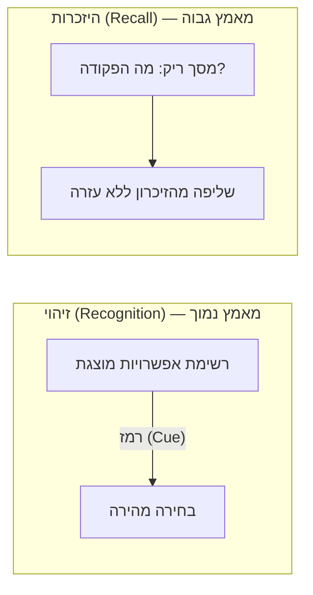

# Authoring lesson visuals

The platform has two visual media directives. Both are **content** — they live in
Markdown, never in the app. The renderer draws them; your job is to write a
source the renderer can draw. This skill covers both, and when to use which.

```
Markdown (:::diagram / :::animation)  →  Parser  →  Media block  →  React  →  UI
```

## Diagram or animation? Choose first

| Use `:::diagram` (Mermaid) when… | Use `:::animation` (HTML) when… |
| --- | --- |
| The point is **structure**: relationships, a flow, a comparison, a hierarchy | The point is **change over time**: a process unfolding, a bottleneck filling, a before→after |
| A static picture says it | Motion is what teaches (something moves, highlights in sequence, transforms) |
| You want zero maintenance and instant authoring | You are willing to write a small self-contained HTML file |

Default to **`:::diagram`** — it is text, deterministic, themed and lazy-loaded
for free, and needs no asset file. Reach for `:::animation` only when motion
carries the idea.

Every visual **must** carry a prose description in its body: it is the caption,
and the accessible fallback a screen reader announces (and what shows if a
diagram fails to parse). Write it even when the visual is self-explanatory.

---

# Part 1 — Diagrams (Mermaid)

## Syntax

Put a fenced ```mermaid block inside the directive. The prose above it stays the
caption; the parser lifts the fence into the block's `source`.

````markdown
:::diagram
תרשים המשווה זיהוי מול היזכרות: מצד אחד רשימת אפשרויות מוצגת (מאמץ נמוך), מצד שני מסך ריק שדורש שליפה מהזיכרון (מאמץ גבוה).


:::
````

The renderer ([apps/web/src/features/lesson/blocks/mermaid-diagram.tsx](../../../apps/web/src/features/lesson/blocks/mermaid-diagram.tsx))
handles theme (light/dark), lazy loading, and the SVG frame. You only write valid
Mermaid.

## Rules that matter here (Hebrew / RTL)

1. **Node ids are Latin, labels are Hebrew in double quotes.** `A["טקסט עברי"]`,
   never a bare Hebrew id. Quotes let a label hold spaces, parentheses, colons
   and `?`: `E["מסך ריק: מה הפקודה?"]`.
2. **Flow direction is set by the diagram, not the page.** `flowchart LR` /
   `TB` / `RL`. For a Hebrew process that reads right-to-left, `LR` still works
   (the renderer frames it `dir=ltr` so arrow geometry stays intact while the
   labels render RTL). Pick the direction that reads naturally for the idea.
3. **Labeled links: use the pipe form.** `A -->|"טקסט"| B`, dotted
   `A -.->|"טקסט"| B`, thick `A ==>|"טקסט"| B`. Avoid the inline `A -. text .-> B`
   form with Hebrew — the pipe form is unambiguous.
4. **Comparisons → two `subgraph`s.** `subgraph ID["כותרת בעברית"] … end`.
5. **Keep it small.** 4–8 nodes. A diagram that needs scrolling is two diagrams.

## Patterns

- **Pipeline / flow:** `flowchart LR` with `A --> B --> C`.
- **Central concept + inputs:** point several nodes at one circle
  `HUB(("HCI"))`: `CS["מדעי המחשב"] --> HUB`.
- **Before / after or good / bad:** two `subgraph`s, one per side.
- **Decision:** `A{"שאלה?"} -->|"כן"| B` / `-->|"לא"| C`.

## Verify a diagram

A diagram that fails to parse degrades to its caption — never a crash — so the
safety net is real, but the goal is a drawn diagram. After authoring:

```bash
pnpm content:build     # 0 errors, and "N mermaid source(s)" for your file
```

Then open the lesson in the running app (see the `run` skill) and confirm the
diagram appears in both light and dark theme. If it shows only the caption, the
Mermaid has a syntax error — fix and rebuild. To catch syntax before the browser,
render it once at [mermaid.live](https://mermaid.live).

---

# Part 2 — Animations (self-contained HTML)

## The pipeline

```
:::animation{src="name.html" height="440"}
תיאור מה שרואים…                          ← caption + accessible description
:::
        │
content/media/name.html                   ← you author this single file
        │  pnpm content:build copies it → apps/web/public/content-media/
        ▼
AnimationPlayer → <iframe sandbox="allow-scripts" src="…?theme=dark&reducedMotion=0&r=0">
```

The player ([apps/web/src/features/lesson/blocks/animation-player.tsx](../../../apps/web/src/features/lesson/blocks/animation-player.tsx))
owns the chrome: lazy loading, a loading state, a replay button, and passing the
theme / reduced-motion preference in. The file owns the animation.

## Hard requirements (the file will not work otherwise)

1. **One self-contained file.** Inline every byte of CSS and JS. The iframe runs
   `sandbox="allow-scripts"` with **no** `allow-same-origin` — opaque origin, no
   access to the app. Prefer **zero dependencies** (CSS + a little vanilla JS).
   Only pull in a library when the choreography needs it — then inline its
   minified build in a `<script>`, never a bare `import`.
2. **Read the query params the player passes:**
   - `theme` — `light` | `dark`. Match the app.
   - `reducedMotion` — `1` → jump to the final, informative frame; do not loop.
   - `r` — replay nonce; ignore it (the reload it triggers restarts you).
   Also honor the `prefers-reduced-motion` media query as a fallback.
3. **Auto-play on load.** No play button — start yourself. "Replay" reloads the
   frame, so a fresh load must start at frame 0.
4. **Size to the frame.** Fill 100% width; the directive's `height` (or 480px
   default) is the frame height. Nothing overflows or scrolls.
5. **RTL + Hebrew.** `<html dir="rtl" lang="he">`. A left-to-right *process* can
   still run visually inside an RTL page — position the flow explicitly.
6. **Accessible & quiet.** Legible contrast in both themes, no audio, no flashing
   faster than 3 Hz.

## Theme tokens

Mirror the app's palette and flip it from the `theme` param:

```css
:root {
  --bg: #ffffff; --fg: #0f172a; --muted: #64748b;
  --accent: #4f46e5; --surface: #f8fafc; --border: #e2e8f0;
}
:root[data-theme='dark'] {
  --bg: #0b1120; --fg: #e2e8f0; --muted: #94a3b8;
  --accent: #818cf8; --surface: #131c30; --border: #2a3852;
}
```

## Start from the template

[references/template.html](references/template.html) is a complete, working file:
it reads the params, sets the theme, honors reduced motion, auto-plays, and
stages a three-step process highlight. Copy it to `content/media/<name>.html` and
replace the stage content. For a fuller worked example, read the shipped
reference animation at
[content/media/information-processing-model.html](../../../content/media/information-processing-model.html).

## When to use Anime.js

Load the **`animejs`** skill (vendored at `.claude/skills/animejs/`) for timeline
sequencing with precise offsets, staggered reveals across many elements, SVG path
drawing/morphing, or spring physics. Inline its minified UMD build in a
`<script>` — do not add it as an app dependency; animations are static assets.

## Verify an animation

```bash
pnpm content:build     # your file shows under "N asset(s)"
```

Then in the running app confirm it: plays on load, replays on the button,
switches with the theme toggle, and collapses to a static frame when the OS is
set to reduced motion.

---

# End-to-end checklist

1. Pick diagram vs animation (structure vs motion).
2. Write the block with a prose description; add the Mermaid fence **or** the
   `src="…"` to a file in `content/media/`.
3. `pnpm content:build` — 0 errors, and the source/asset shows in the summary.
4. Open the lesson in the app; confirm it renders in light **and** dark.
5. For animations, also confirm replay and reduced-motion.
