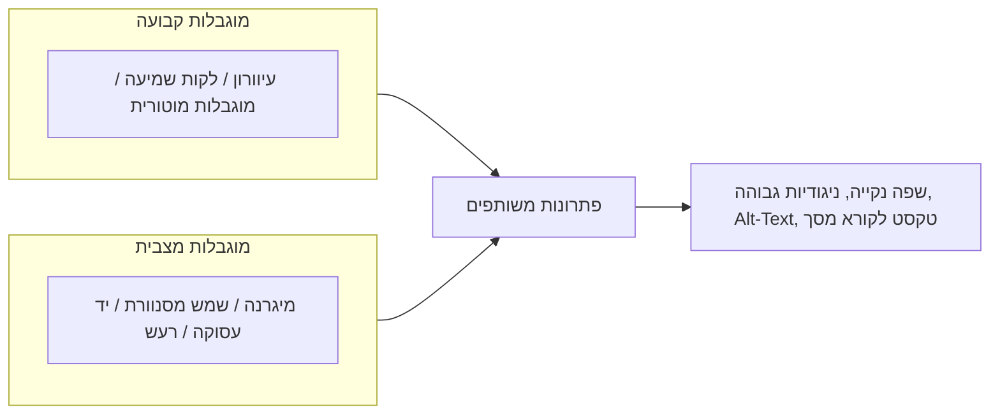

# Accessibility (נגישות)

:::definition
נגישות היא העיקרון שלפיו ממשק חייב להיות ניתן לשימוש ולהבנה על ידי כל האנשים, כולל אנשים עם מוגבלות קבועה (חושית, מוטורית או קוגניטיבית) וכולל משתמשים שנמצאים באופן זמני או מצבי במצב של יכולת מופחתת.
:::

## הסבר פשוט

נגישות היא לוודא שאף אחד לא נשאר בחוץ. לא רק אדם עיוור שמשתמש בקורא מסך — גם מישהו עם מיגרנה, עם שמש מסנוורת על המסך, או שמחזיק תינוק ביד אחת ויכול להשתמש רק ביד השנייה.

## הסבר טכני

טעות נפוצה היא לחשוב על נגישות כעל צורך של מיעוט קבוע וידוע מראש (אנשים עם מוגבלות). בפועל, כל דבר שמסייע לאדם עם מוגבלות — טקסט חלופי לתמונה, ניגודיות גבוהה, שפה נקייה, כפתורים גדולים — מסייע גם למשתמשים במצב **מוגבלות מצבית** (Situational Impairment): עייפות, תאורה גרועה, יד עסוקה, רעש סביבתי. לכן השקעה בנגישות משרתת קהל רחב הרבה יותר מהערכה הראשונית.

בכתיבת UX, נגישות באה לידי ביטוי בשלוש דרכים עיקריות: **טקסט על המסך** (הטקסט הרגיל, שצריך להיות ברור גם לרואים וגם ללא-רואים), **טקסט לקורא מסך בלבד** (Screen-Reader-Only Text) המסייע בניווט למי שמסתמך על טכנולוגיה מסייעת, ו-**Alt-Text** — טקסט חלופי המתאר תמונות ואייקונים עבור משתמשים לא-רואים ומופיע גם כשתמונה נכשלת בטעינה.

:::example
תיאור Alt-Text לתמונת פרופיל ב-**Facebook** ("תמונה של אישה מחייכת עומדת מול הר") מאפשר למשתמש עם קורא מסך להבין מה מוצג, בדיוק כפי שמשתמש רואה מבין זאת במבט אחד.
:::

:::warning
נגישות אינה "פיצ'ר נוסף" למשתמשים עם מוגבלות קבועה בלבד. כל משתמש חווה מוגבלות מצבית מדי פעם — ולכן כל שיפור נגישות הוא שיפור [[usability|שמישות]] כללי.
:::

:::diagram
תרשים המראה שתי קטגוריות של מוגבלות המובילות לאותם פתרונות עיצוב: "מוגבלות קבועה" (עיוורון, לקות שמיעה, מוגבלות מוטורית) ו"מוגבלות מצבית" (מיגרנה, שמש מסנוורת, יד אחת עסוקה, סביבה רועשת) — שני הצירים מתכנסים לאותם פתרונות: שפה נקייה, ניגודיות גבוהה, Alt-Text, טקסט לקורא מסך.

:::
