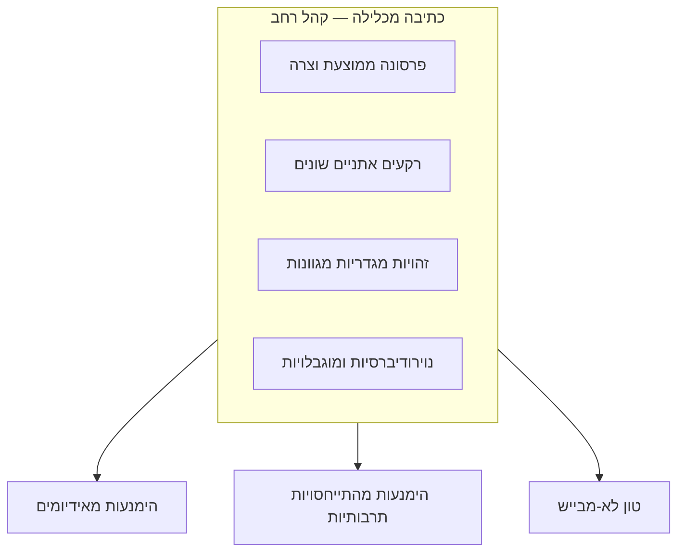

# Inclusive Writing (כתיבה מכלילה)

:::definition
כתיבה מכלילה היא עקרון ניסוח שלפיו טקסט בממשק נכתב כך שיובן וירגיש רלוונטי לקהל רחב ומגוון של משתמשים — בלי להניח שכל קורא חולק את אותה תרבות, שפת אם, זהות מגדרית או יכולת — ובלי לבייש משתמש כדי לשכנע אותו לפעול.
:::

## הסבר פשוט

כתיבה מכלילה שואלת: האם המשתמשת/המשתמש בקצה השני, מי שלא/ת בהכרח נראה/ית או חושב/ת כמוני, עדיין תבין/יבין בדיוק את מה שכתבתי — בלי לפרש מטבע לשון מקומי, בלי להניח מגדר, ובלי להרגיש מוקצה?

## הסבר טכני

כתיבה מכלילה מרחיבה את קהל היעד מעבר ל[[persona|פרסונה]] הצרה והממוצעת שלרוב עומדת בבסיס תהליך העיצוב, ומביאה בחשבון גם משתמשים ממגוון רקעים אתניים, זהויות מגדריות שאינן בינאריות, נוירודיברסיות, מוגבלויות ומצבי בריאות נפשית שונים. שני כללים מעשיים תומכים בה:

1. **הימנעות מהתייחסויות תרבותיות, מטבעות לשון ואידיומים** — ביטוי כמו "זה כבר לא הבלון של מי יודע מה" מובן מיד לדובר עברית ילידי, אך מבלבל דובר שפה שנייה. ביטויים כאלה משויכים לרוב למעמד, אתניות או תרבות מסוימת, ומוציאים כל מי שלא חלק ממנה.
2. **בניית צוותי כתיבה מגוונים** — צוות שמשקף את החברה כולה סביר יותר לזהות מראש ניסוח שמדיר קבוצה מסוימת, לפני שהמוצר יוצא לעולם.

כתיבה מכלילה גם דוחה **טון מבייש** (Shaming Tone) — ניסוח שגורם למשתמש להרגיש לא מספיק חכם, לא יפה או לא אחראי כדי לדחוף אותו לפעולה (למשל כפתור סירוב שמנוסח כ"לא תודה, אני מעדיף/ה לשלם יותר"). טון מכליל בונה אמון דווקא על ידי אמירה למשתמש שהוא בסדר גמור כפי שהוא.

:::example
טופס הרשמה שבו שדה "מגדר" מציע רק "זכר"/"נקבה" מדיר משתמשים שאינם מזדהים עם אף אחת מהאפשרויות. גרסה מכלילה תוסיף אפשרות "אחר" או שדה פתוח, או תסיר את השדה כליל אם אינו נחוץ לפונקציונליות.
:::

:::warning
כתיבה מכלילה אינה זהה לנגישות טכנית ([[accessibility|נגישות]]). נגישות עוסקת ביכולת הפיזית/חושית להשתמש בממשק (קורא מסך, ניגודיות); כתיבה מכלילה עוסקת בכך שהטקסט עצמו לא מדיר מישהו בגלל זהותו, תרבותו או רקעו — שני עקרונות משלימים, לא זהים.
:::

:::diagram
תרשים המראה פרסונה "ממוצעת" צרה במרכז, ומעגל רחב יותר סביבה שמכיל קבוצות משתמשים נוספות: רקעים אתניים שונים, זהויות מגדריות מגוונות, נוירודיברסיות ומצבי בריאות נפשית. חץ מצביע מהמעגל הרחב אל עקרונות הכתיבה שמשרתים אותו: הימנעות מאידיומים, הימנעות מהתייחסויות תרבותיות, טון לא-מבייש.

:::
