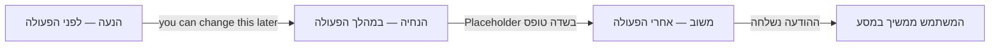

# Microcopy (מיקרו-קופי)

:::definition
מיקרו-קופי הוא הטקסט הקצר בממשק דיגיטלי — על כפתורים, תוויות, שדות טופס, הודעות שגיאה והצלחה — שמנחה את המשתמש מה לעשות, מבהיר נקודות מבלבלות ומשדר את קול המותג.
:::

## הסבר פשוט

מיקרו-קופי הוא כל מילה או משפט קצר בממשק שהוא לא כותרת ולא פסקת תוכן ראשית — "שלח", "הסיסמה חייבת לכלול 8 תווים לפחות", "כמעט סיימנו!". אלה המילים שרוב המשתמשים לא שמים לב אליהן במודע כשהן טובות, אבל מבחינים בהן מיד כשהן חסרות או מבלבלות.

## הסבר טכני

מיקרו-קופי הוא רכיב תוכן (Knowledge Object מסוג טקסט) שממלא תפקיד פונקציונלי בממשק, לא רק תיאורי. הוא נמדד לפי אותה אמת מידה כמו כל רכיב עיצוב אחר: האם הוא עוזר למשתמש להשלים משימה בביטחון? מיקרו-קופי טוב אינו מסביר עיצוב לקוי — אם צריך שורת טקסט כדי להסביר מה עושה אייקון, הפתרון האמיתי הוא לתקן את האייקון, לא רק להוסיף עוד מילים.

מיקרו-קופי ממלא שלושה תפקידים לאורך מסע המשתמש: **הנעה** (לפני פעולה — למשל טקסט Onboarding), **הנחיה** (במהלך פעולה — למשל טקסט בתוך שדה טופס) ו**משוב** (אחרי פעולה — הודעת הצלחה או שגיאה).

:::example
בתהליך יצירת צוות חדש ב-**Slack**, לצד שדה "שם הצוות" מופיע משפט קטן: "you can change this later". שתי מילים שקטנות מסירות מהמשתמש את הלחץ להמציא שם מושלם ברגע הראשון, וכך מזרזות אותו להשלים את תהליך ה-Onboarding.
:::

:::warning
מיקרו-קופי אינו רק "לכתוב יפה". טקסט על כפתור שאומר "לחץ כאן" חוזר על הפעולה הפיזית (הלחיצה) במקום לתאר את התוצאה (למשל "שמור שינויים"). ההבדל הזה — תיאור התוצאה מול תיאור הפעולה — הוא אחד הכללים הנבחנים ביותר בנושא.
:::

:::diagram
תרשים המראה ציר זמן של אינטראקציית משתמש עם שלושה שלבים: לפני הפעולה (הנעה — Onboarding, כיתוב כפתור), במהלך הפעולה (הנחיה — Tooltip, טקסט שדה טופס, הודעת טעינה), ואחרי הפעולה (משוב — הודעת הצלחה, הודעת שגיאה, התראה). בכל שלב מופיעה דוגמת מיקרו-קופי קצרה.

:::
