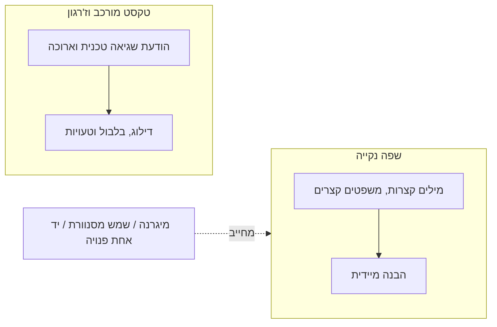

# Plain Language (שפה נקייה)

:::definition
שפה נקייה (Plain Language) היא עקרון כתיבה שלפיו טקסט בממשק נכתב במילים קצרות, במשפטים קצרים ובמבנה ישיר, כך שהמשמעות מובנת בקריאה ראשונה וללא מאמץ, במקום להשקיע מאמץ בפענוח הניסוח.
:::

## הסבר פשוט

שפה נקייה אומרת: תגידו את מה שאתם צריכים להגיד במילים הכי פשוטות שעדיין נכונות. במקום "אירעה שגיאה בתהליך האימות" — "הסיסמה שגויה, נסו שוב". אותו מידע, הרבה פחות מאמץ לקרוא אותו.

## הסבר טכני

שפה נקייה חשובה במיוחד כי יכולת הקריאה וההבנה של משתמשים אינה קבועה — היא **מצבית**. אותו משתמש שקורא בריכוז מלא בבוקר עשוי לקרוא באותה מסך אחר הצהריים עם ילד בוכה ברקע, מגרנה, שמש מסנוורת מסך או יד אחת פנויה בלבד. כל אלה מקטינים זמנית את הקיבולת לעבד טקסט מורכב, בדיוק כפי שמוגבלות קבועה עושה זאת. שפה נקייה — מילים קצרות, משפטים קצרים, מבנה ישיר — משרתת את שני סוגי המשתמשים גם יחד, ולכן היא עיקרון ליבה בהפחתת [[cognitive-load|עומס קוגניטיבי]] בממשק.

עיקרון קשור: מיקרו-קופי צריך לענות מראש על "מה השאלה הבאה שתעלה למשתמש?" — כל פיסת מידע חדשה מעוררת אצל המשתמש חשש או שאלת המשך, ושפה נקייה מאפשרת לענות עליה בלי להעמיס טקסט נוסף.

:::example
הודעת שגיאה בטופס הרשמה שכתובה כ"הקלט שסופק אינו עומד בדרישות הוולידציה של המערכת" מחייבת את המשתמש לפענח ז'רגון טכני. הניסוח הנקי — "הסיסמה חייבת לכלול לפחות 8 תווים" — אומר בדיוק את אותו דבר, מיידית וברור.
:::

:::warning
נגישות מצבית אינה "נחמד שיהיה" רק למשתמשים עם מוגבלות קבועה. כל משתמש חווה בזמנים שונים ירידה זמנית ביכולת קריאה — ולכן שפה נקייה משרתת קהל רחב הרבה יותר ממה שנדמה במבט ראשון.
:::

:::diagram
תרשים המראה שני צירים: ציר עליון "טקסט מורכב" מוביל למשתמש שנתקל בקשיים (דילוג על מילים, בלבול, טעויות); ציר תחתון "שפה נקייה — מילים קצרות, משפטים קצרים" מוביל למשתמש שמבין מיד. לצד הציר התחתון מופיעות שלוש דוגמאות למצבים שמצריכים שפה נקייה: מיגרנה, שמש מסנוורת, יד אחת פנויה.

:::
