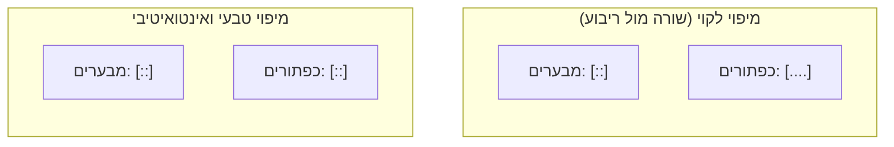

# אפורדנס וסיגניפייר: תקשורת חזותית של ממשקים

## למה חפצים יום-יומיים מבלבלים אותנו?

בוודאי קרה לכם שהגעתם לדלת זכוכית יפה במשרד, דחפתם אותה בביטחון, והיא לא זזה. מבוכים, ניסיתם למשוך – ורק אז היא נפתחה. למה זה קורה? האם אתם אשמים בכך שלא ידעתם להפעיל דלת? 

התשובה היא חד-משמעית: **לא**. האשמה היא של המעצב. דלת כזו נקראת "דלת נורמן" (Norman Door), על שמו של דון נורמן, והיא דוגמה קלאסית לעיצוב לקוי. חפצים וממשקים מתקשרים איתנו ללא מילים – המבנה, החומר והצורה שלהם אמורים לספר לנו מה ניתן לעשות איתם ואיך להפעיל אותם.

היום נלמד כיצד לעצב ממשקים דיגיטליים ופיזיים שמדברים בעצמם עם המשתמש. נבין את ההבדל הקריטי בין **אפורדנס (אפשרות הפעולה)** לבין **סיגניפייר (הרמז לפעולה)**, ונכיר את שלושת עקרונות היסוד של דון נורמן לעיצוב אינטואיטיבי: מיפוי, משוב ומגבלות.

---

## מטרות השיעור

בסיום שיעור זה תוכלו:

- להגדיר מהו [[affordance]] ולהסביר את ההבדל בין אפורדנס אמיתי לנתפס.
- להגדיר מהו [[signifier]] ולהבחין בינו לבין אפורדנס.
- לזהות כשלי עיצוב מסוג "אפורדנס כוזב" (False Affordance) או "אפורדנס סמוי" (Hidden Affordance).
- להסביר וליישם את עקרון **המיפוי (Mapping)** באמצעות דוגמת לוח המחוונים של כיריים גז.
- להסביר את חשיבות עקרון **המשוב (Feedback)** במניעת שגיאות משתמש.
- להגדיר מהן **מגבלות (Constraints)** וכיצד הן מונעות טעויות בממשק.

---

# הבנת עולם המושגים של נורמן

כדי ליצור ממשקים אינטואיטיביים, עלינו להפריד בין שני מושגים שלעיתים קרובות מבלבלים ביניהם בטעות: אפורדנס וסיגניפייר.

## אפורדנס (Affordance) — מה ניתן לעשות?

[[affordance]] הוא מערכת היחסים בין התכונות הפיזיות של המוצר לבין יכולות האדם המפעיל אותו. הוא מגדיר **אילו פעולות אפשריות פיזית**.
- מסך סמארטפון מאפשר נגיעה (affords touching).
- חור של כבל רשת מאפשר הכנסה של קונקטור מתאים.
- כפתור פיזי מוגבה מאפשר לחיצה.

בתחום הדיגיטלי, המושג החשוב ביותר הוא **אפורדנס נתפס (Perceived Affordance)**: מה שהמשתמש מאמין שהוא יכול לעשות על סמך מראה המסך.
* **אפורדנס כוזב (False Affordance):** רכיב שנראה כמו משהו לחיץ (למשל, כותרת מודגשת עם רקע צבעוני), אך בפועל לחיצה עליו לא עושה דבר. המשתמש ינסה ללחוץ ויתאכזב.
* **אפורדנס סמוי (Hidden Affordance):** רכיב שניתן לפעול עליו (למשל, תפריט שנפתח בגרירת אצבע מלמעלה), אך אין לכך שום רמז ויזואלי בממשק. המשתמש פשוט לא ידע שהאפשרות קיימת.

---

## סיגניפייר (Signifier) — איפה ואיך לפעול?

בעוד שהאפורדנס הוא עצם קיומה של אפשרות הפעולה, [[signifier]] הוא **הרמז או הסימן שמסגיר את האפשרות הזו**.
לדוגמה, ידית של דלת היא אפורדנס (היא מאפשרת פיזית אחיזה ומשיכה). אך אם נכתוב מעליה שלט "משוך" או נצבע אותה בצבע בולט – יצרנו סיגניפייר המכוון את המשתמש בדיוק אל המיקום והפעולה הנדרשים.

בממשקים דיגיטליים אנו מוקפים בסיגניפיירים:
- צל מתחת לכפתור שמקנה לו מראה תלת-ממדי.
- סמל של זכוכית מגדלת 🔍 בתוך שדה קלט.
- טקסט עמום של "הקלד אימייל...".
- שינוי צורת סמן העכבר כאשר מרחפים מעל קישור.

:::important
האפורדנס הוא היכולת; הסיגניפייר הוא התקשורת. כמעצבים, עלינו לוודא שיש התאמה מושלמת: שלכל אפורדנס פונקציונלי במערכת יהיה סיגניפייר ברור, ושלעולם לא נציג סיגניפייר כוזב שמוליך שולל את המשתמש.
:::

---

# עקרונות העיצוב האינטואיטיבי של נורמן

מעבר לאפורדנס וסיגניפייר, דון נורמן מגדיר שלושה עקרונות משלימים שהם חובה בכל ממשק שמיש:

## 1. מיפוי (Mapping)
מיפוי מתייחס ל**קשר המרחבי או הפיזי בין מיקום בקרי השליטה לבין הרכיבים שהם שולטים עליהם**.
כאשר המיפוי הוא טבעי ואינטואיטיבי, קל מאוד להבין איך להפעיל את המערכת. כאשר המיפוי לקוי, המשתמש ייאלץ לנחש ולשנן את אופן הפעולה.

:::example
**מיפוי בכיריים גז:**
דמיינו ארבעה מבערי בישול המסודרים בריבוע על הכיריים, וארבעה כפתורי הפעלה המסודרים בשורה ישרה לפניהם. המשתמש אינו יכול לדעת באופן טבעי איזה כפתור מדליק איזה מבער, והוא נאלץ להסתמך על סימונים קטנים או על ניסוי וטעייה.
**הפתרון (מיפוי טבעי):** סידור ארבעת כפתורי ההפעלה בריבוע קטן המדמה בדיוק את סידור המבערים על הכיריים. במצב כזה, היד נשלחת אוטומטית לכפתור הנכון ללא מאמץ קוגניטיבי.
:::

:::diagram
תרשים המציג מיפוי לקוי (כפתורים בשורה מול מבערים בריבוע) לעומת מיפוי טבעי (כפתורים מסודרים בריבוע בהתאמה מרחבית למבערים):

:::

## 2. משוב (Feedback)
משוב (Feedback) הוא **מתן אינדיקציה מיידית וברורה למשתמש על כך שפעולתו נקלטה במערכת ומהן תוצאותיה**.
מערכת ללא משוב משאירה את המשתמש בחוסר ודאות ("האם לחצתי? האם זה עובד?"). חוסר ודאות גורם למשתמש ללחוץ שוב ושוב, מה שעלול להקריס את המערכת או לבצע פעולות כפולות ומזיקות.

משוב יעיל חייב להיות:
- **מיידי:** פחות מ-100 מילי-שניות.
- **אינפורמטיבי:** מבהיר מה קרה (למשל, כפתור שמשנה את צבעו, סאונד קצר, או אנימציה של טעינה).
- **לא מציק:** לא לפתוח חלון פופ-אפ מעצבן על כל לחיצה קטנה.

## 3. מגבלות (Constraints)
מגבלות הן **חסימת אפשרויות פעולה במטרה למנוע שגיאות משתמש מראש**.
במקום לאפשר למשתמש לבצע טעויות ואז להציג לו הודעת שגיאה מתסכלת, עיצוב נכון יגביל את האפשרויות שלו מראש כך שיוכל לבצע רק פעולות תקינות.

מגבלות יכולות להיות:
- **פיזיות:** למשל, כבל USB שניתן להכניס רק בכיוון אחד (או USB-C שאינו מוגבל כיוון פיזית אך פותר את הבעיה באופן חומרה).
- **לוגיות:** למשל, מניעת האפשרות ללחוץ על כפתור "שלח טופס" עד אשר כל שדות החובה מולאו בצורה תקינה.
- **תרבותיות:** שימוש בצבעים מוסכמים (אדום פירושו עצור/סכנה, ירוק פירושו אישור/המשך).

---

## סיכום השיעור

:::summary
אפורדנס ([[affordance]]) מגדיר את הפעולות האפשריות פיזית בין האדם לחפץ, בעוא סיגניפייר ([[signifier]]) הוא הרמז או הסימן המכוון את המשתמש אל אותה אפשרות פעולה. עיצוב ממשקים מיטבי דורש התאמה ביניהם ומניעה של אפורדנס כוזב או סמוי. בנוסף, עיצוב אינטואיטיבי נשען על מיפוי (קשר מרחבי הגיוני), משוב מיידי המבהיר את תוצאת הפעולה, ומגבלות החוסמות אפשרויות שגויות ומגנות על המשתמש מטעויות.
:::

:::keypoints
- אפורדנס עוסק בפעולות האפשריות פיזית; סיגניפייר עוסק בתקשורת וברמזים חזותיים.
- "דלת נורמן" היא דוגמה קלאסית לפער שבין אפורדנס (ניתן למשוך) לסיגניפייר (הידית מרמזת שיש לדחוף).
- אפורדנס כוזב מטעה את המשתמש לחשוב שפעולה קיימת; אפורדנס סמוי מסתיר יכולת קיימת.
- מיפוי טבעי מקשר מרחבית בין הבקרים לרכיבים הנשלטים ומפחית עומס קוגניטיבי.
- משוב איכותי חייב להיות מיידי וברור כדי למנוע חוסר ודאות ופעולות כפולות.
- מגבלות (לוגיות, פיזיות ותרבותיות) מונעות שגיאות מראש במקום לטפל בהן בדיעבד.
:::

:::references
- הספר "The Design of Everyday Things" מאת דון נורמן (Don Norman).
- סרטון הדרכה של Don Norman בנושא עיצוב חפצים יום-יומיים.
- מאמרים של Nielsen Norman Group על שימוש בסיגניפיירים בממשקי ווב.
:::
