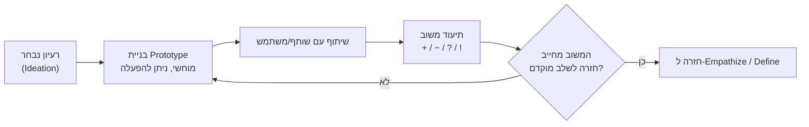
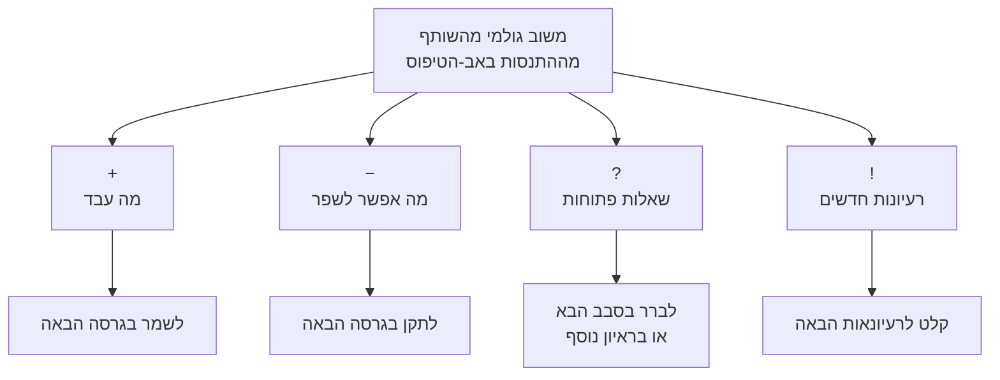
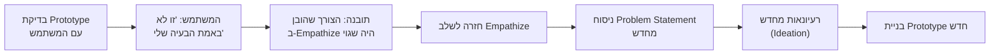

# בנייה ובדיקה (Prototype & Test) — איך רעיון הופך לידע באמצעות משוב

## רעיון הוא רק ניחוש — עד שמישהו מגיב אליו

עד לשלב הזה בתהליך ה-[[design-thinking]] כבר עשיתם המון: הקשבתם למשתמש, ניסחתם מה הוא באמת צריך, והפקתם כמות גדולה של רעיונות פתרון. אבל כל עוד הרעיון הטוב ביותר שבחרתם נשאר בראש שלכם, או משורטט על דף בלי שאף אחד נגע בו — הוא לא יותר מניחוש. אתם עדיין לא יודעים אם הוא באמת פותר את הבעיה.

הדרך היחידה להפוך ניחוש לידע היא לתת למישהו אחר **להתנסות** בו ולהגיב. זה בדיוק תפקידם של שני השלבים האחרונים בתהליך: **Build** — בניית פתרון מוחשי, ו-**Test** — בחינתו המיידית מול משתמש אמיתי כדי לקבל משוב. אלה לא "שלב אחרון" פורמלי — הם הרגע שבו כל מה שלמדתם עד כה נבחן במציאות.

---

## מטרות השיעור

בסיום שיעור זה תוכלו:

- להגדיר מהם שלבי ה-Build (בניית Prototype) וה-Test (בדיקה וקבלת משוב) בתהליך Design Thinking, ולתאר את מטרתם המשותפת.
- להסביר מדוע יש לבנות אב-טיפוס שניתן **לחוות** בפועל, ולא רק להסתכל עליו.
- ליישם את שיטת תיעוד המשוב המובנית +/−/?/! על תרחיש נתון.
- לנתח משוב שהתקבל מבדיקת אב-טיפוס, ולקבוע האם יש לחזור לשלב מוקדם יותר בתהליך או להסתפק בשיפור האב-טיפוס הנוכחי.
- לתאר את שאלות הרפלקציה המסכמות תהליך Design Thinking, ולהסביר מדוע התהליך כולו הוא מעגלי ולא ליניארי.

---

# בנייה (Build) — מהרעיון לחוויה מוחשית

Design Thinking הוא **תהליך מוכוון-תוצר**: המטרה בשלב הזה איננה לדבר עוד על הרעיון, אלא לייצר ממנו משהו שאפשר לגעת בו, להפעיל אותו ולהגיב אליו. ברגע שיש לכם ביד את הרעיון המבטיח ביותר משלב ה-[[ideation]], המשימה הבאה היא לבנות ממנו [[prototype]] — גרסה מוקדמת, זולה ומהירה, שהשותף שלכם יכול **להתנסות** בה ולא רק לצפות בה.

ההדגשה הזו קריטית: שרטוט יפה על דף הוא לא Prototype במובן של Design Thinking, אלא רק כשמישהו יכול "להפעיל" אותו — ללחוץ, לפתוח, לחפש בו משהו — ולגלות בעצמו איפה הוא נתקע.

:::important
כפי שלמדתם בשיעור על אבות טיפוס, גם כאן המטרה היא לא שלמות אלא מהירות וזול. זהו אותו מושג [[prototype]] בדיוק — Paper Prototype, שרטוט גס, אפילו אובייקטים מאולתרים מהשולחן — רק שכעת אתם מיישמים אותו לא כדי לבדוק מסך בודד, אלא כדי לבחון האם **הרעיון עצמו**, שנולד מתוך שלב הרעיונאות, פותר את הצורך שזיהיתם באמפתיה. הכלי זהה; מה שמשתנה הוא השאלה שהוא אמור לענות עליה.
:::

:::example
בתרגיל הארנק, לאחר שבחרתם את אחד הרעיונות הרדיקליים ששרטטתם בשלב הרעיונאות (למשל: ארנק עם תא נשלף לכרטיס האשראי הנפוץ ביותר), אתם לא מסתפקים בהצגת השרטוט לשותף. אתם **בונים** אותו בפועל — מקפלים נייר, גוזרים, מדביקים — כך שהשותף באמת יכול לנסות "לשלוף" את הכרטיס מהתא הנשלף, בדיוק כפי שהיה עושה בארנק אמיתי. רק כשהוא מנסה בעצמו, מתגלה למשל שהתא צר מדי או שקשה להחזיר אליו את הכרטיס.
:::

מעבר לתרגיל הכיתתי, זו גם דרך העבודה מאחורי מוצרים מוכרים: לפני שצוות Dropbox בנה את המוצר המלא, הם יצרו סרטון הדגמה קצר שהראה איך המוצר *היה* עובד — לא קוד אמיתי, אלא "אב-טיפוס" של הרעיון עצמו — ומדדו את התגובה של אנשים אמיתיים לפני שהשקיעו בפיתוח. באותו האופן, ב-IDEO, כאשר צוות התבקש לתכנן עגלת קניות טובה יותר, הם לא הסתפקו בסקיצות: הם בנו אבות טיפוס פיזיים גסים תוך ימים בודדים ולקחו אותם לסופרמרקט אמיתי, כדי לראות אנשים מתמודדים איתם בזמן אמת.

:::diagram
תרשים זרימה של לולאת ה-Build & Test: רעיון נבחר משלב Ideation → בניית Prototype מוחשי הניתן לאינטראקציה → שיתוף עם שותף/משתמש → תיעוד משוב בארבע קטגוריות (+ / − / ? / !) → החלטה האם המשוב מצריך חזרה לשלב מוקדם יותר בתהליך (Empathize / Define) או שאפשר להמשיך לשפר את אותו Prototype.

:::

:::selfcheck
question: שני צוותים בתרגיל הארנק סיימו את שלב הרעיונאות עם אותו רעיון בדיוק. צוות א' מציג לשותף שרטוט מפורט של הארנק על דף ומסביר בעל-פה איך הוא עובד. צוות ב' בונה מהדף אובייקט שאפשר לפתוח, לסגור ולשלוף ממנו כרטיס. איזה צוות צפוי לקבל משוב מועיל יותר, ומדוע?
answer: צוות ב'. Design Thinking הוא תהליך מוכוון-תוצר — הערך של שלב ה-Build הוא שהמשתמש מתנסה בפועל ולא רק שומע הסבר. כשמישהו מפעיל את הפתרון בעצמו, מתגלות בעיות שימושיות שהסבר מילולי לעולם לא יחשוף (למשל: קושי פיזי לשלוף כרטיס, בלבול לגבי היכן ללחוץ). שרטוט מוסבר מייצר לכל היותר משוב על הרעיון כרעיון — לא על החוויה בפועל של השימוש בו.
:::

---

# בדיקה (Test) — תיעוד משוב בשיטה מובנית

אחרי שהשותף התנסה באב-הטיפוס, הפיתוי הטבעי הוא לשאול "אז, מה דעתך?" — אבל זו שאלה גרועה. תשובה פתוחה כזו נוטה להיות מנומסת מדי, מעורפלת, או להיסחף כולה לכיוון הביקורת השלילית ולהשתלט על כל השיחה, בזמן שהתובנות המעניינות ביותר — שאלות פתוחות, רעיון חדש שהבזיק לשותף תוך כדי ההתנסות — פשוט הולכות לאיבוד.

הפתרון הוא לתעד את המשוב **במקביל** להתנסות, ולחלק אותו מראש לארבע קטגוריות נפרדות:

| סימן | קטגוריה | מה מתעדים |
|------|----------|-----------|
| **+** | מה עבד | כל דבר שהשותף עשה בקלות, הבין מיד, או נהנה ממנו |
| **−** | מה אפשר לשפר | קשיים, בלבול, חיכוך שבו השותף נתקע או התלבט |
| **?** | שאלות | שאלות שעלו אצל השותף (או אצלכם) במהלך ההתנסות, שעדיין אין להן תשובה |
| **!** | רעיונות | הברקות חדשות שקפצו תוך כדי — של השותף או שלכם — אפילו אם אינן קשורות ישירות לפתרון הנוכחי |

:::example
נניח שאתם בודקים את אב-הטיפוס של ארנק עם תא נשלף לכרטיס האשראי הנפוץ. כך נראה תיעוד המשוב:

**+ מה עבד:** "השותף מצא את כרטיס האשראי תוך פחות משנייה, בלי לחפש בין שאר הכרטיסים."

**− מה אפשר לשפר:** "השותף התקשה להחזיר את הכרטיס לתא — הוא כמעט קרע את הפינה של הנייר."

**? שאלות:** "מה קורה אם יש לי שני כרטיסי אשראי שאני מחליף ביניהם לפי החנות?"

**! רעיונות:** "אולי כדאי לצבוע כל תא בצבע שונה, כדי שאפשר יהיה למצוא כרטיס גם בלי להסתכל בפנים?"
:::

**מדוע החלוקה הזו כל כך חשובה?** כי בלעדיה, המשוב השלילי נוטה "לבלוע" את כל השיחה — ואילו המשוב החיובי, אם בכלל נאמר, יוצא מעורפל ("היה נחמד") ולא ניתן לפעולה. הפרדה בין ארבע הקטגוריות מבטיחה שגם מה שעבד ייאמר במפורש (ואל תמחקו את זה בגרסה הבאה!), גם הקשיים יתועדו בלי להשתלט על כל הדיון, וגם השאלות הפתוחות וההברקות הרגעיות — שלרוב נעלמות ברגע שמסיימים לדבר — יישמרו לשימוש בסיבוב הבנייה הבא.

:::diagram
תרשים המראה כיצד משוב גולמי בודד מתפצל לארבעה יעדים שונים: תגובות "+" נשמרות לגרסה הבאה, תגובות "−" הופכות למשימות תיקון, סימני "?" נשמרים לבדיקה או לראיון נוסף, וסימני "!" מוזנים כקלט לסבב רעיונאות הבא.

:::

:::selfcheck
question: שותף שבודק אב-טיפוס אומר במשפט אחד: "מצאתי מיד את מה שחיפשתי, אבל היה לי קשה להחזיר את זה למקום, ותהיתי אם יש דרך לעשות את זה גם בלי להשתמש בשתי ידיים." לאילו קטגוריות (+/−/?/!) עליכם לפצל את המשפט הזה, ומדוע לא לתעד אותו כמקשה אחת?
answer: יש לפצל לשלוש קטגוריות נפרדות: "+" — מצא מיד את מה שחיפש; "−" — התקשה להחזיר למקום; "?" — האם יש דרך לעשות זאת בלי שתי ידיים. משפט בודד לרוב מכיל יותר מתובנה אחת, ואם מתעדים אותו כמקשה אחת (למשל רק כ"−" כי הוזכרה בעיה), מאבדים את ההצלחה שכדאי לשמר ואת השאלה הפתוחה שכדאי לברר בסיבוב הבא.
:::

---

# רפלקציה — ולמה התהליך לא באמת נגמר

אחרי שאספתם משוב, יש רגע חשוב שקל לדלג עליו: **לעצור ולהרהר** בתהליך עצמו, לא רק בפתרון. כמה מהשאלות המרכזיות ששווה לשאול את עצמכם בסיום סבב עבודה:

1. **האם העיצוב הסופי שלכם היה זהה לעיצוב האידיאלי שדמיינתם בהתחלה, או שונה ממנו?**
2. **איפה נתקעתם במהלך התהליך?**
3. **מתי הגיע "אה-הא" — הרגע שבו משהו הסתדר לכם פתאום?**
4. **איך שלב האמפתיה תרם לעיצוב הסופי?**
5. **איך בחינת חלופות בבנייה תרמה לעיצוב?**
6. **איך המשוב שקיבלתם תרם לעיצוב?**
7. **איך הייתם משפרים את התהליך שלכם בפעם הבאה?**

השאלה השנייה — "איפה נתקעתם" — היא הקריטית ביותר, כי התשובה הנפוצה עליה אינה "היה קשה לצייר את השרטוט". לעיתים קרובות מסתבר שהתקיעות האמיתית לא הייתה בפרטי הפתרון, אלא בזה שהצורך שהובן ב-[[empathy]] היה שגוי או לא מדויק מספיק. במקרה כזה, שיפור קוסמטי של אותו Prototype לא יעזור — צריך לחזור אחורה: לראיין שוב, לנסח מחדש את ה-Problem Statement, ולפעמים אפילו לרעיונן מחדש.

זהו בדיוק ההבדל בין Design Thinking לתהליך פתרון בעיות רגיל: **התהליך אינו קו ישר מ-Empathize ל-Test**. חמשת השלבים — אמפתיה, הגדרה, רעיונאות, בנייה ובדיקה — מחוברים זה לזה בשני הכיוונים, ומשוב מהבדיקה יכול, ולעיתים חייב, לשלוח אתכם צעד אחד או שניים אחורה.

דוגמה מוכרת מעולם המוצר: הצוות שמאחורי Slack התחיל בבניית משחק מקוון. כשבדקו את המוצר עם משתמשים, גילו שאף אחד לא ממש רצה לשחק במשחק — אבל כולם התלהבו מכלי הצ'אט הפנימי שהצוות בנה לעצמו כדי לתקשר תוך כדי הפיתוח. המשוב מהבדיקה לא הוביל לשיפור קוסמטי של המשחק — הוא הוביל לחזרה מלאה לשלב ההגדרה: מי המשתמש בכלל, ומה הוא באמת צריך.

:::diagram
תרשים המדגים דוגמה קונקרטית ללולאת חזרה: בדיקת Prototype עם משתמש → המשתמש מגיב שהבעיה שתואר לו לא רלוונטית אליו בכלל → תובנה שהצורך שהובן בשלב האמפתיה היה שגוי → חזרה לשלב האמפתיה → ניסוח Problem Statement מחדש → רעיונאות מחדש → בניית Prototype חדש התואם את הצורך המדויק.

:::

:::important
**נקודה חשובה למבחן:** Design Thinking הוא **תהליך, לא תוצר סופי**. חמשת השלבים אינם צינור חד-כיווני שמתחיל באמפתיה ומסתיים בבדיקה. משוב משלב הבדיקה יכול לשלוח אתכם בחזרה לכל שלב קודם — לרוב לאמפתיה או להגדרה — כי הוא חושף שההבנה המקורית של הצורך הייתה חלקית או שגויה. תשובה שמניחה שהתהליך "נגמר" אחרי סבב אחד של Build-Test היא תשובה שגויה.
:::

:::selfcheck
question: צוות בדק אב-טיפוס של אפליקציה לניהול זמן, והמשתמש אמר: "זה נחמד, אבל אני לא ממש מרגיש לחוץ בזמן במהלך היום — הבעיה שלי היא שאני שוכח למה בכלל התחייבתי מלכתחילה, לא כמה זמן נשאר לי." לאיזה שלב בתהליך כדאי לצוות לחזור, ולמה זה לא מספיק פשוט לשפר את אב-הטיפוס הנוכחי?
answer: הצוות צריך לחזור לשלב האמפתיה (ואולי גם להגדרה מחדש). המשוב חושף שהצורך שזוהה מלכתחילה ("ניהול לחץ זמן") שגוי — הבעיה האמיתית של המשתמש היא זיכרון והתחייבות, לא ניהול שעון. שיפור קוסמטי של אפליקציית ניהול-הזמן הנוכחית (למשל שינוי צבעים או תזכורות) לא יפתור בעיה שהיא בכלל לא הבעיה הנכונה — צריך לראיין מחדש, לנסח Problem Statement חדש, ורק אז לרעיונן ולבנות שוב.
:::

---

## סיכום השיעור

:::summary
שלבי ה-Build וה-Test הם הרגע שבו רעיון הופך לידע: בונים Prototype מוחשי וניתן להתנסות (לא רק להסתכלות), משתפים אותו עם משתמש אמיתי, ומתעדים את תגובתו בשיטה מובנית — מה עבד (+), מה אפשר לשפר (−), אילו שאלות עלו (?) ואילו רעיונות נולדו (!). לאחר מכן, שלב הרפלקציה בוחן לא רק את הפתרון אלא את התהליך עצמו — ולעיתים קרובות מגלה שהתקיעות האמיתית מקורה בהבנה שגויה של הצורך, מה שמחייב חזרה לשלב האמפתיה או ההגדרה. חמשת השלבים של Design Thinking אינם צינור חד-כיווני אלא מעגל איטרטיבי: Design Thinking הוא תהליך, לא תוצר סופי.
:::

:::keypoints
- שלב ה-Build: בניית Prototype מוחשי וזול שאפשר **להפעיל**, לא רק להסתכל עליו — אותו עיקרון "מהיר וזול" מהשיעור על אבות טיפוס, מיושם כעת על בדיקת הרעיון עצמו.
- שלב ה-Test: הצגת ה-Prototype למשתמש אמיתי ואיסוף משוב מיידי על ההתנסות בפועל, לא על תיאור מילולי.
- שיטת תיעוד המשוב המובנית: + (מה עבד), − (מה לשפר), ? (שאלות), ! (רעיונות) — מונעת מהמשוב השלילי להשתלט ומהחיובי להישאר מעורפל.
- שלב הרפלקציה בוחן את התהליך עצמו: איפה נתקעתם, מתי הגיע ה"אה-הא", ואיך תרמו האמפתיה, הבנייה והמשוב לתוצאה הסופית.
- "איפה נתקעתם" חושפת לעיתים קרובות שהצורך שהובן באמפתיה היה שגוי — מה שמחייב חזרה לשלב מוקדם ולא רק שיפור קוסמטי של ה-Prototype הנוכחי.
- Design Thinking הוא תהליך מעגלי ואיטרטיבי, לא צינור חד-כיווני שמסתיים ב-Test — נקודה קריטית להבנת המבחן.
:::

:::references
- מצגת הקורס "חשיבה עיצובית" — ד"ר משה לייבה (The Wallet Challange.pptx).
- Stanford d.school — "An Introduction to Design Thinking: Process Guide" (Rapid Prototyping & Testing).
- IDEO — "The Shopping Cart" case study (ABC Nightline).
:::

:::quiz{ref="build-and-test-quiz"}
:::
