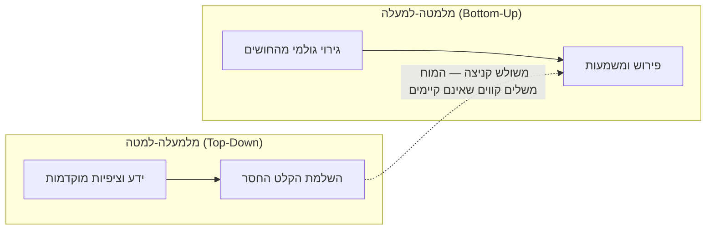
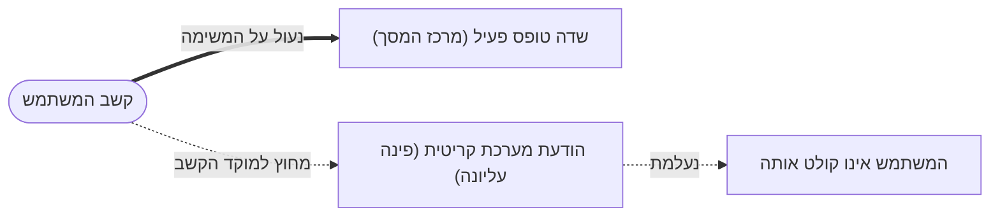
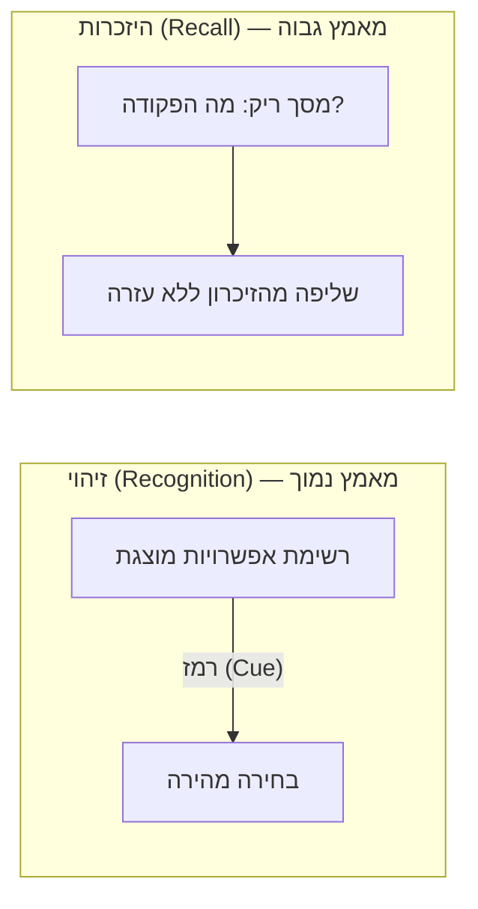
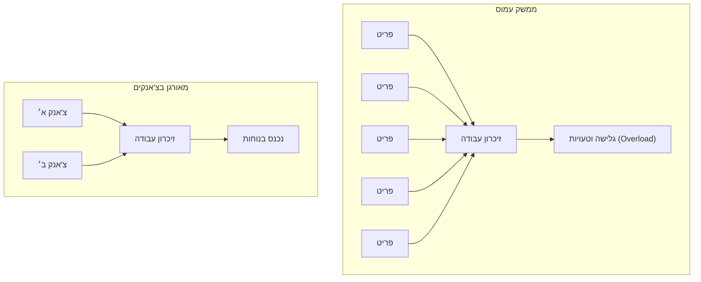

# פסיכולוגיה קוגניטיבית: המוח מאחורי הממשק

## למה מעצב חייב להכיר את הפסיכולוגיה של המשתמש?

כשאנחנו מעצבים ממשק, אנחנו לא באמת מעצבים מסך — אנחנו מעצבים עבור **מוח אנושי** שקולט אותו. ולמוח הזה יש מגבלות מדויקות ומוכרות: הוא רואה רק חלק קטן מהמסך בחדות, שוכח פרטים תוך שניות, מפספס אירועים בולטים כשהוא מרוכז במשימה אחרת, ומתעייף כשמעמיסים עליו יותר מדי החלטות בבת אחת.

מעצב שאינו מכיר את המגבלות הללו בונה ממשקים שנראים הגיוניים על נייר אך מתסכלים בפועל: הוא דורש מהמשתמש לזכור קוד שהוצג לפני שני מסכים, מציב התראה קריטית במקום שאיש לא מסתכל בו, או דוחס טופס של שלושים שדות למסך אחד. כל אלה אינם "טעויות של משתמשים טיפשים" — הם כשלים בהתאמה בין הממשק לבין האופן שבו המוח באמת עובד.

בשיעור זה נכיר את **מודל עיבוד המידע האנושי** — המסגרת שמתארת כיצד אדם קולט, מסנן, זוכר ומפרש מידע — ואת ההשלכות הישירות שלה על עיצוב ממשקים: מדוע [[recognition-vs-recall|זיהוי קל מהיזכרות]], מהו עומס קוגניטיבי, וכיצד קשב מוגבל משנה את מה שאנחנו חייבים להבליט.

---

## מטרות השיעור

בסיום שיעור זה תוכלו:

- **להסביר** את מודל עיבוד המידע האנושי ([[information-processing-model]]) ואת שלביו: קלט, עיבוד ופלט.
- **להבחין** בין זיהוי (Recognition) להיזכרות (Recall) ולנמק מדוע זיהוי הוא מטלת זיכרון קלה יותר.
- **ליישם** את העיקרון "Recognition over Recall" כדי לשפר ממשק נתון.
- **להסביר** מהו עומס קוגניטיבי ([[cognitive-load]]) וכיצד צ'אנקינג (Chunking) מפחית אותו.
- **לנתח** מצב עיצובי שבו עיוורון קשבי (Inattentional Blindness) גורם למשתמשים לפספס אלמנט קריטי.
- **להסביר** כיצד עיבוד מלמעלה-למטה (Top-Down) גורם למשתמשים לראות את מה שהם מצפים לראות.

---

# מודל עיבוד המידע האנושי

בליבת הפסיכולוגיה הקוגניטיבית עומדת התפיסה של האדם כ**מעבד מידע**: המוח מקבל **קלט** מהחושים, **מעבד** אותו (מסנן, מפרש ומאחסן בזיכרון), ומפיק **פלט** בצורת החלטה או פעולה. הכרה (Cognition) היא השם הכולל לכלל התהליכים הללו — רכישת ידע, עיבודו, ייצוגו ויישומו.

המודל הזה חשוב למעצב מפני שכל שלב בו הוא **צוואר בקבוק** אפשרי. אם הקלט לא ברור (ניגודיות נמוכה), אם הקשב עסוק במקום אחר, או אם הזיכרון עמוס מדי — האינטראקציה תיכשל עוד לפני שהמשתמש הספיק להחליט משהו. תפקיד העיצוב הוא להחליק את המעבר בין השלבים ולא להעמיס על אף אחד מהם.

:::example
חשבו על פעולה יומיומית: התחברות לאתר בנק.
- **קלט:** העין קולטת את שדות "שם משתמש" ו"סיסמה" (בתנאי שהניגודיות מספקת והם בולטים).
- **עיבוד:** המוח שולף מהזיכרון את פרטי ההתחברות, מפרש את מבנה הטופס ומחליט מה להקליד היכן.
- **פלט:** האצבעות מקלידות ולוחצות על "כניסה".
כשל בכל אחד מהשלבים — כפתור נסתר (קלט), סיסמה שנשכחה (עיבוד/זיכרון), או כפתור לא ברור (פלט) — עוצר את כל התהליך.
:::

:::animation{src="information-processing-model.html" height="440"}
אנימציה המדגימה את זרימת המידע במוח האנושי בשלושה שלבים: קלט (חושים — עין ואוזן קולטות גירוי מהמסך), עיבוד (סינון בקשב → פירוש בתפיסה → אחסון בזיכרון לטווח קצר וארוך), ופלט (קבלת החלטה וביצוע פעולה). כל שלב מודגש בתורו כדי להראות שהוא עלול להפוך לצוואר בקבוק.
:::

:::important
המסקנה המרכזית של המודל: המשתמש אינו "מצלמה" שקולטת הכול. הוא מערכת מוגבלת שמסננת, מפרשת ושוכחת. עיצוב טוב עובד **עם** המגבלות האלה, לא נגדן.
:::

:::selfcheck
question: מהם שלושת השלבים במודל עיבוד המידע האנושי, ומדוע כל שלב חשוב למעצב?
answer: קלט (קליטת גירויים דרך החושים), עיבוד (סינון בקשב, פירוש בתפיסה ואחסון בזיכרון), ופלט (קבלת החלטה וביצוע פעולה). כל שלב חשוב מפני שהוא צוואר בקבוק אפשרי: מידע לא ברור לא ייקלט, קשב תפוס יגרום להתעלמות, וזיכרון עמוס ימנע קבלת החלטה — וכל כשל כזה עוצר את האינטראקציה כולה.
:::

---

# תפיסה ועיבוד מלמעלה-למטה

**תפיסה (Perception)** היא תהליך הסיווג והפענוח של גירויים המגיעים דרך החושים, במטרה להעניק להם משמעות. אנחנו לא רואים פיקסלים גולמיים — אנחנו רואים *אובייקטים בעלי משמעות*. נקודה חשובה: כשהקלט אינו משתנה בזמן (סטטי לחלוטין), התפיסה נחלשת; המוח מכוון לזהות **שינוי** וניגוד.

חלק גדול מהתפיסה אינו "מלמטה-למעלה" (מהגירוי אל המוח) אלא **מלמעלה-למטה (Top-Down)**: הדעת משלימה את הקלט החיצוני בעזרת ידע וציפיות מוקדמות על העולם. אנחנו רואים את מה שאנחנו *מצפים* לראות. ההדגמה הקלאסית היא **משולש קניצה (Kanizsa)** — אשליה שבה המוח "משלים" משולש לבן שאינו קיים באמת, רק מפני שהסידור של הצורות מרמז עליו.

עבור מעצב, עיבוד מלמעלה-למטה הוא כלי רב-עוצמה: כשממשק תואם את הציפיות המוקדמות של המשתמש (ה-[[mental-models|מודל המנטלי]] שלו), המשתמש "משלים" את החסר בעצמו ומרגיש שהכול אינטואיטיבי. כשהממשק סותר את הציפיות — המשתמש רואה משהו אחר ממה שהתכוונתם.

:::example
בגלל עיבוד Top-Down, משתמשים מניחים שסמל של גלגל שיניים ⚙️ פותח "הגדרות", וסמל של זכוכית מגדלת 🔍 פותח "חיפוש" — עוד לפני שקראו טקסט כלשהו. עיצוב שמשתמש בסמלים המוכרים הללו למטרות אחרות (למשל גלגל שיניים שפותח עזרה) יגרום לטעויות, כי הציפייה המוקדמת גוברת על מה שמופיע בפועל.
:::

:::diagram
תרשים המשווה שתי צורות עיבוד תפיסתי: מצד אחד "מלמטה-למעלה" (Bottom-Up) — החץ עולה מהגירוי הגולמי אל הפירוש; מצד שני "מלמעלה-למטה" (Top-Down) — החץ יורד מהידע והציפיות אל השלמת הגירוי. במרכז מוצג משולש קניצה כדוגמה שבה המוח משלים קווי מתאר שאינם קיימים.

:::

:::selfcheck
question: כיצד עיבוד מלמעלה-למטה (Top-Down) משפיע על האופן שבו משתמש קורא ממשק חדש?
answer: המשתמש אינו קולט את הממשק "נקי", אלא מפרש אותו דרך הידע והציפיות המוקדמות שלו (המודל המנטלי). הוא רואה את מה שהוא מצפה לראות ומשלים חוסרים בעצמו. לכן ממשק שתואם קונבנציות מוכרות מרגיש אינטואיטיבי, וממשק שסותר אותן מוביל לטעויות — גם אם הוא "הגיוני" מבחינת המעצב.
:::

---

# קשב ועיוורון קשבי (Inattentional Blindness)

הקשב הוא משאב מוגבל מאוד: אנחנו יכולים לעבד בעומק רק חלק זעיר מהמידע שמגיע לחושים בכל רגע. תופעה מפורסמת הממחישה זאת היא **עיוורון קשבי (Inattentional Blindness)** — כשאדם מרוכז במשימה מסוימת, הוא עלול לפספס לחלוטין גירוי בולט ובלתי צפוי בשדה הראייה שלו. בניסוי הידוע של דניאל סיימונס, כשנבדקים התבקשו לספור פעולות מסוימות, למעלה מ-40% מהם לא הבחינו כלל באירוע דרמטי שהתרחש מולם.

המשמעות לעיצוב חדה: **העובדה שהצבתם אלמנט על המסך אינה מבטיחה שהמשתמש יראה אותו.** אם המשתמש מרוכז בהשלמת משימה (למשל מילוי טופס), הוא עלול "להתעוור" להודעות, לבאנרים ואפילו להתראות קריטיות שאינן קשורות ישירות למשימה שלו. תופעה קרובה בעולם ה-UX נקראת **Banner Blindness** — משתמשים לומדים להתעלם אוטומטית מאזורים שנראים כמו פרסומות.

:::example
אתר מציג הודעת שגיאה חשובה ("כרטיס האשראי נדחה") בפס צהוב בראש העמוד, בזמן שהמשתמש מרוכז בכפתור "שלם עכשיו" בתחתית. בגלל עיוורון קשבי, משתמשים רבים ילחצו שוב ושוב על הכפתור בלי לראות את ההודעה. פתרון: להציב את השגיאה **בתוך** מוקד המשימה — צמוד לשדה או לכפתור — ובאמצעות שינוי בולט (צבע + אייקון + תנועה קלה).
:::

:::diagram
תרשים המדגים עיוורון קשבי: משתמש שמבטו (קו מקווקו) נעול על שדה טופס פעיל במרכז המסך, בעוד הודעת מערכת קריטית בפינה העליונה נותרת מחוץ למוקד הקשב ו"נעלמת" מבחינתו.

:::

:::warning
אל תסתמכו על כך שאלמנט "נמצא על המסך" כדי שייקלט. קשב אינו מובטח — יש לנתב אותו באופן פעיל דרך מיקום במוקד המשימה, ניגודיות, תנועה והיררכיה חזותית.
:::

:::selfcheck
question: מהו עיוורון קשבי (Inattentional Blindness), ומה ההשלכה הישירה שלו על מיקום הודעות שגיאה בממשק?
answer: עיוורון קשבי הוא נטייה לפספס גירוי בולט ובלתי צפוי כשהקשב מרוכז במשימה אחרת. ההשלכה: אין להסתמך על כך שמשתמש יבחין בהודעה רק כי היא על המסך. יש להציב הודעות שגיאה בתוך מוקד המשימה של המשתמש (צמוד לשדה או לכפתור הרלוונטי) ולהבליט אותן בצבע, אייקון ותנועה, במקום בפינה מרוחקת מהפעולה.
:::

---

# זיכרון: זיהוי מול היזכרות

הזיכרון האנושי מוגבל, ולכן מעצבים חייבים להבין את שני האופנים שבהם אנחנו שולפים ממנו מידע:

- **זיהוי (Recognition):** לזהות תשובה נכונה מתוך אפשרויות שמוצגות לנו ("האם *זה* מה שחיפשתי?"). זו מטלה **קלה**.
- **היזכרות (Recall):** לשלוף מידע מהזיכרון ללא רמזים ("מה היה הקוד?"). זו מטלה **קשה** ומאמצת בהרבה.

הסיבה להבדל נעוצה באופן האחסון: אנחנו מאחסנים מידע ב**צ'אנקים (Chunks)** — קבוצות פריטים הקשורים זה לזה דרך הקשר (Context) משותף. בזיהוי, האפשרות המוצגת משמשת כרמז (Cue) שמפעיל את הצ'אנק הנכון; בהיזכרות, המשתמש צריך לייצר את הרמז הזה בעצמו — ולכן זה קשה יותר. מכאן נגזר אחד מעקרונות ה-UX החשובים ביותר: **הצג, אל תדרוש לזכור (Recognition over Recall).**

:::example
השוו שתי דרכים לבצע פעולה:
- **דורש היזכרות (קשה):** ממשק שורת פקודה (CLI) שבו המשתמש חייב לזכור בעל-פה את שם הפקודה המדויק — `git commit -m`.
- **מבוסס זיהוי (קל):** תפריט גרפי שמציג את כל הפעולות האפשריות, כך שהמשתמש רק **מזהה** ובוחר את מה שהוא רוצה.
דוגמה מוכרת נוספת: המסך "המשך לצפות" של Netflix. במקום לדרוש מהמשתמש **להיזכר** באיזו סדרה ובאיזה פרק עצר, הממשק **מציג** לו את הכותרות עם תמונה ומאפשר לו פשוט **לזהות** ולהמשיך.
:::

:::example
צ'אנקינג בפעולה: מספר כרטיס אשראי מוצג בקבוצות של ארבע ספרות (‎4580 1234 5678 9012) ולא כרצף של 16 ספרות. הפיצול לצ'אנקים מקל על העין לקלוט, על הזיכרון לטווח קצר להחזיק, ועל המשתמש לאתר טעות הקלדה.
:::

:::diagram
תרשים המשווה זיהוי מול היזכרות: בצד אחד "היזכרות (Recall)" — מסך ריק עם סמן הבהוב ושאלה "מה הפקודה?" (מאמץ גבוה); בצד השני "זיהוי (Recognition)" — רשימת אפשרויות מוצגת שממנה בוחרים (מאמץ נמוך). חץ מדגיש שהאפשרות המוצגת משמשת כרמז שמקל על השליפה מהזיכרון.

:::

:::important
זהו נושא מועדף בבחינה. זכרו את הכלל: **זיהוי קל מהיזכרות.** ממשק טוב מציג למשתמש את האפשרויות (תפריטים, אייקונים מוכרים, היסטוריה, השלמה אוטומטית) במקום להכריח אותו לשלוף מידע מהזיכרון.
:::

:::selfcheck
question: מדוע זיהוי (Recognition) קל יותר מהיזכרות (Recall), ואיזה עיקרון עיצובי נגזר מכך?
answer: זיהוי קל יותר מפני שהאפשרות המוצגת משמשת כרמז (Cue) שמפעיל ישירות את הצ'אנק הרלוונטי בזיכרון, בעוד שבהיזכרות המשתמש חייב לייצר את הרמז בעצמו וללא עזרה. העיקרון הנגזר הוא "Recognition over Recall": יש להציג למשתמש את האפשרויות (תפריטים, השלמה אוטומטית, היסטוריה) במקום לדרוש ממנו לזכור מידע בעל-פה.
:::

---

# עומס קוגניטיבי (Cognitive Load)

הזיכרון לטווח קצר (זיכרון עבודה) מסוגל להחזיק רק כמות זעירה של פריטים בו-זמנית. **עומס קוגניטיבי (Cognitive Load)** הוא כמות המאמץ המנטלי שהמשתמש נדרש להשקיע בכל רגע. לפי תיאוריית העומס הקוגניטיבי (Sweller), כשהעומס עולה על הקיבולת — הביצועים קורסים, הטעויות מתרבות והמשתמש מתעייף ומוותר.

חשוב להבחין: לא כל העומס הוא רע. יש עומס **רלוונטי** ללמידה ולמשימה, ויש עומס **מיותר (Extraneous)** שנוצר מעיצוב גרוע — מידע מפוזר, יותר מדי אפשרויות בבת אחת, או צורך לחבר בין מקורות מידע נפרדים. מחקריו של Sweller הראו שאפילו מידע "מועיל לכאורה" (כמו הסבר מיותר ליד תרשים) עלול להזיק כשהוא מוסיף עומס. תפקיד המעצב: **לחסל את העומס המיותר** כדי לפנות משאבים למה שבאמת חשוב.

שלוש דרכים מוכחות להפחית עומס קוגניטיבי:
1. **צ'אנקינג (Chunking):** לקבץ פריטים לקבוצות בעלות משמעות (כמו מספר הטלפון המחולק).
2. **חשיפה הדרגתית (Progressive Disclosure):** להציג תחילה רק את החיוני, ולחשוף אפשרויות מתקדמות רק כשצריך.
3. **אינטגרציה של מקורות מידע:** להציב יחד מידע שיש לקרוא ביחד, במקום לפזר אותו ולהכריח את המוח "לאחות" אותו (Split-Attention Effect).

:::example
טופס הרשמה עם 30 שדות במסך אחד יוצר עומס קוגניטיבי עצום ומרתיע. אותו טופס בדיוק, מחולק לשלושה צעדים ("פרטים אישיים" ← "כתובת" ← "תשלום") עם סרגל התקדמות, מפחית את העומס דרמטית — בכל רגע המשתמש מתמודד רק עם צ'אנק אחד קטן וברור. זו חשיפה הדרגתית וצ'אנקינג בפעולה.
:::

:::example
דף הבית של Google הוא תרגיל בהפחתת עומס: שדה חיפוש אחד במרכז, ללא הסחות דעת. לעומתו, פורטל עמוס בעשרות קישורים, באנרים ותפריטים מכריח את המוח לסנן המון מידע מיותר לפני שהוא מוצא את מה שחיפש.
:::

:::diagram
תרשים "כלי קיבול" של זיכרון העבודה: כלי קטן שמתמלא בפריטים. בצד ימין ממשק עמוס שגורם לגלישה (Overload) ולטעויות; בצד שמאל אותו תוכן מאורגן בצ'אנקים ובחשיפה הדרגתית, כך שהכמות נכנסת בנוחות לתוך הכלי.

:::

:::selfcheck
question: מהו "עומס קוגניטיבי מיותר" (Extraneous Load), ותנו שתי דרכים להפחית אותו בעיצוב טופס ארוך.
answer: עומס מיותר הוא מאמץ מנטלי שנובע מעיצוב גרוע (מידע מפוזר, יותר מדי אפשרויות בבת אחת) ולא מהמשימה עצמה, והוא מבזבז את משאבי זיכרון העבודה המוגבלים. שתי דרכים להפחיתו בטופס ארוך: (1) חשיפה הדרגתית — לחלק את הטופס לצעדים ולהציג רק צ'אנק אחד בכל פעם; (2) צ'אנקינג — לקבץ שדות קשורים לקבוצות בעלות משמעות עם כותרות ברורות.
:::

---

# עקרונות עיצוב מרכזיים

ההבנה של המוח כמעבד מידע מוגבל מתורגמת לחמישה עקרונות מעשיים:

1. **Recognition over Recall — הצג, אל תדרוש לזכור.** הסתמכו על זיהוי: תפריטים, אייקונים מוכרים, השלמה אוטומטית והיסטוריה. *מדוע:* היזכרות היא מטלה קשה ומאמצת. *מחיר ההפרה:* משתמשים שוכחים, טועים ומתעייפים.
2. **הפחיתו עומס קוגניטיבי.** השתמשו בצ'אנקינג ובחשיפה הדרגתית; הציגו רק את החיוני. *מדוע:* זיכרון העבודה זעיר. *מחיר ההפרה:* קריסת ביצועים, טעויות ונטישה.
3. **נתבו את הקשב באופן פעיל.** הבליטו את החשוב דרך מיקום במוקד המשימה, ניגודיות ותנועה. *מדוע:* קשב מוגבל וקיים עיוורון קשבי. *מחיר ההפרה:* משתמשים מפספסים אלמנטים קריטיים.
4. **תכננו לתפיסה — ניגודיות ולא רק צבע.** ודאו ניגודיות מספקת ואל תעבירו מידע באמצעות צבע בלבד (כ-8% מהגברים סובלים מעיוורון צבעים אדום-ירוק / Protanopia). *מדוע:* התפיסה תלויה בניגוד ובחדות. *מחיר ההפרה:* מידע שאינו נקלט כלל אצל חלק מהמשתמשים.
5. **התאימו למודל המנטלי.** נצלו עיבוד Top-Down: השתמשו בקונבנציות מוכרות. *מדוע:* משתמשים רואים את מה שהם מצפים לראות. *מחיר ההפרה:* בלבול וטעויות גם בממשק ה"הגיוני".

:::warning
עיצוב יפה אינו מבטיח עיצוב שמיש מבחינה קוגניטיבית. מסך אסתטי ועמוס עלול להעמיס על הזיכרון ולפזר את הקשב בדיוק כמו מסך מכוער. השמישות נמדדת במונחי המוח, לא רק בעין.
:::

---

## סיכום השיעור

:::summary
הפסיכולוגיה הקוגניטיבית מתארת את האדם כמעבד מידע מוגבל: המוח קולט **קלט** דרך החושים, **מעבד** אותו (סינון בקשב, פירוש בתפיסה ואחסון בזיכרון) ומפיק **פלט** בצורת פעולה — וכל שלב הוא צוואר בקבוק אפשרי. התפיסה פועלת במידה רבה מלמעלה-למטה (Top-Down): אנחנו רואים את מה שאנו מצפים לראות. הקשב מוגבל, ולכן משתמשים סובלים מעיוורון קשבי ומפספסים גם אלמנטים בולטים. הזיכרון מבוסס צ'אנקים, ולכן **זיהוי (Recognition) קל מהיזכרות (Recall)** — עיקרון שמחייב להציג אפשרויות במקום לדרוש שליפה. ומכיוון שזיכרון העבודה זעיר, יש להפחית **עומס קוגניטיבי** באמצעות צ'אנקינג וחשיפה הדרגתית. כל אלה מתורגמים לעקרונות עיצוב שמכבדים את מגבלות המוח במקום להיאבק בהן.
:::

:::keypoints
- מודל עיבוד המידע: **קלט ← עיבוד ← פלט**; כל שלב הוא צוואר בקבוק פוטנציאלי לאינטראקציה.
- תפיסה היא **Top-Down** — המשתמש משלים את הקלט לפי ציפיות ומודל מנטלי, ורואה את מה שהוא מצפה לראות.
- **עיוורון קשבי:** אלמנט "על המסך" אינו מבטיח שייקלט; יש לנתב קשב דרך מיקום, ניגודיות ותנועה.
- **זיהוי קל מהיזכרות** (Recognition over Recall): הצג אפשרויות (תפריטים, השלמה אוטומטית) במקום לדרוש שליפה מהזיכרון.
- **עומס קוגניטיבי:** זיכרון העבודה זעיר; הפחיתו עומס מיותר בעזרת צ'אנקינג וחשיפה הדרגתית.
- אל תעבירו מידע בצבע בלבד — כ-8% מהגברים סובלים מעיוורון צבעים אדום-ירוק.
:::

:::references
- מצגת הקורס "פסיכולוגיה קוגניטיבית" מאת ד"ר משה לייבה (`content/sources/.../Cognitive Psychology/פסיכולוגיה קוגנטיבית.pptx`) — המקור הסמכותי לשיעור זה: מודל עיבוד המידע, תפיסה ועיבוד Top-Down, קשב ועיוורון קשבי, זיהוי מול היזכרות וצ'אנקינג.
- Sweller, J. (1988), "Cognitive Load During Problem Solving"; Chandler & Sweller (1991), "Cognitive Load Theory and the Format of Instruction" (`content/sources/.../Cognitive Psychology/cognitive load theory*.pdf`) — הבסיס לתיאוריית העומס הקוגניטיבי ולאפקט פיצול הקשב.
- Nielsen Norman Group — "Recognition vs. Recall in User Interfaces" (סרטון מקושר במקורות הקורס).
- Daniel Simons — ניסויי עיוורון קשבי (The Monkey Business Illusion / Colour Changing Card Trick), מקושרים במקורות הקורס.
- Ware, C. (2008), *Visual Thinking for Design* — מערכת הראייה, רזולוציה וניגודיות.

### נושאי בחינה מרכזיים (משקל)
- **זיהוי מול היזכרות (Recognition vs. Recall)** — **HIGH** (מועדף בבחינה; חובה לזכור ש"זיהוי קל מהיזכרות").
- **עומס קוגניטיבי וצ'אנקינג (Cognitive Load / Chunking)** — **HIGH** (נבחן בתרחישי עיצוב טפסים וממשקים).
- **עיוורון קשבי (Inattentional Blindness)** — **MEDIUM** (מופיע בהקשר של מיקום הודעות והבלטה).
- **מודל עיבוד המידע (Input–Processing–Output)** — **MEDIUM** (מסגרת מארגנת).
- **עיבוד Top-Down ותפיסה (משולש קניצה)** — **MEDIUM**.
- **ניגודיות ועיוורון צבעים** — **LOW-MEDIUM** (רקע לנגישות ותפיסה).
:::
