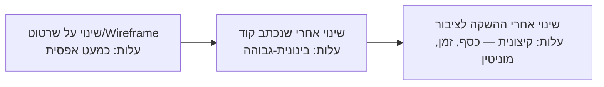
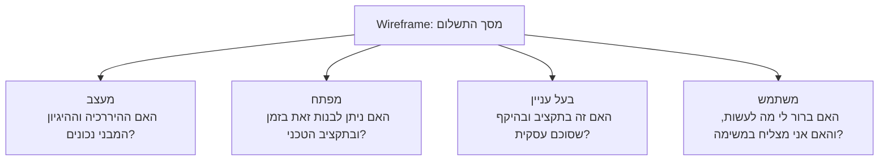
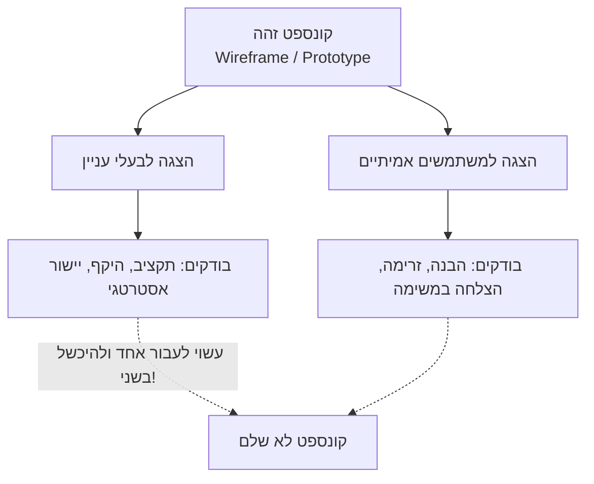
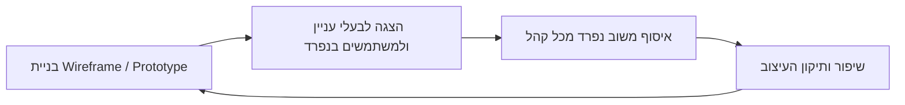

# בחינת הקונספט מול משתמשים ובעלי עניין

## לפני שכותבים שורת קוד אחת

דמיינו אדריכל שמתכנן בית. בשלב הסקיצה על הנייר, אם הלקוח מחליט שהוא רוצה להזיז את הכניסה לצד השני של הבית — זה עולה למעצב חמש דקות עם מחק. אם אותו שינוי מתגלה כנדרש אחרי שהיסודות כבר יצוקים ושלד הבניין עומד — הוא עולה הריסה חלקית, כסף, ושבועות של עיכוב.

זהו בדיוק אותו עיקרון בעיצוב דיגיטלי, ולכן בשיעורים הקודמים למדתם לבנות [[wireframe]] — שרטוט שלדי וסטטי של מסך — ולבנות [[prototype]] — סימולציה אינטראקטיבית שמדמה תנועה בין מסכים. אבל חשוב להבין: wireframe ו-prototype הם לא המוצר הסופי, וגם לא תרגיל עיצובי. הם קיימים למטרה אחת — **לאפשר לכם לבדוק את הרעיון לפני שמישהו כותב שורת קוד אחת**.

ככל שמתקדמים בציר הזמן של הפיתוח, עלות התיקון גדלה בצורה חדה: שינוי על הנייר כמעט חינמי; שינוי אחרי שנכתב קוד דורש זמן פיתוח מחדש; שינוי אחרי שהמוצר כבר הושק לציבור עולה כסף, מוניטין ולעיתים לקוחות שכבר עזבו. חברת Juicero, למשל, השקיעה מיליוני דולרים בפיתוח מכשיר סחיטה מהונדס להפליא — ורק אחרי ההשקה התברר שמשתמשים יכולים לסחוט את שקיות המיץ שלו בידיים, בלי המכשיר בכלל. בדיקת קונספט זולה ומוקדמת הייתה חוסכת את כל ההשקעה הזו.

:::diagram
עקומת עלות השינוי לאורך ציר הזמן של הפיתוח

:::

:::selfcheck
question: חברה מחליטה לדלג על שלב ה-wireframe ולעבור ישירות לכתיבת קוד, כדי "לחסוך זמן". לאחר שהמוצר כמעט מוכן מתגלה שסדר המסכים שגוי לחלוטין. מדוע הניסיון "לחסוך זמן" עלול דווקא להוביל להפסד זמן וכסף גדולים יותר?
answer: כי דילוג על שלב ה-wireframe מזיז את גילוי הבעיה מהנקודה הכי זולה בציר הזמן (שרטוט על נייר, כמעט חינמי) לנקודה יקרה בהרבה (אחרי שכבר נכתב קוד לכל המסכים). התיקון באותו שלב דורש כתיבה מחדש של קוד, לא רק גרירת מלבנים בשרטוט — בדיוק העיקרון שממחיש מקרה Juicero, שם היעדר בדיקה מוקדמת הוביל להשקעה הנדסית יקרה שהתבררה כמיותרת.
:::

---

## מטרות השיעור

בסיום שיעור זה תוכלו:

- להגדיר מהי בחינת קונספט (Concept Validation) ולהסביר מדוע wireframe ו-prototype משמשים "שפה משותפת" בין ארבעה קהלים שונים.
- להסביר את עקומת עלות השינוי ולנמק מדוע בדיקה מוקדמת חוסכת משאבים משמעותיים.
- להבחין בין בדיקת קונספט מול בעלי עניין לבין בדיקה מול משתמשים, ולזהות אילו סוגי כשלים כל אחת חושפת.
- ליישם ניתוח תרחיש ולזהות איזה קהל (מעצב, מפתח, בעל עניין, משתמש) צפוי לתפוס איזו בעיה.
- לנתח מקרה שבו קונספט עבר בדיקה מול קהל אחד אך נכשל מול האחר, ולהסיק מה השתבש.
- לתאר את לולאת האיטרציה בין בדיקה לעיצוב מחדש ולקשר אותה למחזור העבודה של [[human-centered-design]].

---

# שפה משותפת בין ארבעה קהלים

לפני שקיימת מערכת עובדת, אין דרך פשוטה לגרום לארבעה סוגי אנשים שונים — עם שפה מקצועית, מטרות ותפיסת עולם שונות לחלוטין — להסכים על מה בדיוק בונים. פה בדיוק נכנס ה-wireframe או ה-prototype: הוא הופך למעין **שפה משותפת** שכל הצדדים יכולים להסתכל עליה ולהגיב אליה, עוד לפני שהמוצר קיים בפועל.

כפי שמנוסח לעיתים בעולם התעשייה: wireframes משמשים שפה משותפת בין מעצבים, משתמשים, בעלי עניין ומפתחים. אותו קונספט מדויק — אותו שרטוט — נבדק על ידי ארבעה קהלים, וכל אחד מהם בודק דבר שונה לגמרי:

- **מעצבים** — בודקים לוגיקה מבנית: האם ההיררכיה נכונה? האם הזרימה בין המסכים הגיונית?
- **מפתחים** — בודקים היתכנות טכנית ומאמץ: האם ניתן לבנות את זה בזמן ובתקציב הפיתוח הקיימים? אילו רכיבים כבר קיימים במערכת ואילו צריך לבנות מאפס?
- **בעלי עניין** (מנהלי מוצר, הנהלה, לקוחות עסקיים) — בודקים יישור אסטרטגי: האם זה בתקציב? האם זה בהיקף (Scope) שסוכם? האם זה משרת את יעדי החברה?
- **משתמשים אמיתיים** — בודקים [[usability]] בפועל: האם ברור מה לעשות? האם המשימה מסתיימת בהצלחה, בלי בלבול?

הערך של השפה המשותפת הזו הוא שכל בעיה נתפסת **על ידי הקהל הנכון**, בשלב שבו התיקון עדיין כמעט חינמי.

:::example
**תרחיש: מסך תשלום חדש באפליקציית משלוחי אוכל**

צוות מציג wireframe של מסך תשלום חדש (checkout) לשלושה קהלים שונים:

1. **מנהל המוצר** מבחין שה-wireframe כולל אפשרות "שמור כתובת למשלוח הבא" — פיצ'ר שלא אושר בתקציב הרבעון הנוכחי. הוא מבקש להוציא אותו מהיקף הגרסה הקרובה.
2. **מהנדס תוכנה** מציין שרכיב מפת המשלוח בזמן אמת שמופיע בשרטוט ידרוש שינוי משמעותי בארכיטקטורת השרתים — עבודה שתוסיף שלושה ספרינטים לפיתוח.
3. **שלושה משתמשים אמיתיים** מתבקשים "לבצע הזמנה" מול ה-wireframe: שניים מהם מנסים ללחוץ על סכום התשלום הכולל כי הם מצפים לפירוט מחירים, ואחד מהם כלל לא שם לב לקישור הקטן "הזן קוד קופון".

שים לב: אף אחד מהקהלים לא תפס את הבעיה שקהל אחר תפס. מנהל המוצר לא היה מזהה את בעיית הארכיטקטורה, המהנדס לא היה שם לב לבלבול סביב סכום התשלום, ואף אחד משני הראשונים לא היה מזהה שהקישור לקוד הקופון נעלם מעיני משתמשים.
:::

:::diagram
אותו wireframe, ארבע בדיקות שונות

:::

:::selfcheck
question: בתרחיש מסך התשלום, המהנדס מציין שרכיב המפה בזמן אמת ידרוש שינוי בארכיטקטורת השרתים. לאיזה סוג בעיה זו שייכת, ומדוע דווקא המהנדס — ולא מעצב, בעל עניין או משתמש — הוא זה שמזהה אותה?
answer: זו בעיית היתכנות טכנית (Feasibility). רק המפתח מכיר את מגבלות הקוד והארכיטקטורה הקיימים ואת העלות האמיתית של בניית כל רכיב, ולכן רק הוא יכול לזהות שרכיב מסוים "יקר" לבנייה. מעצב בודק היגיון מבני, בעל עניין בודק תקציב והיקף עסקי, ומשתמש בודק שמישות — אף אחד מהם אינו חשוף למגבלות הטכניות שמאחורי הקלעים.
:::

---

# בדיקה מול בעלי עניין לעומת בדיקה מול משתמשים

טעות נפוצה היא לחשוב שברגע שקיבלתם "אור ירוק" מהצד אחד — סימן שהקונספט תקין. בפועל, בדיקה מול בעלי עניין ובדיקה מול משתמשים הן **שתי פעילויות נפרדות לגמרי**, שכל אחת חושפת סוג אחר של כשל:

| היבט | בדיקה מול בעלי עניין | בדיקה מול משתמשים |
|---|---|---|
| השאלה המרכזית | "האם זה נכון עבור העסק?" | "האם זה עובד עבור מי שישתמש בזה בפועל?" |
| מי משתתף | מנהלי מוצר, הנהלה, לקוחות עסקיים, לעיתים משקיעים | אנשים אמיתיים מקהל היעד, גם במדגם קטן |
| מה זה תופס | חריגה מתקציב, סטייה מהיקף שסוכם, אי-התאמה ליעדי החברה, בעיות היתכנות עסקית | בלבול, מודל מנטלי שגוי, כישלון בביצוע משימה, תסכול |
| מה זה **לא** תופס | לרוב לא יזהה קושי שימוש בפועל — בעלי עניין אינם מנסים "לבצע משימה" כמו משתמש אמיתי | לרוב לא יזהה בעיית תקציב, היתכנות טכנית או יישור אסטרטגי |

:::example
**Windows 8 — כשל שדוגמתו קלאסית להבדל בין שני סוגי הבדיקה**

מיקרוסופט הציגה להנהלה ולבעלי העניין הפנימיים חזון נועז: מסך "Start" מבוסס אריחים (Tiles) שמאחד מחשב ומכשיר מגע לחוויה אחת. ההנהלה התלהבה, האישור העסקי ניתן, וההשקעה הרחבה יצאה לדרך. אבל כשהמוצר הגיע למשתמשים אמיתיים — רובם על מחשבים עם עכבר ומקלדת רגילים, ללא מסך מגע — הם התקשו למצוא פונקציות בסיסיות, ואפילו לא מצאו את כפתור "Start" המוכר. האישור מצד בעלי העניין לא ניבא כלום לגבי ההצלחה מול משתמשים אמיתיים.
:::

:::important
בדיקה מול בעלי עניין **אינה תחליף** לבדיקה מול משתמשים אמיתיים — וההפך גם נכון. קונספט יכול לעבור בהצלחה בדיקה מול בעלי עניין (מתאים לתקציב, בהיקף, משרת את יעדי החברה) ולהיכשל לחלוטין מול משתמשים (מבלבל, לא ברור, משימות נכשלות) — כפי שקרה ל-Windows 8. וההפך אפשרי גם כן: קונספט שמשתמשים אוהבים אך חורג לגמרי מהתקציב או מההיקף שסוכם. יש לבצע את שתי הבדיקות, לא רק אחת מהן.
:::

:::diagram
שתי בדיקות נפרדות על אותו קונספט

:::

:::selfcheck
question: צוות הציג פרוטוטייפ למנכ"ל שהתלהב ואישר תקציב מלא להמשך הפיתוח. האם ניתן להסיק מכך שהמוצר יעבור גם בדיקת שמישות מול משתמשים אמיתיים? נמקו.
answer: לא. אישור מצד בעל עניין (המנכ"ל) מעיד רק על יישור אסטרטגי-עסקי — תקציב, היקף, חזון. הוא לא בודק שמישות בפועל, בדיוק כפי שקרה ב-Windows 8: ההנהלה אהבה את החזון, אך משתמשים אמיתיים נתקלו בבלבול חמור. יש לבצע בדיקת משתמשים נפרדת ובלתי תלויה כדי לקבל תמונה מלאה.
:::

---

# הלולאה: מבדיקה לתיקון ובחזרה

בחינת הקונספט אינה שער חד-פעמי שעוברים בו פעם אחת ומתקדמים. היא **לולאה איטרטיבית**: בונים גרסה של ה-wireframe או ה-prototype, מציגים אותה לבעלי עניין ולמשתמשים בנפרד, אוספים משוב שונה מכל קהל, משפרים את העיצוב בהתאם — וחוזרים על התהליך עד שהקונספט עומד גם בדרישות העסקיות וגם בדרישות השמישות.

כפי שלמדנו במחזור העבודה האיטרטיבי של [[human-centered-design]], עיצוב טוב אינו מגיע ב"ניסיון אחד מושלם" — הוא תוצאה של סבבים חוזרים של בנייה, הערכה וחידוד. בחינת הקונספט היא בדיוק היישום המוקדם של אותו עיקרון: ככל שהלולאה הזו רצה על wireframe זול לפני שנכתב קוד, כך היא זולה ומהירה יותר — וכל סבב נוסף מקרב את הקונספט לגרסה שגם בעלי העניין וגם המשתמשים מאשרים.

:::diagram
לולאת בחינת הקונספט

:::

:::selfcheck
question: לאחר סבב בדיקה עם משתמשים, המעצבת מגלה שרוב המשתתפים לא הבינו למה משמש כפתור "המשך". מהו הצעד הנכון הבא לפי לולאת האיטרציה שלמדנו, ומדוע התשובה "לתקן את זה בקוד" אינה מדויקת בשלב הזה?
answer: הצעד הנכון הוא לחזור ולעדכן את ה-wireframe או ה-prototype עצמו, ואז לבדוק שוב מול משתמשים כדי לוודא שהתיקון פתר את הבלבול — לפני שממשיכים הלאה בלולאה. "לתקן בקוד" מניח בטעות שכבר עברנו לשלב הפיתוח, בעוד שכל המטרה של שלב בחינת הקונספט היא לתפוס ולתקן בעיות כאלה *לפני* שנכתבת שורת קוד אחת — כשהתיקון עדיין כמעט חינמי.
:::

---

## סיכום השיעור

:::summary
Wireframe ו-Prototype אינם המוצר הסופי — הם שפה משותפת שמאפשרת לבדוק קונספט לפני שנכתב קוד, כשעלות השינוי עדיין כמעט אפסית. ארבעה קהלים — מעצבים, מפתחים, בעלי עניין ומשתמשים — בודקים את אותו קונספט וכל אחד תופס סוג בעיה שונה. בדיקה מול בעלי עניין ובדיקה מול משתמשים הן שתי פעילויות נפרדות: האחת חושפת חוסר יישור עסקי, השנייה חושפת כשלי שמישות — ומעבר מוצלח באחת אינו מבטיח הצלחה בשנייה, כפי שראינו ב-Windows 8. בחינת הקונספט אינה שער חד-פעמי אלא לולאה איטרטיבית של בנייה, הצגה, איסוף משוב ותיקון — בדיוק כמו מחזור העבודה של Human-Centered Design.
:::

:::keypoints
- Wireframe/Prototype משמשים "שפה משותפת" לפני שנכתב קוד — עלות תיקון כמעט אפסית בשלב הזה, וגדלה דרמטית ככל שמתקדמים לקוד ולהשקה (מקרה Juicero).
- ארבעה קהלים בודקים את אותו קונספט ותופסים ארבעה סוגי בעיות: מעצבים (מבנה), מפתחים (היתכנות), בעלי עניין (יישור עסקי), משתמשים (שמישות).
- בדיקה מול בעלי עניין ובדיקה מול משתמשים הן שתי פעילויות נפרדות שתופסות כשלים שונים — הצלחה באחת אינה מבטיחה הצלחה בשנייה.
- מקרה Windows 8 ממחיש: אישור עסקי-הנהלתי לא מנבא כלל הצלחה מול משתמשים אמיתיים.
- בחינת הקונספט היא לולאה איטרטיבית — בנייה, הצגה, איסוף משוב נפרד מכל קהל, תיקון וחזרה — בהתאמה למחזור העבודה של Human-Centered Design.
- ככל שהלולאה רצה מוקדם יותר, כשעדיין רק wireframe קיים, היא זולה, מהירה ובעלת ערך גבוה יותר.
:::

:::references
- מצגת הקורס "בחינת הקונספט" — ד"ר משה לייבה (Examine the Concept.pptx)
- Nielsen Norman Group — Concept Testing 101: מתודולוגיה לבדיקת קונספטים מוקדמים מול משתמשים.
- Nielsen Norman Group — Iterative Design: ROI of Usability and Early-Stage Evaluation.
:::

:::quiz{ref="concept-validation-quiz"}
:::
