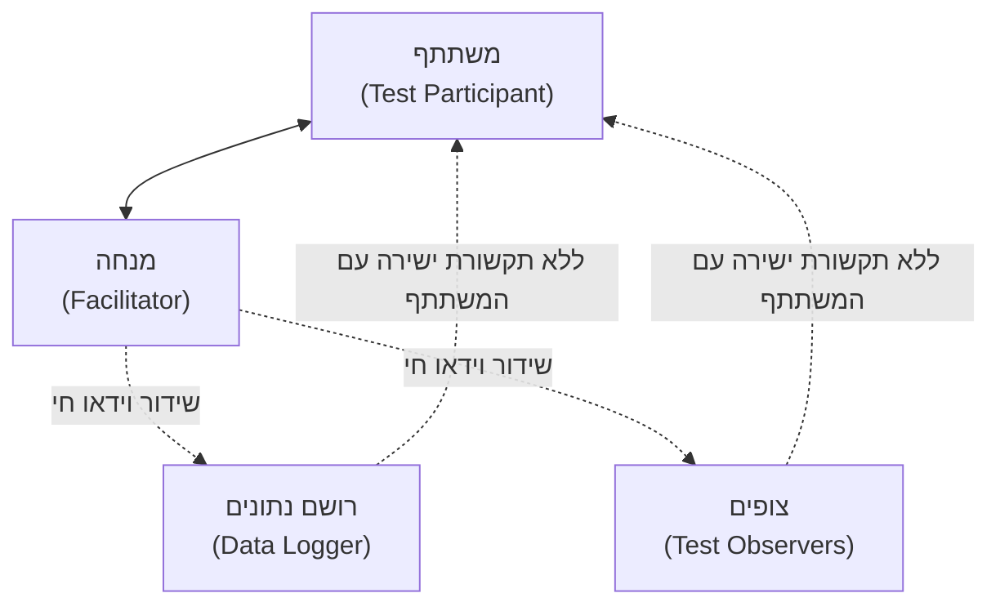
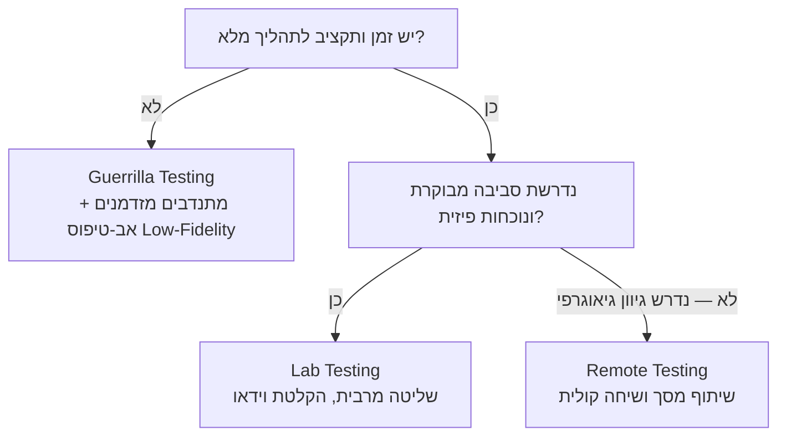

# איך מבצעים בדיקת שמישות — תפקידים, שיטות ו-Think-Aloud

## מהצפייה ל"פרוצדורה"

בשיעור הקודם ראינו שכדי לתפוס בעיות שרק חשיפה אמיתית לממשק חושפת, אין תחליף ל[[empirical-vs-analytical|הערכה אמפירית]] — צפייה במשתמשים אמיתיים מבצעים משימות אמיתיות. אבל "לצפות במשתמש" זו לא הוראת עבודה. מבחן שמישות שמתבצע כמו שיחת מסדרון אקראית לא מייצר נתונים שאפשר לסמוך עליהם.

בדיקת שמישות תקינה היא **פרוצדורה**: יש בה תפקידים מוגדרים, מי שמדבר עם המשתתף ומי שרק צופה; יש בה פורמט — היכן היא מתקיימת ובאיזו רמת שליטה; ויש בה כללים שמגנים גם על תוקף הנתונים וגם על המשתתף עצמו. בשיעור הזה נעבור על שלושת המרכיבים האלה, ונוסיף את הכלי המרכזי שהופך תצפית שקטה לחלון אל המחשבה של המשתמש: **Think-Aloud**.

שימו לב להבדל מהערכה אנליטית כמו [[nielsens-heuristics|ה-Heuristic Evaluation]] שראינו קודם: שם מומחה בודד בודק את הממשק מול רשימת עקרונות, בלי משתמשים בכלל. כאן, לעומת זאת, כל התהליך בנוי סביב **משתמשים אמיתיים** — ולכן הוא דורש פרוצדורה קפדנית הרבה יותר כדי שהתצפית תהיה אמינה.

---

## מטרות השיעור

בסיום שיעור זה תוכלו:

- **לרשום** את התפקידים המרכזיים במבחן שמישות ולהגדיר את האחריות של כל אחד.
- **להסביר** מדוע פרוטוקול ה-Think-Aloud חושף בעיות שמישות שצפייה שקטה מפספסת.
- **להבדיל** בין Critical Error ל-Non-Critical Error ולסווג מקרה נתון לפי ההגדרה הפורמלית.
- **לבחור** את פורמט הבדיקה המתאים — Lab, Remote או Guerrilla — בהינתן אילוצי זמן, תקציב ורמת נאמנות של האב-טיפוס.
- **לזהות** הפרה של כללי אתיקה בבדיקת שמישות ולהסביר מדוע היא פוגעת בתוקף התוצאות.

---

# תפקידים בבדיקת שמישות

:::definition
מבחן שמישות מבוסס על חלוקת תפקידים ברורה: כל תפקיד אחראי על היבט אחר של הבדיקה, ואדם אחד עשוי למלא יותר מתפקיד אחד — אך לא כל תפקיד חייב להתקיים בכל בדיקה. ראו הרחבה ב[[usability-testing]].
:::

## מי עושה מה

כשצוות נכנס לחדר בדיקה, לא כולם שם באותו תפקיד — ולערבוב בין תפקידים יש מחיר ישיר על איכות הנתונים.

- **Facilitator (מנחה):** מציג למשתתף את מטרת הבדיקה ואת מהות השמישות, מלווה אותו לאורך המשימות, ועונה לבקשות עזרה שלו. **אסור לו** לרמוז על הפתרון הנכון — ברגע שהוא עושה זאת, הוא כבר לא בודק את הממשק אלא את יכולת ההנחיה שלו.
- **Data Logger (רושם נתונים):** מתעד בזמן אמת את פעולות המשתתף, את דבריו ואת תגובות המערכת. **אסור לו** להתערב או לדבר עם המשתתף — תפקידו תיעוד בלבד.
- **Test Observer (צופה):** יושב בשקט (לרוב בחדר נפרד או מול מסך משודר), עוזר לזהות בעיות, תקלות תוכנה וטעויות פרוצדורליות שרושם הנתונים עלול לפספס. **אסור לו** לדבר בזמן הבדיקה או לתקשר עם המשתתף.
- **Test Participant (משתתף):** מבצע את המשימות שהוגדרו ומשתף את מחשבותיו תוך כדי ביצוע (ראו [[think-aloud]] בהמשך). **אינו** "עובר" או "נכשל" — הוא רק חושף היכן הממשק כושל.
- **Trainer (מדריך):** תפקיד קצר וממוקד — נותן למשתתף סקירת הכשרה לפני תחילת הבדיקה, כשהמערכת דורשת רקע מוקדם.

:::diagram
מבנה חדר בדיקת שמישות: מי מדבר עם מי, ומי רק צופה.

:::

:::example
צוות בודק את זרימת ה-Checkout באפליקציית Wolt: ה-Facilitator מבקש מהמשתתף "הזמינו פיצה ושלמו". כשהמשתתף מהסס ליד כפתור התשלום ושואל "זה בטוח ישלח את ההזמנה עכשיו?", ה-Facilitator עונה "מה היית מצפה שיקרה?" — ולא "כן, תלחץ, זה בטוח" (שזו כבר עזרה שמכוונת את המשתתף). באותו רגע, ה-Data Logger רושם "היסוס של 8 שניות לפני לחיצה על תשלום — חוסר ודאות", וה-Observer מסמן את זה כדפוס שחזר גם אצל משתתף קודם.
:::

:::selfcheck
question: ה-Facilitator שם לב שהמשתתף לוחץ שוב ושוב על אייקון שגוי ונראה מתוסכל. מה עליו לומר, ומה אסור לו לומר?
answer: מותר לו לעודד דיבור ותצפית מעבר לזה ("על מה אתה חושב עכשיו?", "מה ציפית שיקרה כשלחצת?") — שאלות שלא חושפות את הפתרון. אסור לו לומר משהו כמו "נסה ללחוץ על האייקון השני משמאל" — כל רמז לכיוון הפתרון הנכון הופך את הבדיקה לבדיקה של יכולת ההנחיה שלו, לא של הממשק.
:::

---

# Think-Aloud בפעולה

## למה סתם לצפות לא מספיק

צפייה שקטה מראה **מה** המשתמש עשה — לחץ כאן, גלל שם, נעצר. היא לא מראה **למה**. Think-Aloud (ראו [[think-aloud]]) סוגר את הפער הזה: המשתתף מתבקש לבטא במילים, בזמן אמת, את מחשבותיו, הציפיות שלו ואת התחושות שמלוות כל פעולה — לא רק מה הוא עושה, אלא מה הוא **חושב שיקרה** לפני שהוא עושה את זה.

זה בדיוק מה שהופך את [[empirical-vs-analytical|ההערכה האמפירית]] לחזקה יותר מסתם מדידת זמן או ספירת קליקים: Think-Aloud חושף את הרגע המדויק שבו המודל המנטלי של המשתמש והתנהגות המערכת בפועל מתפצלים.

## איך זה נראה בפועל

בפתיחת הבדיקה, ה-Facilitator מנחה: "אני מבקש שתשתפו אותי בקול בכל מה שאתם חושבים, מרגישים או מצפים לו תוך כדי הביצוע — גם אם זה נשמע לכם מובן מאליו." אם המשתתף משתתק, ה-Facilitator מעודד בעדינות ("על מה אתה חושב כרגע?") — מבלי לרמוז על הפתרון, בדיוק כפי שראינו בסעיף התפקידים.

:::example
**קטע מתומלל מבדיקת שמישות לאפליקציית מוזיקה (Spotify):** המשימה — "צרו פלייליסט משותף עם חבר."

> "אוקיי, אני מחפשת ליצור פלייליסט חדש... אני לוחצת על ה'+' למטה... טוב, זה יצר לי פלייליסט ריק. עכשיו אני מחפשת איך להוסיף חבר אליו... אני בודקת בתפריט שלוש הנקודות למעלה... 'שתף פלייליסט' — אה, זה רק שולח קישור, זה לא מה שרציתי. ציפיתי שיהיה כפתור 'הזמן שותף לעריכה' ליד השם של הפלייליסט, כמו במסמך Google Docs משותף."

הצוות מבין מיד: המשתתפת לא נכשלה "לבד" — היא הביאה איתה מודל מנטלי מ-Google Docs (שיתוף = הזמנה לעריכה משותפת), והממשק לא סיפק לה איתות מקביל. תובנה כזו לא הייתה עולה מצפייה שקטה בתנועת העכבר בלבד — רק המילים "ציפיתי ש..." חושפות את פער הציפייה.
:::

:::important
**כלל ברזל למנחים:** אסור "לעזור" למשתתף כשהוא נתקע. משפט כמו "נסה ללחוץ שם למעלה" הורס את תוקף הבדיקה — במקום לבדוק את הממשק, בודקים כמה טוב המנחה מדריך. תפקיד ה-Facilitator הוא לעודד דיבור, לא לספק רמזים.
:::

:::selfcheck
question: משתתף בבדיקה שותק לגמרי לאורך כל המשימה, ורק בסוף אומר "זה היה קל". מה חסר כאן מבחינת הצוות, ולמה זה בעייתי?
answer: חסר תיעוד של תהליך החשיבה בזמן אמת — הצוות רואה רק את הפעולות (מה נלחץ) בלי לדעת למה, איפה היו רגעי היסוס אמיתיים, או אילו ציפיות הופרו לאורך הדרך. אמירה מסכמת כמו "זה היה קל" בדיעבד לא מגלה את הרגעים הספציפיים שבהם המודל המנטלי של המשתמש התנגש עם הממשק — בדיוק המידע שה-Think-Aloud אמור לספק.
:::

---

# איפה מריצים את הבדיקה: שלושה פורמטים

בדיקת שמישות אפשר לבצע במגוון פורמטים, שנבדלים ברמת השליטה, בעלות ובזמינות המשתתפים.

## Lab Testing — בדיקת מעבדה

המשתתף יושב בחדר ייעודי, מול ה-Facilitator, כשה-Data Logger וה-Observers צופים מחדר סמוך המחובר בשידור וידאו חי (או מאחורי מראה חד-כיוונית). זהו הפורמט עם **רמת השליטה הגבוהה ביותר** — סביבה עקבית, ציוד מקצועי, הקלטה מלאה — אך גם היקר והאיטי ביותר לארגן.

## Remote Testing — בדיקה מרחוק

המשתתף נשאר בסביבת העבודה הטבעית שלו, וה-Facilitator מתחבר אליו באמצעות שיתוף מסך ותקשורת קולית (טלפון). היתרון: המשתתף פועל בסביבה שהוא מכיר, ואפשר לגייס משתתפים ממקומות גיאוגרפיים מגוונים בלי עלויות נסיעה. החיסרון: פחות שליטה על הפרעות סביבתיות ועל איכות החיבור.

## Guerrilla Testing — בדיקת גרילה

:::definition
**Guerrilla Testing** היא בדיקת שמישות מאולתרת וזריזה — "האמנות לתפוס אנשים בודדים בבתי קפה ובמרחבים ציבוריים ולצלם אותם במהירות תוך שהם משתמשים באתר למשך כמה דקות" (מרטין בלאם).
:::

בשיטה זו מסתפקים ב-3–4 מתנדבים מזדמנים, אב-טיפוס מינימלי ברמת נאמנות נמוכה (Low-Fidelity — לפעמים סקיצה על נייר), ותיעוד מקומי פשוט כמו מצלמת טלפון. המטרה אינה דיוק סטטיסטי — היא לתפוס את "ה-oh shit's": הרגעים הברורים שבהם משתמש נתקל בקיר.

שני המכשולים הגדולים ביותר לביצוע בדיקת שמישות בכלל הם גיוס משתתפים והשגת תקציב או אב-טיפוס מתאים. הנכונות לאלתר — "מספיק טוב", "תעשה זאת בעצמך" — היא בדיוק מה שהופך בדיקה מתוכנית שלא קורית לבדיקה שבאמת מתבצעת. חברות כמו Airbnb, Dropbox ו-Yelp נעזרו ב-Guerrilla Testing בשלבים שונים של הפיתוח שלהן.

:::important
בדיקה מהירה ומלוכלכת עדיפה על בדיקה פורמלית שלעולם לא מיישמים את מסקנותיה, או שפשוט אף פעם לא מתבצעת. השאיפה לפורמט "המושלם" (Lab מלא) לא צריכה לעכב בדיקה שאפשר לעשות היום.
:::

:::diagram
עץ החלטה לבחירת פורמט הבדיקה לפי אילוצי זמן, תקציב וסביבה.

:::

:::example
**מתי לבחור מה:** צוות מוצר בשלב רעיוני מוקדם, עם סקיצה על נייר ואחר-צהריים אחד פנוי — Guerrilla Testing בבית קפה סמוך ייתן תשובה מהירה ומספיקה. לעומת זאת, צוות שעומד להשיק פיצ'ר תשלומים קריטי לפני מיליוני משתמשים צריך נתונים מדויקים ומתועדים היטב לפני קבלת החלטה בסיכון גבוה — כאן המחיר של Lab Testing מוצדק. Remote Testing מתאים כשצריך משתתפים ממגוון אזורים או פרופילים שאי אפשר לגייס פיזית לחדר אחד.
:::

:::selfcheck
question: סטארט-אפ בשלב מוקדם רוצה לבדוק סקיצה ראשונית של מסך הרשמה, יש לו יום אחד ותקציב אפסי. איזה פורמט הכי מתאים, ולמה לא Lab Testing?
answer: Guerrilla Testing — הוא מתאים בדיוק לאילוצים האלה: אב-טיפוס Low-Fidelity (סקיצה), 3–4 מתנדבים מזדמנים, תיעוד פשוט. Lab Testing דורש תיאום, ציוד, וזמינות משתתפים שאין להם ביום אחד ובתקציב אפסי — לחכות לתהליך המושלם פירושו לא לבדוק בכלל, וזה גרוע יותר מבדיקה "מלוכלכת" שכן מתבצעת.
:::

---

# חומרת השגיאה: Critical מול Non-Critical

לא כל שגיאה שווה. כדי לתעדף תיקונים אחרי הבדיקה, צריך לסווג כל שגיאה לפי החומרה שלה.

:::definition
**Critical Error (שגיאה קריטית):** סטייה, בסיום המשימה, מהיעד שהוגדר בתרחיש — שגיאה שלא נפתרה במהלך ביצוע המשימה, או שהובילה לתוצאה שגויה.
**Non-Critical Error (שגיאה לא-קריטית):** שגיאה שהמשתתף מתאושש ממנה בעצמו, או שגם אם לא זוהתה, אינה מובילה לבעיה בעיבוד או לתוצאה בלתי צפויה — למשל טעות פרוצדורלית (מסלול לא יעיל) או טעות בלבול (לחיצה ראשונית שגויה, שתוקנה).
:::

## למה זה משנה

ההבדל הזה לא סמנטי — הוא קובע **סדר עדיפויות**. תיקון של Critical Error חוסך למשתמשים כישלון מוחלט במשימה; תיקון של Non-Critical Error משפר יעילות אך לא מונע כישלון. צוות עם משאבים מוגבלים מתחיל תמיד ב-Critical Errors.

:::example
באותה בדיקה של אתר eBay: משתתף א' לוחץ בטעות על "הוסף להשוואה" במקום "הוסף לעגלה", שם לב מיד ("רגע, זה לא זה"), ומתקן את עצמו תוך שתי שניות — **Non-Critical Error**, כי הוא זיהה ותיקן בעצמו ולא נפגעה התוצאה הסופית. משתתפת ב', לעומת זאת, לא מוצאת בכלל את כפתור סיום הרכישה, מנסה כמה מסלולים, ובסוף מוותרת ומדווחת בטופס הסיום "השלמתי את ההזמנה" למרות שההזמנה מעולם לא נשלחה — **Critical Error**, כי התוצאה הסופית שגויה ולא נפתרה.
:::

:::selfcheck
question: משתתף בבדיקת שמישות לאתר תיירות מחפש טיסה, טועה ובוחר תאריך חזרה שגוי, אבל שם לב לכך בעצמו לפני האישור הסופי ומתקן. איזו קטגוריה זו, ולמה?
answer: Non-Critical Error — המשתתף התאושש בעצמו מהטעות לפני שהיא השפיעה על התוצאה הסופית של המשימה. אילו הוא לא היה שם לב וההזמנה הייתה נשלחת עם תאריך שגוי, זו הייתה הופכת ל-Critical Error, כי אז הסטייה הייתה נשארת בתוצאה הסופית.
:::

---

## אתיקה: הגנה על המשתתף

:::warning
ביצועיו של משתתף בודד **אסור** שיהיו ניתנים לשיוך אליו אישית. שמו של משתתף אסור שייעשה בו שימוש מחוץ למפגש הבדיקה עצמו, ואסור לדווח על ביצועיו למנהל שלו. הכלל הזה לא רק מגן על המשתתף — הוא גם מה שמאפשר לו להתנהג באופן טבעי ולומר "לא הבנתי את זה" בלי חשש, וזו בדיוק ההתנהגות הכנה שהבדיקה תלויה בה.
:::

:::selfcheck
question: מנהל מוצר מבקש מה-Facilitator לדעת אילו משתתפים ספציפית נכשלו במשימה, כדי "לדבר איתם". מה על ה-Facilitator לענות, ולמה?
answer: עליו לסרב ולהסביר שביצועי משתתפים בודדים אינם ניתנים לשיוך אישי — אפשר לדווח על מגמות מצטברות ("3 מתוך 5 משתתפים נתקעו בשלב התשלום") אך לא על משתתף מזוהה בשמו. אם משתתפים ידעו שהביצועים שלהם עלולים לחזור אליהם, הם יתנהגו פחות בטבעיות ויסתירו קשיים אמיתיים — מה שהורס את תוקף הבדיקה כולה.
:::

---

## סיכום

:::summary
בדיקת שמישות אינה "לשבת ליד מישהו ולצפות" — היא פרוצדורה עם תפקידים מוגדרים (Facilitator שמנחה ולא מרמז, Data Logger שמתעד, Observers ששותקים, Participant שמבצע), עם פרוטוקול Think-Aloud שחושף את פער הציפייה בזמן אמת, עם בחירת פורמט (Lab לשליטה מרבית, Remote לגיוון גיאוגרפי, Guerrilla למהירות ולזול), ועם סיווג שגיאות (Critical מול Non-Critical) שקובע מה מתקנים קודם. כל זה עומד על בסיס אחד שאסור לוותר עליו: הגנה על זהות המשתתף.
:::

:::keypoints
- ארבעת התפקידים המרכזיים: Facilitator (מנחה, לא מרמז), Data Logger (מתעד), Test Observer (צופה שקט), Test Participant (מבצע).
- Think-Aloud חושף את הפער בין מה שהמשתמש חושב שיקרה למה שקורה בפועל — לא רק מה הוא עשה, אלא למה.
- Lab Testing נותן שליטה מרבית ועלות גבוהה; Remote Testing נותן סביבה טבעית וגיוון גיאוגרפי; Guerrilla Testing נותן מהירות וזול במחיר דיוק.
- "בדיקה מהירה ומלוכלכת" (Guerrilla) עדיפה על בדיקה פורמלית שאף פעם לא מתבצעת — Airbnb, Dropbox ו-Yelp נעזרו בשיטה זו.
- Critical Error = תוצאה שגויה או לא-נפתרת בסיום המשימה. Non-Critical Error = שגיאה שהמשתתף מתאושש ממנה בעצמו או שלא פוגעת בתוצאה.
- אתיקה: ביצועי משתתף בודד אינם ניתנים לשיוך אישי ואסור לדווח עליהם למנהל שלו.
:::

:::references
- מצגת הקורס "בדיקת שמישות" (Usability.pptx) ותבנית תוכנית מבחן שמישות של הקורס (usability-test-plan.docx) — ד"ר משה לייבה.
- Steve Krug, *Don't Make Me Think* — מקור משני על Guerrilla Testing ושיטת האלתור המהיר.
:::

:::quiz{ref="conducting-the-test-quiz"}
:::
