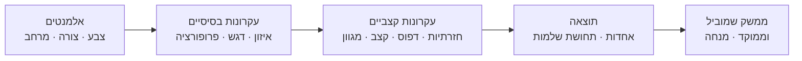

# עקרונות ויזואליים ביסוד עיצוב ממשקים

## מדוע עיצוב ויזואלי הוא לא רק אסתטיקה?

ריצ'רד סאול ווּרמן, ממייסדי עידן ה-Information Architecture, אמר פעם:

> "The only thing we know is our own personal knowledge and lack of knowledge. And since it's the only thing we really know, the key to making things understandable is to understand what it's like not to understand."

משפט זה לב העניין: עיצוב ויזואלי טוב אינו רק עניין של "נראה יפה" — הוא מכשיר שמסביר, מנחה ומפחית את העומס הקוגניטיבי של המשתמש. ממשק לא מאוזן, עמוס ולא ממוקד גורם לבלבול ולנטישה. ממשק שמיישם את עקרונות העיצוב הנכונים מוביל את עין המשתמש, מדגיש את מה שחשוב ומייצר חוויה נינוחה ואמינה.

בשיעור זה נלמד את שתי שכבות הבסיס של כל עיצוב: **אלמנטים** (אבני הבניין) ו**עקרונות** (הכללים לשימוש נכון בהם).

---

## מטרות השיעור

בסיום שיעור זה תוכלו:

- לפרט את חמשת אלמנטי העיצוב הבסיסיים.
- להסביר כל אחד מתשעת עקרונות העיצוב ולתת דוגמה ממשית לכל עיקרון.
- להבחין בין ממשקים "בעייתיים" (לא מאוזנים, עמוסים, לא ממוקדים) לממשקים שמיישמים את העקרונות הנכונים.
- ליישם חשיבה עקרונאית בניתוח ממשקי משתמש קיימים.

---

# אלמנטי העיצוב: אבני הבניין הבסיסיות

לפני שמדברים על "עיצוב טוב", חייבים להכיר את חומרי הגלם. **אלמנטי העיצוב** הם המרכיבים הבסיסיים שמהם בנויה כל יצירה ויזואלית — מצביעת עכבר ועד עיצוב של אפליקציה שלמה.

## 1. צבע (Color)

הצבע הוא אחד הכלים החזקים ביותר בידי המעצב. הוא אינו רק ויזואלי — הוא רגשי, תרבותי ותפקודי.

- **תפקוד**: צבעים שונים מסמנים מצבי מערכת שונים (ירוק = הצלחה, אדום = שגיאה, כתום = אזהרה).
- **רגש**: כחול כהה משדר אמינות; כתום משדר אנרגיה ויצירתיות.
- **ניגוד (Contrast)**: הניגוד בין טקסט לרקע חיוני לנגישות וקריאות.

:::important
בעיצוב ממשקים, צבע לא אמור לשמש כמידע היחיד — לא ניתן להסתמך רק על "האחד האדום הוא הכפתור הלחוץ" — בגלל עיוורי צבעים ומשתמשים עם מגבלות ראייה.
:::

## 2. צורה (Shape)

צורות מעבירות מסרים ללא מילים:
- **עיגולים ואליפסות**: רכות, ידידותיות, חביבות (כפתורי גלולה ב-iOS).
- **מרובעים ומלבנים**: יציבות, סדר, רשמיות.
- **משולשים**: כיוון, דינמיות, מתח.

## 3. מרקם (Texture)

מרקם ויזואלי יוצר תחושת עומק ועניין. בעיצוב דיגיטלי, מרקם עדין (דפוס עדין ברקע, צל, Gradient) מוסיף ממד למסך שטוח.

## 4. מרחב (Space)

המרחב — הן החלקים המלאים והן החלקים הריקים — הוא אלמנט פעיל לחלוטין. "שטח לבן" (White Space) אינו ריק; הוא אמצעי עיצובי להפרדת אלמנטים ולהקלת הקריאה.

## 5. צורה תלת-ממדית (Form)

כאשר לצורה יש עומק, אורך ורוחב, היא הופכת ל-Form. בעיצוב דיגיטלי, Form מושגת באמצעות צלליות, גרדיאנטים ואנימציות שמעניקות למרכיבים תחושת נפח.

:::selfcheck
question: מדוע מרחב לבן (White Space) נחשב לאלמנט עיצובי פעיל ולא ל"שטח מבוזבז"?
answer: שטח לבן אינו ריק — הוא משמש להפרדת אלמנטים, להקלת העומס הויזואלי ולהנחיית עין הקורא לעבר המידע החשוב. ממשקים עמוסים מדי (ללא שטח לבן) גורמים לקושי בניתוב ולעייפות ויזואלית.
:::

---

# עקרונות העיצוב: הכללים לשימוש נכון

אם האלמנטים הם החומרים, אז **עקרונות העיצוב** הם כללי הבישול — הדרך שבה מחברים את החומרים כדי ליצור תוצאה מקצועית ומנוסחת.

## 1. איזון (Balance)

איזון עיצובי פירושו חלוקה שוויונית של "משקל ויזואלי" ברחבי המסך, כך שהעיניים לא יימשכו לכיוון אחד בצורה בלתי רצויה.

- **איזון סימטרי**: שני צדדים ממוקדים ומשוקלים — משדר יציבות ורשמיות.
- **איזון אסימטרי**: אלמנטים שונים בגודל ובמיקום שמאזנים זה את זה — משדר דינמיות ומודרניות.

:::example
בדף בית של אתר חדשות: כותרת גדולה משמאל (גדולה ומשוקלת) מאוזנת על ידי תמונה בצד ימין (קטנה יותר אך בצבעים בולטים). האיזון האסימטרי מייצר עניין ויזואלי ומוביל את עין הקורא.
:::

## 2. דגש (Emphasis)

דגש הוא יצירת נקודת מיקוד ויזואלית ראשית על המסך. לא הכל יכול להיות חשוב באותה מידה — אם הכל מודגש, כלום אינו מודגש.

- **כיצד יוצרים דגש?** גודל גדול יותר, צבע מנוגד, מיקום מרכזי, טיפוגרפיה עבה (Bold), אנימציה עדינה.
- **שאלת הסדר**: על המעצב להחליט מה הפריט הראשון שהמשתמש יראה, השני, השלישי.

:::important
דגש הוא גם כלי הנחיה: כפתור ה-Call-to-Action (CTA) חייב להיות הפריט הבולט ביותר בעמוד, כדי שהמשתמש ידע מה הפעולה הרצויה הבאה.
:::

## 3. תנועה (Movement)

תנועה (או כיוונון ויזואלי) היא האופן שבו המעצב מוביל את עין הצופה בתוך המסך מנקודה לנקודה. ניתן להשיג זאת באמצעות:
- קווים (אמיתיים או מרומזים)
- גרדיאנטים שמעבירים ממקום למקום
- עיצוב שמחקה כיוון טבעי של קריאה (שמאל לימין, מעלה למטה)
- אנימציות עדינות שמושכות תשומת לב

## 4. דפוס (Pattern)

חזרה קבועה על אלמנטים יוצרת דפוס. דפוסים מרגיעים את עין המשתמש, מאחר שהם יוצרים מבנה צפוי ונוח.

- בממשקי משתמש: רשימות עם רכיבים אחידים (כרטיסיות, שורות בטבלה) שמשתמשים מזהים כקשורים.
- **חשוב**: שבירה מכוונת של הדפוס משמשת ליצירת דגש.

## 5. חזרתיות (Repetition)

חזרה על אלמנטים עיצוביים לאורך הממשק כולו (אותו כפתור, אותם צבעים, אותו גופן) יוצרת עקביות וזיהוי מותגי. המשתמש לומד "שפה ויזואלית" אחת ולא צריך לחדשה בכל מסך.

## 6. פרופורציה (Proportion)

פרופורציה היא היחס הגודלי בין אלמנטים שונים. פרופורציה "נכונה" מעידה על חשיבות: אלמנט גדול יותר = חשוב יותר.

:::example
בכרטיס מוצר (Product Card) באתר מסחר: תמונת המוצר (גדולה) > שם המוצר (בינוני) > מחיר (קטן אך בצבע מנוגד) > תיאור (קטן ביותר). ההיררכיה מנחה את הקורא בדיוק בסדר שהמעצב רצה.
:::

## 7. קצב (Rhythm)

קצב בעיצוב הוא תחושת "דפיקות" ויזואליות — אלמנטים שחוזרים בתדירות צפויה ויוצרים תחושת מוזיקליות. מרווח קצר-ארוך-קצר-ארוך בין אלמנטים יוצר קצב.

## 8. מגוון (Variety)

מגוון הוא השימוש בהבדלים ויזואליים כדי לשמור על עניין ולמנוע שעמום. ממשק אחיד לחלוטין מייאש; ממשק שמשלב גדלים שונים, צבעים שונים ומבנים שונים — תוך שמירה על עקביות — מרתק.

## 9. אחדות (Unity)

אחדות היא העיקרון המחבר הכל — הרגשה שכל אלמנטי הממשק שייכים לאותה "משפחה" עיצובית. ממשק מאוחד נראה כולל ונוח לניווט.

:::diagram
מפת קשרים בין עקרונות העיצוב

:::

---

# כיצד מזהים ממשק בעייתי?

שלושת הסימנים הנפוצים לממשק שאינו מיישם את עקרונות העיצוב:

1. **לא מאוזן (Unbalanced)**: עין המשתמש נמשכת לצד אחד ולא יודעת מה לעשות בהמשך.
2. **עמוס (Cluttered)**: יותר מדי אלמנטים, מידע, צבעים ומרכיבים תחרותיים — לא ניתן להחליט מה חשוב.
3. **לא ממוקד (Unfocused)**: אין נקודת דגש ברורה; המשתמש לא מבין מה הפעולה שאמורה לקרות.

:::warning
ממשק עם שלושת הכשלים האלה גורם לנטישה מיידית. משתמשים לא "מנתחים" ויזואלית ומחפשים את הבעיה — הם פשוט הולכים.
:::

---

## סיכום השיעור

:::summary
עיצוב ויזואלי טוב עומד על שתי שכבות: **אלמנטים** (צבע, צורה, מרקם, מרחב ו-Form) שהם אבני הבניין, ו**עקרונות** (איזון, דגש, תנועה, דפוס, חזרתיות, פרופורציה, קצב, מגוון ואחדות) שהם הכללים לשימוש נכון בהם. ממשק שאינו מיישם את העקרונות יהיה לא מאוזן, עמוס ולא ממוקד — ויכשל בהנחיית המשתמש לפעולה הרצויה.
:::

:::keypoints
- חמשת האלמנטים הבסיסיים: צבע, צורה, מרקם, מרחב, Form.
- תשעת עקרונות העיצוב: Balance, Emphasis, Movement, Pattern, Repetition, Proportion, Rhythm, Variety, Unity.
- שטח לבן הוא אלמנט עיצובי פעיל — לא שטח מבוזבז.
- ממשק עמוס, לא מאוזן ולא ממוקד גורם לנטישה מיידית.
- דגש הוא כלי הנחיה — לא הכל יכול להיות חשוב באותה מידה.
:::

:::references
- מצגת "כללי עיצוב" — ד"ר משה לייבה (Design roles.pptx).
- Richard Saul Wurman — Information Architect & TED founder.
- סיכום הקורס "מנשק אדם-מחשב" (Copy of HCI.pdf), פרק Design Rules, עמ' 32–34.
:::

:::quiz{ref="core-visual-principles-quiz"}
:::
