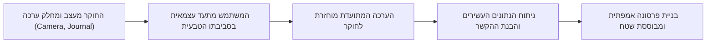

# בניית פרסונות: האנשת נתוני מחקר

## למה חשוב להאנש את נתוני המחקר?

לאחר שיצאנו לשטח, ערכנו תצפיות, ראיינו משתמשים ורשמנו ערימות של הערות מחקר, אנו עומדים בפני אתגר עצום: כיצד לתרגם את כל המידע המופשט והמפוזר הזה להחלטות עיצוביות מעשיות? 

במקרים רבים, מהנדסים ומעצבים נוטים ליפול לאחת משתי מלכודות: הם מעצבים את המערכת עבור עצמם (תוך הנחה מוטעית שהמשתמש חושב כמותם), או שהם מתייחסים למשתמש כאל "יישות אלסטית" – מושג מעורפל שהדרישות שלו משתנות בכל פעם שנתקלים בקושי פיתוחי (למשל, "המשתמש כבר יבין איך לחפש" או "המשתמש בטוח רוצה את האפשרות הזו").

כדי לפתור זאת, אנו משתמשים בכלי רב-עוצמה: **פרסונה (Persona)**. במקום לדבר על "קהל היעד של מנהלי מחסנים", אנו מדברים על "בטי" – דמות מוחשית עם שם, פנים, הרגלים, פחדים ויעדים. האנשת הנתונים הזו יוצרת אמפתיה בקרב צוות הפיתוח ומציבה עוגן יציב וברור לקבלת החלטות לאורך כל חיי הפרויקט.

---

## מטרות השיעור

בסיום שיעור זה תוכלו:

- להגדיר מהי [[persona]] ומדוע היא מיוצגת כדמות בדיונית המבוססת על נתונים אמיתיים.
- להסביר את תרומתו של אלן קופר (Alan Cooper) לפיתוח המושג.
- להבחין בין פרסונה ראשית (Primary) לפרסונות משניות (Secondary), ולהסביר את הסכנה בריבוי פרסונות.
- לנתח פרסונה לפי מתודולוגיית **P.E.R.S.O.N.A**.
- לזהות את החלקים השונים המרכיבים את פרופיל הפרסונה, בדגש על יעדים ותסכולים.
- להסביר מהו כלי ה-**Cultural Probes** ומתי נעשה בו שימוש לאיסוף נתונים לפרסונה.

---

# מהי פרסונה (Persona)?

[[persona]] היא דמות בדיונית מייצגת, המעוצבת על בסיס נתונים שנאספו במחקר שטח (כמו ראיונות ותצפיות), ומטרתה לייצג קבוצת משתמשי קצה מרכזית של המוצר. 

המושג פותח על ידי אלן קופר (Alan Cooper), מחלוצי הנדסת התוכנה ועיצוב הממשקים. הרעיון המרכזי של קופר היה פשוט: במקום לחשוב על המשתמש כעל יישות מופשטת ונטולת פנים, על הצוות לחשוב עליו כעל אדם מוחשי. כאשר הצוות מדבר על "יוסי" או "בטי", הם מתחשבים בצרכים, במיומנויות וברגשות שלהם בכל החלטה עיצובית.

:::important
הפרסונה היא בדיונית (fictional) אך היא אינה מומצאת! היא חייבת להתבסס על נתונים אמיתיים ומחקר אמפירי בשטח. יצירת פרסונה ללא מחקר מקדים מולידה "פרסונת קש" שאינה מייצגת את המציאות ומזיקה לתהליך העיצוב.
:::

## סיווג פרסונות: ראשית מול משניות

ברוב הפרויקטים נזהה מספר קבוצות משתמשים שונות. לכן, לרוב נבנה בין **2 ל-6 פרסונות** שונות המייצגות את קהל היעד. בתוך קבוצה זו, נגדיר תמיד פרסונה אחת כ**פרסונה הראשית (Primary Persona)**, ואת השאר כ**פרסונות משניות (Secondary Personas)**.

- **פרסונה ראשית (Primary):** המשתמש שקהל היעד שלו הוא החשוב ביותר למוצר, ושעבורו הממשק מעוצב באופן ישיר. המערכת חייבת לענות על כל הצרכים של פרסונה זו באופן מלא, גם אם הדבר דורש פשרות מצד משתמשים אחרים.
- **פרסונה משנית (Secondary):** משתמש בעל צרכים נוספים, שניתן לענות עליהם באמצעות התאמות קטנות בממשק הקיים (שעוצב עבור הפרסונה הראשית), מבלי לפגוע בחוויה של המשתמש הראשי.

:::warning
**מלכודת ריבוי הפרסונות:** מעצבים מתחילים מנסים לעיתים לבנות עשרות פרסונות כדי לרצות את כולם. הדבר יוצר מצב בלתי אפשרי שבו הצוות מנסה לעצב ממשק שמתאים לכולם, ובסוף לא מתאים לאף אחד. הגבלת מספר הפרסונות ל-2 עד 6 (עם ראשית אחת בלבד) שומרת על המיקוד של הצוות.
:::

---

# מתודולוגיית P.E.R.S.O.N.A

כיצד נדע אם הפרסונה שעיצבנו היא כלי עבודה איכותי ומעשי? לשם כך נשתמש במדד **P.E.R.S.O.N.A**:

* **P - Primary research (מחקר ראשוני):** האם הפרסונה מבוססת על מחקר שטח ישיר (כגון ראיונות קונטקסטואליים ותצפיות עם לקוחות אמיתיים), ולא על ניחושים?
* **E - Empathy (אמפתיה):** האם היא מעוררת אמפתיה אצל המפתחים? האם היא כוללת שם, תמונה ריאליסטית וסיפור חיים רלוונטי למוצר?
* **R - Realistic (ריאליזם):** האם הדמות נראית הגיונית ואמיתית לאנשים שעובדים מול לקוחות יום-יום (למשל, אנשי מכירות ותמיכה)?
* **S - Singular (ייחודיות):** האם כל פרסונה מייצגת קבוצה ייחודית בעלת מאפיינים נפרדים, ללא כפילויות מיותרות עם פרסונות אחרות?
* **O - Objectives (יעדים):** האם מטרותיה העיקריות והציטוט המוביל שלה רלוונטיים למוצר ומסבירים מה היא מנסה להשיג?
* **N - Number (מספר):** האם מספר הפרסונות קטן מספיק (2-6) כדי שחברי הצוות יזכרו את שמותיהן בעל פה?
* **A - Applicable (ישימות):** האם הצוות יכול להשתמש בפרסונה ככלי מעשי שיעזור להכריע במחלוקות עיצוביות?

---

# תבנית יצירת הפרסונה

כדי לאפיין פרסונה בצורה שיטתית ומקצועית, תהליך העבודה כולל מילוי של מספר סעיפים קבועים המרכיבים את פרופיל הדמות:

1. **פרטים דמוגרפיים:** שם, גיל, מיקום, מקצוע, חברה, השכלה, סטטוס משפחתי וסיווג הפרסונה (ראשית/משנית).
2. **סקירה כללית (Overview):** תיאור קצר של חייה, תחומי עניין, הרגלים ותחביבים (האנשת הדמות).
3. **תפקיד ותחומי אחריות:** הגדרת תפקידה המקצועי של הפרסונה ומה מצופה ממנה לבצע.
4. **ערוצי תקשורת:** האמצעים שבהם היא משתמשת כדי ליצור קשר עם אחרים (טלפון, מייל, רשתות חברתיות).
5. **מיומנות מחשב וטכנולוגיה:** סוג החומרה בשימוש, רמת השליטה במחשב ובתוכנות, ודפוסי שימוש ברשת.
6. **יעדים וחששות (Goals & Fears):** 
   - **יעדים:** מה הפרסונה מנסה להשיג (למשל, חיסכון בזמן, דיוק בנתונים).
   - **חששות/תסכולים:** מה מונע ממנה להשיג את מטרותיה או גורם לה ללחץ (למשל, פחד מאובדן נתונים, סירבול).
7. **הקשר (Context):** תיאור הסביבה הפיזית, החברתית, והטכנולוגית שבה הפרסונה פועלת (למשל, משרד רועש, מחשב ישן, הגבלות firewall).
8. **יום בחיי הפרסונה (A day in the life):** 2-3 פסקאות המתארות יום טיפוסי של הדמות, כדי להבין את שגרת יומה מעבר לשימוש היבש במערכת.
9. **ציטוט מייצג (Quotes):** ציטוט או שניים שממצים את הלך הרוח שלה (למשל: *"באמת שאין לי זמן להתעסק עם זה עכשיו"*).

:::example
**פרסונה לדוגמה — בטי (Betty):**
בטי היא בת 37, מנהלת מחסן בחברת הנדסה ב-12 השנים האחרונות. היא למדה לימודי ערב לדיפלומה בעסקים, נשואה ואם לשניים (בני 15 ו-7). היא סובלת ממגבלה קלה בתנועת יד ימין בעקבות תאונת עבודה, ושמחה להאציל סמכויות לעובדיה. 
**החשש המרכזי שלה:** בטי חשה מאוימת מכניסתה של מערכת מחשוב חדשה (השלישית בתקופתה בחברה), והיא חוששת שהדבר יפגע ביעילות עבודתה או יאלץ אותה להישאר שעות נוספות (דבר שהיא נמנעת ממנו כדי להיות עם ילדיה).
:::

---

# כלי מחקר מתקדם: Cultural Probes (גישוש תרבותי)

בתחילת השיעור ציינו שפרסונה חייבת להתבסס על נתוני שטח. אולם, לעיתים קשה מאוד לבצע תצפית ישירה על משתמשים – למשל כשחוקרים התנהגות אינטימית בתוך הבית, או כשחוקרים אוכלוסיות רגישות (כמו חולי נפש בקליניקות).

לשם כך פותח כלי ה-**Cultural Probes (גישוש תרבותי)**.
בשיטה זו, החוקרים מעצבים **ערכת גישוש (Probe pack)** ומחלקים אותה למשתתפים. המשתתפים לוקחים את הערכה לביתם או לסביבתם הטבעית, ומשתמשים בה כדי לתעד את חייהם באופן עצמאי.

הערכה עשויה לכלול פריטים יצירתיים המעודדים השתתפות:
- **מצלמה חד-פעמית:** עם הנחיות כמו "צלמי את הדבר הראשון שאת מסתכלת עליו כשאת מתעוררת" או "צלמי את המקום הכי מעצבן בבית".
- **גלויות מודפסות מראש:** עם שאלות פתוחות או בקשות להביע רגשות.
- **יומן אישי:** לכתיבת הערות יומיות.
- **כלי הקלטה או חפצים סימבוליים:** (כמו כוס זכוכית להצמדה לקיר כדי "להקשיב" לרעשי הסביבה).

המשתמשים שולחים את הערכה המלאה בחזרה לחוקרים. המידע המתקבל אינו ניתוח סטטיסטי יבש, אלא צוהר לעולמם הפנימי והרגשי של המשתמשים. נתונים אלו מזינים ישירות את בניית הפרסונה, מעוררים אמפתיה עמוקה בקרב המעצבים, ומספקים השראה לפתרונות עיצוביים חדשניים.

:::diagram
תרשים המציג את תהליך השימוש ב-Cultural Probes לאיסוף נתונים לבניית פרסונה:

:::

---

## סיכום השיעור

:::summary
פרסונה ([[persona]]) היא דמות בדיונית המבוססת על נתוני שטח אמיתיים, שנועדה לייצג קבוצת משתמשים ראשית או משנית במטרה למנוע עיצוב עצמי או פנייה ל"משתמש אלסטי". המושג, שפותח על ידי אלן קופר, נשען על מחקר ראשוני, יצירת אמפתיה, ריאליזם, וישימות עיצובית (לפי מתודולוגיית P.E.R.S.O.N.A). מספר הפרסונות המומלץ בפרויקט נע בין 2 ל-6, עם פרסונה ראשית אחת שמכתיבה את כיוון העיצוב. איסוף הנתונים לפרסונות נעשה באמצעות תצפיות וראיונות, או באמצעות כלי מחקר עצמאיים כמו Cultural Probes בסביבות קשות לגישה.
:::

:::keypoints
- פרסונה היא דמות בדיונית אך חייבת להתבסס על נתוני מחקר שטח (Primary Research).
- אלן קופר פיתח את השימוש בפרסונות כדי להאנש את נתוני המחקר ולמנוע את בעיית "המשתמש האלסטי".
- פרויקט עיצוב טיפוסי יכלול 2 עד 6 פרסונות, כאשר רק אחת מהן מוגדרת כפרסונה ראשית (Primary).
- מרכיב ה"תסכולים" (Frustrations) והציטוט בפרסונה קריטיים להבנת נקודות התורפה של המשתמש.
- Cultural Probes הן ערכות המאפשרות למשתמשים לתעד את חייהם באופן עצמאי בסביבות שבהן קשה לחוקר לבצע תצפית ישירה.
:::

:::references
- מצגת הקורס בנושא פרסונות ותרחישים (Personas and Scenarios.pptx).
- תבנית יצירת פרסונה (Templete.doc).
- הספר "About Face" מאת אלן קופר (Alan Cooper).
- מאמרים על שימוש ב-Cultural Probes במחקר משתמשים (Bill Gaver et al.).
:::
