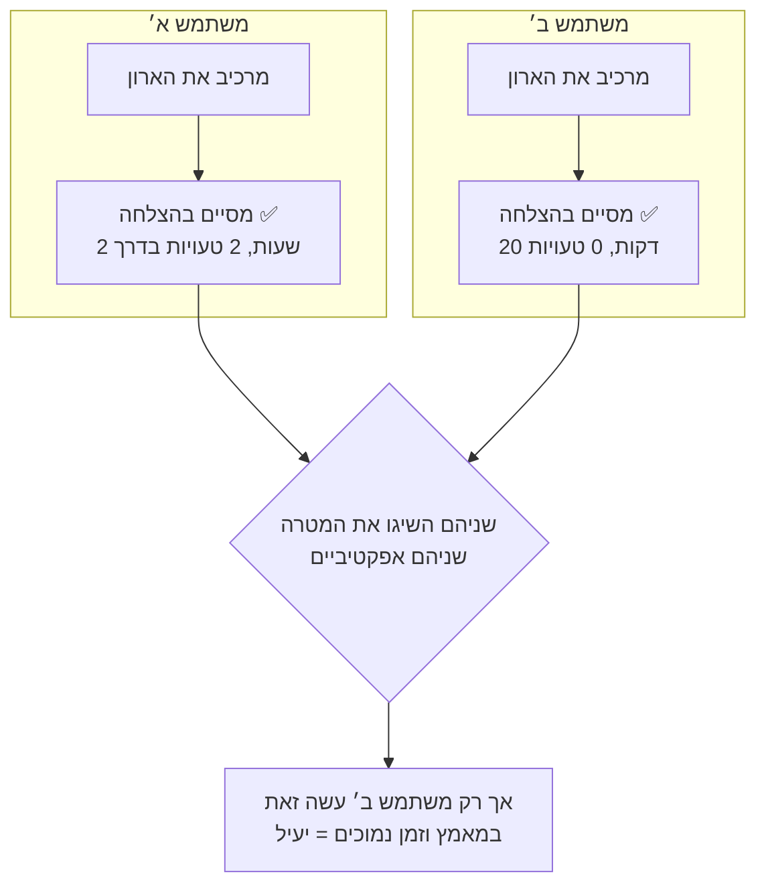
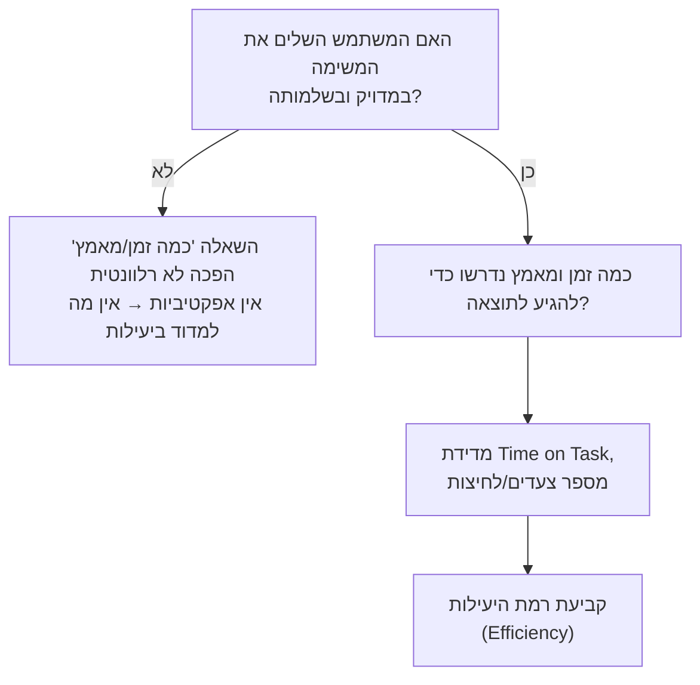

# אפקטיביות מול יעילות — ההבחנה המדויקת של ISO 9241-11

## פתיחה: שני אנשים, אותו ארון

תארו לעצמכם שני חברים שקנו בדיוק את אותו ארון בגדים משטח, וכל אחד מהם מרכיב אותו לבד בסלון שלו. שניהם, בסופו של דבר, מסיימים את ההרכבה — הארון עומד, הדלתות נסגרות, שום בורג לא נשאר בצד. אבל כאן הדמיון נגמר: החבר הראשון התעסק עם הארון שעתיים שלמות, טעה פעמיים בכיוון הלוחות ונאלץ לפרק ולהרכיב מחדש חלק שלם. החבר השני סיים תוך עשרים דקות, ללא טעות אחת.

שאלה: **מי מהשניים "הצליח" בהרכבת הארון?** התשובה האינטואיטיבית היא — שניהם. שניהם השיגו בדיוק את מה שרצו להשיג. אבל ברור לכל אחד מאיתנו ששני החברים לא עברו את אותה **חוויה**. ה"הצלחה" של שניהם היא שאלה אחת (האם הגעתי ליעד?), וה"מחיר" ששילמו כדי להגיע אליו הוא שאלה שנייה לגמרי (כמה זה עלה לי?).

תקן ISO 9241-11, שכבר פגשתם כשלמדנו את ההגדרה הפורמלית של [[usability]], מפריד בדיוק בין שתי השאלות הללו — וקורא להן **אפקטיביות (Effectiveness)** ו**יעילות (Efficiency)**. ההגדרה המלאה, שאנו נפרק כאן לגורמים, מתועדת ב[[effectiveness-vs-efficiency]]. השיעור הזה מוקדש כולו להבהרת ההבדל ביניהן, כי זו אחת ההבחנות הנפוצות ביותר במבחני HCI, ומרבית הטעויות בה נובעות מבלבול עם מונח דומה שכבר פגשתם — ממד ה-Efficiency של נילסן.

---

## מטרות השיעור

בסיום שיעור זה תוכלו:

- **להגדיר** את שלושת המרכיבים הרשמיים של הגדרת השמישות לפי ISO 9241-11 — אפקטיביות, יעילות ושביעות רצון.
- **להסביר** במילים פשוטות את ההבדל בין "האם הגעתי ליעד" (אפקטיביות) לבין "כמה עלה לי להגיע אליו" (יעילות), ולזהות אילו מדדים (Task Success Rate מול Time on Task) משויכים לכל אחת.
- **להבחין** בין ממד ה-Efficiency בחמשת ממדי נילסן לבין רכיב ה-Efficiency בהגדרת ISO 9241-11 — שני מושגים שנשמעים זהים אך מודדים דברים שונים.
- **ליישם** את ההבחנה על תרחיש נתון עם נתוני Completion Rate ו-Time on Task אמיתיים, ולסווג אותו נכון.
- **לנתח** מדוע אפקטיביות היא שאלה מקדימה ליעילות, ומה קורה כשמנסים לדלג על הסדר ההגיוני הזה.

---

# אפקטיביות (Effectiveness) — האם המשתמש הגיע ליעד?

**אפקטיביות**, במילים הפשוטות ביותר, עונה על שאלה אחת: **האם המשתמש השיג את המטרה שלו, במדויק ובשלמותה?** זו שאלה בינארית-במהותה — הצלחה או כישלון, גם אם לפעמים יש הצלחות "עם הסתייגות" (למשל, המשתמש השלים את המשימה אך עם שגיאה קלה שתיקן בעצמו).

ההגדרה הפורמלית של ISO 9241-11 מנסחת זאת כך: אפקטיביות היא המידה שבה משתמשים מסוימים משיגים מטרות מסוימות **בדיוק ובשלמות** בהקשר שימוש נתון. שימו לב למילים "בדיוק ובשלמות" — אפקטיביות לא נמדדת רק ב"האם הגיע לשם", אלא גם ב"האם התוצאה נכונה". משתמש שמילא טופס והגיש אותו, אך מילא שדה קריטי בטעות, לא היה אפקטיבי באמת — למרות שהוא "לחץ שלח".

בעולם המחקר האמפירי, כפי שלמדתם ב[[usability-testing]], אפקטיביות נמדדת בעיקר באמצעות שני מדדים:

- **Task Success Rate** — אחוז המשתתפים שהצליחו להשלים את המשימה בכלל.
- **Completion Rate** — אחוז ההשלמות ללא שגיאה קריטית (Critical Error) בדרך.

:::example
חברת תעופה משיקה תהליך הזמנת כרטיס טיסה חדש. בבדיקת שמישות עם 20 משתתפים, 18 מהם (90%) הצליחו להזמין כרטיס לטיסה הנכונה, בתאריך הנכון, עבור מספר הנוסעים הנכון. שני משתתפים (10%) הזמינו בטעות טיסה בתאריך שגוי ולא שמו לב לכך עד הרגע האחרון — הזמנה זו נחשבת **כישלון אפקטיביות**, למרות שהם "סיימו את התהליך" מבחינה טכנית.
:::

:::diagram
תרשים המשווה בין שני משתמשים המרכיבים את אותו ארון:

התרשים ממחיש ששני המשתמשים אפקטיביים באותה מידה (שניהם הגיעו ליעד), אך שונים לגמרי ברמת היעילות שלהם.
:::

:::selfcheck
question: משתמשת ניסתה להעלות קובץ למערכת ענן, הקובץ אכן עלה בהצלחה, אבל היא בטעות העלתה גרסה ישנה של הקובץ ולא שמה לב לכך. האם זו הייתה אינטראקציה אפקטיבית? נמקו.
answer: לא. למרות שהמשימה "הטכנית" הושלמה (קובץ הועלה, המערכת לא קרסה), התוצאה אינה תואמת את מטרתה האמיתית של המשתמשת — היא רצתה להעלות את הגרסה הנכונה. אפקטיביות נמדדת לפי דיוק ושלמות ההשגה, לא רק לפי "משהו קרה". זו דוגמה קלאסית לכישלון אפקטיביות שמוסתר מאחורי תחושת השלמה מוטעית.
:::

---

# יעילות (Efficiency) — כמה זה עלה למשתמש?

אם אפקטיביות שואלת "האם?", **יעילות** שואלת **"כמה?"**. יעילות בודקת את כמות המשאבים — בעיקר זמן, אך גם מאמץ קוגניטיבי, מספר צעדים ולחיצות — שהמשתמש היה צריך להשקיע כדי להגיע לאותה תוצאה.

חשוב להבין: יעילות **אינה שאלה בינארית**. היא סקאלה — יש הבדל בין "יעיל מאוד", "יעיל בינוני" ו"לא יעיל בכלל", וההבדל הזה נמדד בדרך כלל ביחס לבנצ'מארק (למשל, גרסה קודמת של המוצר, או מתחרה בשוק).

המדדים האמפיריים הנפוצים ליעילות:

- **Time on Task** — הזמן שנדרש להשלמת המשימה.
- **מספר הצעדים / הקלקות** שנדרשו לביצוע המשימה.
- לעיתים גם **עומס קוגניטיבי** ([[cognitive-load]]) — כמה "מאמץ מחשבתי" המשתמש חש לאורך התהליך.

:::example
בהמשך לדוגמת הזמנת הטיסה: מבין 18 המשתתפים שהצליחו להזמין כרטיס נכון (אפקטיביים), רובם סיימו תוך כ-3 דקות בממוצע (יעילות גבוהה) — אבל שניים מהם התעכבו יותר מ-15 דקות כל אחד, כי לא הבינו איפה למצוא את שדה "מספר נוסעים" והתחילו לגלול באקראי בין תפריטים. שני המשתמשים האלה **היו אפקטיביים אך לא יעילים**.
:::

:::selfcheck
question: אפליקציית בנק מאפשרת למשתמש להעביר כסף ב-3 לחיצות ותוך 15 שניות, אך לעיתים קרובות ההעברה נשלחת לחשבון הלא נכון בגלל ממשק מבלבל שגורם למשתמשים לבחור בטעות באיש קשר דומה בשם. איך הייתם מסווגים את המערכת הזו — יעילה? אפקטיבית?
answer: המערכת מהירה מאוד (יעילה מבחינת זמן וצעדים), אך יש לה בעיית אפקטיביות חמורה — משתמשים לא משיגים את מטרתם האמיתית (העברה לאיש הקשר הנכון) בגלל טעויות שהממשק גורם להן. זהו מקרה מובהק שממחיש שיעילות גבוהה אינה מפצה על אפקטיביות נמוכה — מהירות בהגעה ליעד הלא נכון היא לא הישג.
:::

---

## שביעות הרצון (Satisfaction) — הרגל השלישי

ISO 9241-11 לא עוצר באפקטיביות ויעילות — הוא מוסיף רכיב שלישי: **שביעות רצון (Satisfaction)**, התחושה הסובייקטיבית של המשתמש מהתהליך. כבר פגשתם את שביעות הרצון כאחד מחמשת ממדי נילסן ב[[usability]], ולמעשה שם, במודל של נילסן, שביעות הרצון היא ממד עצמאי לצד ה-Efficiency שלו.

חשוב לזכור ששלושת הרכיבים של ISO אינם תמיד הולכים יד ביד: משתמש יכול להיות אפקטיבי ויעיל, אך עדיין לא מרוצה (למשל, אם התהליך היה מלחיץ מבחינה רגשית, גם אם מהיר ומדויק). לכן שביעות רצון נמדדת בנפרד, בדרך כלל באמצעות שאלון (כמו SUS) בסוף מבחן [[usability-testing]].

:::example
משתמש שמעביר כסף באפליקציית בנק תוך 15 שניות בלבד (יעיל מאוד) ומגיע ליעד הנכון בכל פעם (אפקטיבי לחלוטין) עדיין עלול לדרג את החוויה נמוך בשאלון שביעות רצון, אם צבעי האזהרה האדומים בממשק ("פעולה בלתי הפיכה!") גורמים לו כל פעם לתחושת חרדה. אפקטיביות ויעילות מודדות **תוצאה**; שביעות רצון מודדת **חוויה**.
:::

:::selfcheck
question: בלי להסתכל למעלה — מהם שלושת הרכיבים שמרכיבים את הגדרת השמישות לפי ISO 9241-11, ואיזה מדד אמפירי אחד מתאים לכל אחד מהם?
answer: אפקטיביות (Effectiveness) — נמדדת ב-Task Success / Completion Rate; יעילות (Efficiency) — נמדדת ב-Time on Task ומספר הצעדים; שביעות רצון (Satisfaction) — נמדדת בשאלון סובייקטיבי כמו SUS. שלושתם יחד, בהקשר שימוש מוגדר, מרכיבים את ההגדרה הפורמלית של שמישות.
:::

---

# ISO מול נילסן: שתי משמעויות שונות ל"יעילות"

זו הנקודה הקריטית ביותר בשיעור, ולכן נעצור עליה. שני המודלים שכבר פגשתם — **שלושת רכיבי ISO 9241-11** וחמשת ממדי נילסן שלמדתם ב[[usability]] — **חולקים מונח משותף: Efficiency**. אך המונח מתאר שני דברים שונים לגמרי:

| היבט | Efficiency לפי **ISO 9241-11** | Efficiency לפי **חמשת ממדי נילסן** |
|---|---|---|
| מה נמדד | משאבים (זמן/מאמץ) שהושקעו **בניסיון בודד** להשלים משימה — לכל משתמש, מומחה או מתחיל | מהירות ביצוע משימות של **משתמשים שכבר למדו** את המערכת ומכירים אותה |
| מספר הרכיבים במודל | אחד משלושה (יחד עם Effectiveness ו-Satisfaction) | אחד מחמישה (יחד עם Learnability, Memorability, Errors, Satisfaction) |
| מה נדרש כדי למדוד | כל אינטראקציה בודדת — גם של משתמש חדש בפעם הראשונה | רק לאחר תקופת למידה — לא רלוונטי למפגש הראשון |
| בן-זוגו הישיר | Effectiveness (זוג צמוד — לכל ניסיון) | ארבעת הממדים האחרים (Learnability, Memorability, Errors, Satisfaction) |

:::important
**איך זוכרים את זה?** ISO 9241-11 מגדיר **שמישות של אינטראקציה בודדת** — כל ניסיון של כל משתמש, בכל שלב, נבחן דרך אפקטיביות + יעילות + שביעות רצון. חמשת ממדי נילסן מתארים **תכונות של המערכת עצמה לאורך זמן**, ואחד מהם קרוי גם הוא "יעילות" — אבל מתמקד ספציפית במהירות של משתמשים **ותיקים** לאחר שכבר עברו את שלב הלמידה. משתמש חדש בפעם הראשונה יכול להיות אפקטיבי ואפילו יעיל (לפי ISO) — אך לא נמדד כלל בממד ה-Efficiency של נילסן, כי הוא עדיין לא "משתמש מנוסה".
:::

:::warning
**מלכודת בחינה קלאסית**: שאלה עשויה לתאר תרחיש ולשאול "איזה ממד שמישות מודגם כאן — Efficiency?" מבלי לציין לאיזה מודל היא מתכוונת. תמיד בדקו את ההקשר: אם השאלה עוסקת ב**ניסיון בודד** של משתמש (כל משתמש, גם חדש) להשלים משימה מסוימת — זהו ה-Efficiency של **ISO** (הזוג של Effectiveness). אם השאלה עוסקת במהירות של **משתמשים שכבר מכירים** את המערכת, לאחר תקופת שימוש — זהו ה-Efficiency של **נילסן** (אחד מחמישה, לצד Learnability). בלבול בין השניים הוא אחת הטעויות הנפוצות ביותר בבחינה.
:::

:::selfcheck
question: תרחיש: משתמש שמשתמש לראשונה בחייו באפליקציית ניווט מצליח למצוא את היעד תוך 40 שניות בלבד מרגע הפתיחה. תרחיש נוסף: משתמש ותיק שמשתמש באפליקציה כבר שנה, מבצע פעולת ניווט שגרתית תוך 5 שניות. איזה ניסיון קשור לאיזה מודל של "יעילות"?
answer: הניסיון הראשון (משתמש חדש, פעם ראשונה, 40 שניות למשימה בודדת) קשור ל-Efficiency לפי **ISO 9241-11** — הוא נמדד כזוג עם Effectiveness עבור כל ניסיון, גם של מתחיל. הניסיון השני (משתמש ותיק, אחרי תקופת היכרות עם המערכת) קשור ל-Efficiency לפי **חמשת ממדי נילסן** — הוא בודק ספציפית מהירות של משתמשים מנוסים, אחרי שכבר עברו את שלב ה-Learnability.
:::

---

## הסדר ההגיוני: אפקטיביות היא תנאי מקדים ליעילות

עכשיו לכלל הכי חשוב לזכור מהשיעור הזה: **אי אפשר למדוד יעילות של משהו שלא הצליח**. יעילות עונה על "כמה זמן/מאמץ עלה להגיע ליעד" — ואם המשתמש מעולם לא הגיע ליעד, השאלה הזו הופכת חסרת משמעות. אין טעם לומר "המשתמש נכשל מהר מאוד" כאילו זה הישג.

לכן, בכל ניתוח שמישות, הסדר הלוגי הוא תמיד:

1. **קודם** בודקים האם המשימה הושלמה נכון ובשלמותה (אפקטיביות).
2. **רק אם כן** — יש טעם לשאול כמה זמן ומאמץ זה דרש (יעילות).

הסיבה שהסדר הזה קריטי היא שהפוך ממנו נוצרת טעות מדידה נפוצה: צוותי מוצר לפעמים בוחנים רק "כמה מהר משתמשים עוברים תהליך" מבלי לבדוק אם הם בכלל הגיעו לתוצאה נכונה. מערכת יכולה להיראות "מהירה ומצוינת" בדוחות Time on Task, בעוד שבפועל אחוז גדול מהמשתמשים בכלל לא סיימו את המשימה נכון — והנתון הזה פשוט לא נמדד.

:::diagram
תרשים זרימה של סדר הבדיקה הנכון:

:::

:::selfcheck
question: מדוע לא נכון לומר על מערכת שבה 30% מהמשתמשים נכשלים במשימה, אך אלו שכן מצליחים עושים זאת תוך 10 שניות בלבד, ש"המערכת יעילה מאוד"?
answer: כי הטענה מתעלמת מכך שאפקטיביות היא תנאי מקדים ליעילות. 10 שניות הן נתון יעילות מרשים — אבל הוא רלוונטי רק לתת-קבוצת המשתמשים שהצליחו (70%). לגבי 30% הנוספים, אין בכלל מה למדוד — הם לא הגיעו ליעד, ולכן שאלת "כמה זמן זה לקח" חסרת משמעות עבורם. לומר "המערכת יעילה מאוד" מבלי לציין את שיעור הכישלון הגבוה מטעה ומסתיר בעיית אפקטיביות חמורה.
:::

---

## דוגמה מורחבת: טופס ממשלתי מול אפליקציה מודרנית

הבה נבחן דוגמה מספרית מלאה שממחישה איך שני הרכיבים — אפקטיביות ויעילות — נמדדים זה לצד זה, ואיך עיצוב מחדש יכול לשפר את אחד מבלי לפגוע בשני.

**גרסה א׳ — האתר הממשלתי הישן לתשלום דוחות תנועה:**

- **Completion Rate: 92%** — רוב המשתמשים הצליחו, בסופו של דבר, לשלם את הדוח (אפקטיביות גבוהה).
- **Time on Task: 12 דקות בממוצע, 40 לחיצות** — כדי למצוא את הדף הנכון, המשתמשים נדדו בין תפריטים, טעו בדפים, וחזרו אחורה שוב ושוב (יעילות נמוכה מאוד).

**גרסה ב׳ — אפליקציית תשלום דוחות מודרנית, לאחר עיצוב מחדש:**

- **Completion Rate: 92%** — בדיוק אותה אפקטיביות! העיצוב מחדש לא שינה את שיעור ההצלחה.
- **Time on Task: 90 שניות, 4 לחיצות** — אותה תוצאה בדיוק, אבל במאמץ וזמן נמוכים משמעותית (יעילות גבוהה בהרבה).

:::important
שימו לב לנקודה החשובה בדוגמה: **האפקטיביות נשארה זהה (92%) בשתי הגרסאות — רק היעילות השתפרה דרמטית.** זו הוכחה מספרית לכך שאפקטיביות ויעילות הם שני צירים בלתי-תלויים לגמרי: אפשר לשפר משמעותית את אחד מבלי לגעת בשני. צוות מוצר שמסתכל רק על Completion Rate (92% מול 92%) עלול להחמיץ לגמרי את השיפור העצום בחוויית המשתמש שקרה כאן.
:::

---

## סיכום השיעור

:::summary
ISO 9241-11 מגדיר שמישות כשילוב של שלושה רכיבים: אפקטיביות (Effectiveness) — האם המשתמש השיג את מטרתו במדויק ובשלמות; יעילות (Efficiency) — כמה זמן ומאמץ עלה לו להגיע לשם; ושביעות רצון (Satisfaction) — התחושה הסובייקטיבית מהתהליך. אפקטיביות ויעילות עשויות להיראות דומות לממד ה-Efficiency בחמשת ממדי נילסן, אך הן שני מושגים שונים — ISO מתאר ניסיון בודד של כל משתמש, בעוד נילסן מתאר תכונת מערכת של משתמשים מנוסים לאורך זמן. הכלל החשוב ביותר לזכור: אפקטיביות היא תמיד שאלה מקדימה — אי אפשר, ואין טעם, למדוד יעילות של משימה שנכשלה.
:::

:::keypoints
- אפקטיביות (Effectiveness) עונה על "האם המשתמש הגיע ליעד, במדויק ובשלמות?" — נמדדת ב-Task Success Rate ו-Completion Rate.
- יעילות (Efficiency) עונה על "כמה זמן ומאמץ עלה להגיע לשם?" — נמדדת ב-Time on Task ומספר הצעדים.
- שביעות רצון (Satisfaction) היא הרכיב השלישי של ISO 9241-11, ונמדדת בנפרד באמצעות שאלונים כמו SUS.
- ה-Efficiency של ISO (זוג עם Effectiveness, לכל ניסיון בודד) שונה מה-Efficiency של נילסן (אחד מחמישה ממדים, למשתמשים ותיקים בלבד) — זו מלכודת בחינה קלאסית.
- אפקטיביות היא תנאי מקדים ליעילות: מערכת שאינה אפקטיבית אינה יכולה להיחשב יעילה, גם אם הניסיון בה היה מהיר.
- אפקטיביות ויעילות הן צירים בלתי-תלויים — אפשר לשפר משמעותית אחד מהם (למשל בעיצוב מחדש) מבלי לשנות את השני כלל.
:::

:::references
- מצגות הקורס "שמישות" — ד"ר משה לייבה (Usability.pptx, Usability definitions.pptx).
- ISO 9241-11:2018 — Ergonomics of human-system interaction: Usability — Definitions and concepts.
:::

:::quiz{ref="effectiveness-vs-efficiency-quiz"}
:::
