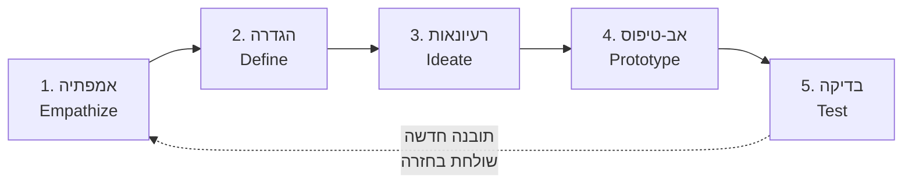
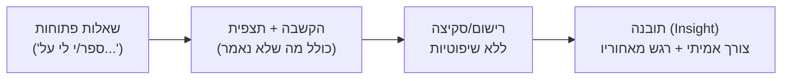
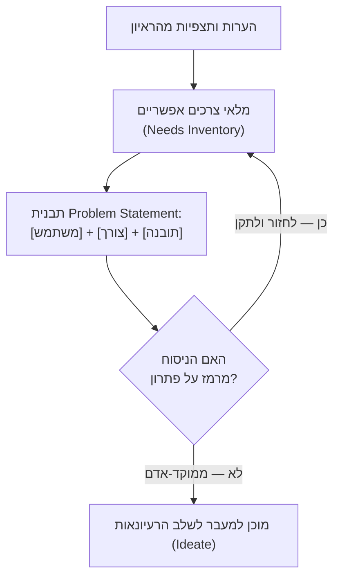

# חשיבה עיצובית: אמפתיה למשתמש והגדרת ה-Problem Statement

## שני מעצבים, אותה משימה: תכננו ארנק טוב יותר

דמיינו שאני מבקש מכם, ברגע זה, לתכנן **ארנק טוב יותר**. לא ארנק כלשהו — ארנק טוב יותר, עבור אדם ספציפי שיושב לידכם. יש לכם כמה דקות בלבד. מה תעשו?

הדחף הטבעי הוא לשבת לבד ולחשוב: אילו תכונות הופכות ארנק ל"טוב"? אולי תא נוסף לכרטיסי אשראי, אולי חומר איכותי יותר, אולי עיצוב אלגנטי יותר. תוך דקה-שתיים תשרטטו את הרעיון הכי טוב שעלה בראשכם. זו גישת **Problem Solving** קלאסית: מזהים משימה כללית ("תכננו ארנק טוב יותר") וקופצים ישר לפתרון, מתוך ההנחות והטעם האישי שלכם.

עכשיו נסו גישה אחרת: לפני שאתם משרטטים משהו — **עצרו**. פנו לאדם שיושב לידכם ובקשו ממנו להציג בפניכם, פריט-פריט, את מה שיש בארנק שלו. שאלו שאלות. הקשיבו. שימו לב למה שמפתיע אתכם ולמה שמעורר בכם סקרנות. רק אחרי זה תתחילו לתכנן.

זו **חשיבה עיצובית** ([[design-thinking]]): גישה שמציבה את **האדם** במרכז, לפני שהיא מציבה **רעיון** במרכז. ההבדל בין שתי הגישות אינו בכישרון או בכלים — הוא בסדר הפעולות. וכפי שנראה בשיעור הזה, הסדר הזה משנה הכול.

:::important
**Creative Confidence** — כך מכנים דיוויד וטום קלי, מייסדי סוכנות העיצוב IDEO, את האמונה ביכולת שלכם ליצור שינוי בעולם שסביבכם. חשיבה עיצובית לא נותנת לכם השראה משום מקום — היא נותנת לכם **תהליך** מובנה שאפשר לסמוך עליו. הביטחון לא מגיע מלמצוא את "הרעיון הגאוני" הראשון שעולה בראש, אלא מלדעת שאם תעקבו אחרי התהליך — אמפתיה, הגדרה, רעיונאות, אב-טיפוס, בדיקה — תגיעו לפתרון טוב יותר ממה שהייתם ממציאים לבד.
:::

---

## מטרות השיעור

בסיום שיעור זה תוכלו:

- להגדיר את חמשת שלבי החשיבה העיצובית ולהסביר מדוע הם מהווים מעגל איטרטיבי ולא רצף ליניארי.
- להבחין בין גישת **Problem Solving** לגישת **Design Thinking**, ולזהות איזו מהן מיושמת בתרחיש נתון.
- להסביר את תפקיד שלב האמפתיה ולתאר את טכניקת הראיון הנכונה לגילוי צרכים אמיתיים — כולל הקשבה למה שהמשתמש **לא** אומר.
- ליישם את תבנית ה-Problem Statement ("[משתמש] צריך/ה דרך ל-[צורך], באופן שיגרום לו/לה להרגיש [תובנה]") ולנסח POV ממוקד-אדם מתוך תיאור מצב.
- לנתח ולבקר Problem Statement נתון, ולזהות מתי הוא בעצם פתרון מוסווה כצורך.
- לקשר בין עקרון ה-HCD "התמקדות באנשים" לבין שלב האמפתיה ב-Design Thinking, ולהסביר את היחס בין השניים.

---

# עקרון 1: חשיבה עיצובית — חמישה שלבים, מעגל אחד

[[design-thinking]] הוא תהליך מובנה לפתרון בעיות, שבו האדם — לא הרעיון, לא הטכנולוגיה — עומד במרכז לכל אורך הדרך. התהליך בנוי מחמישה שלבים:

1. **אמפתיה (Empathize)** — הבנת המשתמש, צרכיו ורגשותיו, באמצעות ראיון ותצפית.
2. **הגדרה (Define)** — זיקוק התובנות מהאמפתיה לכדי [[problem-statement]] ממוקד-אדם.
3. **רעיונאות ([[ideation]])** — ייצור כמות גדולה של רעיונות פתרון, כולל רעיונות נועזים, ללא שיפוטיות.
4. **אב-טיפוס (Prototype)** — הפיכת הרעיון המבטיח ביותר למשהו מוחשי, מהר וזול.
5. **בדיקה (Test)** — הצגת אב-הטיפוס בפני המשתמש ואיסוף משוב אמיתי.

בשיעור הזה נעצור בשני השלבים הראשונים — אמפתיה והגדרה — כי הם הבסיס שעליו נשען כל השאר. שלבי הרעיונאות, האב-טיפוס והבדיקה ילמדו בשיעורים הבאים ביחידה.

**נקודה קריטית**: השלבים **אינם ליניאריים**. תרשים חמשת השלבים שכולם מכירים מטעה אם קוראים אותו כרצף חד-כיווני. בפועל, תובנה שמתקבלת בשלב הבדיקה עשויה לשלוח את הצוות בחזרה לאמפתיה, כי מסתבר שהצורך שזוהה מלכתחילה לא היה מדויק. חשיבה עיצובית היא **תהליך**, לא קו ייצור.

:::example
מקרה הבוחן הקלאסי להמחשת חשיבה עיצובית בפעולה הוא פרויקט **עגלת הקניות** של IDEO. הצוות קיבל שבוע בלבד לעצב מחדש עגלת קניות. הם לא פתחו בסקיצות — הם יצאו לסופרמרקטים, צפו בקונים אמיתיים (הורים עם ילדים, אנשים עם מוגבלויות, ואפילו התנהגות של גניבה מהחנות), ורק אחרי שהבינו לעומק את ההתנהגות בפועל עברו להגדרה, לרעיונאות ולבניית אב-טיפוס. שימו לב: הם לא שאלו "איזו עגלה הכי יפה בעיניי?" — הם שאלו "מה קורה בפועל כשאנשים דוחפים עגלה?".
:::

## חשיבה עיצובית מול Human-Centered Design: לא אותו דבר, אבל אותה רוח

למדנו קודם לכן על [[human-centered-design]] (HCD) — הגישה הרחבה, המעוגנת בתקן ISO 9241-210, ששמה את המשתמש במרכז כל תהליך עיצוב ופיתוח, דרך מחזור של הבנת הקשר, אפיון דרישות, יצירת פתרונות והערכה. HCD הוא **פילוסופיה** — עקרון-על שיכול להנחות פרויקט שנמשך שנה או תהליך פיתוח שלם.

חשיבה עיצובית היא **לא** תחליף ל-HCD, אלא **מימוש קונקרטי וממוקד** שלו. אם עקרון ה-HCD הראשון של דון נורמן הוא "התמקדות באנשים" (Focus on People), חשיבה עיצובית לוקחת את העיקרון המופשט הזה והופכת אותו לתהליך בן חמישה שלבים שאפשר לבצע בסדנה של יום אחד, בצוות של שניים, סביב שולחן אחד. במילים אחרות: HCD אומר **מה** לעשות ("התמקדו באדם"), וחשיבה עיצובית אומרת **איך** לעשות את זה בפועל, צעד-צעד — ראיינו, הגדירו, המציאו, בנו, בדקו.

:::diagram
תרשים מעגלי של חמשת שלבי החשיבה העיצובית, עם חץ חוזר מהשלב האחרון אל הראשון:

:::

:::selfcheck
question: אור ודנה מתבקשים לתכנן עמדת צ'ק-אין חדשה לבית מלון. אור מיד מתחיל לשרטט את מסך המגע האידיאלי לדעתו. דנה מציעה: "בואו נעמוד ליד הדלפק שעה ונצפה באורחים בפועל, לפני שנוגעים בעיפרון." איזו גישה מיישמת דנה, ומהו עקרון ה-HCD שהיא מפעילה בכך?
answer: דנה מיישמת גישת Design Thinking (ולא Problem Solving) — היא דוחה את שלב הפתרון ופותחת בשלב האמפתיה, יציאה לשטח לצפייה במשתמשים אמיתיים. בכך היא מפעילה את עקרון ה-HCD הראשון של נורמן, "התמקדות באנשים" (Focus on People), אך הופכת אותו לפעולה קונקרטית וממוקדת-זמן — בדיוק כפי שחשיבה עיצובית מתרגמת עקרונות HCD רחבים לתהליך עבודה מעשי.
:::

---

# עקרון 2: שלב האמפתיה — לשאול, לא לנחש

[[empathy]] הוא השלב הראשון בחשיבה עיצובית, ומטרתו פשוטה להגדרה אך קשה בביצוע: להבין את החוויה, הצרכים והרגשות של המשתמש — **מנקודת המבט שלו**, לא מהניחושים שלכם.

המשימה כאן **אינה** "לעצב ארנק" (או כל מוצר אחר). המשימה היא להבין **אדם**. פתרון קונקרטי בא רק בשלבים מאוחרים יותר — אם תקפצו אליו עכשיו, איבדתם את כל הערך של השלב הזה.

## הטכניקה: ראיון, לא שאלון סגור

בתרגיל הארנק, ההנחיה המדויקת היא: בקשו מהשותף/ה שלכם להציג בפניכם את תוכן הארנק שלו, פריט-פריט. שאלו שאלות. רשמו הערות וסקיצות. שימו לב למה שבולט לכם ולמה שמעורר בכם סקרנות.

שימו לב לניסוח: **לא** "איזה צבע ארנק תרצה?" (שאלה סגורה שכבר מכוונת לפתרון), אלא שאלות פתוחות: "מה יש כאן?", "מתי השתמשת בזה לאחרונה?", "מה מרגיז אותך בארנק הנוכחי?". ההבדל בין שתי הגישות הוא ההבדל בין לאסוף מידע אמיתי לבין לאשר את מה שכבר חשבתם.

:::example
דמיינו שאתם מראיינים את מאיה, השותפה שלכם בתרגיל. היא מוציאה מהארנק שלה שישה כרטיסי חבר שונים, קבלה מקומטת, ותעודת זהות. היא אומרת: "הארנק שלי בסדר, אין לי תלונות מיוחדות." אבל תוך כדי הראיון אתם שמים לב שהיא בודקת את הארנק שלוש פעמים במהלך השיחה, ומתקשה למצוא את כרטיס האשראי הנכון מבין שלל הכרטיסים הדומים.

מה **לא** גיליתם כאן? צורך ב"ארנק יפה יותר". מה כן גיליתם? מאיה מתעכבת ומרגישה לא נוחה בכל פעם שהיא צריכה לשלוף כרטיס ליד קופה עם תור ממתין — תסכול שהיא בעצמה לא ניסחה במילים, כי היא כבר התרגלה אליו.
:::

:::important
שימו לב לרגע החשוב בדוגמה: מאיה **אמרה** "אין לי תלונות", אבל ההתנהגות שלה — הבדיקה החוזרת, הקושי לאתר פריט — סיפרה סיפור אחר. אמפתיה אמיתית דורשת הקשבה לשניהם: למה שהמשתמש אומר, **וגם** למה שהוא לא אומר במפורש אך מפגין בהתנהגותו.
:::

:::warning
אמפתיה אינה "לדמיין איך אני הייתי מרגיש במקומו". היא דורשת לצאת פיזית ולדבר עם משתמשים אמיתיים, ולהתבסס על מה שנצפה — לא על הנחות של המעצב. עיצוב שמבוסס על ניחוש במקום על ראיון או תצפית אמיתיים אינו שלב אמפתיה — הוא בדיוק הטעות שהתהליך נועד למנוע.
:::

:::diagram
תהליך שלב האמפתיה, משאלה פתוחה ועד תובנה:

:::

:::selfcheck
question: בזמן ראיון על ארנק, השותף שלכם אומר: "הארנק שלי בסדר, אין לי תלונות." אבל אתם שמים לב שהוא מוציא אותו ובודק אותו שלוש פעמים תוך דקה, ומתקשה למצוא כרטיס נסיעות בין הקבלות. לפי עקרון האמפתיה, על מה כדאי לכם להתבסס בהמשך התהליך — על מה שהוא אמר או על מה שראיתם, ולמה?
answer: יש להתבסס בעיקר על מה שנצפה (Observation), לא רק על ההצהרה המילולית. עקרון האמפתיה מדגיש הקשבה לא רק למה שהמשתמש אומר במפורש אלא גם למה שהוא לא אומר — ההתנהגות בפועל (בדיקה חוזרת, קושי לאתר פריט) חושפת צורך אמיתי ("דרך למצוא כרטיס נסיעות מהר") שהמשתמש אפילו לא ניסח במילים, כי הוא כבר התרגל להתעלם מהתסכול הזה.
:::

---

# עקרון 3: שלב ההגדרה — ניסוח ה-Problem Statement

לפני שנכנס לתבנית הכתיבה, שווה להבין למה בכלל צריך להגדיר "בעיה" בצורה כל כך מדוקדקת. החוקר Willoughby (1990) הציע הגדרה מדויקת: **בעיה היא הפער בין מצב רצוי למצב נוכחי, כאשר אדם שואף להשיג מטרה מסוימת, יש לו הידע, המוטיבציה והמשאבים לעשות זאת — אך משהו חוסם אותו**. שימו לב: ההגדרה הזו לא מזכירה פתרון בכלל. היא רק ממפה **פער וחסימה**. זו בדיוק הרוח שאיתה [[problem-statement]] טוב צריך להיכתב.

לאחר שלב האמפתיה, יש בידכם המון מידע גולמי — ציטוטים, תצפיות, פרטים קטנים. שלב ה-**Define** מתחיל ב**מלאי צרכים אפשריים** (Needs Inventory): אילו צרכים תפקודיים ורגשיים עלו מהראיון? ולאחר מכן מזקק אותם למשפט אחד ברור, לפי תבנית קבועה:

> **[שם המשתמש] צריך/ה דרך ל-[צורך], באופן שיגרום לו/לה להרגיש [תובנה/משמעות].**

## דוגמה מנוגדת: ניסוח גרוע מול ניסוח טוב

נמשיך עם מאיה מהדוגמה הקודמת. גיליתם שהיא מתעכבת ומרגישה לא נוחה כשהיא מחפשת כרטיס בקופה. עמית שלכם מנסח מיד:

**ניסוח גרוע**: *"מאיה צריכה אפליקציית ארנק דיגיטלית שתאחד את כל כרטיסי החבר שלה."*

מה הבעיה כאן? המשפט כבר קובע **פתרון** — "אפליקציה" — עוד לפני ששלב הרעיונאות בכלל התחיל. הוא ממוקד-טכנולוגיה, לא ממוקד-אדם. הוא מניח שהפתרון הנכון הוא דיגיטלי, אף שאולי הפתרון הטוב ביותר הוא ארגון פיזי, סימון צבעוני, או משהו שאיש עדיין לא חשב עליו.

**ניסוח טוב**: *"מאיה צריכה דרך למצוא את כרטיס החבר הנכון תוך שניות ספורות, באופן שיגרום לה להרגיש בטוחה ורגועה בקופה — ולא נסערת ונבוכה מול תור ממתין."*

שימו לב להבדל: הניסוח הטוב מתאר **צורך תפקודי** ("למצוא כרטיס מהר") ו**תובנה רגשית** ("בטוחה ורגועה", לא "נבוכה") — בלי לרמוז אפילו פעם אחת מה יהיה הפתרון. הוא משאיר את שלב הרעיונאות פתוח לחלוטין: אולי הפתרון יהיה תא שקוף בארנק, אולי מיון לפי צבע, אולי בכלל שינוי בסדר השימוש. הניסוח הטוב לא מגביל אתכם מראש.

:::diagram
מהערות הראיון ועד ל-Problem Statement תקין — ושער הבדיקה החוזר:

:::

:::warning
הטעות הנפוצה ביותר בשלב ההגדרה: ניסוח Problem Statement שהוא בעצם **פתרון מוסווה כצורך** — "X צריך אפליקציה", "X צריך תזכורת בוואטסאפ", "X צריך כפתור נוסף". ברגע שהניסוח מכיל טכנולוגיה או מנגנון קונקרטי, שלב ה[[ideation|רעיונאות]] שנלמד בשיעור הבא ביחידה נסגר כמעט לפני שהתחיל — כל הרעיונות ייסחפו לכיוון אחד בלבד, וחבל על הפוטנציאל שהוחמץ. בדקו את עצמכם בכל פעם: אם אפשר להחליף את מה שכתבתם בעשרות פתרונות שונים והמשפט עדיין נכון ומדויק — הניסוח תקין.
:::

:::selfcheck
question: לאחר ראיון, גיליתם שסטודנט בשם נדב מגיע כמעט כל יום באיחור לשיעור הראשון כי הוא מבזבז זמן רב בחיפוש מקום חניה ליד הקמפוס, ומרגיש לחוץ ונסער כל בוקר. עמיתה שלכם מנסחת: "נדב צריך אפליקציית ניווט לחניות פנויות." מה הבעיה בניסוח הזה, ואיך הייתם מנסחים מחדש Problem Statement תקין?
answer: הניסוח "אפליקציית ניווט" הוא כבר פתרון טכנולוגי ספציפי, לא צורך — הוא סוגר את שלב הרעיונאות מראש ומכוון ישר לפתרון דיגיטלי, גם אם ייתכן פתרון טוב יותר (למשל שיתוף מידע על חניות, שינוי שעות הגעה, תמריץ לתחבורה ציבורית). ניסוח תקין לפי התבנית: "נדב צריך דרך למצוא מקום חניה פנוי לפני תחילת השיעור, באופן שיגרום לו להרגיש רגוע ובשליטה על הבוקר שלו — ולא לחוץ ומאחר." ניסוח זה ממוקד-אדם, מתאר צורך תפקודי (למצוא חניה מהר) ותובנה רגשית (רוגע ושליטה), ומשאיר את שלב הרעיונאות פתוח לגמרי לכל סוג פתרון.
:::

---

## סיכום השיעור

:::summary
חשיבה עיצובית ([[design-thinking]]) היא תהליך בן חמישה שלבים מעגליים — אמפתיה, הגדרה, רעיונאות, אב-טיפוס ובדיקה — המממש בצורה קונקרטית וממוקדת-זמן את עקרון ה-HCD "התמקדות באנשים". בניגוד לגישת Problem Solving, שקופצת ישר לפתרון מתוך הנחות אישיות, חשיבה עיצובית עוצרת ומתחילה תמיד באדם. שלב האמפתיה ([[empathy]]) דורש ראיון אמיתי, שאלות פתוחות, והקשבה גם למה שהמשתמש לא אומר במפורש. שלב ההגדרה מזקק את התובנות הללו ל-[[problem-statement]] — משפט בתבנית "[משתמש] צריך/ה דרך ל-[צורך], באופן שיגרום לו/לה להרגיש [תובנה]" — שחייב להישאר ממוקד-צורך ולא להסגיר פתרון מראש, כדי לא לסגור את שלב הרעיונאות שיבוא בשיעור הבא.
:::

:::keypoints
- חשיבה עיצובית היא תהליך מעגלי ואיטרטיבי בן חמישה שלבים: אמפתיה, הגדרה, רעיונאות, אב-טיפוס, בדיקה — לא רצף ליניארי חד-פעמי.
- ההבדל בין Problem Solving לחשיבה עיצובית הוא סדר הפעולות: לקפוץ ישר לפתרון מתוך הנחות אישיות, מול לעצור ולהבין את המשתמש קודם.
- חשיבה עיצובית מממשת בפועל את עקרון ה-HCD "התמקדות באנשים" — היא מתודולוגיית עבודה קונקרטית, לא תחליף לפילוסופיית ה-HCD הרחבה.
- שלב האמפתיה דורש ראיון עם שאלות פתוחות והקשבה גם למה שהמשתמש לא אומר במפורש, לא רק לתלונות מוצהרות.
- Problem Statement תקין נכתב לפי התבנית "[משתמש] צריך/ה דרך ל-[צורך], באופן שיגרום לו/לה להרגיש [תובנה]", וממוקד-צורך ולא ממוקד-פתרון.
- הטעות הנפוצה ביותר בשלב ההגדרה: לנסח Problem Statement שהוא בעצם פתרון מוסווה — טעות שסוגרת את שלב הרעיונאות מוקדם מדי.
:::

:::references
- מצגת הקורס "חשיבה עיצובית" — ד"ר משה לייבה (The Wallet Challange.pptx).
- Kelley, T. & Kelley, D. — *Creative Confidence: Unleashing the Creative Potential Within Us All*, IDEO.
- Willoughby, T. (1990) — הגדרת "בעיה" כפער בין מצב רצוי למצב נוכחי.
- Stanford d.school — *An Introduction to Design Thinking: Process Guide* (The Wallet Project).
- IDEO — *The Deep Dive* (ABC Nightline, 1999), פרויקט עיצוב מחדש של עגלת קניות.
:::

:::quiz{ref="empathy-and-define-quiz"}
:::
