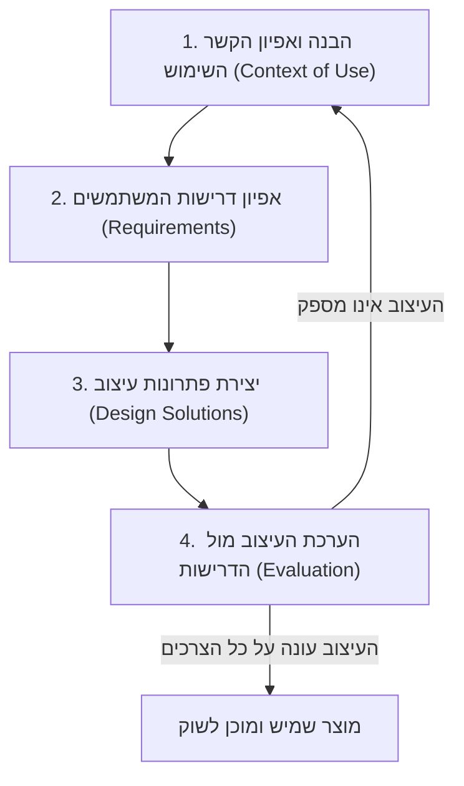

# עיצוב ממוקד אדם: תהליך העיצוב האיטרטיבי

## מדוע קשה כל כך לעצב מוצר מנצח בניסיון הראשון?

כאשר מהנדסים ומעצבים ניגשים לבנות מערכת תוכנה חדשה, הם מכינים רשימת דרישות ארוכה, כותבים קוד במשך חודשים, ובסופו של דבר משחררים את האפליקציה למשתמשים. במקרים רבים, ברגע שהמשתמשים פוגשים את המערכת בפעם הראשונה, מתגלה האמת המרה: הממשק מסורבל, המשתמשים לא מבינים מה לעשות, והמוצר נכשל. 

למה זה קורה? כי בעיצוב ממשקים, **כמעט אף פעם לא קולעים למטרה בניסיון הראשון**. המשתמשים הם אנשים אמיתיים עם דרכי חשיבה מגוונות, אילוצים פיזיים וקוגניטיביים, והקשר עבודה ייחודי.

כדי לפתור זאת, אנו מאמצים את גישת **עיצוב ממוקד אדם (Human-Centered Design - HCD)**. במקום לדרוש מהמשתמש להשתנות ולהתאים את עצמו למחשב, אנו מתאימים את המחשב והממשק אל המשתמש. השיעור היום יעסוק בעקרונות ה-HCD ובתקן הבינלאומי **ISO 9241-210** המגדיר את מחזור הפיתוח המחזורי (האיטרטיבי) המנחה את כל תהליך העבודה שלנו.

---

## מטרות השיעור

בסיום שיעור זה תוכלו:

- להגדיר מהי מתודולוגיית [[human-centered-design]] ומדוע היא מציבה את צרכי האדם במרכז.
- לפרט את ארבעת עקרונות ה-HCD לפי דון נורמן (Don Norman).
- לנתח את ארבע הפעילויות המרכזיות של מחזור העיצוב לפי תקן **ISO 9241-210**.
- להסביר את החשיבות של תהליך **איטרטיבי (Iterative)** בעיצוב ממשקים.
- להסביר מדוע הערכה (Evaluation) היא שלב קריטי המניע את הלמידה והתיקון של המוצר.

---

# ארבעת העקרונות של דון נורמן ל-HCD

בספרו ובמאמריו, דון נורמן מתווה ארבעה עקרונות יסוד שמנחים את תפיסת העיצוב ממוקד האדם:

1. **התמקדות באנשים (Focus on People):** אנו תמיד מתחילים בהבנת המשתמשים הממשיים – מי הם, מהן היכולות שלהם, ובאילו תנאים פיזיים ורגשיים הם יפעילו את המוצר.
2. **פתרון הבעיה השורשית (Solve the Root Problem):** כשלקוח מתלונן על קושי בממשק, קל למהר ולפתור את הסימפטום החיצוני (למשל, להזיז כפתור). מעצב HCD איכותי יחקור לעומק כדי להבין מהו שורש הבעיה האמיתי (למה המשתמש בכלל היה צריך את הכפתור הזה?).
3. **ראיית הכל כמערכת (Everything is a System):** חוויית המשתמש אינה מוגבלת למסך אחד או למכשיר יחיד. היא כוללת את כל מערכת נקודות המגע – רכישת המוצר, ההתקנה, השימוש, התמיכה הטכנית, והסביבה שבה המשתמש נמצא.
4. **התערבויות קטנות ואיטרציה (Small Interventions & Iterate):** לעולם אל תעצבו את המערכת השלמה במכה אחת. בצעו שינויים קטנים, בדקו אותם עם משתמשים, למדו מהתוצאות, ושפרו את העיצוב באופן מתמיד.

---

# תהליך העיצוב לפי תקן ISO 9241-210

תקן **ISO 9241-210** ממסד את גישת ה-HCD למסגרת עבודה מוגדרת המורכבת מארבע פעילויות ליבה מרכזיות המתבצעות בצורה מחזורית:

## 1. הבנה ואפיון הקשר השימוש (Context of Use)
בשלב הראשון אנו יוצאים לשטח כדי לאסוף נתונים על קהל היעד. אנו מנסים לענות על שאלות כמו:
- **מי המשתמשים?** (מיומנות טכנולוגית, גיל, מוגבלויות).
- **מה המשימות שלהם?** (מה הם מנסים להשיג באמצעות המערכת).
- **מה הסביבה שלהם?** (פיזית: רעש, תאורה; חברתית: עבודה בצוות; טכנולוגית: סוג מכשיר, אינטרנט איטי).

## 2. אפיון דרישות המשתמשים (User Requirements)
על בסיס הבנת הקשר השימוש, אנו מגדירים את הצרכים והאילוצים של המשתמשים. הדרישות אינן מנוסחות כקוד טכנולוגי (למשל: "המערכת תשתמש במסד נתונים SQL"), אלא כצרכי אנוש שימושיים (למשל: "המשתמש חייב להיות מסוגל להזין את הפרטים ביד אחת בלבד בזמן שהוא הולך במחסן").

## 3. יצירת פתרונות עיצוב (Design Solutions)
כאן מתחיל העיצוב בפועל. אנו מייצרים סקיצות, שרטוטים (Wireframes) ואבות-טיפוס (Prototypes) הממחישים את זרימת הממשק. העיצוב מתחיל מפשוט וזול (סקיצות נייר) ומתפתח בהדרגה לאבות-טיפוס דיגיטליים מורכבים.

## 4. הערכת העיצוב אל מול הדרישות (Evaluation)
זהו השלב החשוב ביותר. אנו מביאים משתמשים אמיתיים ומבקשים מהם לבצע משימות בעזרת אב-הטיפוס שעיצבנו (בדיקות שמישות). אנו בוחנים היכן הם מתבלבלים, אילו טעויות הם עושים, והאם הממשק באמת פותר את הבעיה שלהם.

---

# מנוע הלמידה: האיטרציה (Iteration)

מדוע התהליך מוצג כמעגל?
מכיוון ששלב ההערכה (4) כמעט תמיד חושף בעיות שמישות חדשות או צרכים שלא היינו מודעים אליהם. במצב כזה, התקן מנחה אותנו **לא להמשיך לפיתוח**, אלא לחזור אחורה:
- לחזור לשלב 1 (הבנת ההקשר) כדי להבין למה המשתמש פעל בצורה מפתיעה.
- לחזור לשלב 2 (הדרישות) כדי לעדכן או להוסיף דרישות שמישות חדשות.
- לחזור לשלב 3 (פתרונות העיצוב) כדי לתקן את הממשק וליצור אב-טיפוס משופר.

:::important
האיטרציה היא המפתח להצלחה. תיקון שגיאת עיצוב על גבי סקיצת נייר לוקח 2 דקות ולא עולה כמעט דבר. לעומת זאת, תיקון שגיאת עיצוב לאחר שהמערכת נכתבה בקוד, נבדקה והופצה – דורש עבודה של מתכנתים רבים, כתיבה מחדש של קוד, ועולה פי 100 יותר. מעצבי HCD שואפים להיכשל מוקדם (Fail early) ולתקן מהר ככל הניתן.
:::

---

## סיכום השיעור

:::summary
עיצוב ממוקד אדם (HCD) מציב את המשתמש וצרכיו במרכז תהליך הפיתוח. לפי דון נורמן, הגישה נשענת על התמקדות באנשים, פתרון הבעיה השורשית, ראיית המערכת בכללותה, וביצוע התערבויות קטנות ואיטרטיביות. תקן ISO 9241-210 ממסד זאת לתהליך איטרטיבי בעל ארבעה שלבים חוזרים: אפיון הקשר השימוש, הגדרת דרישות המשתמשים, יצירת פתרונות עיצוב והערכתם מול המשתמשים. מחזוריות זו מאפשרת לגלות ולתקן כשלי שמישות בשלבים מוקדמים וזולים, במקום לגלות אותם בשלב הפקה יקר ומאוחר.
:::

:::keypoints
- HCD הוא תהליך עיצוב ממוקד-משתמש המעוגן בתקן ISO 9241-210.
- 4 עקרונות HCD של נורמן: התמקדות באנשים, פתרון הבעיה השורשית, הכל כמערכת, והתערבות איטרטיבית.
- שלבי ה-ISO הם: הבנת ההקשר, הגדרת דרישות, פתרונות עיצוב והערכת הממשק.
- התהליך הוא איטרטיבי (מעגלי) ומתקן את עצמו ללא הרף על בסיס מבדקי שמישות.
- בדיקות שמישות בשלבים מוקדמים (באמצעות אבי טיפוס זולים) מונעות עלויות תיקון עצומות בשלבי פיתוח מאוחרים.
:::

:::references
- התקן הבינלאומי ISO 9241-210: Ergonomics of human-system interaction.
- הספר "The Design of Everyday Things" מאת דון נורמן (Don Norman).
- מאמרים של Nielsen Norman Group על בדיקות שמישות והערכה איטרטיבית.
:::

:::quiz{ref="human-centered-design-quiz"}
:::
