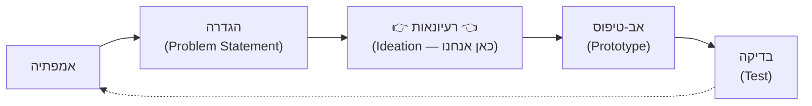
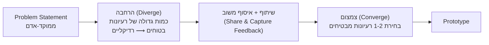

# רעיונאות (Ideation) — העלאת רעיונות ללא שיפוטיות

## הפיתוי לקפוץ לרעיון הראשון

בשלב הקודם ניסחתם [[problem-statement]] ממוקד-אדם — משפט אחד וחד שמגדיר בשביל מי אתם מעצבים ולמה זה חשוב לו. עכשיו קורה משהו טבעי מאוד: ברגע שיש לכם בעיה ברורה, המוח שלכם קופץ *מיד* לפתרון הראשון שעולה לו לראש. זה מרגיש יעיל — למה לבזבז זמן על עוד רעיונות אם כבר יש אחד טוב?

הבעיה היא שהרעיון הראשון כמעט אף פעם לא הטוב ביותר. הוא פשוט הראשון — הכי זמין, הכי מוכר, הכי דומה למה שכבר ראיתם בעבר. ברגע שאתם מתחילים לפתח אותו, אתם **מעוגנים** (anchored) עליו: כל האנרגיה שלכם הולכת לשכלל את הרעיון הזה, ואתם מפסיקים לחפש חלופות — גם אם קיימת בחוץ אפשרות טובה משמעותית יותר.

בדיוק בשביל זה קיים שלב הרעיונאות. [[design-thinking]] כופה עצירה מכוונת בין הגדרת הבעיה לבין בחירת הפתרון: קודם **מרחיבים** את מרחב האפשרויות ככל שניתן, ורק אחר כך **מצמצמים** אותו לפתרון אחד. זהו לא שלב "בזבוז זמן" — הוא הביטוח שלכם מפני התאהבות מוקדמת מדי ברעיון בינוני.

---

## מטרות השיעור

בסיום שיעור זה תוכלו:

- להגדיר מהו שלב הרעיונאות (Ideation) ולמקם אותו במחזור החשיבה העיצובית.
- להסביר מדוע יש לדחות שיפוט ביקורתי בזמן הרעיונאות, ומהי ההשלכה של הפרת העיקרון הזה.
- להבחין בין עקרון "כמות לפני איכות" (divergence) לבין הנטייה לבחור רעיון בודד מוקדם מדי (convergence מוקדם).
- ליישם את ארבעת כללי הרעיונאות (דחיית שיפוטיות, כמות, רעיונות רדיקליים, בנייה על רעיונות אחרים) על Problem Statement נתון.
- להדגים כיצד לשרטט שני פתרונות רדיקליים שונים לבעיה נתונה, בהשראת תרגיל הארנק.
- לנתח תרחיש של סיעור מוחות ולזהות היכן הופרו כללי הרעיונאות ומה ההשלכה על יצירתיות הקבוצה.

---

# מהי רעיונאות (Ideation) ומה מקומה בתהליך?

**רעיונאות** היא השלב ב[[design-thinking]] שבו הצוות הופך [[problem-statement]] יחיד לכמות גדולה של פתרונות אפשריים — לפני שמחליטים איזה מהם לפתח. זהו הגשר בין "הבנו את הבעיה" לבין "יש לנו משהו לבנות".

בשלב הקודם למדנו לנסח [[problem-statement]] ממוקד-אדם; שלב הרעיונאות הוא הרגע שבו אנו הופכים את אותו משפט למגוון רחב של פתרונות אפשריים. שימו לב לכיוון: אנחנו **לא** חוזרים לראיין את המשתמש ולא משנים את הבעיה עצמה — אנחנו לוקחים את המשפט המוגדר שכבר יש בידינו ומייצרים ממנו כמה שיותר תשובות אפשריות לשאלה "איך אפשר לענות על הצורך הזה?"

כאשר אתם מגיעים לשלב הזה, חשוב לזכור שהוא ממוקם **בין** ההגדרה לבין הבנייה, ולא נפרד מהן: כל רעיון שתפיקו כאן ייבחן בהמשך מול המשתמש עצמו, בשלבי ה[[prototype]] והבדיקה.

:::diagram
מיקום שלב הרעיונאות במחזור החשיבה העיצובית, עם הדגשה על השלב הנוכחי.

:::

:::selfcheck
question: צוות מדלג משלב האמפתיה ישר לשרטוט פתרונות, בלי לעצור ולנסח Problem Statement מוגדר. מה הסיכון בכך עבור שלב הרעיונאות שיבוא אחר כך?
answer: בלי Problem Statement ממוקד-אדם, לרעיונאות אין "מטרה" משותפת וברורה להתרחב סביבה — כל חבר צוות עשוי לדמיין צורך שונה של המשתמש, והרעיונות שיעלו לא יהיו ניתנים להשוואה או לסינון משותף בהמשך. ה-Problem Statement הוא מה שמאפשר לכל הרעיונות שנוצרים להיות תשובות אמיתיות לאותה שאלה.
:::

---

# עקרון ההרחבה לפני הצמצום — "כמות לפני איכות"

ההיגיון הפנימי של הרעיונאות מבוסס על עיקרון פשוט: **קודם מרחיבים (Diverge), ורק אחר כך מצמצמים (Converge)**. בשלב ההרחבה המטרה היא מספר הרעיונות, לא איכותם — ואת הסינון עושים רק אחרי שיש הרבה מה לסנן.

למה זה עובד? כי אי אפשר לדעת מראש אילו רעיונות טובים לפני שרואים אותם לצד רעיונות אחרים. רעיון שנראה בינוני לבד עשוי להתגלות כגאוני כשמשווים אותו לעשרה רעיונות אחרים, או כשמשלבים אותו עם רעיון שכן נשמע בהתחלה קיצוני מדי. ככל שמרחב הרעיונות רחב יותר, כך גדל הסיכוי שבתוכו מסתתר פתרון בלתי צפוי וטוב במיוחד — וגם אם לא, קל הרבה יותר לבחור את הטוב מבין עשרה מאשר "לקוות" שהרעיון היחיד שעלה לכם הוא הנכון.

:::example
**מדגימים על Problem Statement קונקרטי:**

> רון מאבד את מפתחות הבית שלו כמעט כל שבוע ומאחר להיכנס הביתה. **רון צריך דרך למצוא את מפתחות הבית שלו תוך פחות מ-10 שניות בזמן היציאה, באופן שיגרום לו להרגיש רגוע ולא ננעל בחוץ בטעות.**

אם רון היה עוצר על הרעיון הראשון שעולה לו לראש, כנראה שהיה בונה "ווים ליד הדלת" ומסתפק בזה. אבל שלב הרעיונאות דורש להמשיך הלאה, על ציר שנע מהבטוח אל הקיצוני:

- **בטוח:** קערת מפתחות קבועה ליד הדלת.
- **בטוח-בינוני:** תגית Bluetooth קטנה שמצפצפת כשסורקים אותה מהטלפון.
- **בינוני:** מחזיק מפתחות עם GPS מובנה שמראה על מפה איפה הוא.
- **קיצוני:** מנעול חכם שנפתח בטביעת אצבע או זיהוי פנים — בלי מפתח פיזי בכלל.
- **רדיקלי:** דלת שמזהה את בעל הבית לפי הטלפון בכיס (כמו Bluetooth proximity) ופשוט נפתחת לבדה, כך שהשאלה "איפה המפתח" כבר לא רלוונטית.

שימו לב שהרעיון האחרון בכלל לא "פותר" את בעיית המפתח — הוא מבטל אותה. זו בדיוק התועלת של להמשיך מעבר לרעיון הבטוח: לפעמים הפתרון הטוב ביותר לא נראה כמו שיפור של הרעיון הראשון, אלא כמו שאלה אחרת לגמרי.
:::

:::important
שימו לב: אף אחד מהרעיונות ברשימה למעלה לא "נפסל" בשלב הזה — כולם נרשמים. ההחלטה איזה מהם לקחת הלאה מגיעה **רק** בשלב סינון נפרד, אחרי שכל האפשרויות כבר על השולחן.
:::

:::selfcheck
question: צוות מייצר שלושה רעיונות בלבד, בוחר את הרעיון שנשמע הכי בטוח, ועובר ישר לבנות עליו אב-טיפוס. באילו מונחים מהשיעור הייתם מתארים את הטעות, ומה הסיכון שהיא יוצרת?
answer: הצוות דילג משלב ההרחבה (Diverge) ישר לצמצום (Converge) בלי לעבור דרך "כמות לפני איכות" — הוא נשאר מעוגן (anchored) על אחד מהרעיונות הראשונים שעלו, במקום להמשיך לאורך הציר מהבטוח אל הרדיקלי. הסיכון: ייתכן שקיים בחוץ פתרון טוב משמעותית יותר, אולי אפילו כזה שמבטל את הבעיה כליל (כמו הדלת שנפתחת לבד בדוגמת מפתחות הבית) — אבל מכיוון שמעולם לא נוצר, הוא לעולם לא ייבחר.
:::

---

# ארבעת כללי הרעיונאות

כדי שהרחבת מרחב הרעיונות באמת תעבוד — בייחוד בקבוצה — נדרשים כמה כללי משחק מוסכמים. ארבעת הכללים הבאים מקורם בשיטת הסיעור המוחות שפיתחה חברת העיצוב IDEO, וכל אחד מהם עונה על אופן ספציפי שבו רעיונאות נכשלת בפועל.

## כלל 1: דחיית שיפוטיות (Defer Judgment)

**מה זה אומר:** בזמן שמעלים רעיונות, אסור לבקר, לנתח או "לחסל" רעיון — גם אם הוא נשמע לא מציאותי.

**למה זה חשוב:** ביקורת מוקדמת מדי מפעילה אצל אנשים חשש חברתי מלהיראות מגוחכים. ברגע שמישהו אחד נשפט, כל שאר חברי הקבוצה לומדים — במודע או לא — שרעיונות "מסוכנים" עלולים להביך אותם, והם פשוט מפסיקים להעלות אותם. איכות הרעיונאות קורסת לא כי אין רעיונות טובים, אלא כי אנשים מפסיקים לשתף אותם.

**ההשלכה של הפרתו:** תרבות שבה כל רעיון עובר "וטו" מיידי מייצרת בסופו של דבר רק רעיונות בטוחים ושמרניים — בדיוק ההפך ממטרת השלב. בסשן הרעיונאות המפורסם של IDEO לעיצוב מחדש של עגלת קניות (שתועד בכתבת "Deep Dive" של ABC Nightline), אף רעיון לא נפסל בזמן אמת — כולל רעיונות שנשמעו הזויים לגמרי בתחילת הדרך — וזה בדיוק מה שאפשר לצוות להגיע לעשרות רעיונות תוך שעה בודדת.

## כלל 2: לחתור לכמות (Go for Quantity)

**מה זה אומר:** המטרה הכמותית של השלב היא **מספר** הרעיונות, לא איכותם הממוצעת.

**למה זה חשוב:** כמות גבוהה של רעיונות מגדילה את ההסתברות הסטטיסטית שבתוכם יימצא רעיון פורץ דרך, ומאפשרת שילובים בין רעיונות שלא היו קורים אם הייתם עוצרים אחרי שניים-שלושה. חברת IDEO עצמה ידועה בסשנים שבהם צוות מפיק עשרות עד מאות רעיונות על לוח אחד תוך שעה, בדיוק מתוך ההנחה שהאיכות "מסתננת" רק כשיש כמות.

**ההשלכה של הפרתו:** קבוצה שעוצרת אחרי 3-4 רעיונות בפועל בוחרת מתוך מדגם קטן מדי — וכמעט תמיד תבחר את הרעיון הכי מוכר, לא את הכי טוב.

## כלל 3: לעודד רעיונות רדיקליים (Encourage Wild Ideas)

**מה זה אומר:** יש לעודד באופן פעיל רעיונות שנשמעים קיצוניים, לא מעשיים או אפילו מגוחכים — ולא רק לסבול אותם.

**למה זה חשוב:** רעיון פרוע שנשמע בלתי אפשרי היום מכיל לעיתים קרובות גרעין שימושי שמתגלה רק כשמעדנים אותו. פתרונות "בטוחים מדי" נוטים לשכפל את הפתרון הקיים ולא לחדש דבר. מסך המגע הרב-נקודתי של האייפון הראשון, למשל, נשמע לרוב אנשי התעשייה ב-2007 כמו רעיון בלתי מציאותי לעומת מקלדת פיזית מוכרת — עד שהתברר שהוא בדיוק הכיוון הנכון.

**ההשלכה של הפרתו:** בלי רעיונות רדיקליים על השולחן, כל הרעיונות מתרכזים סביב אותו אזור "בטוח" של הפתרון הקיים — ומאבדים בדיוק את הפוטנציאל לחדשנות אמיתית.

## כלל 4: לבנות על רעיונות של אחרים (Build on the Ideas of Others)

**מה זה אומר:** במקום לענות לרעיון של מישהו אחר ב"כן, אבל..." (שמדגיש למה זה לא יעבוד), עונים ב"כן, וגם..." (שמוסיף לרעיון ומפתח אותו הלאה) — טכניקה שאולה ישירות מעולם האימפרוביזציה בתיאטרון.

**למה זה חשוב:** רעיון קבוצתי שמתפתח דרך כמה אנשים ברצף כמעט תמיד עשיר יותר מרעיון שנוצר על ידי אדם בודד — כי כל אחד מוסיף זווית שהאחרים לא ראו.

**ההשלכה של הפרתו:** "כן, אבל" עוצר את זרימת הרעיונות באמצע המשפט של מישהו אחר — התוצאה זהה להשלכה של הפרת כלל 1: הקבוצה נעשית זהירה יותר ומפסיקה להעלות רעיונות.

:::selfcheck
question: קבוצת עבודה מקיימת סיעור מוחות, ובאמצע ההצעה של אחד המשתתפים חבר צוות אחר קוטע ואומר "זה לא ריאלי, אין תקציב לזה". אילו שניים מארבעת כללי הרעיונאות הופרו כאן, ומה הנזק הצפוי להמשך הסשן?
answer: הופרו כלל 1 (דחיית שיפוטיות — הרעיון נשפט מיידית במקום להירשם) וכלל 4 (בנייה על רעיונות אחרים — התגובה הייתה "כן, אבל" ולא "כן, וגם"). הנזק: שאר חברי הקבוצה ילמדו שרעיונות "מסוכנים" עלולים להיפסל בפומבי, ויתחילו לצנזר את עצמם — כמות ואיכות הרעיונות בהמשך הסשן יירדו.
:::

---

# תרגיל הארנק: שני פתרונות רדיקליים כדוגמה מעשית

איך כל זה נראה בפועל? בתרגיל הארנק, אחרי שכל סטודנט ניסח Problem Statement עבור השותף שלו, ההנחיה בשלב הרעיונאות היא לא "שרטטו פתרון" אלא **לשרטט שני פתרונות רדיקליים שונים** — ואז לשתף את שניהם עם השותף ולאסוף ממנו משוב, עוד לפני שמחליטים מה לבנות הלאה.

שימו לב לשתי בחירות מכוונות בהנחיה הזאת, ושתיהן נובעות ישירות מהעקרונות שלמדנו:

1. **"שניים" ולא "אחד":** הכפייה לשרטט שני רעיונות מונעת מהסטודנט לעצור על הפתרון הראשון שעלה לו. אי אפשר "לקפוץ לרעיון האחד" כשמחויבים משמעית להביא שני כיוונים שונים.
2. **"רדיקליים" ולא "בטוחים":** ההנחיה דוחפת במפורש מעבר לאזור הנוח, ומיישמת את כלל "עידוד רעיונות פרועים" בפעולה.

:::example
סטודנטית אחת עשויה לשרטט ארנק שנפתח רק בסריקת טביעת אצבע של השותף שלה — פתרון רדיקלי אחד שעונה על צורך בביטחון ובמניעת גניבה. סטודנט אחר עשוי לשרטט "כרטיס דיגיטלי יחיד" שמחליף לגמרי את כל הכרטיסים הפיזיים בארנק — פתרון רדיקלי שונה לחלוטין, שעונה על אותו Problem Statement אבל מכיוון אחר לגמרי (ביטול הצורך בארנק פיזי, לא שיפורו).

שני הרעיונות מוצגים בפני השותף **יחד**, לפני שמחליטים על מה לעבוד — כי המשוב המוקדם הזה הוא בדיוק מה שיגיד לצוות אילו כיוונים באמת מדברים אל הצורך של המשתמש, לפני שמשקיעים זמן בבניית אב-טיפוס.
:::

:::warning
זהו בדיוק הרגע שבו "שיפוטיות מוקדמת מדי" הורגת רעיונאות בשקט. אם חבר צוות אומר "זה לא יעבוד" בזמן ששני הרעיונות עדיין נרשמים על הנייר — לפני ששיתפו אותם עם השותף ולפני שקיבלו עליהם משוב אמיתי — שאר הקבוצה תפסיק להעלות רעיונות מסוכנים או יצירתיים, בדיוק אלה שיש להם הכי הרבה פוטנציאל. ההערכה של רעיון שייכת לשלב הסינון שאחרי הרעיונאות, ולא לתוכה.
:::

:::diagram
תרשים משפך: הרחבה (Diverge) ואז צמצום (Converge), מ-Problem Statement ועד לבחירת רעיון להמשך.

:::

:::selfcheck
question: מדוע ההנחיה בתרגיל הארנק היא לשרטט "שני פתרונות רדיקליים" ולא רעיון אחד — גם אם לסטודנט כבר יש רעיון שנשמע לו טוב?
answer: כי רעיון בודד, גם אם הוא נשמע טוב, מייצג עיגון (anchoring) על האפשרות הראשונה שעלתה לראש — בלי לבדוק אם קיימת חלופה טובה יותר. הדרישה לשני כיוונים רדיקליים שונים כופה הרחבה בפועל של מרחב הפתרונות (ולא רק בהצהרה), ומאפשרת לקבל משוב על שני כיוונים לפני שמתחייבים לפתח רק אחד מהם.
:::

---

## סיכום השיעור

:::summary
שלב הרעיונאות הוא הגשר המכוון בין Problem Statement יחיד לבין מגוון רחב של פתרונות אפשריים. העיקרון המרכזי הוא הרחבה לפני צמצום — "כמות לפני איכות" — כי אי אפשר לדעת מראש אילו רעיונות טובים לפני שמייצרים הרבה ומשווים ביניהם. ארבעת כללי הרעיונאות (דחיית שיפוטיות, כמות, עידוד רעיונות רדיקליים, בנייה על רעיונות אחרים) קיימים כדי להגן על ההרחבה הזו מפני האויב הגדול ביותר שלה: שיפוט מוקדם מדי. תרגיל הארנק ממחיש את זה בפועל — שני פתרונות רדיקליים, לא אחד בטוח — ורק אחרי ששיתפו את שניהם עם המשתמש וקיבלו משוב, עוברים לשלב הצמצום ובניית האב-טיפוס.
:::

:::keypoints
- Ideation הוא שלב ה[[design-thinking]] שבו מייצרים כמות גדולה של פתרונות אפשריים ל[[problem-statement]] שהוגדר, תוך דחיית שיפוטיות עד שלב מאוחר יותר.
- העיקרון המרכזי: "כמות לפני איכות" — קודם מרחיבים (Diverge), ורק אחר כך מצמצמים (Converge).
- ארבעת כללי הרעיונאות: דחיית שיפוטיות, חתירה לכמות, עידוד רעיונות רדיקליים, ובנייה על רעיונות אחרים ("כן, וגם" ולא "כן, אבל").
- שיפוטיות מוקדמת ("זה לא יעבוד") היא ההרג השקט של רעיונאות קבוצתית — היא מדכאת השתתפות עתידית של כל הקבוצה, לא רק את הרעיון שנשפט.
- בתרגיל הארנק ההנחיה היא לשרטט שני פתרונות רדיקליים שונים ולחלוק אותם עם המשתמש לקבלת משוב — לפני שבוחרים איזה מהם לפתח.
- הסינון והבחירה של הרעיון הטוב ביותר שייכים לשלב נפרד, שמגיע רק אחרי שהרעיונאות הפתוחה הסתיימה.
:::

:::references
- מצגת הקורס "חשיבה עיצובית" — ד"ר משה לייבה (The Wallet Challange.pptx).
- IDEO — Method Cards & Brainstorming Rules ("Defer Judgment", "Go for Quantity", "Encourage Wild Ideas", "Build on the Ideas of Others").
- Stanford d.school — Wallet Project / Design Thinking Bootcamp Bootleg.
:::

:::quiz{ref="ideation-phase-quiz"}
:::
