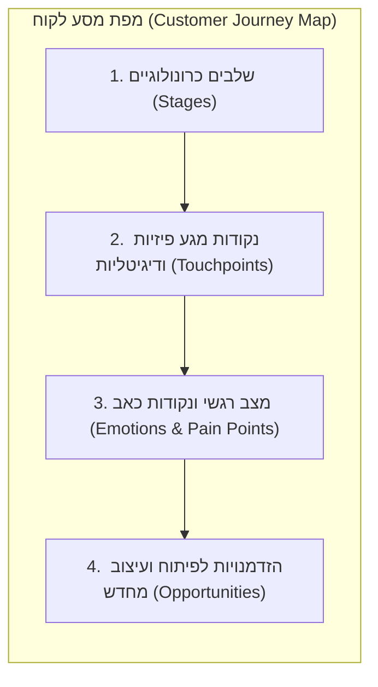

# מיפוי מסע לקוח: החוויה מקצה לקצה

## למה אנחנו צריכים להסתכל על החוויה המלאה?

כפי שלמדנו במבוא ל-HCI, חוויית משתמש (UX) אינה מסתכמת במסך הבודד שהמשתמש רואה באפליקציה. החוויה מתחילה ברגע שבו המשתמש מגלה את המוצר, ממשיכה ברכישה, בהתקנה, בשימוש הראשוני, ומגיעה עד לשירות הלקוחות ולתמיכה הטכנית לאורך חודשים או שנים.

אם נתמקד רק בעיצוב ממשק האפליקציה (UI), אנו עלולים ליצור אפליקציה מרהיבה – אך כזו שכושלת לחלוטין במתן ערך כולל למשתמש (לדוגמה, אם המוצר אינו מגיע בזמן, או אם אין מענה לתקלות). כדי לראות את התמונה המלאה, לזהות היכן המשתמש חווה תסכול רגשי רב, ולגלות הזדמנויות לשיפור השירות, אנו משתמשים בכלי חזותי אסטרטגי: **מפת מסע לקוח (Customer Journey Map)**.

---

## מטרות השיעור

בסיום שיעור זה תוכלו:

- להגדיר מהי [[journey-map]] ומדוע היא מיוצגת ככלי חזותי כרונולוגי של חוויות המשתמש.
- לפרט ולהסביר את ארבעת המרכיבים המרכזיים של מפת מסע לקוח: שלבים (Stages), נקודות מגע (Touchpoints), רגשות (Emotions) והזדמנויות (Opportunities).
- להבחין בצורה ברורה בין פרסונה, תרחיש משתמש ומפת מסע לקוח, ולהסביר את הקשר ביניהם.
- לנתח כיצד מפת מסע לקוח מסייעת באיתור נקודות תורפה (Pain points) ושיפור שמישות המערכת.
- להסביר מדוע מפת מסע לקוח חייבת להתבסס על מחקר משתמשים אמפירי בשטח.

---

# מהי מפת מסע לקוח (Journey Map)?

[[journey-map]] היא תיאור חזותי כרונולוגי של הדרך שעובר משתמש (המיוצג על ידי פרסונה ספציפית) מול המוצר, השירות או הארגון לאורך זמן. המפה מתעדת את כל שלבי העבודה ומאפשרת לראות את החוויה במבט מקיף, במקום להתמקד באינטראקציה דיגיטלית בודדת.

המפה עוזרת לצוותי פיתוח ועיצוב לגשר על הפער שבין "איך שהארגון חושב שהשירות שלו עובד" לבין "מה שהמשתמש מרגיש וחווה בפועל במציאות".

## ארבעת המרכיבים של מפת מסע לקוח

מפת מסע לקוח מורכבת מארבע שכבות מידע מרכזיות:

1. **שלבים (Stages):** שלבי האינטראקציה העיקריים של המשתמש לאורך ציר הזמן. לרוב, השלבים מתארים מחזור חיים שלם של מוצר, כגון: 
   - **חשיפה ומודעות** (כיצד המשתמש מגלה את המוצר).
   - **מחקר והשוואה** (כיצד הוא מקבל החלטת רכישה).
   - **רכישה והתקנה** (השימוש הראשוני וההתקנה).
   - **שימוש שוטף** (אינטראקציה יום-יומית).
   - **תמיכה וסיום שימוש** (פנייה לעזרה או עזיבה).
2. **נקודות מגע (Touchpoints):** כל נקודת מפגש ואינטראקציה (פיזית או דיגיטלית) של המשתמש עם השירות או הארגון. נקודות מגע אלו עשויות לכלול חיפוש בגוגל, אפליקציה לנייד, מייל אישור עסקה, שיחה עם שירות לקוחות, או הגעה פיזית לחנות.
3. **רגשות ותחושות (Emotions):** מצבו הרגשי של המשתמש בכל שלב במסע (כגון: שמחה, ביטחון, בלבול, תסכול עמוק). רגשות אלו מיוצגים לרוב באמצעות קו גרפי עולה ויורד לאורך שלבי המסע, המלווה באייקונים של סמיילים וציטוטים רגשיים מהשטח.
4. **הזדמנויות לשיפור (Opportunities):** תובנות ורעיונות מעשיים לפיתוח או עיצוב מחדש, הנגזרים מתוך נקודות הכאב והתסכול שזוהו אצל המשתמש בשלבים השונים של המסע.

---

# ההבדל בין פרסונה, תרחיש ומפת מסע

כדי למנוע בלבול במבחן, חשוב להבין את ההבדלים המהותיים בין שלושת הכלים המרכזיים של אפיון המשתמשים:

| כלי האפיון | הגדרה | השאלה שעליה הוא עונה | טווח הכיסוי (Scope) |
| :--- | :--- | :--- | :--- |
| **פרסונה ([[persona]])** | דמות בדיונית המייצגת קבוצת משתמשים. | **מי המשתמש?** (מהם מאפייניו, מטרותיו וחששותיו). | סטטי / נקודתי. מתמקד במאפייני האדם. |
| **תרחיש משתמש ([[user-scenario]])** | סיפור ליניארי ממוקד משימה. | **כיצד המשתמש מבצע משימה ספציפית בממשק?** | ליניארי / ממוקד משימה בודדת. |
| **מפת מסע לקוח ([[journey-map]])** | ייצוג חזותי מלא לאורך זמן. | **מה המשתמש חווה לכל אורך מחזור החיים של השירות?** | רחב / מקיף את כל מחזור החיים של המוצר או השירות. |

---

# איך מפת מסע משפרת את חוויית המשתמש?

* **איתור נקודות כאב (Pain points):** מפת המסע מציגה בצורה חזותית ברורה היכן בדיוק המשתמש "נופל" ומסמנת את הנקודה הקריטית ביותר לטיפול. למשל, אם הממשק של האפליקציה מעולה אך המשתמש מרגיש כעס רב בשלב ההמתנה לשליח – הבעיה אינה ב-UI של האפליקציה אלא בלוגיסטיקה, ומפת המסע תציף זאת מיד.
* **התאמת המודל המנטלי:** היא מציגה פערים בין הציפיות של המשתמש לבין המציאות, ומאפשרת למעצבים לגשר על פערים אלו.
* **יצירת מיקוד עסקי:** המפה מסייעת לחברה לתעדף פיתוח של מאפיינים חדשים על בסיס השלבים שבהם חוויית הלקוח היא הגרועה ביותר, ובכך למקסם את החזר ההשקעה (ROI).

:::important
כמו פרסונות ותרחישים, מפת מסע לקוח **אינה** מסמך שנוצר לפי ניחושים או דמיון של מעצב בתוך משרד סגור. היא חייבת להתבסס על מחקר משתמשים בשטח. מיפוי מסע שאינו מבוסס על נתוני אמת ייצור מפת מסע מומצאת שלא מייצגת את בעיות השמישות האמיתיות של המשתמשים.
:::

:::diagram
תרשים המציג את 4 מרכיבי מפת מסע הלקוח לאורך זמן:

:::

---

## סיכום השיעור

:::summary
מפת מסע לקוח ([[journey-map]]) היא ייצוג חזותי של החוויה המלאה שעובר המשתמש מול מוצר או שירות לאורך זמן. היא מורכבת מארבעה רכיבים: שלבים כרונולוגיים, נקודות מגע (Touchpoints), קו רגשות ותסכולים, והזדמנויות לשיפור. בניגוד לפרסונה המגדירה "מי המשתמש" ותרחיש המתאר "כיצד מתבצעת משימה ספציפית", מפת המסע מעניקה תמונה רחבה מקצה לקצה. כדי להבטיח את יעילותה, המפה חייבת להישען על נתוני מחקר שטח אמפיריים ולא על השערות מומצאות.
:::

:::keypoints
- מפת מסע לקוח עוקבת אחר חוויית המשתמש לאורך כל מחזור החיים של המוצר או השירות.
- ארבעת המרכיבים של מפת מסע הם: שלבים, נקודות מגע, רגשות, והזדמנויות לשיפור.
- פרסונה עונה על "מי המשתמש"; תרחיש עונה על "איך מבוצעת משימה אחת"; מפת מסע עונה על "מה המשתמש חווה לאורך זמן".
- מפת המסע מאפשרת לזהות תסכולים מחוץ לממשק הדיגיטלי (למשל, שירות לקוחות או משלוחים) וליצור תובנות מעשיות (Opportunities).
- מפת מסע לקוח חייבת להתבסס על נתוני שטח אמיתיים כדי למנוע ייצוג שגוי ומטעה של חוויות המשתמשים.
:::

:::references
- מצגת הקורס בנושא פרסונות ותרחישים (Personas and Scenarios.pptx).
- הספר "Mapping Experiences" מאת ג'יימס קאלבך (James Kalbach).
- הנחיות וכלים למיפוי מסע לקוח (Nielsen Norman Group, Customer Journey Mapping).
:::

:::quiz{ref="journey-maps-quiz"}
:::
