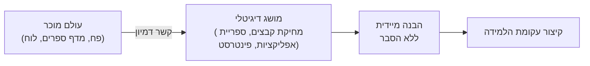

# מטאפורות ואנלוגיות — גשר בין העולם הפיזי לממשק הדיגיטלי

## המוח אנושי מחפש את המוכר

בני אדם מרגישים אי-נוח כאשר הם נתקלים בדברים שאינם מכירים. הטכנולוגיה הדיגיטלית, ביסודה, היא זרה ולא אינטואיטיבית — צ'יפ סיליקון, בתים וביטים, כתובות IP. אך מה שהפך את מחשב ה-Macintosh של אפל ב-1984 למהפכה לא היה כוח העיבוד שלו, אלא ה-GUI — ממשק הגרפי — שתרגם את כל הטכנולוגיה הזרה הזאת למטאפורת **שולחן העבודה** (Desktop).

פתאום, הנחיית קבצים בתיקיות, שליחתם ל"פח" כשרוצים למחוק — הכל נגזר ממושגים שכולנו מכירים מחיי היומיום. **זו כוח המטאפורה בעיצוב**.

---

## מטרות השיעור

בסיום שיעור זה תוכלו:

- להגדיר מהי מטאפורה בהקשר עיצוב ממשקים ולהסביר מדוע היא כלי כה חזק.
- להבדיל בין מטאפורה לאנלוגיה ולהסביר מתי מתאים להשתמש בכל אחת.
- לנתח דוגמאות מוצלחות ונכשלות של מטאפורות בעיצוב (Apple, Pinterest, Microsoft Clippy).
- לפרט את שלושת יתרונות המטאפורה ואת חסרונותיה.

---

# מטאפורה (Metaphor) בעיצוב

**מטאפורה** היא אמצעי לשוני וויזואלי שנעשה בו שימוש על מנת להאיר מושג אחד בתכונותיו של מושג אחר. כל מטאפורה מבוססת על **אנלוגיה** — קשר של דמיון — בין שדה סמנטי אחד לאחר.

אנו מרגישים לא בנוח כאשר אנחנו נתקלים בדברים שלא מכירים. לכן, בעיצוב ממשקים, אנו שואפים **לעגן מידע דיגיטלי לא מוכר במושגים מוכרים מהעולם הפיזי**.

:::example
**הדוגמה הקלאסית — אייקון פח האשפה:**
כאשר עוצבו שולחנות העבודה הממוחשבים הראשונים, נבחר אייקון של פח אשפה לייצג את מקום שבו "זורקים" קבצים שאין בהם צורך. לא נדרש הסבר — ניסיון החיים של המשתמש כבר מלמד אותו שזורקים דברים שלא רוצים לפח.
:::

## כיצד מטאפורה פועלת בממשק?

ממשק שדומה לאובייקט פיזי, אך בעל תכונות נוספות, נקרא **ממשק מבוסס מטאפורה**. הוא יכול להיות מבוסס על:
- **פעילות**: מטאפורת "ממסרט" (Shopping Cart) לרכישה מקוונת.
- **אובייקט**: שולחן עבודה, תיקייה, אינבוקס.
- **שילוב שניהם**: לוח מודעות דיגיטלי (Pinterest).

:::diagram
מבנה פעולת המטאפורה

:::

---

## מטאפורות מוצלחות

### Apple iMac — עיצוב שמעורר רגשות חיוביים

אפל עיצבה את ה-iMac G3 המקורי (1998) בצבעים עזים ועם גוף שקוף. המטאפורה הייתה לא ויזואלית-מילולית אלא **רגשית** — מחשב שנראה שמח, ידידותי ומזמין. הצבעים הבהירים הפריכו את התפיסה שמחשבים הם מכשירים מפחידים ומורכבים.

> **עיקרון**: מטאפורות טובות מעוררות אסוציאציות חיוביות ורגשות המעודדים שימוש.

### Pinterest — לוח פקקים דיגיטלי

הפלטפורמה Pinterest בנויה כולה סביב מטאפורת **לוח הפקקים** (Pin Board). משתמשים "נועצים" (Pins) תמונות שמצאו ברשת ומארגנים אותן לאוספים לפי נושאים — בדיוק כפי שעושים בעולם הפיזי עם לוח פקקים וצילומים. המטאפורה **מטפחת חשיבה יצירתית** ומפחיתה את הצורך ללמוד את האפליקציה — כי אנחנו כבר יודעים איך "להשתמש בלוח פקקים".

---

## מטאפורות כושלות

### Microsoft Clippy — מטאפורה שנלקחה רחוק מדי

Clippy (1997) היה עוזר משרדי אנימטיבי ב-Microsoft Office בצורת אטב ניירות. הבעיה: **המטאפורה הייתה פשטנית מדי** — אטב ניירות אינו קשור לעזרה, הוא לא מעורר אסוציאציה של "יועץ מומחה", והאנימציות השובבות של Clippy שיבשו את העבודה במקום לסייע לה.

:::warning
אם לוקחים מטאפורה רחוק מדי ומתייחסים אליה באופן פשטני מדי, היא הופכת למטרד. Clippy נחשב לאחד ממשקי המשתמש הגרועים ביותר שנפרסו לציבור הרחב.
:::

### Apple iBooks — חיקוי עולם פיזי ללא ערך מוסף

אפל עיצבה את ה-iBooks Bookshelf עם מדפים מעץ ומרקמים של עץ אמיתי. אסתטיקה פיזית (skeuomorphism) — המדפים ומרקמי העץ — הייתה **לא רלוונטית לפונקציונליות האפליקציה** ולא הוסיפה שום ערך. אפל בסופו של דבר הסירה את העיצוב הזה ועברה לסגנון שטוח יותר.

:::important
**כלל הזהב**: מטאפורה צריכה להנחות את ההבנה — לא לחקות את העולם הפיזי לשמה. חיקוי לא פונקציונלי (Skeuomorphism קיצוני) הוא בזבוז ויזואלי שמבלבל משתמשים.
:::

---

## יתרונות וחסרונות המטאפורה

### יתרונות

1. **קיצור ופישוט עקומת הלמידה**: המשתמש לא לומד מחדש — הוא מיישם ידע שכבר קיים אצלו מהעולם הפיזי.
2. **סיוע בהבנת המודל הקונספטואלי**: המטאפורה עוזרת לבנות מפה מנטלית של איך המערכת עובדת.
3. **הגדלת קהל המשתמשים**: ממשק אינטואיטיבי מרחיב את בסיס המשתמשים ומאפשר לאנשים עם פחות ניסיון טכנולוגי להשתמש במערכת.

### חסרונות

1. **הגבלת יצירתיות המעצב**: הצמדות נוקשה לאנלוגיה פיזית עלולה להגביל אפשרויות עיצוב חדשניות.
2. **העתקת אלמנטים גרועים מהמקור**: אם האנלוגיה הפיזית לוקה בחסר, הממשק עלול לרשת את הבעיות שלה.
3. **פגיעה ביעילות**: מטאפורה אשר לא מתאימה לאופן הפעולה הדיגיטלי עלולה להאט את המשתמש.
4. **הבנה מוגבלת**: משתמשים שאינם מכירים את הדבר הפיזי עליו מבוססת המטאפורה לא יבינו את הממשק.

:::selfcheck
question: מדוע ה-Trash Can (פח אשפה) הוא מטאפורה מוצלחת, בעוד ש-Clippy של Microsoft כשלה?
answer: פח האשפה מבוסס על מושג פשוט ואוניברסלי שכולם מכירים — זורקים לפח מה שלא צריך. Clippy לעומת זאת הייתה מטאפורה לא מתאימה (אטב ניירות לא מסמל עזרה), הייתה פשטנית מדי ומאניפולטיבית, ושיבשה את זרימת העבודה. מטאפורה טובה חייבת להיות רלוונטית, מינימלית ומועילה.
:::

---

# אנלוגיה (Analogy) — גרסה מדויקת יותר

**אנלוגיה** היא יחס של דמיון, השוואה בין שני דברים ויותר. אנו משתמשים באנלוגיות בחלקים נרחבים מחיינו — הן כלי חשיבה והבנה בסיסי. כל יצירת מושג חדש (קטגוריזציה) פירושה מתיחת קשר אנלוגי בין דברים שונים.

## אנלוגיה מול מטאפורה

| היבט | מטאפורה | אנלוגיה |
|------|---------|---------|
| אופי הקשר | לשוני-ויזואלי, עקיף יותר | ישיר, "אחד-לאחד" |
| מטרה | להאיר מושג בתכונות אחר | להסביר חדש דרך הידוע |
| דוגמה | "שולחן עבודה" דיגיטלי | Nest Thermostat כנגד טרמוסטט Honeywell |

## מקרה בוחן: Nest Thermostat

Google Nest פיתחה מכשיר שליטה בטמפרטורת הבית המחובר ל-Wi-Fi — אפשר היה לעשות זאת באפליקציה בלבד. אך Nest בחרה לפתח **מכשיר פיזי עגול** שמצייר אנלוגיה ישירה לטרמוסטט המעגלי המקורי של Honeywell.

:::example
**מדוע זה עבד?**
- בני אדם רוצים **לגעת** בדברים פיזית.
- המכשיר הפיזי מוכר — כבר ידוע שמסובבים סקאלה גדולה לשינוי טמפרטורה.
- האנלוגיה מקצרת את עקומת הלמידה: "אני כבר יודע איך לעבוד עם זה."
:::

**מסקנה מרכזית**: אנלוגיות מקצרות את עקומת הלמידה על ידי הצגת מערכת מורכבת ומודרנית בפורמט שכבר נוח ומוכר למשתמש.

---

## מקרה בוחן: Facebook לעומת MySpace

MySpace (רשת חברתית קודמת לפייסבוק) איפשרה למשתמשים להתאים לחלוטין את פרופיל האישי שלהם — כל עיצוב, כל צבע, כל פונט. התוצאה: כאוס ויזואלי, עמודי פרופיל לא קריאים ואי-עקביות בין פרופיל לפרופיל.

Facebook בחרה אנלוגיה שונה: **דף פרופיל פיזי** — כמו כרטיס ביקור דיגיטלי עם מבנה קבוע ואחיד. אנלוגיה זו יצרה סדר, קריאוּת ועקביות, וסייעה לפייסבוק לצבור מאות מיליוני משתמשים.

---

## סיכום השיעור

:::summary
מטאפורות ואנלוגיות הן כלים עוצמתיים שמגשרים בין הלא-מוכר של הטכנולוגיה לבין הידע הקיים אצל המשתמש. מטאפורה טובה — כמו פח האשפה של Mac, לוח הפקקים של Pinterest, או הטרמוסטט העגול של Nest — קוצרת את עקומת הלמידה, מבהירה את המודל הקונספטואלי ומרחיבה את קהל המשתמשים. מטאפורה גרועה — כמו Clippy — גורמת לתסכול ולנטישה. המפתח: המטאפורה חייבת להיות רלוונטית, מינימלית ומועילה — לא סתם חיקוי הדיגיטל של העולם הפיזי.
:::

:::keypoints
- מטאפורה: עיגון מושג דיגיטלי ביכולות של מושג מהעולם הפיזי המוכר.
- שלושת יתרונות המטאפורה: קיצור למידה, הבהרת מודל קונספטואלי, הגדלת קהל משתמשים.
- חסרונות: הגבלת יצירתיות, העתקת כשלים מהמקור, פגיעה ביעילות, הבנה מוגבלת לקהל שאינו מכיר.
- אנלוגיה היא קשר דמיון ישיר "אחד-לאחד" (כמו Nest Thermostat).
- Clippy — דוגמה לכישלון מטאפורי: פשוט מדי, לא רלוונטי, מפריע לזרימת עבודה.
- iBooks Bookshelf — Skeuomorphism קיצוני ללא ערך פונקציונלי שאפל הסירה.
:::

:::references
- מצגת "כללי עיצוב" — ד"ר משה לייבה (Design roles.pptx), שקופיות 7–21.
- סיכום הקורס "מנשק אדם-מחשב" (Copy of HCI.pdf), פרק Design Rules — Metaphor ו-Analogy, עמ' 32–33.
- The original 1984 Mac OS desktop and the Trash Can metaphor.
:::

:::quiz{ref="metaphors-and-analogies-quiz"}
:::
