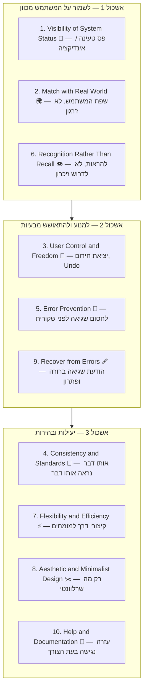

# 10 ההיוריסטיקות של נילסן להערכת שמישות

## רשימת הבדיקה של המומחה

בשיעור הקודם ראינו שיש שתי דרכים לגלות בעיות שמישות: [[empirical-vs-analytical|לצפות במשתמשים אמיתיים (אמפירי), או להיעזר בשיפוט מומחה (אנליטי)]]. אבל מה בדיוק בודק המומחה כשהוא יושב מול מסך בלי אף משתמש בסביבה? הוא לא סתם "מסתכל ומרגיש" — הוא עובר על **רשימת בדיקה מוגדרת**.

ב-1994 יעקב נילסן (Jakob Nielsen), אחד מאבות תחום ה-Usability, ניסח את [[nielsens-heuristics|10 ההיוריסטיקות]] — עקרונות אצבע רחבים שנגזרו מניתוח מאות בעיות שמישות אמיתיות. כל עוד מומחה מכיר את עשרת העקרונות האלה, הוא יכול לשבת מול כמעט כל ממשק — אתר, אפליקציה, מכונת קפה עם מסך מגע — ולאתר תוך דקות בעיות שיפריעו למשתמשים אמיתיים, בלי לגייס אף אחד. זו בדיוק השיטה שנקראת **הערכה היוריסטית (Heuristic Evaluation)**, והיא הכלי המרכזי של ההערכה האנליטית.

חשוב להבין כבר עכשיו: אלה **לא** חוקים נוקשים שאפשר לצטט מילה במילה ולסמן וי/איקס. אלה עקרונות מנחים שדורשים שיפוט — ניפגש עם הרעיון הזה שוב בהמשך השיעור.

---

## מטרות השיעור

בסיום שיעור זה תוכלו:

- **לפרט (Remember)** את שמות עשר ההיוריסטיקות של נילסן ולשייך כל אחת לקבוצה שהיא שייכת אליה.
- **להסביר (Understand)** במילים שלכם מה כל היוריסטיקה דורשת מהממשק, ומה קורה כשמפרים אותה.
- **לזהות (Apply)** איזו היוריסטיקה מופרת מתוך תיאור של תרחיש ממשק קונקרטי.
- **ליישם (Apply)** את מסגרת עשר ההיוריסטיקות כדי לבצע הערכה היוריסטית קצרה על מסך נתון.
- **לנתח (Analyze)** מקרה שבו שתי היוריסטיקות נמצאות במתח זו עם זו, ולהסביר איך מעצב מאזן ביניהן.

---

# הקבוצות של עשר ההיוריסטיקות

עשר עקרונות בבת אחת זה יותר מדי לזכור כרשימה שטוחה — לכן נחלק אותן לשלושה אשכולות לפי התפקיד שהן ממלאות עבור המשתמש. בכל אשכול נעבור על כל היוריסטיקה לפי אותו מבנה קבוע: **הגדרה במשפט אחד → דוגמה ממוצר אמיתי → איך נראית הפרה שלה.**

:::diagram
רשימת בדיקה (checklist) של עשר ההיוריסטיקות של נילסן, מחולקת לשלושה אשכולות עם תווית קצרה וסמל טקסטואלי ליד כל שורה:

:::

---

## אשכול 1 — לשמור על המשתמש מכוון (Orientation)

שלוש ההיוריסטיקות הבאות עונות על שאלה אחת בסיסית שכל משתמש שואל בלי מודעות: "איפה אני, ומה קורה כאן עכשיו?" ממשק שלא עונה על השאלה הזאת גורם לתחושת אובדן ובלבול, גם אם כל שאר הפונקציונליות תקינה.

### 1. Visibility of System Status — חשיפת מצב המערכת

**הגדרה:** המערכת חייבת ליידע את המשתמש כל הזמן, תוך זמן סביר, מה קורה כרגע.

**דוגמה:** באפליקציית **Gmail**, כשאתם שולחים מייל, מופיעה הודעת "מייל נשלח" קטנה בתחתית המסך. זהו אישור מיידי שהפעולה הצליחה — בלי זה, משתמשים היו לוחצים שוב ושוב על "שלח", חוששים שהמייל לא יצא.

**מה קורה כשמפרים:** משתמש שלוחץ על כפתור ולא רואה שום תגובה — לא ספינר, לא שינוי צבע, שום דבר — ילחץ שוב, וזה עלול לגרום לפעולה כפולה (למשל תשלום כפול).

### 2. Match Between System and the Real World — התאמה לעולם האמיתי

**הגדרה:** המערכת מדברת בשפה, במושגים ובסדר הלוגי שהמשתמש מכיר מהחיים, ולא בז'רגון פנימי של המפתחים.

**דוגמה:** **Amazon** משתמשת במושג "עגלת קניות" (Shopping Cart) ולא ב"מאגר SKUs נבחרים". כל מי שקנה פעם בסופר מבין מיד את הרעיון בלי הסבר.

**מה קורה כשמפרים:** אתר בנקאות שמציג הודעת שגיאה כמו "Error 4092: NULL_REF_EXCEPTION" במקום "לא ניתן להשלים את ההעברה — נסו שוב" — המשתמש לא מבין מה קרה ולא יודע מה לעשות הלאה.

### 6. Recognition Rather Than Recall — זיהוי במקום היזכרות

**הגדרה:** להראות למשתמש את האפשרויות הזמינות במקום לדרוש ממנו לזכור אותן מהזיכרון.

**דוגמה:** באפליקציית **Instagram**, כשאתם רוצים לתייג חבר בתמונה, מוצגת רשימת שמות מתוך אנשי הקשר שלכם ברגע שמתחילים להקליד — אתם לא צריכים לזכור את שם המשתמש המדויק.

**מה קורה כשמפרים:** ממשק שורת פקודה (Command Line) שדורש מהמשתמש לזכור פקודות בעל פה, בלי תפריט או רמז — נטל זיכרון גבוה שמתאים רק למומחים.

:::selfcheck
question: אפליקציית הזמנת מוניות מציגה למשתמש, אחרי שהוא לוחץ "הזמן נסיעה", מסך ריק לגמרי במשך 8 שניות בלי שום אינדיקציה — לא ספינר, לא טקסט. רק אז מופיע מסך אישור. איזו היוריסטיקה מופרת כאן?
answer: Visibility of System Status (חשיפת מצב המערכת). המשתמש לא מקבל שום משוב על כך שהמערכת מעבדת את הבקשה שלו, ולכן הוא לא יודע אם ללחוץ שוב, לחכות, או שהאפליקציה קרסה. חוסר אינדיקציה ויזואלית על תהליך שרץ ברקע הוא ההפרה הקלאסית ביותר של עיקרון זה.
:::

---

## אשכול 2 — למנוע ולהתאושש מבעיות (Prevention & Recovery)

טעויות הן חלק בלתי נמנע מאינטראקציה אנושית עם מחשב. שלוש ההיוריסטיקות הבאות עוסקות במחזור החיים המלא של טעות: איך למנוע אותה מלכתחילה, ואם היא כבר קרתה — איך לתת למשתמש דרך לחזור אחורה ולהבין מה השתבש.

### 3. User Control and Freedom — שליטה וחופש פעולה למשתמש

**הגדרה:** משתמשים לוחצים לפעמים בטעות על הפעולה הלא נכונה, ולכן זקוקים ל"יציאת חירום" ברורה — Undo, Cancel, "חזרה" — בלי לעבור תהליך ארוך.

**דוגמה:** ב-**WhatsApp**, ניתן "למחוק הודעה אצל כולם" תוך חלון זמן קצר אחרי השליחה. זו רשת ביטחון שמאפשרת לתקן טעות רגע לפני שהיא הופכת בלתי הפיכה.

**מה קורה כשמפרים:** אפליקציית עריכת תמונות בלי כפתור Undo — כל טעות בעריכה מחייבת להתחיל את כל התהליך מחדש, מה שגורם לתסכול ולנטישה.

### 5. Error Prevention — מניעת שגיאות

**הגדרה:** עיצוב טוב מונע מהמשתמש לטעות מלכתחילה, במקום רק להציג הודעת שגיאה טובה אחרי מעשה.

**דוגמה:** באפליקציות **בנקאות** רבות, לפני העברה כספית גדולה מופיע חלון אישור נוסף ("האם אתם בטוחים שברצונכם להעביר 10,000 ₪ ל-X?") — צעד שמונע העברות בטעות.

**מה קורה כשמפרים:** כפתור "מחק חשבון לצמיתות" שממוקם ממש ליד כפתור "שמור שינויים" הרגיל, באותו עיצוב וגודל — לחיצה אחת לא זהירה, ואין דרך חזרה.

### 9. Help Users Recognize, Diagnose, and Recover from Errors — סיוע בזיהוי, אבחון והתאוששות משגיאות

**הגדרה:** כשכבר קרתה שגיאה, הודעת השגיאה צריכה להיות בשפה פשוטה, לתאר בדיוק מה השתבש, ולהציע פתרון בונה.

**דוגמה:** **Slack** מציג הודעה כמו "לא הצלחנו לשלוח את ההודעה — בדקו את החיבור לאינטרנט ונסו שוב", עם כפתור "נסה שוב" ממש לצידה. ברור מה קרה, וברור מה לעשות.

**מה קורה כשמפרים:** אתר שמציג רק "משהו השתבש" בלי שום פירוט והצעת פעולה — המשתמש נתקע בלי לדעת אם לרענן, לחכות, או לפנות לתמיכה.

:::example
**תרגול הערכה היוריסטית: מסך תשלום במשלוח מזון**

בואו נדגים איך הערכה היוריסטית באמת נראית בפועל, על מסך תשלום מדומה של אפליקציית משלוח מזון:

המסך מציג סל קניות עם שלוש מנות, ומתחתיו כפתור ירוק גדול "שלם עכשיו" — ללא שדה לבחירת שיטת תשלום גלוי (המערכת פשוט תחייב את כרטיס האשראי האחרון ששימש), וללא הודעת סיכום לפני החיוב. אחרי לחיצה על הכפתור, המסך קופא לרגע ואז קופץ ישר למסך "ההזמנה שלך בדרך!" — בלי הודעת ביניים כלשהי.

הערכה היוריסטית של המסך הזה תעלה:

1. **הפרת Error Prevention (5):** אין שום שלב אישור לפני החיוב בפועל — משתמש שלוחץ בטעות פעמיים על "שלם עכשיו" עלול להיות מחויב פעמיים, ואין רגע עצירה שבו הוא רואה ומאשר את הסכום הסופי.
2. **הפרת Visibility of System Status (1):** בזמן שהמסך "קופא", אין ספינר או הודעת "מעבד תשלום..." — המשתמש לא יודע אם הלחיצה שלו בכלל נקלטה.
3. **הפרת User Control and Freedom (3):** ברגע שהמסך עבר ל"ההזמנה שלך בדרך!" אין שום אפשרות ביטול — גם אם המשתמש הבין מיד שטעה בכתובת המשלוח.
4. **הפרת Match with Real World (2):** החיוב האוטומטי מכרטיס "האחרון ששימש" בלי להציג זאת בפירוש סותר את הציפייה הטבעית של משתמש לראות ולבחור באיזה אמצעי תשלום הוא משלם, כמו שהוא רגיל בקופה פיזית.

שימו לב איך ארבע ההיוריסטיקות מצטרפות יחד לתמונה אחת: מסך שממהר את המשתמש קדימה בלי משוב, בלי אישור ובלי דרך חזרה — מתכון בטוח לתשלומים כפולים ולתלונות שירות לקוחות.
:::

:::selfcheck
question: אפליקציית תרשומת פיננסית מציגה כפתור "מחק את כל ההיסטוריה" באותו גודל וצבע כמו כפתור "ייצוא לקובץ Excel", זה לצד זה, ולחיצה עליו מוחקת מיידית בלי שום שאלת אישור. איזו היוריסטיקה מופרת בעיקר, ומדוע היא לא Recovery from Errors?
answer: זו בעיקר הפרה של Error Prevention (מניעת שגיאות) — אין שום מחסום (כמו חלון אישור) שמונע מהמשתמש ללחוץ בטעות על פעולה הרסנית שקרובה פיזית לפעולה שגרתית. זה לא Recover from Errors, כי אותה היוריסטיקה עוסקת במה שקורה אחרי שהשגיאה כבר בוצעה (הודעה ברורה ופתרון) — כאן הבעיה היא שהמערכת בכלל לא ניסתה למנוע את הטעות מראש.
:::

---

## אשכול 3 — יעילות ובהירות (Efficiency & Clarity)

ארבע ההיוריסטיקות האחרונות לא עוסקות בהישרדות מול טעות אלא באיכות החוויה השוטפת: האם הממשק עקבי, האם הוא לא מעמיס על המשתמש מידע מיותר, והאם הוא משרת גם מתחילים וגם מומחים בו-זמנית.

### 4. Consistency and Standards — עקביות ותקנים

**הגדרה:** אותה מילה, אייקון או פעולה צריכים להיראות ולהתנהג אותו דבר בכל רחבי המערכת — ואין לסטות מהתקנים המקובלים בפלטפורמה.

**דוגמה:** ב-**iOS**, מחוות ה"החלקה חזרה" (Swipe back) לניווט אחורה עובדת באופן זהה כמעט בכל אפליקציה במערכת — המשתמש לומד אותה פעם אחת ומשתמש בה בכל מקום.

**מה קורה כשמפרים:** אתר שבו כפתור "שמור" בצבע כחול במסך אחד ואדום במסך אחר, כשבשניהם הוא מבצע את אותה פעולה — משתמשים מפתחים חוסר אמון בממשק כי הם לא יכולים לחזות מה יקרה.

### 7. Flexibility and Efficiency of Use — גמישות ויעילות שימוש

**הגדרה:** קיצורי דרך שלא בהכרח נראים לעין למשתמשים מתחילים יכולים להאיץ מאוד את העבודה עבור משתמשים מנוסים, בלי לפגוע בנוחות המתחילים.

**דוגמה:** ב-**Photoshop**, אפשר לבחור בכל כלי עריכה דרך לחיצה בסרגל הכלים הגרפי, אבל משתמשים מנוסים משתמשים בקיצורי מקלדת (כמו `B` למברשת) שחוסכים להם שניות רבות בכל פעולה.

**מה קורה כשמפרים:** תוכנה שמכריחה כל פעולה — גם החוזרת ביותר — לעבור דרך אשף (Wizard) רב-שלבי, גם משתמש שביצע את הפעולה מאות פעמים לא יכול לזרז אותה.

### 8. Aesthetic and Minimalist Design — עיצוב אסתטי ומינימליסטי

**הגדרה:** מסכים לא צריכים להכיל מידע לא רלוונטי או נדיר לשימוש — כל פריט מידע נוסף מתחרה על תשומת הלב עם מה שבאמת חשוב.

**דוגמה:** מנוע החיפוש של **Google** מציג שדה חיפוש יחיד וריק כמעט לגמרי — בלי פרסומות, בלי תפריטים מיותרים — כך שהמשתמש מתמקד מיד במשימה היחידה: לחפש.

**מה קורה כשמפרים:** דשבורד ניהולי עמוס בעשרות גרפים, כפתורים והתראות בו-זמנית, כשרק שניים מהם רלוונטיים למשימה היומיומית של רוב המשתמשים — עומס ויזואלי שמקשה למצוא את מה שבאמת חשוב.

### 10. Help and Documentation — עזרה ותיעוד

**הגדרה:** גם אם עדיף שהמערכת תהיה שמישה בלי צורך בתיעוד כלל, לפעמים יש צורך לספק עזרה — והיא צריכה להיות קלה לחיפוש, ממוקדת במשימה הספציפית, ולא ארוכה מדי.

**דוגמה:** תוכנות כמו **Microsoft Excel** מציעות עזרה מוקשרת-הקשר (contextual help) — לחיצה על סימן שאלה ליד פונקציה מציגה הסבר ודוגמה בדיוק לאותה פונקציה, ולא מפנה לספר עזרה כללי בן מאות עמודים.

**מה קורה כשמפרים:** מסמך עזרה יחיד וארוך של 200 עמודים ללא חיפוש וללא קישור ישיר מתוך הממשק — משתמש שנתקל בבעיה ספציפית לא ימצא לעולם את התשובה שלו בזמן סביר.

:::selfcheck
question: משתמש ותיק במערכת CRM מתלונן שכל פעולה חוזרת — כמו "שכפל ליד קיים" — מחייבת אותו לעבור דרך אותו תהליך בן חמישה שלבים שמיועד למשתמשים חדשים, בלי שום קיצור דרך גם אחרי שנת ותק. איזו היוריסטיקה מופרת?
answer: Flexibility and Efficiency of Use (גמישות ויעילות שימוש). הבעיה אינה שהתהליך המלא קיים — הוא נחוץ למשתמשים חדשים — אלא שאין שום מסלול מקוצר (קיצור מקלדת, פעולה מהירה, "עשה שוב") למשתמשים מנוסים שכבר יודעים בדיוק מה הם רוצים לעשות.
:::

---

:::warning
**טעות נפוצה בבחינה:** לחשוב שעשר ההיוריסטיקות הן "חוקים" נוקשים שאפשר לבדוק וי/איקס בלי שיקול דעת. בפועל, נילסן עצמו הגדיר אותן כ**עקרונות מנחים רחבים**, ולעיתים שתי היוריסטיקות אפילו מתנגשות זו בזו ומחייבות את המעצב לבחור איזון. הדוגמה הקלאסית: **Error Prevention** לעיתים דורש להוסיף עוד שלב אישור ("בטוחים שאתם רוצים למחוק?") — אבל שלב אישור נוסף פוגע ב-**Flexibility and Efficiency of Use** של המשתמש המנוסה שמבצע את הפעולה הזאת מאות פעמים ביום. אין תשובה "נכונה" אוניברסלית — יש החלטת עיצוב מושכלת שתלויה בהקשר (כמה הרסנית הפעולה? כמה בקיא הקהל?).
:::

---

## סיכום השיעור

:::summary
עשר ההיוריסטיקות של נילסן (1994) הן רשימת הבדיקה המרכזית של [[empirical-vs-analytical|ההערכה האנליטית]] — כלי שמאפשר למומחה לאתר בעיות שמישות במהירות, בלי משתמשים אמיתיים. חילקנו אותן לשלושה אשכולות: **אשכול 1** שומר על המשתמש מכוון (Visibility of System Status, Match with Real World, Recognition Rather Than Recall). **אשכול 2** מונע ומטפל בטעויות (User Control and Freedom, Error Prevention, Help Users Recover from Errors). **אשכול 3** דואג ליעילות ולבהירות (Consistency and Standards, Flexibility and Efficiency, Aesthetic and Minimalist Design, Help and Documentation). חשוב לזכור: אלה עקרונות מנחים, לא חוקים נוקשים — לעיתים הם מתנגשים זה בזה ודורשים שיקול דעת מקצועי.
:::

:::keypoints
- **Visibility of System Status** — לעדכן את המשתמש כל הזמן מה קורה.
- **Match with Real World** — לדבר בשפת המשתמש, לא בז'רגון.
- **User Control and Freedom** — לאפשר Undo ו"יציאת חירום".
- **Consistency and Standards** — אותו דבר תמיד נראה ומתנהג אותו דבר.
- **Error Prevention** — לחסום שגיאה לפני שהיא קורית.
- **Recognition Rather Than Recall** — להראות אפשרויות, לא לדרוש זיכרון.
- **Flexibility and Efficiency of Use** — קיצורי דרך למשתמשים מנוסים.
- **Aesthetic and Minimalist Design** — רק מידע רלוונטי על המסך.
- **Help Users Recover from Errors** — הודעת שגיאה ברורה עם פתרון.
- **Help and Documentation** — עזרה נגישה, ממוקדת ולא ארוכה מדי.
:::

:::references
- Nielsen, J. (1994). *10 Usability Heuristics for User Interface Design.* Nielsen Norman Group.
- Nielsen Norman Group — התיעוד הציבורי הרשמי והמעודכן של עשר ההיוריסטיקות (nngroup.com).
:::

:::quiz{ref="nielsens-10-heuristics-quiz"}
:::
