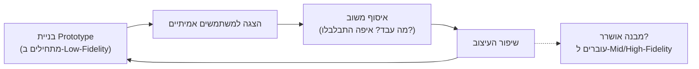

# יצירת אב-טיפוס אינטראקטיבי — מ-Paper Prototype ועד Mid-Fidelity

## למה בודקים רעיון לפני שכותבים שורת קוד אחת?

בשיעור הקודם למדתם לבנות [[wireframe]] — שרטוט שלדי שמראה מה יש במסך בודד. אבל שרטוט של מסך בודד לא עונה על שאלה קריטית: **מה קורה כשהמשתמש בפועל מנווט בין המסכים?** האם הוא מוצא את הכפתור שהוא מחפש? האם הוא מתבלבל בשלב מסוים בתהליך? שאלות כאלה אי אפשר לענות עליהן מתוך שרטוט סטטי — צריך משהו שאפשר "להפעיל".

כאן נכנס לתמונה **אב-טיפוס (Prototype)**. העיקרון המנחה הוא **"Fail Fast, Fail Cheap"** — ככל שתגלו בעיה בשלב מוקדם וזול יותר בתהליך, כך יעלה פחות לתקן אותה. גילוי שמשתמשים לא מבינים איך לחזור למסך הקודם — כשזה קורה תוך כדי בדיקת דפי נייר — עולה כמה דקות של שרטוט מחדש. אותו גילוי, אחרי שהצוות כבר כתב שבועות של קוד, עולה זמן פיתוח יקר, תסכול צוות, ולעיתים שינוי ארכיטקטורה שלם. לכן, לפני שמשקיעים בבניית המוצר עצמו, בונים גרסה זולה שמדמה את החוויה — ובודקים אותה על משתמשים אמיתיים.

---

## מטרות השיעור

בסיום שיעור זה תוכלו:

- להגדיר מהו [[prototype]] (אב-טיפוס) ולהסביר מדוע הוא נבנה לפני פיתוח המוצר עצמו.
- להסביר את טכניקת ה-**Paper Prototype** ולתאר כיצד מדמים אינטראקציה בין מסכים באמצעות נייר בלבד.
- להבחין באופן חד בין [[wireframe]] הסטטי לבין [[prototype]] האינטראקטיבי, ולזהות איזו שאלה עונה כל אחד מהם.
- ליישם את טכניקת ה-Paper Prototype בעבודה בזוגות על פיצ'ר שכבר נחקר בכלים קודמים (מחקר אתנוגרפי ופרסונות).
- לסווג אב-טיפוס נתון על ציר ה[[fidelity]] (Low-Fidelity לעומת Mid/High-Fidelity) ולהסביר את הפשרה (Trade-off) שביניהם.
- לנתח מתי מתאים לעבוד ב-Low-Fidelity ומתי כדאי לעבור ל-Mid/High-Fidelity, בהתאם לשלב בתהליך העיצוב.

---

# מהו אב-טיפוס (Prototype)?

[[prototype]] הוא גרסה מוקדמת וניתנת-לחוויה של מוצר או פיצ'ר, שמדמה כיצד המשתמש ינווט ויתקשר עם המערכת — לצורך קבלת משוב לפני השקעה בפיתוח מלא. בניגוד ל-Wireframe שמראה **מבנה** של מסך אחד, אב-טיפוס מדמה **זרימה**: מה קורה כשהמשתמש לוחץ, עובר בין מסכים, ומנסה להשלים משימה שלמה.

אב-טיפוס לא צריך "לעבוד" באמת ברמת הקוד. הוא רק צריך ליצור עבור הבודק חוויה **מספיק אמינה** כדי שיוכל להגיב אליה, לטעות בה, ולומר "פה התבלבלתי" או "לא הבנתי לאן ללחוץ כדי להמשיך".

## הטכניקה הבסיסית: Paper Prototype

הצורה הזולה, המהירה והנפוצה ביותר ליצירת אב-טיפוס היא **Paper Prototype**:

1. כל מסך במוצר משורטט על **דף נייר נפרד** — בדיוק כמו Wireframe בודד.
2. אדם אחד בצוות משחק את תפקיד **"המחשב"**: הוא מחזיק את כל דפי המסכים, ולא מדבר עם הבודק במהלך המבחן.
3. הבודק (המשתמש שנבדק) מקבל משימה ("מצא את המסעדה ובצע הזמנה"), ו**"לוחץ"** באצבע על אזורים בדף העליון — בדיוק כפי שהיה לוחץ על מסך אמיתי.
4. בכל פעם שהבודק "לוחץ" על אזור שמוביל למסך אחר, "המחשב" **מחליף את הדף** לדף המתאים למסך הבא — ומדמה כך מעבר בין מסכים, בלי קוד אחד.

כך, בעשרות דקות של עבודה עם עפרון ונייר, מקבלים סימולציה מלאה של זרימת ניווט — ובודקים אותה על משתמש אמיתי לפני שנכתבה שורת קוד אחת.

:::example
**תרגיל בזוגות: מעקב אחרי הזמנה באפליקציית משלוחי אוכל**

שני סטודנטים מקבלים משימה לבנות Paper Prototype לפיצ'ר "מעקב אחרי ההזמנה שלי", שכבר נחקר בתרגיל קודם באמצעות מחקר אתנוגרפי ופרסונות. הם משרטטים שלושה דפים נפרדים:

- **דף 1:** מסך הבית עם רשימת ההזמנות הפעילות שלי.
- **דף 2:** מסך פרטי ההזמנה, עם כפתור "עקוב אחרי השליח".
- **דף 3:** מסך מפה עם מיקום השליח בזמן אמת ושעת הגעה משוערת.

סטודנט א' משחק את "המחשב" ומניח את דף 1 מול סטודנט ב', שמגלם משתמש-בודק. כשסטודנט ב' לוחץ באצבעו על שורת ההזמנה בדף 1, סטודנט א' מחליף מיד לדף 2. כשסטודנט ב' לוחץ על "עקוב אחרי השליח", סטודנט א' מחליף לדף 3. באמצע התרגיל מתגלה שסטודנט ב' מנסה ללחוץ על שם המסעדה בטעות כדי לחזור אחורה — תובנה שלא הייתה מתגלה מעולם משרטוט סטטי בודד, ושתשפיע ישירות על מיקום כפתור "חזרה" בגרסה הבאה.
:::

---

## Wireframe מול Prototype — לא לבלבל בין השניים

זו אחת ההבחנות הנבחנות ביותר ביחידה הזו, ולכן חשוב לחדד אותה:

| היבט | [[wireframe]] | [[prototype]] |
| :--- | :--- | :--- |
| מהות | ייצוג **סטטי** של מסך בודד | סימולציה **אינטראקטיבית** של זרימה בין מסכים |
| השאלה שעליה עונה | "מה יש במסך הזה, ואיפה?" | "מה קורה כשהמשתמש לוחץ כאן?" |
| מה בודקים | מבנה, פריסה, היררכיה של תוכן | ניווט, זרימת משימה, קלות שימוש |
| דוגמה טיפוסית | שרטוט יד של מסך תפריט אחד | דפי נייר שמוחלפים ידנית בין מסכים, או קליק בכלי דיגיטלי |

:::important
**כלל הזהב**: Wireframe בודק **מבנה של מסך בודד**; Prototype בודק **זרימה בין כמה מסכים**. אם שמעתם מישהו אומר "בניתי Wireframe, ואפשר כבר ללחוץ עליו ולעבור בין מסכים" — הוא בעצם תיאר Prototype, לא Wireframe. ברגע שיש אינטראקציה וניווט, יצאתם מתחום ה-Wireframe.
:::

:::selfcheck
question: חברת צוות אומרת: "שרטטתי Wireframe של האפליקציה, ועכשיו אפשר כבר ללחוץ על כפתור ההתחברות ולראות איך עוברים למסך הבית." מה לא מדויק במשפט הזה, ואיך הייתם מתקנים אותו?
answer: מה שהיא בעצם בנתה הוא Prototype ולא Wireframe. Wireframe הוא ייצוג סטטי של מסך בודד ואי אפשר "ללחוץ" בו ולעבור למסך אחר — ברגע שיש מעבר בין מסכים בתגובה ללחיצה, מדובר בסימולציה של זרימה, שזו בדיוק ההגדרה של Prototype. התיקון: "שרטטתי Prototype (למשל Paper Prototype) של האפליקציה, ועכשיו אפשר לדמות מעבר בין מסך ההתחברות למסך הבית."
:::

---

# רמת הדיוק (Fidelity) של אב-טיפוס

לא כל אב-טיפוס נראה אותו דבר. אב-טיפוס יכול לנוע על ציר ה[[fidelity]] (רמת הדיוק) — מכמה "גס" ולא-מוגמר הוא, ועד כמה הוא קרוב למוצר הסופי:

### Low-Fidelity Prototype

זהו בדיוק ה-Paper Prototype שתיארנו למעלה: דפי נייר, שרטוטים גסים, ללא צבע, שמופעלים ידנית על ידי חבר צוות. היתרון המרכזי הוא **מחיר**: זול, מהיר להכנה (דקות, לא ימים), וקל **לזרוק ולהתחיל מחדש** אם מתגלה שהמבנה הבסיסי שגוי. בדיוק בגלל שההשקעה קטנה, אף אחד בצוות לא "מתאהב" בפרטים ומתקשה לוותר עליהם.

### Mid/High-Fidelity Prototype

כאשר המבנה הבסיסי כבר אושרר בעזרת Low-Fidelity, עוברים לבנייה בכלי דיגיטלי כמו Axure — עם מסכים מפורטים וקישורים לחיצים בין מסכים, שמדמים ניווט הרבה יותר קרוב למוצר האמיתי. אב-טיפוס כזה נותן משוב עדין ומדויק יותר (למשל, על ניסוח כפתור ספציפי או על מיקום פיקסלים), אבל בנייתו יקרה ואיטית יותר — ולכן שינוי כיוון מהותי בשלב הזה עולה הרבה יותר.

:::example
**שתי גישות, שתי תוצאות**

**צוות א'** בודק תחילה זרימת הזמנה חדשה באמצעות Paper Prototype. תוך רבע שעה מתגלה שמשתמשים לא מבינים איפה נמצא כפתור "אישור תשלום" — הצוות משרטט מחדש את סדר המסכים באותו יום, בעלות של כמה דפי נייר.

**צוות ב'**, שבוחר לדלג ישר ל-Mid/High-Fidelity Prototype בכלי כמו Axure כדי "לחסוך זמן", משקיע שבוע שלם בבניית מסכים מפורטים וקישורים חיצים. רק אז מתברר, באותה בדיקת משתמשים, שאותה בעיית ניווט קיימת גם אצלו — אבל עכשיו תיקון המבנה מחייב לפרק ולבנות מחדש שבוע של עבודה מפורטת.

שני הצוותים גילו את אותה הבעיה — אך המחיר של הגילוי היה שונה לחלוטין, בגלל רמת הדיוק שבה בחרו לבדוק את הרעיון.
:::

:::important
**הפשרה (Trade-off) של Fidelity**: ככל שרמת הדיוק עולה, המשוב שמתקבל מדויק יותר וריאליסטי יותר — אבל גם עולה בזמן ובמשאבים לשנות. לכן הכלל הוא: **תתחילו זול ומהיר (Low-Fidelity) כדי לבדוק מבנה וזרימה בסיסיים, ורק אחרי שאלה אושררו — תעברו ל-Mid/High-Fidelity** לבדיקת פרטים עדינים יותר.
:::

:::diagram
תרשים לולאת המשוב של עבודה עם אב-טיפוס — מהבנייה ועד לשיפור חוזר:

:::

:::selfcheck
question: מדוע צוות מוצר עשוי לבחור **לזרוק** Paper Prototype שעבד עליו טוב, במקום פשוט להמשיך ולהוסיף לו צבע וטיפוגרפיה בהדרגה עד שיהפוך למוצר הסופי?
answer: מפני שהעיקרון המנחה הוא Fail Fast, Fail Cheap: ההשקעה ב-Low-Fidelity הייתה קטנה בכוונה, כדי שקל יהיה לזרוק אותו ולנסות מבנה שונה לגמרי אם מתגלה שהראשון לא עובד עבור המשתמשים. אם הצוות "יתפתח" בהדרגה מתוך אותם דפי נייר, הוא מסתכן ב"התאהבות" בפתרון המקורי ובקושי לוותר עליו גם כשמחקר משתמשים מראה שהמבנה הבסיסי שגוי — בדיוק המלכודת שרמת דיוק גבוהה מוקדם מדי יוצרת.
:::

---

## מהתאוריה לתרגול: התרגיל בזוגות

התרגול המרכזי של השיעור הזה הוא יישום ישיר של הטכניקה: **בזוגות בלבד**, אתם בונים אב-טיפוס ברמת Low-Fidelity לאותו פיצ'ר עליו כבר ביצעתם מחקר אתנוגרפי ובניתם פרסונות בתרגיל מוקדם יותר בקורס. זה לא תרגיל טכני-גרפי — המטרה היא לגלות, על ידי הפעלת דפי הנייר על משתמש-בודק אמיתי (או חבר קבוצה אחר), היכן זרימת הניווט שתכננתם עובדת והיכן היא מבלבלת — **לפני** שתשקיעו שעה אחת בקוד.

---

## סיכום השיעור

:::summary
אב-טיפוס ([[prototype]]) הוא גרסה מוקדמת, ניתנת-לחוויה, שמדמה כיצד משתמש ינווט במוצר — בניגוד ל[[wireframe]] הסטטי, שמראה מבנה של מסך בודד בלבד. הטכניקה הבסיסית והזולה ביותר היא Paper Prototype: מסכים משורטטים על דפי נייר נפרדים, וחבר צוות "משחק את המחשב" ומחליף דפים בתגובה ל"לחיצות" הבודק, ומדמה כך מעבר בין מסכים. אב-טיפוס נע על ציר ה[[fidelity]]: Low-Fidelity (נייר, זול, קל לזרוק) מתאים לבדיקת מבנה וזרימה בסיסיים בתחילת התהליך; Mid/High-Fidelity (כלי דיגיטלי כמו Axure, קליקבילי) מתאים לבדיקת פרטים עדינים יותר, אחרי שהמבנה הבסיסי כבר אושרר. העיקרון המנחה לאורך כל התהליך הוא Fail Fast, Fail Cheap: ככל שמגלים בעיה מוקדם וזול יותר, כך עולה פחות לתקן אותה.
:::

:::keypoints
- Prototype מדמה **זרימה ואינטראקציה** בין מסכים; Wireframe מתאר **מבנה של מסך בודד** בלבד.
- Paper Prototype: כל מסך על דף נפרד; חבר צוות "משחק את המחשב" ומחליף דפים לפי "לחיצות" הבודק.
- העיקרון המנחה: Fail Fast, Fail Cheap — ככל שמגלים בעיה מוקדם יותר בתהליך, כך עולה פחות לתקן אותה.
- Low-Fidelity Prototype: זול, מהיר, קל לזרוק — מתאים לבדיקת מבנה וזרימה בסיסיים.
- Mid/High-Fidelity Prototype: נבנה בכלי דיגיטלי (כגון Axure), קליקבילי וקרוב יותר למוצר האמיתי — אך יקר יותר לשנות.
- הכלל: מתחילים תמיד ב-Low-Fidelity, ועוברים ל-Mid/High-Fidelity רק אחרי שהמבנה הבסיסי אושרר.
:::

:::references
- מצגת הקורס "בחינת הקונספט" — ד"ר משה לייבה (Examine the Concept.pptx).
- Nielsen Norman Group — Paper Prototyping: Getting User Data Before You Code.
- Rapid Prototyping methodology in user-centered design — iterative build-test-refine cycles.
:::

:::quiz{ref="prototyping-quiz"}
:::
