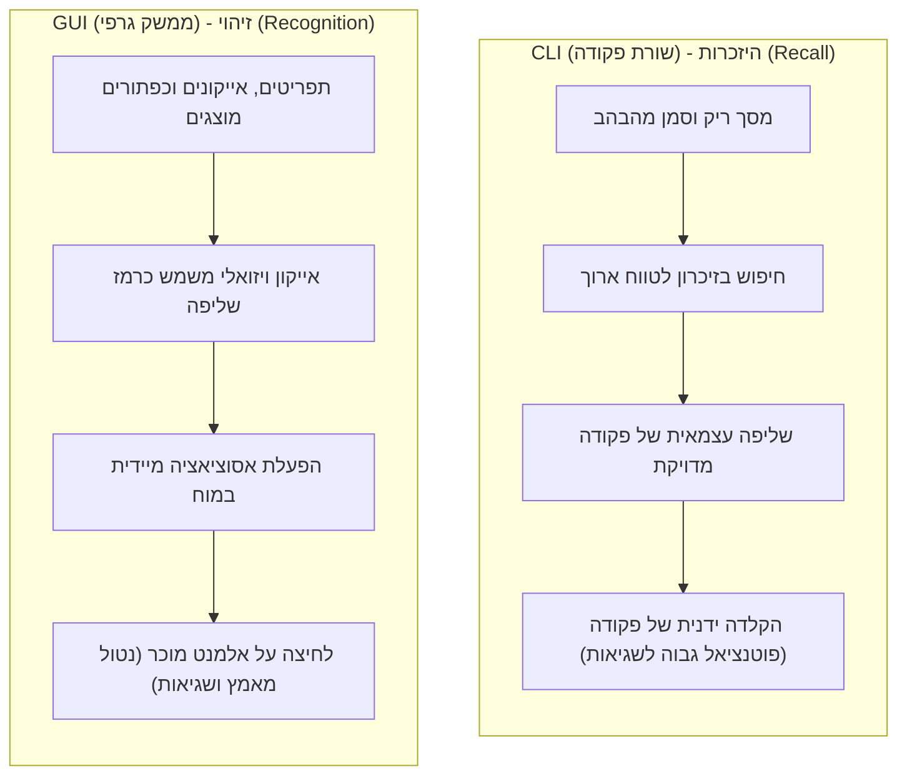

# זיהוי מול היזכרות (Recognition vs. Recall)

## מדוע עדיף להציע תפריט מאשר שדה הקלדה ריק?

אחד החוקים הבסיסיים והחזקים ביותר בעיצוב ממשקי משתמש (UX) הוא: **העדף תמיד זיהוי על פני היזכרות (Recognition over Recall)**. 

כדי להבין מדוע עיקרון זה כה קריטי, עלינו להבין כיצד הזיכרון האנושי מארגן ומאחזר מידע. המוח שלנו אינו כונן קשיח השולף קבצים לפי כתובת מדויקת; הוא עובד באמצעות רשתות של אסוציאציות. שליפת מידע מהזיכרון ללא כל עזרה חיצונית היא משימה קשה ומעייפת קוגניטיבית, בעוד שזיהוי של מידע קיים היא משימה קלה וכמעט נטולת מאמץ.

בשיעור זה נבין את ההבדל הקוגניטיבי בין שתי פעולות הזיכרון הללו, נלמד כיצד המוח משתמש ב**צ'אנקים (Chunks)**, ונראה כיצד ממשקים מודרניים מיישמים את עקרון הזיהוי כדי להקל על המשתמש.

---

## מהו ההבדל בין זיהוי להיזכרות?

כדי להבחין בין השניים, נביט בהגדרות הקוגניטיביות שלהם:

:::definition
**זיהוי (Recognition)** הוא היכולת לזהות גירוי מוכר כאשר הוא מוצג בפנינו מתוך רשימת אפשרויות (למשל: "האם השם הזה מוכר לי?"). זיהוי נחשב למטלת זיכרון **קלה** מפני שהפריט המוצג משמש כרמז (Cue) חיצוני שמפעיל ישירות את המידע הרלוונטי במוח.
:::

:::definition
**היזכרות (Recall)** היא המטלה של שליפת מידע מהזיכרון ללא כל עזרה או רמז חיצוני (למשל: "מה היה שם המשתמש שלי?"). היזכרות היא מטלת זיכרון **קשה** ומאמצת בהרבה, מכיוון שהאדם חייב לייצר את רמזי השליפה בעצמו בתוך מוחו.
:::

### דוגמה מחיי היום-יום:
חשבו על מבחן בלימודים:
- שאלה בסגנון **מבחן אמריקאי** (רב-ברירה) בוחנת **זיהוי** — התשובה הנכונה נמצאת מול העיניים שלכם, ואתם רק צריכים לזהות אותה מבין המסיחים.
- שאלה בסגנון **שאלה פתוחה** בוחנת **היזכרות** — עליכם לשלוף את התשובה המלאה ממעמקי הזיכרון ללא כל רמז מסייע.

---

## כיצד הזיכרון מארגן מידע? (צ'אנקינג)

כדי להבין מדוע היזכרות קשה כל כך, נזכיר את מושג ה**צ'אנקינג (Chunking)**. הזיכרון לטווח קצר (או זיכרון העבודה) של בני אדם מוגבל להחזקה של כ-4 עד 7 פריטי מידע בכל רגע נתון. 

כדי להתמודד עם המגבלה הזו, המוח מקבץ פריטים בודדים לקבוצות בעלות משמעות הנקראות **צ'אנקים (Chunks)**. 
כאשר אנו מנסים להיזכר במידע, עלינו לאתר ולשלוף את הצ'אנק הנכון מתוך הזיכרון לטווח ארוך. 

- ב**זיהוי** (Recognition), פריט ויזואלי על המסך (כמו אייקון, מילה או תמונה) משמש כ**רמז שליפה (Retrieval Cue)**. רמז זה מפעיל ישירות את האסוציאציה ומעלה את הצ'אנק המתאים לזיכרון העבודה באופן מיידי.
- ב**היזכרות** (Recall), אין רמז חיצוני. המשתמש צריך לחפש בזיכרון באופן סריקה סדרתי ומאמץ, דבר המגדיל את העומס הקוגניטיבי ומגביר את הסיכוי לטעויות או לשכחה.

---

## המעבר ההיסטורי: CLI מול GUI

ההוכחה הטובה ביותר לכוחו של עיקרון זה היא המעבר ההיסטורי של מערכות ההפעלה:

- **ממשק שורת פקודה (CLI - Command Line Interface):**
  מערכות הפעלה ישנות (כמו MS-DOS) התבססו לחלוטין על **היזכרות (Recall)**. המשתמש עמד מול מסך שחור וסמן מהבהב, והיה חייב לזכור בעל-פה את השם המדויק של הפקודה (למשל, `mkdir` או `rmdir`) ואת התחביר שלה. טעות של אות אחת מנעה מהפקודה לרוץ.
- **ממשק משתמש גרפי (GUI - Graphical User Interface):**
  מערכות מודרניות (כמו Windows או macOS) מבוססות על **זיהוי (Recognition)**. המשתמש אינו צריך לזכור פקודות; הוא רואה אייקונים של תיקיות, תפריטי פעולות (העתק, הדבק, מחק), ופשוט לוחץ עליהם. האייקון או התפריט המוצג משמש כרמז ויזואלי ומבטל את הצורך לזכור את הפקודה.

:::diagram
תרשים המשווה את התהליך הקוגניטיבי ומאמץ הזיכרון בין ממשק שורת פקודה (CLI) המבוסס על היזכרות (Recall) לבין ממשק משתמש גרפי (GUI) המבוסס על זיהוי (Recognition).

:::

---

## כיצד ליישם "Recognition over Recall" בעיצוב ממשקים?

כמעצבי ממשקים, עלינו לשאוף לצמצם את הצורך של המשתמש להיזכר בפרטים. להלן הדרכים הנפוצות לעשות זאת:

1. **שימוש בתפריטים ואפשרויות מוכנות:**
   במקום לבקש מהמשתמש להקליד ערכים חופשיים (כמו שם מדינה או קטגוריה), ספקו תפריט בחירה נפתח (Dropdown) או כפתורי סינון.
2. **היסטוריית פעולות וחיפושים אחרונים:**
   הציגו למשתמשים את מה שהם חיפשו או עשו לאחרונה (למשל: "חיפושים אחרונים" בגוגל או "המשך לצפות" בנטפליקס). זה פוטר אותם מהצורך להיזכר מה הם עשו בעבר.
3. **השלמה אוטומטית (Autocomplete):**
   בזמן הקלדה בשדה חיפוש, הציעו השלמות אפשריות בזמן אמת. המשתמש יוכל לזהות את מבוקשו מתוך הרשימה מבלי להקליד את המילה במלואה.
4. **עזרים ויזואליים ואייקונים קונבנציונליים:**
   הצמידו סמלים מוכרים לטקסטים (למשל, 🛒 לעגלת קניות) כדי לאפשר זיהוי מהיר של תפקוד הכפתור ללא צורך בקריאה מעמיקה.

---

:::selfcheck
question: מדוע מנוע חיפוש שמציג "הצעות חיפוש" בזמן הקלדה הוא דוגמה טובה לעיקרון "Recognition over Recall"?
answer: כיוון שבמקום שהמשתמש ייאלץ להיזכר בניסוח המדויק של המונח שהוא מחפש (Recall), המערכת מציגה לו הצעות מוכנות על המסך. המשתמש צריך רק לעבור על ההצעות, לזהות את הניסוח המתאים לו ביותר (Recognition), וללחוץ עליו — משימה קלה בהרבה לשליפה קוגניטיבית.
:::
