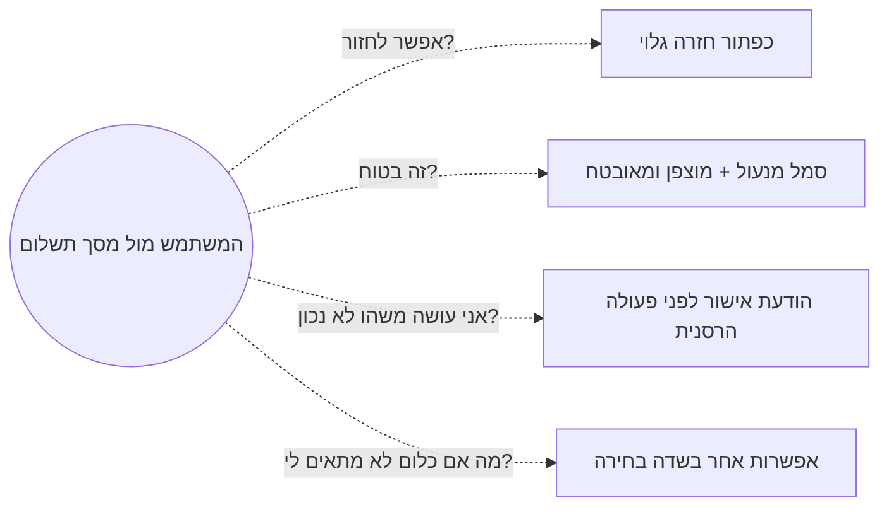
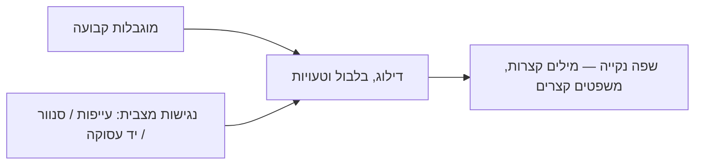

# הפחתת חרדות משתמש: מהקיר הקוגניטיבי לחוויה חלקה

## המשתמש שלכם מפוחד יותר משאתם חושבים

בשיעור הקודם ראינו ש[[microcopy|מיקרו-קופי]] ממלא שלושה תפקידים לאורך מסע המשתמש — הנעה, הנחיה ומשוב. אבל יש הנחת יסוד שעומדת מאחורי שלושתם, ורוב המעצבים לא עוצרים לחשוב עליה במפורש: **המשתמש שלכם, ברגע שהוא עומד מול מסך, לרוב מפוחד**.

הוא שואל את עצמו שאלות שהוא כמעט אף פעם לא אומר בקול: האם אני יכול לחזור למסך הקודם אם אני מתחרט? האם התשלום הזה בטוח? האם אני עושה כאן משהו לא נכון? מה קורה אם אף אחת מהאפשרויות לא מתאימה בדיוק למקרה שלי? כל אחת מהשאלות האלה היא **קיר קוגניטיבי** קטן — רגע היסוס שמאט את המשתמש, ולפעמים גורם לו לנטוש את התהליך כולו.

בשיעור זה נלמד איך מיקרו-קופי טוב מזהה מראש את השאלות האלה ועונה עליהן, ולמה סביבה פיזית — לא רק מוגבלות קבועה — יכולה להחליש זמנית את היכולת של כל אחד מאיתנו לקרוא ולהבין טקסט.

---

## מטרות השיעור

בסיום שיעור זה תוכלו:

- **להגדיר (Remember)** מהי חרדת משתמש (User Anxiety) בהקשר ממשק, ומהי נגישות מצבית (Situational Accessibility).
- **להסביר (Understand)** מדוע שאילת השאלה "מה השאלה הבאה שתעלה למשתמש?" אחרי כל פיסת מידע מפחיתה נטישה.
- **לזהות (Understand)** מצבים שבהם יכולת הקריאה וההבנה של משתמש יורדת זמנית, גם בלי מוגבלות קבועה.
- **ליישם (Apply)** את עקרונות [[plain-language|השפה הנקייה]] — מילים קצרות, משפטים קצרים — כדי לשפר קטע מיקרו-קופי נתון.
- **לנתח (Analyze)** מסך נתון ולהבחין בין מיקרו-קופי שמרגיע נכון לבין מיקרו-קופי שמזריק חשש חדש שלא היה קיים.

---

# בני אדם מפוחדים: לענות על השאלה הבאה

**הגדרה:** משתמשים חווים באופן קבוע חרדה מצבית קלה מול ממשקים — חשש שמא יטעו, יאבדו מידע, או ישלמו על משהו שלא התכוונו אליו. תפקיד המיקרו-קופי הוא לפוגג את החששות האלה **מראש**, ולאפשר למשתמש לפעול בביטחון.

השאלות החוזרות הן לרוב מאותה משפחה: "אפשר לחזור למסך הזה?", "התשלום בטוח?", "אני עושה משהו לא נכון?", "מה אם שום אפשרות לא מתאימה לי?" אף משתמש לא כותב את השאלות האלה בפה מלא, אבל הן קיימות ברקע כל אינטראקציה — במיוחד ברגעים שקשורים לכסף, למידע אישי או לפעולות בלתי הפיכות.

**הטכניקה המעשית:** אחרי כל פיסת מידע שאתם נותנים למשתמש, שאלו את עצמכם — "מה השאלה הבאה שתעלה לו עכשיו?" וענו עליה באותו מקום, לפני שהוא בכלל הספיק לשאול אותה.

:::example
במסך תשלום ב-**PayPal**, לצד שדה פרטי כרטיס האשראי מופיע סמל מנעול קטן עם הטקסט "התשלום שלך מוצפן ומאובטח". זו תשובה ישירה לשאלה השקטה "האם זה בטוח להזין כאן את פרטי הכרטיס?" — בדיוק ברגע שבו היא עולה, ולא איפשהו בעמוד "אודות" נפרד.
:::

:::important
המטרה היא **לאפשר** למשתמש לפעול בביטחון — לא ליצור חששות חדשים שלא היו קיימים. יש הבדל גדול בין "התשלום שלך מוצפן ומאובטח" (מרגיע חשש קיים) לבין הוספת אזהרה מפחידה ליד פעולת שמירה רגילה כמו "אזהרה: פעולה זו עלולה לגרום לאובדן מידע בלתי הפיך בנסיבות מסוימות" — משפט כזה מזריק פחד חדש לתוך פעולה שגרתית ובטוחה לחלוטין, ומשיג בדיוק את האפקט ההפוך.
:::

:::diagram
תרשים המראה משתמש עומד מול מסך תשלום, עם ארבעה "בועות מחשבה" שקטות סביבו: "אפשר לחזור?", "זה בטוח?", "אני עושה משהו לא נכון?", "מה אם כלום לא מתאים לי?". לצד כל בועה — חץ למיקרו-קופי קונקרטי שעונה עליה: כפתור "חזרה" גלוי, סמל מנעול + "מוצפן ומאובטח", הודעת אישור לפני פעולה הרסנית, ואפשרות "אחר" בשדה בחירה.

:::

:::selfcheck
question: אפליקציה להרשמה לניוזלטר (בלי שום מידע רגיש, ללא תשלום) מוסיפה שלושה תגי אבטחה גדולים ("100% מאובטח!", "הפרטיות שלך חשובה לנו!", "ללא סיכון!") מתחת לשדה כתובת המייל היחיד בטופס. מה הבעיה כאן, אף שמדובר על פניו ב"הרגעה" ולא ב"אזהרה"?
answer: זו עדיין הזרקת חשש חדש שלא היה קיים — הצפת המשתמש בתגי אבטחה דרמטיים לפעולה כה פשוטה ולא-מסוכנת (הרשמה לניוזלטר) גורמת לו לתהות "רגע, למה בכלל צריך להרגיע אותי כל כך? יש כאן סיכון שלא ידעתי עליו?" גם הרגעה יכולה להזריק חשש כשהיא לא פרופורציונלית לפעולה בפועל.
:::

---

# הסביבה משפיעה על היכולת: נגישות מצבית

**הגדרה:** [[accessibility|נגישות]] אינה שייכת רק למשתמשים עם מוגבלות קבועה. כל דבר שמסייע למשתמש עם מוגבלות (למשל שפה פשוטה וקצרה) מסייע גם למשתמש שנמצא כרגע במצב זמני שמפחית את יכולתו לקרוא ולהבין: מיגרנה, שמש מסנוורת על המסך, בטן מקרקרת, קליטה גרועה, או סתם יד אחת פנויה בלבד (למשל כשמחזיקים תינוק).

כל המצבים האלה — קבועים וזמניים כאחד — משפיעים על היכולת שלנו להבין טקסטים, וגורמים לתופעות דומות: דילוג על מילים חשובות, חוסר סבלנות לקרוא עד הסוף, בלבול בין מילים דומות וטעויות. לכן, במיוחד כשכותבים הנחיות לפעולה, יש לכתוב ב**שפה פשוטה ונקייה** שעומדת גם בכללי נגישות — מילים קצרות ומשפטים קצרים. מיקרו-קופי שמשתמש מבין מיד ובקלות — מכבד אותו.

:::example
אפליקציית הבנקאות הדיגיטלית **Revolut**, הידועה בין השאר דווקא בזכות ניסוח פשוט וישיר בהודעותיה, ממחישה את הניגוד: הודעת שגיאה שהייתה יכולה להיכתב כ"הפעולה נכשלה עקב אי-עמידה בדרישות האימות של המערכת" מחייבת קריאה מרוכזת ופענוח של ז'רגון. משתמש שנוהג בו-זמנית, נמצא בתאורה חזקה או פשוט עייף בסוף היום עלול לפספס אותה לגמרי. ניסוח נקי בסגנון "הפרטים שהוזנו שגויים — בדקו ונסו שוב" מעביר בדיוק את אותו מידע, במאמץ קריאה מינימלי.
:::

:::diagram
תרשים המראה שני מקורות שונים המובילים לאותה ירידה זמנית ביכולת קריאה: "מוגבלות קבועה" (למשל קושי ראייה) ו"נגישות מצבית" (עייפות, סנוור, יד עסוקה, סביבה רועשת) — שני החצים מתכנסים לאותה תופעה: דילוג על מילים, בלבול וטעויות — ומשם לאותו פתרון: שפה נקייה, מילים קצרות ומשפטים קצרים.

:::

:::warning
אל תבלבלו בין "נגישות" כדרישה טכנית צרה (למשל תאימות לקורא מסך) לבין העיקרון הרחב יותר שכל שיפור נגישות משרת גם משתמשים בלי מוגבלות קבועה, במצב זמני של יכולת מופחתת. זו בדיוק הסיבה ששפה נקייה היא כלי שמשרת כמעט כל משתמש, לא רק קהל מוגדר וצר.
:::

:::selfcheck
question: צוות מוצר מחליט לוותר על שפה נקייה בממשק ניהול פנימי, בנימוק ש"זה כלי מקצועי למומחי IT בלבד, כולם כאן מבינים ז'רגון טכני". מה הסיכון בהנחה הזו, גם אם כל המשתמשים אכן מומחים?
answer: גם מומחה חווה מדי פעם ירידה זמנית ביכולת קריאה — עייפות בסוף משמרת לילה, ריכוז מפוצל בזמן תקרית דחופה, או סביבת עבודה רועשת. שפה נקייה לא נועדה רק למי ש"לא מבין ז'רגון", אלא מפחיתה את הסיכוי לטעות בדיוק ברגעים שבהם גם מומחה קורא במאמץ מופחת — למשל תוך כדי טיפול באירוע תקלה בלחץ זמן.
:::

---

## עקרונות מפתח

### עיקרון 1: ענו על השאלה הבאה, לפני שהיא נשאלת

**העיקרון:** אחרי כל פיסת מידע חדשה שאתם מציגים למשתמש, שאלו מה החשש או השאלה הבאה שתעלה אצלו — וענו עליה באותו מקום.

**למה זה חשוב:** משתמש שלא מקבל תשובה לשאלה השקטה שלו נשאר תקוע בהיסוס, מחפש הרגעה במקום אחר (למשל בסקירות חיצוניות), או פשוט נוטש.

**איך ליישם:**
- ❌ אל תסתפקו בשדה קלט חשוף לפרטי אשראי בלי שום הקשר
- ✅ הוסיפו סמל אבטחה קצר עם משפט הרגעה ("מוצפן ומאובטח") בדיוק ליד השדה הרגיש

**תוצאה של הפרה:** משתמשים מהססים או נוטשים תהליכים קריטיים (כמו תשלום) בגלל חשש שלא נענה, גם אם המערכת בפועל בטוחה לחלוטין.

### עיקרון 2: אל תזריקו חשש חדש שלא היה קיים

**העיקרון:** הרגעה יתרה, אזהרות מפחידות מדי או ניסוחים דרמטיים ליד פעולות שגרתיות מייצרים חרדה שלא הייתה קיימת מלכתחילה.

**למה זה חשוב:** מטרת המיקרו-קופי היא לבנות ביטחון, לא לערער אותו. אזהרה מוגזמת ליד פעולת "שמור" רגילה גורמת למשתמש לחשוב שמשהו מסוכן קורה כאן, גם כשאין שום סיכון אמיתי.

**איך ליישם:** שמרו את שפת האזהרה החזקה (מילים כמו "לצמיתות", "בלתי הפיך") רק לפעולות שבאמת הרסניות ובלתי הפיכות — לא לכל פעולה שגרתית.

**תוצאה של הפרה:** משתמשים מפתחים "עייפות אזהרות" (Warning Fatigue) — הם מפסיקים לקרוא אזהרות ברצינות, כולל אלה שכן קריטיות.

### עיקרון 3: כתבו בשפה נקייה — מילים קצרות, משפטים קצרים

**העיקרון:** הנחיות פעולה, במיוחד, צריכות להיות בעברית או אנגלית פשוטה, במשפטים קצרים, ללא ז'רגון מקצועי.

**למה זה חשוב:** שפה נקייה משרתת בו-זמנית משתמשים עם מוגבלות קבועה ומשתמשים במצב זמני של יכולת מופחתת — כלומר כמעט כל אחד, בזמן כלשהו.

**איך ליישם:** בכל הודעת שגיאה או הנחיה, שאלו: האם אפשר לומר את זה במילים פשוטות יותר ובמשפט קצר יותר, בלי לאבד מידע?

**תוצאה של הפרה:** משתמשים במצב של עומס קוגניטיבי (עייפות, הסחת דעת, סביבה קשה) מפספסים מידע קריטי, טועים או נוטשים.

---

## דפוסי בחינה נפוצים

### דפוס 1: זיהוי — עקרון "השאלה הבאה"

**סוג:** רב-ברירה, זיהוי

**מה זה בוחן:** האם אתם מכירים את הטכניקה של מענה מקדים לחששות המשתמש.

**שאלת דוגמה:** מה הטכניקה המומלצת לזיהוי איזה מיקרו-קופי מרגיע יש להוסיף במסך נתון?

A. להוסיף כמה שיותר טקסט הסבר בכל מקום אפשרי
B. אחרי כל פיסת מידע, לשאול "מה השאלה הבאה שתעלה למשתמש?" ולענות עליה מיד
C. להימנע מכל טקסט הרגעה כדי לשמור על מסך נקי
D. להעביר את כל ההרגעות למסמך תנאי שימוש נפרד

**תשובה נכונה:** B

**הסבר:** הטכניקה המדויקת שנלמדה היא לחשוב מראש על השאלה הבאה שתעלה למשתמש ולענות עליה באותו מקום. תיאור A מוביל לעומס טקסט מיותר. תיאור C מתעלם מהצורך האמיתי בהרגעה. תיאור D מרחיק את המידע החשוב מהרגע שבו הוא נחוץ.

### דפוס 2: יישום — הרגעה מול הזרקת חשש

**סוג:** תרחיש, יישום

**מה זה בוחן:** האם אתם יודעים להבחין בין ניסוח מרגיע לניסוח שמזריק חשש חדש.

**תרחיש:** מסך שמירת טיוטת מסמך רגילה מציג את הטקסט: "אזהרה חמורה: פעולה זו עלולה להשפיע לצמיתות על שלמות הנתונים שלך."

**שאלה:** מה הבעיה העיקרית בניסוח הזה?

A. הוא ארוך מדי ולכן פוגע באסתטיקה
B. הוא מזריק חשש חדש וחמור לתוך פעולת שמירה שגרתית ובטוחה לגמרי
C. הוא לא מזכיר את שם הקובץ הנשמר
D. הוא לא כתוב בפונט מספיק גדול

**תשובה נכונה:** B

**הסבר:** פעולת שמירה רגילה היא בטוחה ולא הרסנית, ולכן שפת אזהרה כה חמורה ("לצמיתות", "אזהרה חמורה") מזריקה חשש שלא היה קיים ופוגעת בביטחון המשתמש שלא לצורך. תיאורים A, C ו-D אינם מזהים את הבעיה המרכזית, שהיא חוסר ההתאמה בין חומרת האזהרה לבין חומרת הפעולה בפועל.

### דפוס 3: ניתוח — נגישות מצבית

**סוג:** תרחיש, ניתוח

**מה זה בוחן:** האם אתם מבינים שנגישות מצבית משפיעה על משתמשים ללא מוגבלות קבועה.

**תרחיש:** משתמש מנסה לקרוא הודעת שגיאה ארוכה וטכנית באפליקציית בנקאות בזמן שהוא נוהג ברכב עם אור שמש חזק על המסך.

**שאלה:** לפי עקרון הנגישות המצבית, מה הכי סביר שיקרה כאן?

A. המשתמש יבין את ההודעה בדיוק כמו בכל מצב אחר, כי אין לו מוגבלות קבועה
B. יכולת הקריאה וההבנה של המשתמש יורדת זמנית עקב הנסיבות (נהיגה, סנוור), גם ללא מוגבלות קבועה, ולכן הודעה מורכבת עלולה להתפספס
C. נגישות מצבית רלוונטית רק למשתמשים עם מוגבלות ראייה קבועה
D. אורך ההודעה אינו משפיע על ההבנה במצב זה

**תשובה נכונה:** B

**הסבר:** נגישות מצבית מתארת בדיוק את המצב הזה — נסיבות זמניות (סנוור מהשמש, ריכוז בנהיגה) מפחיתות את יכולת הקריאה וההבנה גם ללא כל מוגבלות קבועה. תיאור A מתעלם מהעיקרון המרכזי של השיעור. תיאור C מצמצם נגישות מצבית רק למוגבלות קבועה — בדיוק ההפך מהגדרתה. תיאור D שגוי — אורך ומורכבות ההודעה משפיעים ישירות על הסבירות שהיא תובן במצב של יכולת מופחתת.

### דפוס 4: יישום — כתיבה בשפה נקייה

**סוג:** רב-ברירה, יישום

**מה זה בוחן:** האם אתם יודעים לזהות ניסוח שעומד בעקרונות שפה נקייה.

**שאלת דוגמה:** איזו מהודעות השגיאה הבאות עומדת בצורה הטובה ביותר בעקרונות השפה הנקייה?

A. "אירעה שגיאה בתהליך האימות של הבקשה שהוגשה על ידך."
B. "הבקשה שלך לא עברה עקב פרמטרים לא תקינים במופע הנוכחי."
C. "הסיסמה שגויה. נסו שוב."
D. "המערכת זיהתה חוסר התאמה בין הקלט שסופק לבין הפורמט הנדרש לצורך אימות."

**תשובה נכונה:** C

**הסבר:** "הסיסמה שגויה. נסו שוב." הוא ניסוח קצר, ישיר, נטול ז'רגון, שמובן מיד בקריאה אחת — בדיוק עקרון השפה הנקייה. שאר האפשרויות משתמשות בז'רגון טכני ("פרמטרים", "מופע", "אימות") ובמשפטים ארוכים שדורשים מאמץ קריאה מיותר.

---

## סיכום השיעור

:::summary
משתמשים חווים חרדה שקטה מול ממשקים — חששות שלא נאמרים בקול כמו "אפשר לחזור?" או "זה בטוח?". מיקרו-קופי טוב שואל מראש "מה השאלה הבאה?" ועונה עליה באותו מקום, בלי להזריק חשש חדש שלא היה קיים. במקביל, [[accessibility|נגישות]] אינה עניין של מוגבלות קבועה בלבד — מצבים זמניים כמו עייפות, סנוור או יד עסוקה מפחיתים זמנית את יכולת הקריאה של כל משתמש, ולכן [[plain-language|שפה נקייה]] (מילים קצרות, משפטים קצרים) משרתת קהל רחב הרבה יותר ממה שנדמה במבט ראשון.
:::

:::keypoints
- משתמשים חווים חרדה שקטה מול ממשקים: פחד מטעות, מאובדן מידע ומפעולות בלתי הפיכות.
- הטכניקה: אחרי כל פיסת מידע, לשאול "מה השאלה הבאה?" ולענות עליה מיד.
- אסור להזריק חשש חדש שלא היה קיים — הרגעה מוגזמת פוגעת באמון בדיוק כמו חוסר הרגעה.
- **נגישות מצבית** — מצבים זמניים (עייפות, סנוור, יד עסוקה) מפחיתים יכולת קריאה גם ללא מוגבלות קבועה.
- **שפה נקייה** — מילים קצרות ומשפטים קצרים משרתים גם מוגבלות קבועה וגם מצבית כאחד.
:::

:::references
- `/content/sources/HCI_ concepts and applications - 27203901-20262_.../Micro copy/micro copy.pptx` — מצגת הקורס, שקפים 5–6 (Humans are afraid; The environment affects the ability).
- Nielsen Norman Group — "Plain Language Is for Everyone, Even Experts" — מאמר על התועלת הרחבה של שפה נקייה מעבר לקהל עם קשיי קריאה מוגדרים.
:::

:::quiz{ref="reducing-friction-quiz"}
:::
