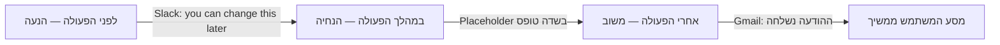
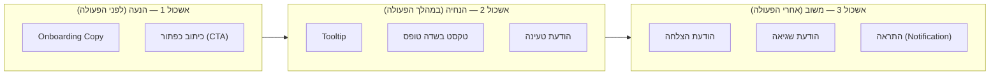

# תפקידי המיקרו-קופי: הנעה, הנחיה ומשוב

## המילים הקטנות שמחליטות הכל

עד עכשיו בקורס עסקנו בשלד הממשק: איך [[usability|מודדים שמישות]], איך בונים [[wireframing|Wireframe]], איך בודקים אב-טיפוס עם משתמשים. אבל יש שכבה נוספת שרוב המעצבים מזניחים עד השלב האחרון, ולמרבה ההפתעה — היא זו שהמשתמש בפועל **קורא** בכל שנייה של האינטראקציה: הטקסט הקצר על הכפתורים, בתוך שדות הטופס, בהודעות ההצלחה והשגיאה.

הטקסט הזה נקרא **מיקרו-קופי (Microcopy)**, ולפעמים גם UX Writing. שתי מילים על שדה טופס יכולות להיות ההבדל בין משתמש שמשלים הרשמה בביטחון לבין משתמש שנוטש את התהליך מבולבל — גם אם העיצוב הגרפי מסביב מושלם. Usability, כפי שלמדנו, נמדדת גם בשביעות רצון ובכמות השגיאות — ומיקרו-קופי משפיע ישירות על שני הממדים האלה.

בשיעור זה נבין מהו מיקרו-קופי, אילו תפקידים הוא ממלא לאורך מסע המשתמש, ואיזה כלל אחד קטן — איך מנסחים כיתוב כפתור — הופך להיות אחד ההבדלים המעשיים ביותר בין ממשק שמרגיש מקצועי לממשק שמרגיש מבולבל.

---

## מטרות השיעור

בסיום שיעור זה תוכלו:

- **להגדיר (Remember)** מהו מיקרו-קופי ולזהות אותו כרכיב טקסטואלי קצר ופונקציונלי בממשק.
- **להסביר (Understand)** מדוע מיקרו-קופי הוא כלי שמשפר שמישות, ולא רק "לכתוב יפה".
- **לזהות (Understand/Apply)** את שלושת התפקידים המרכזיים של מיקרו-קופי — הנעה, הנחיה ומשוב — ולשייך דוגמת ממשק נתונה לתפקיד הנכון.
- **ליישם (Apply)** את הכלל שלפיו כיתוב כפתור צריך לתאר את התוצאה של הלחיצה ולא את פעולת הלחיצה עצמה.
- **לנתח (Analyze)** קטע מיקרו-קופי נתון ולזהות מתי הוא בא "לתקן" עיצוב לקוי במקום לשפר עיצוב תקין.

---

# מהו מיקרו-קופי?

**הגדרה:** [[microcopy|מיקרו-קופי]] הוא הטקסט הקצר בממשק — על כפתורים, תוויות, שדות טופס, הודעות שגיאה והצלחה — שמנחה את המשתמש מה לעשות, מבהיר נקודות מבלבלות ומזריק רגע של אישיות לתוך הממשק.

מיקרו-קופי אינו "תוכן" במובן הרגיל (כמו כתבה או תיאור מוצר). הוא **תפקודי**: תפקידו לגרום למשתמש לפעול נכון, בביטחון, וברגע הנכון. בגלל שהוא כל כך קצר — לפעמים מילה בודדת — הוא גם הקשה ביותר לכתיבה: אין בו מקום לניסוח מסורבל, וכל מילה חייבת להצדיק את מקומה.

:::example
בתהליך יצירת צוות חדש ב-**Slack**, מיד לצד שדה "שם הצוות" מופיע משפט קטן: *"you can change this later"*. שתי מילים אלה מסירות מהמשתמש את הלחץ להמציא שם מושלם ברגע הראשון — וכך מזרזות אותו להשלים את שלב ה-Onboarding ולהתחיל להשתמש במוצר, במקום להיתקע בהיסוס מול שדה טופס אחד.
:::

:::diagram
תרשים ציר-זמן של אינטראקציית משתמש עם שלושה שלבים: "לפני הפעולה", "במהלך הפעולה" ו"אחרי הפעולה". מתחת לכל שלב מופיעה תווית התפקיד המתאים (הנעה / הנחיה / משוב) ודוגמת מיקרו-קופי קצרה מתחתיו: לפני — "you can change this later" (Slack); במהלך — טקסט placeholder בתוך שדה טופס; אחרי — "ההודעה נשלחה".

:::

:::selfcheck
question: בעמוד מוצר אחד מופיעים שני קטעי טקסט: (1) הכותרת השיווקית "המוצר הכי נמכר החודש — אל תפספסו!" (2) ההודעה "המוצר נוסף לסל הקניות שלכם" שמופיעה אחרי לחיצה על כפתור. איזה מהשניים הוא מיקרו-קופי, ולמה השני אינו?
answer: קטע (2) הוא מיקרו-קופי — הוא מגיב לפעולה קונקרטית של המשתמש (הוספה לסל) ומאשר לו שהיא הצליחה. קטע (1) הוא תוכן שיווקי: מטרתו לשכנע ולעורר עניין, לא להגיב לפעולה שהמשתמש כרגע ביצע בממשק.
:::

---

# שלושת התפקידים של מיקרו-קופי במסע המשתמש

עשרות סוגי מיקרו-קופי קיימים בממשק דיגיטלי — טקסט Onboarding, הודעות שגיאה, טקסט טעינה, Tooltips ועוד — וזו רשימה ארוכה מדי לזכור כשטוחה. לכן נחלק אותם לפי **הרגע במסע המשתמש** שבו הם מופיעים: לפני שהוא פועל, בזמן שהוא פועל, ואחרי שהוא פעל.

:::diagram
תרשים flowchart בשלושה אשכולות: אשכול 1 "הנעה — לפני הפעולה" מכיל את הריבועים "Onboarding Copy" ו"כיתוב כפתור (CTA)"; אשכול 2 "הנחיה — במהלך הפעולה" מכיל את הריבועים "Tooltip", "טקסט בשדה טופס" ו"הודעת טעינה"; אשכול 3 "משוב — אחרי הפעולה" מכיל את הריבועים "הודעת הצלחה", "הודעת שגיאה" ו"התראה (Notification)". חץ מוביל מאשכול לאשכול משמאל לימין.

:::

## הנעה (Motivation) — לפני שהמשתמש פועל

**הגדרה:** טקסט שמטרתו לגרום למשתמש להתחיל לפעול, ולהסיר חסמים פסיכולוגיים לפני שהוא בכלל מנסה.

**דוגמה:** טקסט ה-Onboarding של **Slack** שראינו למעלה הוא דוגמה קלאסית — הוא מוריד לחץ מתהליך ההרשמה ומניע את המשתמש להמשיך קדימה, בלי לדרוש ממנו מידע מיותר.

**כלל חשוב בהנעה — כיתוב כפתור:** הטקסט על כפתור לא אמור לתאר את פעולת הלחיצה עצמה ("לחץ כאן", "שלח"), אלא את **התוצאה** שתקרה אחרי הלחיצה. "לחץ כאן" לא אומר כלום על מה שיקרה. "שמור שינויים" ב-**Google Docs**, "התחילו להאזין" ב-**Spotify** או "אשר את ההעברה" באפליקציית בנקאות — כל אלה אומרים למשתמש בדיוק מה קורה ברגע שהוא לוחץ, ומעניקים לו ביטחון בבחירה שלו.

## הנחיה (Guidance) — במהלך הפעולה

**הגדרה:** טקסט שמלווה את המשתמש בזמן שהוא מבצע פעולה, ועוזר לו לא להיתקע באמצע.

**דוגמה:** ב-**Trello**, לוח עבודה ריק (Empty State) של פרויקט חדש מציג טקסט קצר שמסביר שאפשר לגרור כרטיסייה ראשונה לכאן — במקום מסך ריק ומבלבל שמשאיר את המשתמש לתהות אם משהו נטען בכלל. באפליקציית **Booking.com**, בזמן חיפוש מלונות מוצגת הודעת טעינה כמו "מחפשים לכם את המלונות הכי משתלמים..." — הטקסט הזה לא רק ממלא זמן, הוא גם מרגיע שהמערכת פועלת.

**מה קורה כשמפרים:** שדה טופס ללא שום הנחיה על הפורמט הנדרש (למשל תאריך לידה) גורם למשתמש לנחש, לטעות ולנסות שוב — בזבוז זמן ותסכול שאפשר היה למנוע במשפט קצר אחד.

## משוב (Feedback) — אחרי הפעולה

**הגדרה:** טקסט שמאשר למשתמש מה קרה בעקבות פעולתו — הצליח, נכשל, או קרה משהו שהוא צריך לדעת עליו.

**דוגמה:** **Gmail** מציג הודעת "המייל נשלח" קטנה מיד אחרי שליחה, ולצידה כפתור "בטל שליחה" לכמה שניות — משוב חיובי מיידי, עם רשת ביטחון. לעומת זאת, כשמייל נכשל בשליחה, **Slack** מציג הודעה כמו "לא הצלחנו לשלוח — בדקו את החיבור ונסו שוב", עם כפתור "נסה שוב" ממש לצידה.

**מה קורה כשמפרים:** אתר שמציג רק "משהו השתבש" בלי פירוט ובלי כפתור פעולה משאיר את המשתמש תקוע, לא יודע אם לרענן, לחכות או לפנות לתמיכה.

**עוד שני סוגים ששייכים למשפחת ה"משוב" הרחבה:** **כיתובים (Captions)** — טקסט קצר מתחת לתמונה שמתאר את תוכנה, כמו הכיתוב מתחת לתמונת פרופיל בפיד של **Instagram**. **טקסט Offboarding** — ההודעה שמוצגת כשמשתמש בוחר לעזוב את השירות, למשל מסך "מצטערים לראות אתכם עוזבים" שמופיע כשמבטלים מנוי ב-**Netflix**, לעיתים עם הצעה חלופית לפני עזיבה סופית.

:::important
שימו לב: **כיתוב כפתור** (חלק מהנעה) ו**הודעת משוב** הן שתי נקודות שנבחנות הכי הרבה, כי הן הכי קלות להמחיש בתרחיש קצר. בכל שאלה שמתארת כפתור או הודעה, שאלו את עצמכם קודם: זה קורה **לפני**, **במהלך** או **אחרי** הפעולה?
:::

:::selfcheck
question: אפליקציית משלוחים מציגה כפתור ירוק גדול עם הטקסט "לחץ כאן" בתחתית מסך התשלום, וללא הודעה כלשהי אחרי הלחיצה עד שההזמנה כבר בדרך. אילו שני תפקידי מיקרו-קופי חסרים כאן, ומה הייתם כותבים במקומם?
answer: חסר גם **הנעה** נכונה — הכיתוב "לחץ כאן" מתאר את פעולת הלחיצה ולא את התוצאה; ניסוח טוב יותר: "שלם והזמן עכשיו". וחסר גם **משוב** — אין הודעת הצלחה או הודעת טעינה בין הלחיצה לבין קפיצה למסך "בדרך אליכם", כך שהמשתמש לא יודע אם הלחיצה שלו בכלל נקלטה.
:::

---

# מיקרו-קופי משפר את החוויה — הוא לא מתקן עיצוב לקוי

עיצוב UX שואף לגרום לדברים להרגיש אינטואיטיביים. מיקרו-קופי אמור לפעול באותו אופן: כמה מילים נבחרות היטב יכולות למנוע ממשתמש להיתקע או לנטוש תהליך שלם. אבל יש כאן מלכודת נפוצה: מיקרו-קופי **לא אמור להסביר עיצוב**. תפקידו לשפר את החוויה בתוך ההקשר, ולענות על השאלה שעולה למשתמש באותו רגע — לא לפצות על אייקון מבלבל, כפתור לא ברור או זרימת מסכים שגויה.

אם אייקון של "שמור" נראה כמו דיסקט (שלרבים מהמשתמשים הצעירים אף פעם לא היה) ודורש תווית טקסט קבועה לצידו כדי שיובן — הפתרון האמיתי הוא להחליף את האייקון, לא רק להוסיף עוד מילה. מיקרו-קופי טוב מצטרף לעיצוב תקין; הוא לא תחבושת על עיצוב שבור.

:::example
מנגנון התשלום של **Stripe Checkout**, המוטמע באלפי אתרי מסחר, מציג placeholder בפורמט "1234 5678 9012 3456" בתוך שדה מספר הכרטיס עצמו, עם רווחים שנוספים אוטומטית תוך כדי הקלדה. שימו לב: אין כאן שום משפט הסבר נפרד ליד השדה — הפורמט הנדרש מוצג **בתוך** השדה עצמו. השוו זאת לטופס שבו שדה כרטיס האשראי ריק לגמרי, ולצידו רק כתוב "הזן פרטים": הטקסט הזה מנסה להסביר בכתב מה שהעיצוב היה צריך להראות מלכתחילה, ועדיין לא אומר למשתמש אילו פרטים ובאיזה פורמט.
:::

:::selfcheck
question: מעצב מוסיף משפט הסבר ארוך ליד אייקון לא ברור, במקום להחליף את האייקון עצמו. מה הבעיה בגישה הזו מבחינת תפקיד המיקרו-קופי?
answer: מיקרו-קופי אמור לשפר חוויה שכבר עובדת, לא לתקן אלמנט עיצובי שבור מלכתחילה. הוספת טקסט הסבר ארוך היא פתרון זמני שמעמיס עוד קריאה על המשתמש, במקום לפתור את הבעיה האמיתית — האייקון עצמו.
:::

---

## עקרונות מפתח

### עיקרון 1: כיתוב כפתור מתאר תוצאה, לא פעולה

**העיקרון:** הטקסט על כפתור צריך לומר למשתמש לאן הוא הולך או מה יקרה בעקבות הלחיצה — לא לחזור על כך שצריך ללחוץ.

**למה זה חשוב:** משתמש שרואה "אישור" גנרי לא יודע אם הוא מאשר תשלום, מחיקה או שינוי הגדרות. משתמש שרואה "מחק לצמיתות" יודע בדיוק מה הוא עומד לעשות.

**איך ליישם:**
- ❌ אל תכתבו: "לחץ כאן", "שלח", "אישור" (גנרי מדי, לא מתאר תוצאה)
- ✅ כן כתבו: "שמור שינויים", "התחל להאזין", "אשר את ההעברה", "מחק לצמיתות"

**תוצאה של הפרה:** משתמש מהסס לפני לחיצה על כפתור גנרי כי אינו יודע מה יקרה, מה שמאט את התהליך ומגביר טעויות (למשל לחיצה על "אישור" שמכוון בפועל למחיקה בלתי הפיכה).

### עיקרון 2: להתאים את סוג המיקרו-קופי לרגע הנכון

**העיקרון:** מיקרו-קופי צריך להופיע בדיוק ברגע שבו המשתמש זקוק לו — לא לפני, לא אחרי.

**למה זה חשוב:** הודעת הנחיה שמופיעה רק **אחרי** שהמשתמש כבר טעה (במקום כ-placeholder לפני שהוא הקליד) מגיעה מאוחר מדי. הודעת משוב שלא מגיעה כלל אחרי פעולה משאירה את המשתמש בחוסר ודאות.

**איך ליישם:** מפו כל רגע אינטראקציה למקומו בציר הזמן (הנעה / הנחיה / משוב) ובידקו שיש טקסט מתאים בכל תחנה קריטית — במיוחד לפני פעולות בלתי-הפיכות.

**תוצאה של הפרה:** משתמשים חוזרים על טעויות שהיו נמנעות בהנחיה מוקדמת, או מרגישים חרדה כי אין להם משוב על תוצאת הפעולה.

### עיקרון 3: מיקרו-קופי משפר עיצוב תקין — הוא לא מתרץ עיצוב שבור

**העיקרון:** אם צריך פסקת הסבר כדי שאלמנט בממשק יובן, הבעיה היא באלמנט עצמו.

**למה זה חשוב:** תיקון האלמנט (אייקון, מיקום, פורמט שדה) פותר את הבעיה אחת ולתמיד. מיקרו-קופי מפצה רק זמנית ומוסיף עומס קריאה.

**איך ליישם:** כשאתם כותבים הסבר ארוך יוצא דופן ליד רכיב ממשק, שאלו קודם: "האם התיקון האמיתי הוא בעיצוב הרכיב, לא בטקסט שלידו?"

**תוצאה של הפרה:** הממשק מצטבר עם יותר ויותר טקסט הסברים, במקום להיפתר מהבעיה השורשית — עומס קריאה שגדל עם הזמן.

---

## דפוסי בחינה נפוצים

### דפוס 1: זיהוי — הגדרת מיקרו-קופי

**סוג:** רב-ברירה, זיהוי

**מה זה בוחן:** האם אתם יודעים להבחין בין מיקרו-קופי לתוכן שיווקי או תוכן ראשי.

**שאלת דוגמה:** אילו מהבאים הוא הדוגמה הטובה ביותר למיקרו-קופי?

A. כתבת בלוג באתר החברה על עדכון מוצר חדש
B. הודעת "המייל נשלח" המופיעה לרגע לאחר שליחת הודעה ב-Gmail
C. פרסומת וידאו למוצר בעמוד הבית
D. תיאור מוצר ארוך בעמוד קטלוג

**תשובה נכונה:** B

**הסבר:** מיקרו-קופי הוא טקסט קצר ותפקודי בתוך אינטראקציה — הודעת "המייל נשלח" מדגימה בדיוק זאת. שאר האפשרויות הן תוכן שיווקי או תיאורי, לא רכיב פונקציונלי של האינטראקציה עצמה.

### דפוס 2: יישום — תיקון כיתוב כפתור

**סוג:** רב-ברירה, יישום

**מה זה בוחן:** האם אתם יודעים ליישם את הכלל של תיאור תוצאה במקום פעולה.

**שאלת דוגמה:** כפתור בטופס יצירת חשבון חדש מנוסח כ"אישור". איזו חלופה תואמת את עקרון כיתוב הכפתור הנכון?

A. "לחץ כאן"
B. "אישור"
C. "צור את החשבון שלי"
D. "המשך"

**תשובה נכונה:** C

**הסבר:** "צור את החשבון שלי" מתאר את התוצאה המדויקת של הלחיצה. "לחץ כאן" חוזר על הפעולה הפיזית, ו"אישור" ו"המשך" גנריים מדי ולא אומרים למשתמש מה בדיוק קורה.

### דפוס 3: אפליקציה — שיוך לתפקיד הנכון

**סוג:** תרחיש, יישום

**מה זה בוחן:** האם אתם יודעים לשייך דוגמת מיקרו-קופי לתפקיד שלה במסע המשתמש (הנעה / הנחיה / משוב).

**תרחיש:** משתמש ממלא טופס תשלום. תחת שדה תאריך התוקף של הכרטיס מופיע טקסט placeholder אפור: "MM/YY".

**שאלה:** לאיזה תפקיד שייך המיקרו-קופי הזה?

A. הנעה — משום שהוא מעודד את המשתמש להתחיל למלא את הטופס
B. הנחיה — משום שהוא מסייע למשתמש בזמן אמת בזמן שהוא ממלא את השדה
C. משוב — משום שהוא מגיב לפעולת המשתמש לאחר שסיים להקליד
D. אף אחד מהתפקידים — placeholder אינו נחשב מיקרו-קופי

**תשובה נכונה:** B

**הסבר:** placeholder שמראה את הפורמט הצפוי מסייע למשתמש **בזמן** מילוי השדה, לפני שהוא טועה — זו בדיוק הגדרת ההנחיה. הוא לא מעודד להתחיל (הנעה) ולא מגיב לאחר סיום פעולה (משוב).

### דפוס 4: ניתוח — מיקרו-קופי מול תיקון עיצוב

**סוג:** תרחיש, ניתוח

**מה זה בוחן:** האם אתם יודעים לזהות מקרה שבו מיקרו-קופי מנסה לתרץ עיצוב לקוי במקום לשפר עיצוב תקין.

**תרחיש:** אייקון של שלוש נקודות אנכיות (⋮) בראש מסך אפליקציה נותר ללא כל תווית, אך לצידו מופיע משפט הסבר ארוך: "לחצו כאן כדי לפתוח תפריט עם אפשרויות נוספות כמו שיתוף, מחיקה ועריכה של הפריט הנוכחי."

**שאלה:** מה הבעיה העיקרית בפתרון שהוצג?

A. המשפט ארוך מדי ופוגע באסתטיקה של המסך
B. המיקרו-קופי מנסה לפצות על כך שהאייקון עצמו אינו ברור, במקום שהאייקון עצמו יתוקן או יתויג
C. אין צורך בהסבר כלל, כי כל המשתמשים מכירים את הסמל
D. יש להסיר את התפריט לגמרי ולהחליפו בכפתורים בודדים

**תשובה נכונה:** B

**הסבר:** זהו בדיוק המקרה של מיקרו-קופי שמתקן עיצוב לקוי במקום לשפר עיצוב תקין — הפתרון האמיתי הוא לתייג את האייקון (למשל "עוד אפשרויות") ולא להוסיף פסקת הסבר לצידו. תיאור A נכון חלקית אך לא מזהה את שורש הבעיה. תיאור C שגוי — לא כל המשתמשים מכירים את הסמל, ולכן בכלל היה צורך בפתרון. תיאור D קיצוני ולא נדרש.

### דפוס 5: יישום — משוב לאחר פעולה

**סוג:** תרחיש, יישום

**מה זה בוחן:** האם אתם יודעים לזהות מתי חסר משוב מתאים אחרי פעולת משתמש.

**תרחיש:** משתמש לוחץ על כפתור "שלח בקשה" בטופס יצירת קשר. המסך נשאר בדיוק כפי שהיה, ללא הודעה, ספינר או שינוי כלשהו.

**שאלה:** איזה רכיב מיקרו-קופי חסר כאן?

A. טקסט הנעה לפני שליחת הטופס
B. Placeholder בתוך שדות הטופס
C. הודעת משוב שמאשרת שהבקשה נשלחה בהצלחה
D. Tooltip שמסביר את מטרת הטופס

**תשובה נכונה:** C

**הסבר:** לאחר פעולה כמו שליחת טופס, המשתמש זקוק להודעת משוב שמאשרת הצלחה (או כישלון). היעדרה גורם לחוסר ודאות ולעיתים ללחיצות חוזרות. שאר האפשרויות שייכות לשלבים אחרים של האינטראקציה (הנעה או הנחיה), לא לרגע שלאחר השליחה.

---

## סיכום השיעור

:::summary
מיקרו-קופי הוא הטקסט הקצר והתפקודי בממשק — על כפתורים, שדות ובהודעות — שמשפיע ישירות על שביעות הרצון וכמות השגיאות של המשתמש. הוא ממלא שלושה תפקידים לאורך מסע המשתמש: **הנעה** לפני הפעולה, **הנחיה** במהלכה ו**משוב** אחריה. כלל מרכזי הנבחן חוזרות ונשנות: כיתוב כפתור צריך לתאר את **התוצאה** של הלחיצה, לא את פעולת הלחיצה עצמה. וחשוב לזכור: מיקרו-קופי אמור לשפר עיצוב תקין, לא לתרץ עיצוב שבור — אם צריך פסקת הסבר כדי שאלמנט יובן, הפתרון האמיתי הוא לתקן את האלמנט עצמו.
:::

:::keypoints
- **מיקרו-קופי** — טקסט קצר ותפקודי בממשק שמנחה ומרגיע את המשתמש.
- **הנעה** — טקסט שמעודד להתחיל לפעול (Onboarding, כיתוב כפתור).
- **הנחיה** — טקסט שמלווה בזמן הפעולה (Tooltip, placeholder, הודעת טעינה).
- **משוב** — טקסט שמאשר תוצאה לאחר הפעולה (הודעת הצלחה/שגיאה, התראה).
- **כיתוב כפתור נכון** — מתאר את התוצאה של הלחיצה, לא את פעולת הלחיצה.
- מיקרו-קופי משפר עיצוב תקין; הוא לא תחליף לתיקון עיצוב לקוי.
:::

:::references
- `/content/sources/HCI_ concepts and applications - 27203901-20262_.../Micro copy/micro copy.pptx` — מצגת הקורס על מיקרו-קופי, שקפים 2–3 ו-10–19 (הגדרת מיקרו-קופי, סוגיו וכיתוב כפתור).
- Nielsen Norman Group — "Microcopy: Definition" — מאמר מבוא על תפקיד המיקרו-קופי בחוויית משתמש.
:::

:::quiz{ref="role-of-microcopy-quiz"}
:::
