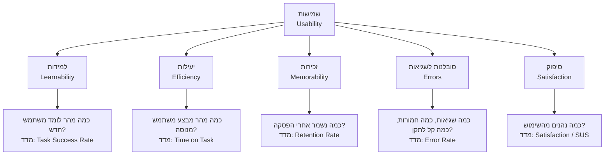

# חמשת ממדי השמישות של נילסן

## שמישות היא לא ציון אחד — היא חמישה ציונים

בשיעור הקודם ראינו ש[[usability|שמישות]] היא ה"איך" שמלווה כל "מה" (Utility) של מוצר. אבל המשפט "המוצר הזה שמיש" מטעה יותר משהוא מסביר — כי הוא מרמז שיש כאן ציון אחד, כמו ציון מבחן. במציאות, שמישות היא **צירוף של חמש תכונות נפרדות ומדידות**, וכל מוצר יכול לקבל עליהן חמישה ציונים שונים לגמרי.

מוצר יכול להיות קל מאוד ללמוד ביום הראשון, ובו-זמנית להיות מתסכל ואיטי למשתמש הוותיק שכבר יודע להשתמש בו. מוצר אחר יכול להיות יעיל להפליא בידי מומחה, אך בלתי אפשרי ללמידה עצמאית של מתחיל. אם נסתפק במילה "שמיש" בלי לפרק אותה, לא נדע **מה בדיוק** לתקן ולא נדע **את מי** אנחנו בכלל בודקים — משתמש חדש? משתמש חוזר? משתמש שטעה?

יעקב נילסן (Jakob Nielsen), מחלוצי חקר השמישות, פירק את המושג לחמישה ממדים שמאפשרים לנו לאבחן במדויק היכן מוצר מצליח והיכן הוא נכשל. זהו כלי האבחון המרכזי שבו נשתמש לאורך שאר הקורס.

---

## מטרות השיעור

בסיום שיעור זה תוכלו:

- **לשנן** את חמשת ממדי השמישות של נילסן ולהגדיר כל אחד מהם במשפט אחד.
- **להסביר** במה כל ממד שונה מהאחרים, ומדוע מוצר אחד יכול לקבל ציון גבוה בממד אחד וציון נמוך באחר.
- **להתאים** בין תרחיש או תלונת משתמש קונקרטית לבין הממד שהיא מפרה.
- **להתאים** בין מדד כמותי (כגון Task Success Rate או SUS) לבין ממד השמישות שהוא מודד בפועל.
- **לנתח** דוגמה של מוצר אמיתי ולזהות באילו ממדים הוא מצטיין ובאילו הוא כושל.
- **להבחין** בין ממד ה-Efficiency של נילסן לבין המונח "Efficiency" בתקן ISO 9241-11 — מלכודת בחינה נפוצה.

---

# חמשת הממדים

[[usability|שמישות]] מורכבת מחמישה ממדים: **למידות, יעילות, זכירות, סובלנות לשגיאות וסיפוק**. נעבור על כל אחד מהם לפי אותו מבנה קבוע: הגדרה פשוטה → דוגמה ממוצר אמיתי → המדד הכמותי שמודד אותו → מה קורה כשהוא נכשל.

:::diagram
תרשים מרכזי-קורן (hub-and-spoke) שבמרכזו "שמישות (Usability)", ומתפצלים ממנו חמישה קווים אל חמשת הממדים: למידות, יעילות, זכירות, סובלנות לשגיאות וסיפוק. מכל ממד יוצא קו נוסף לתיבה המציגה את השאלה המרכזית שהוא בודק ואת המדד הכמותי שמייצג אותו — כך שכל ממד מקושר לשאלת-מפתח ולמדד אחד ספציפי.

:::

---

## 1. למידות (Learnability)

**למידות** בודקת שאלה אחת ויחידה: כמה קל למשתמש **חדש**, שנתקל בממשק **בפעם הראשונה בחייו**, לבצע בו משימות בסיסיות בלי הדרכה מקיפה?

:::example
פתחו לראשונה את **Duolingo**. האפליקציה לא מציגה מדריך טקסטואלי ארוך — היא זורקת אתכם ישר לתרגיל ראשון פשוט (התאמת תמונה למילה), עם משוב מיידי על כל תשובה. תוך פחות מדקה, משתמש חדש לגמרי כבר "יודע לשחק" — מבלי לקרוא הוראות.
:::

**המדד הכמותי**: **Task Success Rate** — אחוז המשתמשים החדשים שמצליחים להשלים משימת בסיס בניסיון הראשון. לדוגמה, 85% מהמשתמשים החדשים הצליחו להתחבר למערכת ללא סיוע. ככל שהאחוז גבוה יותר בקרב משתמשים חסרי ניסיון, הלמידות גבוהה יותר.

**מה קורה כשלמידות נכשלת**: משתמש חדש שנתקל במסך פתיחה עמוס ולא מבין מה הצעד הראשון — נוטש תוך שניות. עבור מוצרים חדשים בשוק תחרותי, למידות נמוכה היא לרוב סיבת המוות מספר אחת: אף אחד לא ישקיע זמן ללמוד מוצר לפני שהתרשם שהוא שווה את המאמץ.

---

## 2. יעילות (Efficiency)

בעוד שלמידות עוסקת ב**רגע הראשון**, **יעילות** עוסקת במה שקורה **אחרי** שהמשתמש כבר למד את המערכת: כמה מהר וחלק הוא מסוגל לבצע משימות כמשתמש מנוסה?

:::example
משתמש ותיק ב-**Gmail** לא גורר את העכבר בין תפריטים כדי לארכב מייל, למחוק אותו או לסמן אותו כנקרא. הוא לוחץ `E`, `#` או `Shift+U` — קיצורי מקלדת שמאפשרים לו לעבד תיבת דואר שלמה תוך דקות. אותה משימה בדיוק, שלמשתמש חדש הייתה לוקחת דקה שלמה של חיפוש בתפריטים, לוקחת למומחה שנייה אחת.
:::

**המדד הכמותי**: **Time on Task** — הזמן הממוצע הנדרש להשלמת משימה. לדוגמה, למשתמשים לקח בממוצע 2 דקות לרכוש פריט. ככל שהזמן קצר יותר עבור משתמשים שכבר מכירים את המערכת, היעילות גבוהה יותר.

**מה קורה כשיעילות נכשלת**: המערכת אמנם ניתנת ללמידה, אבל היא "תקועה" באותה מהירות גם אחרי חודשים של שימוש — אין קיצורי דרך, אין דרכים מהירות יותר, כל פעולה חוזרת על אותו תהליך המייגע כמו בפעם הראשונה. התוצאה: אובדן פרודוקטיביות של המשתמשים הכי נאמנים למוצר — דווקא אלה שהיו אמורים להרוויח הכי הרבה מהמומחיות שרכשו.

### מקרה בוחן: כשאותו מוצר מצליח בממד אחד ונכשל באחר — Adobe Photoshop

זו הנקודה החשובה ביותר בשיעור: **הממדים בלתי-תלויים זה בזה**. מוצר יכול לקבל ציון גבוה בממד אחד וציון נמוך בממד אחר — באותו זמן, אצל אותם משתמשים.

**Adobe Photoshop** הוא דוגמה קלאסית לפער הזה:

- **למידות — נמוכה מאוד.** משתמש חדש שפותח את Photoshop בפעם הראשונה מוצף בעשרות פאנלים, כלים וקיצורים. אין דרך אינטואיטיבית "לנחש" איך לחתוך רקע מתמונה בלי הדרכה חיצונית.
- **יעילות — גבוהה מאוד.** מעצב גרפי מקצועי שמכיר את התוכנה מבצע באמצעות קיצורי מקלדת, מקרו (Actions) ו-Layers מוכנים מראש עשרות פעולות עריכה בדקה — מהירות שבלתי אפשרית להשגה בממשק "פשוט יותר".

Adobe בחרה במפורש **לא** להקריב יעילות למען למידות — כי קהל היעד שלה (מעצבים מקצועיים שישתמשו בתוכנה יומיום במשך שנים) מרוויח יותר מכלי עוצמתי ומהיר מאשר מכלי קל ללמידה בפעם הראשונה. זו החלטת עיצוב מודעת, לא כישלון — אבל היא ממחישה שאי אפשר להניח שציון גבוה בממד אחד "גורר" ציון גבוה בממד אחר.

:::important
**מלכודת בחינה קלאסית**: ה-**Efficiency** שלמדנו כאן הוא אחד מ**חמשת ממדי השמישות** של נילסן — הוא עוסק במהירות של משתמש **מנוסה** לבצע משימה, לעומת למידות שעוסקת במשתמש **חדש**.

זה שונה מהמושג **Efficiency** בתקן **ISO 9241-11**, שם הוא אחד משלושה מדדים (יחד עם Effectiveness ו-Satisfaction) שמתארים **תוצאה של אינטראקציה בודדת** — כמה משאבים (זמן, מאמץ) נדרשו כדי להשלים משימה מסוימת, ללא קשר לרמת הניסיון של המשתמש.

שני המושגים חולקים שם, אך אינם זהים. את ההבחנה המלאה בין שני המודלים — כולל מדוע היא אחת המלכודות הנפוצות ביותר בבחינה — נלמד לעומק בשיעור הבא, [[effectiveness-vs-efficiency|אפקטיביות מול יעילות]].
:::

:::selfcheck
question: משתמשת ותיקה ב-Excel יודעת בדיוק אילו פעולות היא רוצה לבצע, אך נאלצת לעבור דרך שלושה תפריטים מקוננים בכל פעם שהיא רוצה להעתיק עיצוב של תא — כי לתוכנה אין אפשרות להגדיר קיצור מקלדת אישי לפעולה הזו. איזה ממד שמישות נפגע כאן, ולמה זו *לא* בעיית למידות?
answer: זו פגיעה ב-**יעילות (Efficiency)**, לא בלמידות. הבעיה אינה שהיא לא יודעת מה לעשות — היא כבר יודעת בדיוק את הפעולה הרצויה (המשתמשת מנוסה). הבעיה היא שהמערכת לא מאפשרת לה לבצע את הפעולה הידועה הזו במהירות, ומכריחה אותה לחזור על אותו תהליך איטי בכל פעם — בדיוק ההגדרה של כישלון ביעילות.
:::

---

## 3. זכירות (Memorability)

**זכירות** בודקת מה קורה כאשר משתמש **חוזר** למערכת אחרי הפסקה — ימים, חודשים ולעיתים שנים — שבהם לא השתמש בה כלל: כמה מהר הוא חוזר לשליטה מלאה?

:::example
משתמשת שקנתה מוצר באתר מסחר מקוון לפני חצי שנה, וחוזרת אליו עכשיו כדי לקנות משהו אחר, אמורה לזכור באופן טבעי היכן נמצא סמל העגלה, איך מוסיפים פריט אליה ואיך משלימים תשלום — בלי ללמוד את האתר מחדש כאילו הייתה משתמשת חדשה. אתר עם זכירות גבוהה מרגיש "מוכר" גם אחרי היעדרות ארוכה, כי הוא נשען על מוסכמות עיצוב עקביות וברורות שקל לשחזר מהזיכרון.
:::

**המדד הכמותי**: **Retention Rate** — אחוז המשתמשים שחוזרים למערכת לאחר השימוש הראשון. לדוגמה, 90% מהמשתמשים חוזרים לאתר בתוך שבוע. הקשר לזכירות ישיר: מערכת שקשה לזכור איך מפעילים אותה גורמת למשתמשים לחוות תסכול בחזרתם, ולכן פחות סביר שיחזרו שוב — כלומר שיעור נטישה גבוה הוא לרוב הסימפטום המדיד ביותר של כישלון בזכירות.

**מה קורה כשזכירות נכשלת**: המשתמש החוזר מרגיש כאילו הוא מתחיל מאפס — בדיוק כמו משתמש חדש, למרות שכבר "שילם" בעבר בזמן למידה. התסכול הזה חמור יותר מתסכול של משתמש חדש, כי המשתמש החוזר **ציפה** לזכור, ואי-הזכירה מרגישה ככישלון אישי ולא רק ככישלון של הממשק.

:::selfcheck
question: משתמשת שחוזרת לאפליקציית ניהול תקציב אחרי חצי שנה של אי-שימוש, מגלה שהיא לא זוכרת בכלל היכן נמצא הכפתור להוספת הוצאה חדשה, ונאלצת לחפש אותו בכל התפריטים מחדש — בדיוק כאילו מעולם לא השתמשה באפליקציה. באיזה ממד שמישות מדובר, ובמה הוא שונה מלמידות?
answer: זהו כישלון ב-**זכירות (Memorability)**. לכאורה זה נראה דומה ללמידות — המשתמשת "לא יודעת מה לעשות" — אבל ההבדל קריטי: למידות נמדדת אצל משתמש **שמעולם לא** השתמש במערכת, ואילו כאן מדובר במשתמשת **ותיקה** שכבר רכשה מיומנות בעבר ואיבדה אותה בגלל הפסקה ממושכת. הפתרון גם שונה: בעיית זכירות נפתרת באמצעות עקביות ומוסכמות מוכרות, לא באמצעות מדריך הדרכה למתחילים.
:::

---

## 4. סובלנות לשגיאות (Errors)

ממד ה-Errors לא בודק רק "כמה טעויות המשתמש עושה" — הוא בודק שלושה דברים יחד: **כמה** שגיאות המשתמשים מבצעים, **כמה חמורות** השגיאות (האם הן הפיכות), ו**כמה קל** להתאושש מהן.

:::example
בתהליך התשלום של **Stripe**, אם ממלאים מספר כרטיס אשראי לא תקין, השדה מסומן מיידית באדום עם הודעה ברורה ("מספר הכרטיס לא תקין") — ושאר השדות שכבר מולאו (שם, כתובת, אימייל) **נשארים על מקומם**. המשתמש מתקן שדה אחד ומתקדם. השוו זאת לטופס גרוע יותר שדוחה את כל הטופס ומאפס את כל השדות בגלל טעות אחת קטנה — אותה שגיאה בדיוק, אך תוצאה הרסנית פי כמה.
:::

**המדד הכמותי**: **Error Rate** — מספר הטעויות שבוצעו במהלך ביצוע המשימה. לדוגמה, משתמשים הזינו מידע שגוי בטופס ב-30% מהמקרים. חשוב: מדד זה צריך להיבחן יחד עם חומרת השגיאה וקלות התיקון — 30% שגיאות שמתוקנות תוך שנייה אחת חמורות הרבה פחות מ-5% שגיאות שגורמות לאובדן כל הנתונים.

**מה קורה כשסובלנות לשגיאות נכשלת**: משתמש שאיבד עבודה שלמה בגלל שגיאה קטנה מפתח חוסר אמון בסיסי במערכת — הוא יתחיל "לפחד" ממנה, יעבוד לאט יותר וייזהר יתר על המידה, מה שפוגע גם ביעילות. שגיאות שאי אפשר לתקן בקלות הן אחד המקורות החזקים ביותר לנטישת מוצר.

:::selfcheck
question: אתר להזמנת טיסות שולח את המשתמש בחזרה למסך הראשון של ההזמנה — ומאפס את כל הבחירות שביצע (יעד, תאריכים, מספר נוסעים) — אם הוא טעה בהקלדת מספר דרכון בשדה אחד. מדוע זה כישלון חמור בממד סובלנות לשגיאות יותר מסתם "יש כאן שגיאה"?
answer: הבעיה אינה עצם קיום השגיאה (לכל מערכת יש שגיאות מדי פעם), אלא **חוסר האפשרות להתאושש ממנה בקלות**. מערכת עם סובלנות גבוהה לשגיאות הייתה מסמנת רק את השדה השגוי ומאפשרת תיקון נקודתי, תוך שמירה על שאר הנתונים. כאן, שגיאה קטנה אחת גוררת אובדן מוחלט של כל ההתקדמות — כלומר השגיאה חמורה במיוחד וקשה מאוד להתאושש ממנה, שני הרכיבים המרכזיים שמגדירים כישלון בממד הזה.
:::

---

## 5. סיפוק (Satisfaction)

**סיפוק** הוא הממד היחיד שאינו נמדד ישירות דרך ביצוע — הוא בודק את התחושה **הסובייקטיבית** של המשתמש: האם השימוש היה נעים ומהנה, או מתסכל ומעייף?

:::example
אפליקציית המדיטציה **Headspace** לא רק "עובדת" (מנגנת קטעי אודיו) — היא בנויה סביב אנימציות רכות, צבעוניות מרגיעה, טון דיבור חם ותחושת התקדמות מתמשכת (רצפים, תגים). משתמשים רבים מדווחים שהם **נהנים** מעצם השימוש באפליקציה, לא רק "משתמשים בה כי היא נחוצה" — וזה בדיוק ההבדל בין מוצר יעיל למוצר שמעורר סיפוק.
:::

**המדד הכמותי**: **Satisfaction Ratings**, לרוב באמצעות שאלון ה-**SUS** (System Usability Scale). לדוגמה, ציון SUS של 78 מעיד על שמישות מעל הממוצע. שלא כמו שאר הממדים, סיפוק לא נמדד ישירות מהתנהגות המשתמש (הוא לא "רואים" אותו בלוגים) — הוא נאסף באמצעות **דיווח עצמי** של המשתמש, לרוב בסקר לאחר השימוש.

**מה קורה כשסיפוק נכשל**: מוצר יכול להיות ניתן ללמידה, יעיל, זכיר וכמעט חסר שגיאות — ועדיין לגרום למשתמשים לחוות אותו כמייגע, קר או לא נעים. במקרה כזה המשתמשים ימשיכו להשתמש בו (כי הוא "עובד"), אך לא יתחברו אליו רגשית, לא ימליצו עליו ויעברו למתחרה בהזדמנות הראשונה שתציג להם חלופה נעימה יותר.

:::selfcheck
question: מוצר תוכנה עומד בכל היעדים העסקיים: המשתמשים מצליחים במשימות שלהם, לא עושים כמעט שגיאות, וזוכרים היטב איך להשתמש בו אחרי הפסקות. עם זאת, סקרי משתמשים חוזרים ומראים ציון SUS נמוך במיוחד, ותלונות על כך שהממשק "מרגיש מיושן ומייגע". באיזה ממד המוצר נכשל, ולמה ציון גבוה בשאר הממדים לא מספיק כדי "לפצות" על כך?
answer: זהו כישלון בממד **סיפוק (Satisfaction)**. הוא נמדד בנפרד משאר הממדים כי הוא סובייקטיבי לחלוטין — משתמש יכול להצליח במשימה, לזכור אותה ולא לטעות בה, ועדיין להרגיש שהיא לא נעימה. שמישות שלמה דורשת ציון סביר בכל חמשת הממדים; ביצועים טכניים חזקים (הצלחה, זכירות, מיעוט שגיאות) אינם מבטיחים חוויה שמעוררת חיבור רגשי או הנאה — ולכן מוצרים "עובדים" אך לא אהובים נוטשים משתמשים למתחרה נעים יותר.
:::

---

## מדדי השמישות — סיכום הממדים והמדדים

| ממד | השאלה המרכזית | קהל היעד | המדד הכמותי |
|---|---|---|---|
| **למידות** (Learnability) | כמה קל לבצע משימה בפעם הראשונה? | משתמש חדש | Task Success Rate |
| **יעילות** (Efficiency) | כמה מהר מבוצעת המשימה לאחר למידה? | משתמש מנוסה | Time on Task |
| **זכירות** (Memorability) | כמה קל לשחזר מיומנות אחרי הפסקה? | משתמש חוזר | Retention Rate |
| **סובלנות לשגיאות** (Errors) | כמה שגיאות, כמה חמורות, כמה קל לתקן? | כל משתמש | Error Rate |
| **סיפוק** (Satisfaction) | כמה נעים ומהנה השימוש? | כל משתמש (דיווח עצמי) | Satisfaction Ratings / SUS |

:::selfcheck
question: מחקר שמישות על אפליקציית הודעות חדשה מצא שלושה נתונים: (1) 92% מהמשתמשים החדשים הצליחו לשלוח הודעה ראשונה בלי הדרכה; (2) למשתמשים ותיקים לוקח בממוצע 3 שניות לשלוח הודעה קבועה מראש; (3) ציון SUS של 41 (נמוך מהממוצע). לאיזה ממד שמישות מתייחס כל אחד משלושת הנתונים, בהתאמה?
answer: נתון (1) מודד **למידות** — Task Success Rate בקרב משתמשים חדשים. נתון (2) מודד **יעילות** — Time on Task קצר בקרב משתמשים מנוסים. נתון (3) מודד **סיפוק** — ציון SUS נמוך, למרות שהלמידות והיעילות גבוהות. זו דוגמה נוספת לכך שממדים שונים יכולים לקבל ציונים הפוכים באותו מוצר בו-זמנית.
:::

---

## סיכום השיעור

:::summary
שמישות אינה תכונה בודדת, אלא צירוף של חמישה ממדים נפרדים ומדידים שהגדיר יעקב נילסן: **למידות** (משתמש חדש לומד מהר), **יעילות** (משתמש מנוסה מבצע מהר), **זכירות** (משתמש חוזר משחזר מיומנות בקלות), **סובלנות לשגיאות** (מעט שגיאות, לא חמורות, קל לתקן) ו**סיפוק** (חוויה סובייקטיבית מהנה). לכל ממד מדד כמותי משלו — Task Success Rate, Time on Task, Retention Rate, Error Rate ו-Satisfaction/SUS בהתאמה — ומוצר יכול לקבל ציון גבוה בממד אחד וציון נמוך באחר לגמרי, כפי שראינו אצל Photoshop (למידות נמוכה, יעילות גבוהה). חשוב לזכור שממד ה-Efficiency כאן שונה מהמושג התקני ISO 9241-11 באותו שם — הבחנה שנעמיק בה בשיעור הבא.
:::

:::keypoints
- שמישות מורכבת מחמישה ממדים נפרדים ומדידים, לא מציון אחד: Learnability, Efficiency, Memorability, Errors, Satisfaction.
- למידות בודקת משתמשים **חדשים**; יעילות בודקת משתמשים **מנוסים** — אלה תמונות מראה, לא אותו דבר.
- זכירות שונה מלמידות: היא עוסקת במשתמש **ותיק שחוזר** אחרי הפסקה, לא במשתמש שמעולם לא השתמש במערכת.
- סובלנות לשגיאות נמדדת בשלושה מרכיבים יחד: כמות השגיאות, חומרתן וקלות ההתאוששות מהן — לא רק "יש שגיאה או אין".
- סיפוק הוא היחיד מבין החמישה שנמדד בדיווח עצמי (כמו SUS) ולא ישירות מהתנהגות — ומוצר יכול להצליח בכל הממדים האחרים ועדיין להיכשל בו.
- מוצר אחד יכול לקבל ציונים שונים לגמרי בכל ממד — לכן אבחון שמישות תמיד דורש לבדוק את כל חמשת הממדים בנפרד, לא רק "האם זה שמיש".
:::

:::references
- מצגת הקורס "שמישות" — ד"ר משה לייבה (Usability definitions.pptx).
- Nielsen, J. (1993). *Usability Engineering*. Academic Press.
:::

:::quiz{ref="the-five-dimensions-quiz"}
:::
