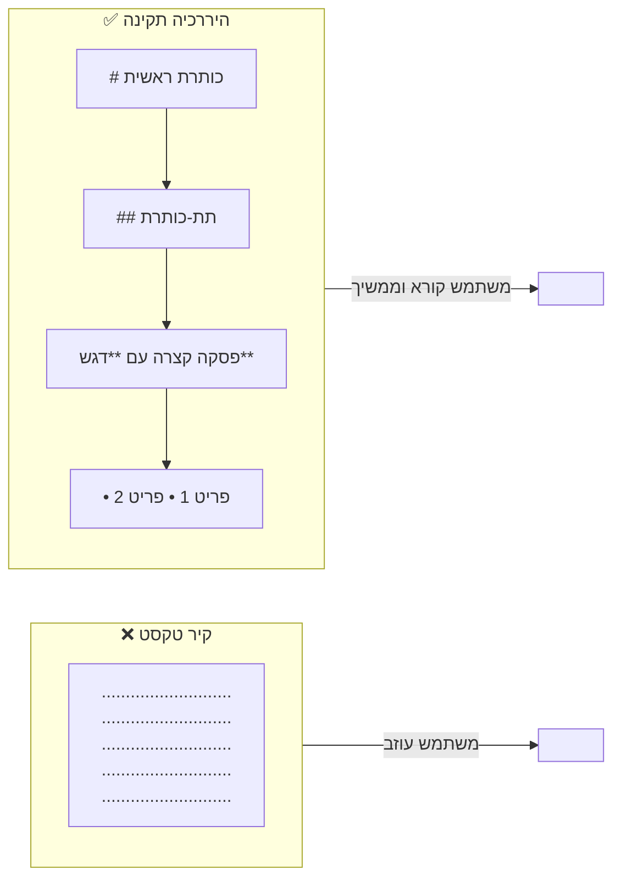

# טיפוגרפיה ושטח לבן — כלי הטקסט בשירות החוויה

## הטקסט הוא לא רק תוכן — הוא חוויה

דמיינו שני עמודים עם אותו תוכן מילולי מדויק. האחד: גוש אחד רצוף של טקסט, אותו גודל, אותו גופן, ללא כותרות, ללא ריווח. השני: כותרת ראשית גדולה, תת-כותרות, פסקאות קצרות, מילים מודגשות, ושטח לבן בין הקטעים.

מי יקרא את הראשון?

**טיפוגרפיה** היא לא "בחירת גופן" — היא האמנות של ארגון, עיצוב והיררכיה של טקסט כך שיהיה קריא, נגיש ומשדר מסר. בשיעור זה נלמד כיצד בחירות טיפוגרפיות ושימוש נכון בשטח לבן יכולים לקטוע את העומס הקוגניטיבי ולהנחות את המשתמש בדיוק לאן שאנחנו רוצים שיגיע.

---

## מטרות השיעור

בסיום שיעור זה תוכלו:

- להגדיר מהי טיפוגרפיה ומהם המרכיבים הטכניים שלה.
- לבנות היררכיה טיפוגרפית תקנית (כותרת ראשית, משנית, גוף).
- להסביר מהו "קיר טקסט" ומדוע הוא פוגע בחוויית הקריאה.
- להסביר את תפקיד השטח הלבן (White Space) ואת הסכנות בשימוש מופרז בו.

---

# טיפוגרפיה (Typography)

**טיפוגרפיה** היא האמנות והטכניקה של סידור ועיצוב טקסט — כך שיהיה נגיש וקריא, ועם זאת אסתטי ומשקף מסר מסוים.

מלאכה זו כוללת מגוון החלטות עיצוביות:

- **בחירת גופן (Font Selection)**: איזה typeface מתאים להקשר? (Serif לגיל מבוגר, Sans-serif לממשקים דיגיטליים מודרניים).
- **גודל האות (Size)**: גודל הכותרת, גוף הטקסט, הערות שוליים.
- **ריווח (Spacing)**: מרחק בין שורות (Line Height), בין מילים ובין אותיות (Letter Spacing).
- **אורך שורה (Line Length)**: שורה ארוכה מדי קשה לעין לעקוב; קצרה מדי — מתסכלת.
- **ארגון במרחב**: סידור הטקסט בתוך הפורמט, יצירת מבנה והיררכיה.
- **בניית שיטה טיפוגרפית**: יצירת שפה ויזואלית אחידה ועקבית לכל הממשק.

:::selfcheck
question: מה ההבדל בין גופן Serif לגופן Sans-serif ומתי עדיף כל אחד?
answer: Serif (כמו Times New Roman) הוא גופן עם "רגליים" קטנות בקצות האותיות — מסייע בקריאת טקסט ארוך בדפוס. Sans-serif (כמו Arial, Roboto) הוא ללא קישוטים — ברור יותר במסכים דיגיטליים, ולכן מועדף בממשקי משתמש.
:::

---

# היררכיה בטקסט (Typographic Hierarchy)

עיקרון יסוד: **לכל פסקת טקסט, לא משנה אם היא בעיתון או באתר אינטרנט, צריך להיות מבנה היררכי בסיסי שמחלק את הטקסט**.

בלוקים ארוכים ואחידים במראה של טקסט הם קשים לקריאה ואף **מרתיעים** — המשתמש רואה "קיר טקסט" וסוגר את הדף.

## המבנה ההיררכי הסטנדרטי

חישבו על מבנה כתבה בעיתון — קל מאוד לזכור אותו:

```
כותרת ראשית (H1)          ← גדולה, בולטת, מסכמת את הנושא
  ↓
כותרת משנית (H2)           ← מציגה תת-נושא או זווית משלימה
  ↓
תת-כותרת (H3)              ← מאפשרת מעברי נושא בתוך קטע
  ↓
גוף הטקסט (Body Text)      ← קריא, פסקאות קצרות, ריווח נאות
  ↓
הדגשות מודגשות (Bold)      ← שוברות מונוטוניות ומכוונות לנקודות מפתח
```

:::important
**בממשק דיגיטלי, מותר כותרת H1 אחת בלבד לכל עמוד** — לצורכי נגישות ו-SEO. כל שאר הכותרות מדורגות לפי רמה.
:::

:::example
**בדף מוצר של אתר מסחר:**
- H1: שם המוצר ("נעלי ריצה X-Pro")
- H2: "מה בקופסה" | "מפרט טכני" | "ביקורות"
- H3: "גודלים זמינים" | "צבעים" (תחת כל H2)
- גוף: תיאור, מחיר, כפתור רכישה
- Bold: "משלוח חינם לכל הזמנות מעל 200₪"
:::

## שבירת המונוטוניות

**הדגשה של משפט או פסקה חשובים** יוצרת שבירה של המונוטוניות ומסייעת לקורא להבין מה חשוב ובמה להתמקד.

כלים לשבירת מונוטוניות:
- **Bold** — מילות מפתח ורעיונות מרכזיים.
- *Italic* — מונחים, ציטוטים, הדגשה עדינה.
- רשימות תבליטים — לפירוט פריטים מרובים.
- תמונות, גרפים ותרשימים — "מנוחות" ויזואליות לעין.
- ציטוטים (Blockquote) — בולטים ומייצרים עניין.

:::diagram
השוואה בין "קיר טקסט" לבין טקסט עם היררכיה תקינה


:::

---

# שטח לבן (White Space)

**שטח לבן** הוא כל שטח שאינו מנוצל לצורך אלמנט ממשקי — רקע ריק בין אלמנטים, מרווחים בין פסקאות, שוליים בין תוכן לקצות המסך.

:::important
**המטרה של שטח לבן** היא להסיר את העומס הויזואלי מעיני המשתמש ובכך לסייע לו להתרכז רק במה שבאמת חשוב.
:::

## שטח לבן: הכמות הנכונה

שימוש בשטח לבן צריך להיעשות **בזהירות**:

| כמות | תוצאה |
|------|--------|
| **ללא שטח לבן** | ממשק עמוס, עייפות ויזואלית, קושי בניתוב |
| **שטח לבן מאוזן** | ממשק נקי, קריא, מוביל את עין המשתמש |
| **יותר מדי שטח לבן** | ממשק "נפוח", מחמיא פחות בנייד, תחושת ריקנות |

:::warning
**סכנת שטח לבן מופרז**: בממשקים סלולריים, שבהם השטח הזמין מוגבל, יותר מדי שטח לבן מוריד תוכן חשוב מתחת לקצה המסך (above the fold) ומחייב גלילה מיותרת.
:::

## דוגמת מופת: מודעת VW Think Small (שנות ה-50)

אחת הדוגמאות הידועות ביותר לשימוש מופתי בשטח לבן היא מודעת הפרסום "Think Small" של פולקסווגן מסוף שנות ה-50. בעולם שבו כל מודעת רכב הציגה תמונות ענק הממלאות את כל הדף, VW הציגה תמונה קטנה של חיפושית בפינה עליונה — ושמות הדף כמעט ריק.

> "It creates tension and brings this page alive, and it invites your eye to travel through it."

השטח הלבן יצר **מתח ויזואלי** שגרם לעין להישאר על הדף ולחקור אותו. זה עיקרון חזק: שטח לבן מאפשר לאלמנטים הקיימים "לנשום" ולבלוט.

---

# המילה כמרכיב ויזואלי

אחת התרגילות החשובות בטיפוגרפיה היא הבנה שניתן **לעצב מילה כך שהמראה החזותי יבטא את המשמעות**.

לדוגמה: המילה "שבור" יכולה להיות מעוצבת כך שהאותיות מפוצלות. המילה "כוח" יכולה להיות מוצגת בגופן עבה ובולט. המילה "רעש" יכולה להיות עם אותיות חופפות ומבולגנות.

:::example
**Design Word as Concept:**
- "כבד" — גופן עבה (Heavy), שחור, אותיות צפופות.
- "קל" — גופן דק (Light), אפור בהיר, ריווח רחב בין אותיות.
- "מהירות" — אותיות נוטות ימינה באיטליק, צבע כתום דינמי.

זהו תחום שבו עיצוב גרפי ורעיון מתמזגים לאחד.
:::

---

## סיכום השיעור

:::summary
טיפוגרפיה אינה רק בחירת גופן — היא מערכת שלמה של בחירות ארגוניות (גודל, ריווח, אורך שורה) ויזואליות (גופן, הדגשות, היררכיה) שמטרתן להפוך את הטקסט לנגיש, קריא ומנחה. היררכיה טיפוגרפית תקינה (H1 → H2 → H3 → גוף) מונעת "קירות טקסט" ומסייעת למשתמש להבין מה חשוב ומה משני. שטח לבן, כשמשתמשים בו בזהירות, הוא כלי עוצמתי שמנקה עומס ויזואלי ומוביל את עין הקורא לאן שרוצים — אך יותר מדי ממנו, במיוחד בנייד, עלול לנפח ממשקים ולחייב גלילה מיותרת.
:::

:::keypoints
- טיפוגרפיה: אמנות וטכניקה של ארגון טקסט לשם קריאוּת, נגישות ומסר.
- רכיבי טיפוגרפיה: גופן, גודל, ריווח, אורך שורה, היררכיה.
- היררכיה תקינה: H1 (אחת בלבד!) → H2 → H3 → גוף → הדגשות.
- "קיר טקסט" (בלוקים ארוכים ואחידים) הוא מרתיע ופוגע בחוויית הקריאה.
- שטח לבן: אלמנט עיצובי פעיל שמפחית עומס — אך שימוש מופרז מנפח ממשקים.
- בממשקים סלולריים: שטח לבן מופרז מוריד תוכן מתחת ל-Fold ומחייב גלילה.
:::

:::references
- מצגת "כללי עיצוב" — ד"ר משה לייבה (Design roles.pptx), שקופיות 21–26.
- סיכום הקורס "מנשק אדם-מחשב" (Copy of HCI.pdf), פרק Design Rules — Typography, עמ' 33–34.
- VW "Think Small" ad campaign (1959) — Doyle Dane Bernbach.
:::

:::quiz{ref="typography-and-whitespace-quiz"}
:::
