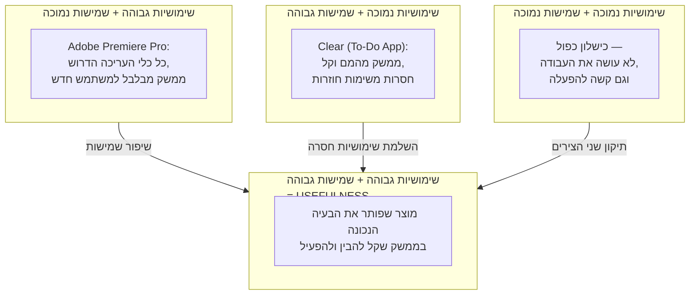

# שימושיות (Utility) מול שמישות (Usability): ההבדל שקובע הצלחה או כישלון

## מוצר מדהים שאף אחד לא מצליח להפעיל

דמיינו תוכנת עריכת וידאו מקצועית שיכולה תיאורטית לעשות הכול — צביעת צבע ברמת קולנוע, עריכה רב-ערוצית, אפקטים מתקדמים. כל יכולת שעורך וידאו מקצועי צריך, קיימת שם. ועכשיו דמיינו משתמש חדש שפותח את התוכנה בפעם הראשונה: מאות כפתורים, תפריטים מקוננים, וקיצורי מקלדת שאי אפשר לנחש. הוא סוגר את התוכנה מתוסכל, בלי לערוך שנייה אחת של וידאו.

עכשיו דמיינו את המקרה ההפוך: אפליקציית ניהול משימות עם עיצוב מהמם, מחוות נגיעה אלגנטיות, ותחושת שימוש שמחזיקה מכל מודרני. משתמשים מתאהבים בה תוך דקות. אבל אחרי שבוע הם מגלים שהיא לא תומכת במשימות חוזרות — "לשלם ארנונה כל חודש" חייבים להקליד מחדש כל פעם. תוך זמן קצר הם נוטשים אותה וחוזרים לרשימת המשימות המשעממת אך השלמה יותר.

שני המוצרים האלה נכשלים — אך משתי סיבות הפוכות לחלוטין. במקרה הראשון, יש למוצר **את כל היכולת הדרושה, אבל אף אחד לא מצליח להשתמש בה**. במקרה השני, המוצר **קל ונעים לשימוש, אבל הוא לא עושה את מה שהמשתמש באמת צריך**. היום נלמד להבחין בין שני הכשלים האלה, כי ההבחנה הזו היא אחד הכלים החשובים ביותר שיש לכם כדי לאבחן למה מוצר נכשל — ואיך למנוע מהמוצר שלכם ליפול לאותה מלכודת.

אחרי שתדעו לאבחן את שני הכשלים האלה במילים, השלב הבא בקורס הוא ללמוד כיצד בודקים אותם בפועל מול משתמשים אמיתיים — באמצעות [[usability-testing]].

---

## מטרות השיעור

בסיום שיעור זה תוכלו:

- להגדיר מהי [[usability]] (שמישות) ומהי שימושיות (Utility), ולהסביר כיצד שתיהן יחד מרכיבות את ה-Usefulness של מוצר.
- לצטט את הגדרת התקן ISO 9241-11 לשמישות ולהסביר את משמעות רכיביה.
- להסביר את ההבחנה של יעקב נילסן בין "האם המערכת עושה את העבודה הנדרשת" לבין "האם ניתן להבין ולהפעיל אותה בפועל".
- לזהות ולסווג מוצר נתון כבעל שימושיות גבוהה/נמוכה ושמישות גבוהה/נמוכה, בהתבסס על תיאור מקרה.
- לנתח מדוע כישלון בממד אחד בלבד — שימושיות או שמישות — מספיק כדי להכשיל את המוצר כולו, גם כאשר הממד השני מצוין.

---

# הגדרת היסוד: שני צירים, לא ציר אחד

הטעות הנפוצה ביותר של מעצבים מתחילים היא לחשוב על "האם המוצר טוב" כעל שאלה אחת. בפועל, מדובר בשתי שאלות נפרדות לחלוטין, שכל אחת מהן יכולה להיכשל בפני עצמה.

## שימושיות (Utility) — האם המערכת עושה את העבודה הנכונה?

**שימושיות (Utility)** בודקת שאלה אחת בלבד: **האם קיימת במערכת הפונקציונליות הנדרשת כדי לפתור את הבעיה של המשתמש?** זו שאלה של *מה* המוצר עושה — לא איך זה מרגיש להשתמש בו. מוצר עם שימושיות גבוהה נותן למשתמש את היכולות שהוא באמת צריך, גם אם הדרך להגיע אליהן מסורבלת.

## שמישות (Usability) — האם אנשים מסוגלים להפעיל אותה בפועל?

**שמישות ([[usability]] / Usability)** בודקת שאלה שונה לגמרי: **בהינתן שהפונקציונליות קיימת, האם המשתמשים מצליחים להבין איך להפעיל אותה, ביעילות ובשביעות רצון?** זו שאלה של *איך* — כמה מאמץ קוגניטיבי, כמה טעויות, וכמה תסכול נדרשים כדי להגיע לאותה יכולת.

התקן הבינלאומי ISO 9241-11 מגדיר את השמישות באופן פורמלי:

> "עד כמה משתמשים מסוימים יכולים להשתמש במוצר כדי להשיג מטרות מסוימות באפקטיביות, ביעילות, ולשביעות רצונם בהקשר שימוש מסוים" (ISO 9241-11).

שימו לב שההגדרה התקנית *מניחה* שהיכולת כבר קיימת — היא בוחנת רק את איכות ההפעלה שלה. זו בדיוק הסיבה שהיא לא מכסה את שאלת השימושיות: תקן ISO יכול לתאר ממשק נגיש, יעיל ומספק להפליא — לכלי שכלל לא פותר בעיה אמיתית של אף אחד.

## Usefulness = שימושיות + שמישות

יעקב נילסן, מהחוקרים המובילים בתחום, ניסח את ההבחנה הזו בצורה שקובעים אותה כל תלמיד וכל מעצב:

- **שימושיות (Utility)** — האם זה פותר צורך? האם זה עושה את העבודה?
- **שמישות (Usability)** — האם אנשים מסוגלים להבין איך להשתמש בזה?

יחד, שני הרכיבים האלה מרכיבים את **Usefulness** — הערך הכולל שהמוצר מספק בפועל למשתמשים שלו. מוצר לא יכול להיחשב שימושי-בפועל (Useful) אם חסר לו אחד מהרכיבים, ללא קשר לכמה הרכיב השני מצוין.

:::selfcheck
question: בלי לגלול למעלה — חשבו על מכשיר או אפליקציה שאתם משתמשים בהם וכמעט ולא הצלחתם להבין איך להפעיל בפעם הראשונה, למרות שידעתם שהיכולת שחיפשתם קיימת שם איפשהו. איזה ציר נכשל אצלכם באותו רגע — Utility או Usability — ולמה?
answer: זהו כשל ב-Usability (שמישות), לא ב-Utility. הרי ידעתם שהיכולת קיימת (כלומר ה-Utility היה תקין) — הבעיה הייתה שלא הצלחתם להבין איך לגשת אליה או להפעיל אותה בפועל. אם היכולת עצמה הייתה חסרה מלכתחילה, זה היה כשל Utility, לא משנה כמה קל היה הממשק.
:::

---

# שני כיווני כישלון — דוגמאות מהעולם האמיתי

כדי להפנים את ההבחנה, בואו נבחן שני מוצרים אמיתיים שממחישים כל אחד מכיווני הכישלון בצורה טהורה.

:::example
**שימושיות גבוהה + שמישות נמוכה — Adobe Premiere Pro**

Adobe Premiere Pro היא אחת מתוכנות עריכת הווידאו המקצועיות המובילות בעולם. מבחינת שימושיות (Utility), אין כמעט יכולת שעורך וידאו מקצועי צריך שלא קיימת שם: עריכה רב-ערוצית, תיקון צבע ברמת סטודיו, שילוב אפקטים, ייצוא לכל פורמט אפשרי. הפונקציונליות עצומה ומדויקת.

אבל השמישות (Usability) של הממשק היא בעייתית מאוד עבור משתמש חדש: מאות כלים בתפריטים מקוננים, פאנלים שניתן לסדר מחדש בעשרות דרכים, וקיצורי מקלדת שאין דרך לנחש. משתמש שמעולם לא עבד עם התוכנה עלול לבזבז שעות רק כדי למצוא איך לחתוך קליפ בודד. התוצאה: משתמשים רבים נוטשים את Premiere Pro לטובת כלים חלשים משמעותית ביכולת שלהם, פשוט כי הם לא מצליחים להבין איך להפעיל את הכלי החזק יותר.
:::

:::example
**שמישות גבוהה + שימושיות נמוכה — Clear (אפליקציית ניהול משימות)**

Clear הייתה אפליקציית To-Do מהפכנית בזמנה: ממשק מינימליסטי מדהים, מחוות נגיעה אלגנטיות למחיקה ולסידור מחדש של פריטים, וללא שום כפתור מיותר על המסך. מבחינת שמישות (Usability) — קשה למצוא דוגמה טובה יותר: משתמשים חדשים הבינו איך להפעיל אותה תוך שניות, ללא הדרכה.

הבעיה הייתה בציר האחר לגמרי: שימושיות (Utility) נמוכה. לאפליקציה חסרה יכולת בסיסית שכל אדם צריך בניהול משימות אמיתי — תמיכה במשימות חוזרות ("לשלם ארנונה כל 1 לחודש", "להוציא זבל כל יום שלישי"). משתמש שהיה צריך את היכולת הזו נאלץ להקליד את אותה המשימה מחדש כל פעם, או לוותר ולעבור לכלי מסורבל יותר אך שלם יותר מבחינה פונקציונלית. ממשק מושלם, שלא פתר את הבעיה שהמשתמש בא לפתור.
:::

שימו לב: בשני המקרים, **המוצר נכשל**. לא בגלל שהוא "רע" באופן כללי — אלא בגלל שהוא נכשל בציר ספציפי אחד, בעוד הציר השני היה חזק מאוד. זו בדיוק הסיבה שחשוב להפריד בין שתי השאלות ולא לשפוט מוצר על "טוב" או "רע" גורף.

:::diagram
מטריצת שימושיות (Utility) מול שמישות (Usability): רק מוצר שחזק בשני הצירים גם יחד מגיע ל-Usefulness מלא. Adobe Premiere Pro ממוקם בשימושיות גבוהה עם שמישות נמוכה; Clear ממוקם בשמישות גבוהה עם שימושיות נמוכה; מוצר שנכשל בשני הצירים גם יחד; ומוצר שמשלב את שניהם (למשל מנוע חיפוש עם תיבת טקסט אחת בלבד שמחזירה בדיוק את מה שרציתם) ממוקם ברביע המנצח.

:::

:::selfcheck
question: מערכת הזמנת תורים ברשות ממשלתית מציעה בדיוק את כל השירותים שאזרח צריך (חידוש דרכון, שינוי כתובת, בקשת אישורים) — אבל כדי למצוא את הטופס הנכון צריך לעבור דרך שבעה תפריטים שונים בלי חיפוש. איזה ציר נכשל כאן, ואיזה ציר תקין?
answer: השימושיות (Utility) תקינה — כל השירותים הדרושים אכן קיימים במערכת. השמישות (Usability) נכשלת — המשתמשים לא מצליחים למצוא ולהפעיל בקלות את מה שכבר קיים, בגלל ניווט מסורבל. זהו בדיוק אותו דפוס כשל כמו Adobe Premiere Pro: יכולת גבוהה, נגישות נמוכה.
:::

---

# למה כישלון בציר אחד מספיק כדי להכשיל את כל המוצר

זהו הרעיון הקריטי ביותר בשיעור הזה, וזה בדיוק מה שהופך את ההבחנה הזו לשימושית באבחון מוצרים: **Usefulness אינה סכום של שני הרכיבים — היא תלויה בשניהם בו-זמנית**. אם אחד מהם שואף לאפס, כל המוצר קורס יחד איתו, לא משנה כמה גבוה הרכיב השני.

חשבו על זה כך: Utility גבוה בלי Usability אומר שהיכולת קיימת, אבל אף אחד לא מגיע אליה — מבחינת המשתמש, זה כאילו היא לא קיימת בכלל. Usability גבוה בלי Utility אומר שקל מאוד להפעיל משהו — שלא פותר את הבעיה שלשמה המשתמש הגיע מלכתחילה. בשני המקרים, התוצאה הסופית עבור המשתמש זהה: **הוא לא הצליח להשיג את המטרה שלו**. וזו בדיוק המטרה שה-Usefulness אמור למדוד.

זו הסיבה שאי אפשר "לפצות" על כישלון בציר אחד באמצעות הצטיינות בציר השני. תוכנה עם 200 פיצ'רים חדשניים שאף אחד לא מוצא לא שווה יותר מתוכנה עם 5 פיצ'רים חדשניים שכולם מוצאים ומשתמשים בהם. עיצוב מהמם לכלי שפותר בעיה שלא קיימת לא שווה יותר מעיצוב בינוני לכלי שפותר בעיה אמיתית וקריטית.

:::important
**המסקנה המעשית עבורכם כמעצבים**: לפני שאתם משקיעים משאבים בשיפור השמישות (חוויית משתמש, ניווט, עיצוב) — ודאו קודם שהמוצר שלכם בכלל פותר בעיה אמיתית (שימושיות). ולפני שאתם מוסיפים עוד ועוד יכולות (שימושיות) — ודאו שהמשתמשים בכלל מצליחים להשתמש ביכולות הקיימות (שמישות). שני התהליכים חייבים להתקדם ביחד.
:::

:::warning
**הבלבול הנפוץ ביותר בנושא**: סטודנטים רבים לומדים על שמישות (Usability) ומסיקים בטעות שזהו הדבר היחיד שחשוב בעיצוב — "אם הממשק נוח ואינטואיטיבי, המוצר יצליח". זו טעות מסוכנת. ממשק מושלם, נגיש ומהנה לשימוש עבור פיצ'ר שאף אחד לא צריך — עדיין מוצר כושל. שמישות גבוהה בלי שימושיות היא בזבוז משאבי עיצוב על בעיה שגויה. תמיד בדקו את שני הצירים.
:::

:::selfcheck
question: חברת סטארט-אפ בונה אפליקציה לניהול תקציב אישי. הצוות משקיע חודשים בליטוש האנימציות, המחוות והעיצוב — אך לא בודק מעולם אם המשתמשים בכלל צריכים את סוג התקציב שהאפליקציה מציעה (למשל: תקצוב יומי בלבד, בלי תמיכה בהוצאות משתנות חודשיות). לפי המסגרת שלמדנו, מה הסיכון המרכזי כאן, וכיצד היית מייעצים לצוות לפעול?
answer: הסיכון הוא שהצוות משקיע את כל המשאבים בשמישות (Usability) מבלי לוודא קודם שיש שימושיות (Utility) — כלומר שהאפליקציה בכלל פותרת את בעיית התקצוב האמיתית של המשתמשים. גם אם העיצוב יהיה מבריק, אם חסרה יכולת קריטית (כמו תמיכה בהוצאות משתנות), משתמשים ינטשו. הייעוץ: לעצור ולוודא תחילה עם משתמשים אמיתיים (למשל באמצעות אימות קונספט) שהפונקציונליות המוצעת אכן פותרת את הצורך שלהם, ורק אז להשקיע בליטוש חוויית השימוש.
:::

---

## סיכום השיעור

:::summary
לאחר שהשלמתם את תהליך העיצוב הממוקד-אדם ([[human-centered-design]]) ובחנתם את הקונספט מול משתמשים, השלב הבא הוא להעריך באופן שיטתי את המערכת שנבנתה — וזה בדיוק מה שההבחנה בין Utility ל-Usability מאפשרת לכם לעשות. Usefulness — הערך האמיתי שמוצר מספק — נבנה משני רכיבים בלתי-תלויים: **שימושיות (Utility)**, שבודקת האם קיימת הפונקציונליות הנדרשת כדי לפתור את בעיית המשתמש, ו**שמישות ([[usability]] / Usability)**, שבודקת האם המשתמשים מצליחים להבין ולהפעיל את אותה פונקציונליות באפקטיביות, ביעילות ובשביעות רצון — כפי שמגדיר גם התקן ISO 9241-11. Adobe Premiere Pro ממחישה שימושיות גבוהה עם שמישות נמוכה; Clear ממחישה שמישות גבוהה עם שימושיות נמוכה. בשני המקרים המוצר נכשל, כי כישלון בציר אחד בלבד מספיק כדי להפיל את כל חוויית המשתמש — ללא אפשרות "לפצות" באמצעות הצטיינות בציר השני.
:::

:::keypoints
- שימושיות (Utility) עונה על "מה" — האם קיימת הפונקציונליות הנכונה כדי לפתור את בעיית המשתמש.
- שמישות (Usability) עונה על "איך" — האם ניתן להבין ולהפעיל את אותה פונקציונליות באפקטיביות, ביעילות ובשביעות רצון (ISO 9241-11).
- Usefulness = Utility + Usability — הערך הכולל של המוצר תלוי בשני הרכיבים בו-זמנית, לא בסכומם.
- Adobe Premiere Pro: שימושיות גבוהה, שמישות נמוכה — יכולת עצומה שקשה מאוד להגיע אליה.
- Clear (To-Do App): שמישות גבוהה, שימושיות נמוכה — ממשק מהמם שחסרה בו יכולת בסיסית (משימות חוזרות).
- כישלון בציר אחד מספיק כדי להכשיל את המוצר כולו — גם אם הציר השני מושלם.
:::

:::references
- מצגות הקורס "שמישות" — ד"ר משה לייבה (Usability.pptx, Usability definitions.pptx).
- ISO 9241-11:2018 — Ergonomics of human-system interaction — Usability: Definitions and concepts.
- Jakob Nielsen, "Usability 101: Introduction to Usability" — Nielsen Norman Group, על ההבחנה בין Utility ל-Usability בתוך Usefulness.
:::

:::quiz{ref="utility-vs-usability-quiz"}
:::
