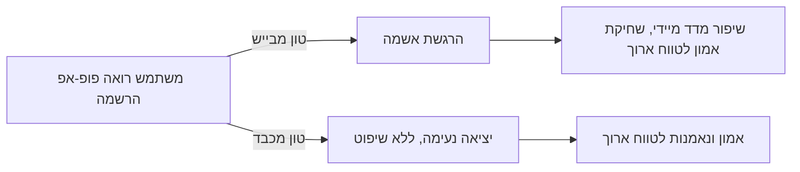
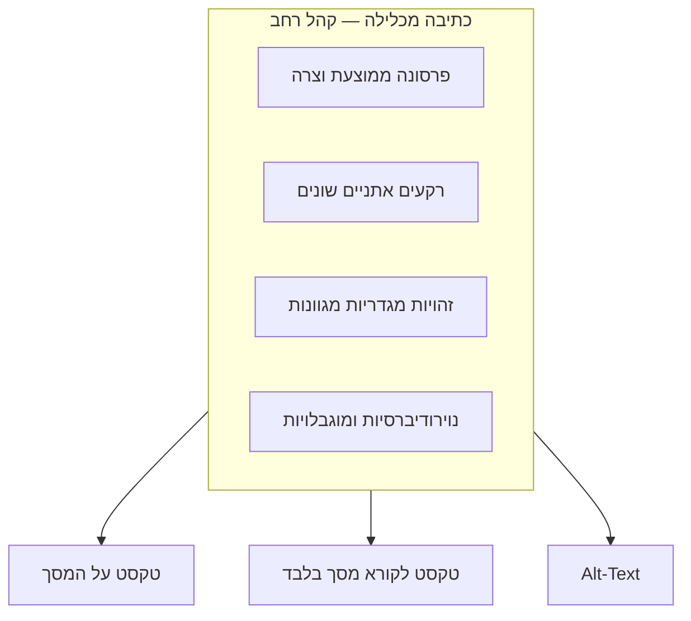

# טון וכתיבה מכלילה: מיקרו-קופי שלא מבייש ולא מדיר

## מי בעצם קורא את המילים שלכם?

בשני השיעורים הקודמים ראינו ש[[microcopy|מיקרו-קופי]] מנחה את המשתמש לאורך מסע הפעולה, ושהוא צריך [[plain-language|לענות מראש על חששות ולהיכתב בשפה נקייה]]. אבל יש שאלה נוספת שכל מילה בממשק חייבת לעמוד בה: **האם המשתמש הספציפי שקורא את זה עכשיו מרגיש שהטקסט הזה נכתב עבורו?**

התשובה תלויה בשני דברים: איזה **טון** אתם בוחרים כלפי המשתמש — האם הוא מכבד אותו או מנסה לביישו לפעולה — ואיזה **קהל** אתם מדמיינים כשאתם כותבים. רוב ה[[persona|פרסונות]] שנבנות בתחילת פרויקט הן צרות ומייצגות רק פרופיל אחד ממוצע. בשיעור הזה נלמד למה כדאי להרחיב את הכתיבה שלכם הרבה מעבר לפרסונה הצרה הזו, ואיך לעשות זאת הלכה למעשה.

---

## מטרות השיעור

בסיום שיעור זה תוכלו:

- **להגדיר (Remember)** מהי [[inclusive-writing|כתיבה מכלילה]] ומהם שלושת ערוצי הכתיבה לנגישות: טקסט על המסך, טקסט לקורא מסך בלבד ו-Alt-Text.
- **להסביר (Understand)** מדוע טון שמבייש משתמשים כדי להניע אותם לפעולה פוגע באמון, גם כשהוא משפר המרות בטווח הקצר.
- **לזהות (Understand)** שימוש בהתייחסויות תרבותיות, מטבעות לשון ואידיומים שמדירים חלק מהמשתמשים.
- **ליישם (Apply)** את עקרון ה-Alt-Text כדי לכתוב תיאור תמונה נגיש ומדויק.
- **לנתח (Analyze)** כפתור סירוב נתון ולהסביר מדוע הוא פוגע במותג בטווח הארוך, גם אם הוא "עובד" בטווח הקצר.

---

# בני אדם רוצים גם להשתייך וגם להיות ייחודיים

**הגדרה:** משתמשים רוצים להרגיש חלק מקבוצה, אך גם מיוחדים בתוכה — ורוצים להאמין שהם טובים כפי שהם, לא ש"משהו חסר להם" שרק המוצר שלכם יכול לתקן.

זה משליך ישירות על טון הכתיבה. יש מותגים שבוחרים לגרום למשתמש להרגיש שבלי המוצר שלהם הוא לא מספיק חכם, לא מספיק יפה, או לא אחראי מספיק. הטכניקה הזו ידועה בשם **Confirmshaming** (הלבשת אשמה על סירוב) — ניסוח כפתור סירוב שגורם למשתמש להרגיש רע על עצם ההחלטה לסרב.

:::example
המונח **Confirmshaming** נטבע על ידי חוקר ה-UX **הארי בריניול (Harry Brignull)** — מי שטבע גם את המונח הרחב יותר "Dark Patterns" (תבניות עיצוב מטעות). התופעה תועדה בעשרות פופ-אפים של הרשמה לניוזלטר ברחבי האינטרנט: כפתור אישור גדול וצבעוני ("כן, שלחו לי הנחות!") לצד כפתור סירוב קטן ואפור שכתוב עליו נוסח כמו "לא תודה, אני מעדיף/ה לשלם מחיר מלא." הניסוח הזה גורם למשתמש להרגיש טיפש או פזרן על עצם הבחירה לסרב — במקום פשוט לכתוב "לא, תודה."
:::

זה עשוי לשפר את שיעור ההרשמה בטווח הקצר, אבל פוגע ביחסים עם המשתמש בטווח הארוך: אם אתם אומרים לו שהוא לא מספיק טוב, הוא פשוט לא ירצה להיות איתכם. הגישה הנכונה היא ההפך: לומר למשתמשים שהם מגניבים כפי שהם, אבל שהחיים שלהם יכולים להיות קצת יותר נוחים או יפים עם המוצר או השירות שלכם — לבנות אמון, לא להשתמש בבושה כמנוף.

:::warning
טון שמבייש עלול "לעבוד" מבחינת מדדים מיידיים (יותר הרשמות, יותר לחיצות) ולכן קל לפספס את הנזק שלו. אבל המדד האמיתי הוא [[usability|שביעות רצון]] ואמון לאורך זמן — ושם הטון הזה מפסיד בגדול.
:::

:::diagram
תרשים המראה נקודת הכרעה יחידה (משתמש שרואה פופ-אפ הרשמה) שמתפצלת לשני מסלולים: מסלול "טון מבייש" מוביל להרגשת אשמה מיידית, שיפור קצר-טווח במדדים, אך שחיקת אמון לטווח ארוך; מסלול "טון מכבד" מוביל ליציאה נעימה מהפופ-אפ, ולנאמנות ואמון גבוהים יותר לטווח ארוך.

:::

:::selfcheck
question: צוות שיווק מציע להוסיף לכפתור הסירוב בפופ-אפ הרשמה לניוזלטר את הניסוח "לא, אני לא רוצה לחסוך כסף". מה הבעיה בהצעה הזו, ומה הייתם מציעים במקום?
answer: זהו ניסוח Confirmshaming קלאסי — הוא גורם למשתמש להרגיש רע (טיפש, מבזבז כסף) על עצם ההחלטה לסרב, כדי לשכנע אותו להירשם. ניסוח מכבד יותר: כפתור סירוב פשוט עם הטקסט "לא תודה", שנותן למשתמש לצאת מהפופ-אפ בלי לפגוע בתחושת העצמי שלו.
:::

---

# כתיבה מכלילה: מעבר לפרסונה הצרה

**הגדרה:** [[inclusive-writing|כתיבה מכלילה]] היא כתיבה שמביאה בחשבון מגוון רחב של משתמשים — רקעים אתניים שונים, זהויות מגדריות מגוונות (כולל לא-בינאריות), נוירודיברסיות, מוגבלויות ומצבי בריאות נפשית — ולא רק את הפרסונה הממוצעת והצרה שעומדת לרוב במרכז תהליך העיצוב.

**שתי דרכים מעשיות להימנע מהדרה:**

1. **הימנעות מהתייחסויות תרבותיות, מטבעות לשון ואידיומים.** ביטוי כמו "זה כבר לא הקטע שלי" או התייחסות לחג מסוים כמובן מאליו, מובן מיד למי שגדל בתרבות מסוימת — אבל מבלבל ולעיתים מרחיק כל מי שלא חלק ממנה. אידיומים ומטבעות לשון קשורים לרוב למעמד, אתניות או תרבות ספציפית.
2. **בניית צוותי כתיבה מגוונים.** צוות שמשקף את הקהל של המוצר סביר יותר לזהות ניסוח מדיר לפני שהמוצר יוצא לעולם, ולא אחרי שמשתמשים דיווחו עליו.

:::example
אתר בינלאומי שמנוסח כ"תנו לזה להתבשל כמו יין טוב" (אידיום שמניח היכרות עם תרבות יין מערבית) מבלבל משתמשים ממדינות או תרבויות שבהן הביטוי לא קיים כלל. ניסוח ישיר יותר, כמו "תנו לתהליך זמן להסתיים", מעביר בדיוק את אותו מסר בלי להסתמך על היכרות תרבותית ספציפית.
:::

:::important
כתיבה מכלילה אינה "לכתוב לכולם באותה מידה" — היא לכתוב כך שאף קבוצה משתמשים לא מרגישה מודרת או מבולבלת שלא לצורך. זה עקרון שונה מ[[plain-language|שפה נקייה]] (שמתמקדת בקלות הבנה), אך משלים אותו: טקסט קצר ופשוט שמסתמך על אידיום תרבותי עדיין יכול להדיר, למרות שהוא "נקי" מבחינת אורך.
:::

:::selfcheck
question: הודעת מערכת בינלאומית כתובה כ"התכונה הזו עדיין ירוקה" (כלומר חדשה ולא בשלה). מדוע ניסוח כזה בעייתי מבחינת כתיבה מכלילה, גם אם כל מילה בו קלה ופשוטה בפני עצמה?
answer: הבעיה אינה קושי לשוני של המילים עצמן (הן פשוטות), אלא שהמשמעות "ירוק = חדש/לא בשל" היא מוסכמה תרבותית-לשונית ספציפית שלא קיימת בכל שפה או תרבות. משתמש ששולט מצוין בשפה עדיין עלול לא להבין את הביטוי, כי המשמעות שלו לא נובעת מהמילים אלא מהקשר תרבותי שהוא לא בהכרח חלק ממנו — בדיוק כמו אידיום.
:::

---

# כתיבה לנגישות: שלושה ערוצי טקסט

**הגדרה:** כתיבת UX לנגישות מתבצעת בשלושה ערוצים משלימים: **טקסט על המסך** (הטקסט הרגיל שכל המשתמשים רואים), **טקסט לקורא מסך בלבד** (Screen-Reader-Only Text — טקסט נסתר חזותית שמסייע רק למי שמשתמש בטכנולוגיה מסייעת לניווט), ו-**Alt-Text** (טקסט חלופי המתאר תמונות ואייקונים).

**טקסט על המסך** צריך לשרת גם רואים וגם לא-רואים בו-זמנית — לרוב באמצעות שפה נקייה ומבנה ברור. **טקסט לקורא מסך בלבד** נוסף כשיש צורך לתת הקשר ניווטי (למשל "דלג לתוכן הראשי") שלא נחוץ למשתמש רואה. **Alt-Text** קריטי כי הוא מספק הקשר למי שלא יכול לראות תמונה — מה היא מציגה, ולאן היא מובילה אם היא לחיצה — ומוצג גם אם התמונה נכשלת בטעינה.

:::example
בעמודי מוצר של קמעונאיות אונליין כמו **ASOS** או **Zalando**, הנוהג הרצוי הוא Alt-Text מתאר כמו "נעלי ריצה כחולות עם סוליה לבנה, מוצגות מזווית צד" — בדיוק המידע שרואה מקבל במבט אחד. Alt-Text גרוע יסתפק ב"תמונה1.jpg" — ולא ייתן שום מידע למשתמש שמסתמך על קורא מסך.
:::

:::warning
לא כל תמונה זקוקה ל-Alt-Text מתאר. תמונה **דקורטיבית בלבד** (למשל רקע גרפי ללא משמעות) צריכה Alt-Text ריק בכוונה, כדי שקורא המסך ידלג עליה ולא יקריא תיאור מיותר שמפריע לזרימת המידע החשוב.
:::

:::diagram
תרשים המראה שני מעגלים: מעגל פנימי קטן בשם "פרסונה ממוצעת וצרה", ומעגל חיצוני רחב בשם "כתיבה מכלילה" שמכיל אותו ומוסיף קבוצות נוספות — רקעים אתניים שונים, זהויות מגדריות מגוונות, נוירודיברסיות, מוגבלויות. לצד המעגל החיצוני מוצגים שלושה תיוגים לערוצי כתיבת נגישות: "טקסט על המסך", "טקסט לקורא מסך בלבד", "Alt-Text" — כל אחד עם חץ קטן למשתמש שהוא משרת.

:::

:::selfcheck
question: מדוע Alt-Text נחשב לחלק מ"כתיבת UX" ולא רק לפרט טכני שמפתחים ממלאים?
answer: כי כתיבת Alt-Text טובה דורשת אותה מיומנות של תמצות ובחירת מילים מדויקת שנדרשת בכל מיקרו-קופי אחר — התיאור חייב להעביר בדיוק את המידע הרלוונטי (מה מוצג, מה קורה בלחיצה) במינימום מילים, בדיוק כמו כיתוב כפתור.
:::

---

## עקרונות מפתח

### עיקרון 1: אל תבייש כדי לשכנע

**העיקרון:** לעולם אל תגרמו למשתמש להרגיש רע על עצמו כדי לשכנע אותו לפעול או להישאר.

**למה זה חשוב:** בושה עשויה לשפר מדד מיידי (הרשמה, המרה), אך פוגעת באמון ובנאמנות המשתמש לטווח הארוך.

**איך ליישם:**
- ❌ אל תכתבו: "לא, אני לא רוצה לחסוך כסף" ככפתור סירוב
- ✅ כן כתבו: "לא תודה" — סירוב פשוט וללא שיפוטיות

**תוצאה של הפרה:** משתמשים מרגישים שהמותג מנצל אותם רגשית, ומאבדים אמון גם אם נרשמו בפועל.

### עיקרון 2: כתבו לקהל רחב מהפרסונה הממוצעת

**העיקרון:** התייחסו במפורש לצרכים של משתמשים ממגוון רקעים, זהויות ויכולות — לא רק לפרסונה הצרה שבמרכז המחקר.

**למה זה חשוב:** מוצר שכתוב רק לפרסונה אחת מרחיק בפועל חלק גדול מהמשתמשים הפוטנציאליים שלו, גם אם הם מסוגלים טכנית להשתמש בו.

**איך ליישם:** הימנעו מאידיומים ומהתייחסויות תרבותיות ספציפיות; הביאו קולות מגוונים לתוך תהליך הכתיבה והביקורת.

**תוצאה של הפרה:** משתמשים מקבוצות שלא נלקחו בחשבון מרגישים מודרים או מבולבלים, ונוטשים את המוצר.

### עיקרון 3: כתבו נגישות בשלושת הערוצים

**העיקרון:** ודאו כיסוי בשלושת ערוצי הטקסט — מסך, קורא מסך בלבד ו-Alt-Text — ולא רק בטקסט הגלוי לרואים.

**למה זה חשוב:** משתמש שמסתמך על קורא מסך חווה ממשק שונה לגמרי ממשתמש רואה, ואם ערוץ אחד חסר, הוא פשוט מפספס מידע קריטי.

**איך ליישם:** בכל תמונה משמעותית, שאלו "מה הרואה מבין ממנה שהלא-רואה צריך לדעת?" וכתבו Alt-Text שעונה בדיוק על זה.

**תוצאה של הפרה:** משתמשים המסתמכים על טכנולוגיה מסייעת נתקלים בפערי מידע שמונעים מהם להשלים משימות בסיסיות.

---

## דפוסי בחינה נפוצים

### דפוס 1: זיהוי — Confirmshaming

**סוג:** רב-ברירה, זיהוי

**מה זה בוחן:** האם אתם מזהים ניסוח שמבייש משתמש כדי להניע אותו לפעולה.

**שאלת דוגמה:** איזה מהניסוחים הבאים לכפתור סירוב הוא דוגמה ל-Confirmshaming?

A. "לא תודה"
B. "לא, אני מעדיף/ה לשלם יותר ולפספס הנחות"
C. "ביטול"
D. "חזרה למסך הקודם"

**תשובה נכונה:** B

**הסבר:** הניסוח "לא, אני מעדיף/ה לשלם יותר ולפספס הנחות" מנוסח כך שהמשתמש נאלץ להצהיר על עצמו כמישהו לא נבון או מבזבז כסף כדי לסרב — זו בדיוק הטכניקה של Confirmshaming. שאר האפשרויות הן ניסוחי סירוב נייטרליים שאינם מטילים אשמה על המשתמש.

### דפוס 2: ניתוח — טון ואמון לטווח ארוך

**סוג:** תרחיש, ניתוח

**מה זה בוחן:** האם אתם מבינים את המתח בין שיפור מדדים מיידיים לפגיעה באמון לטווח ארוך.

**תרחיש:** לאחר שינוי כפתור סירוב לניסוח שמבייש משתמשים, אחוז ההרשמות לניוזלטר של אתר עלה ב-15%. צוות השיווק שמח מהתוצאה.

**שאלה:** מה החיסרון המרכזי שהצוות עלול לפספס?

A. אין חיסרון — עלייה בהרשמות היא תמיד הצלחה מוחלטת
B. הטון המבייש עשוי לשפר מדד מיידי, אך פוגע באמון ובנאמנות המשתמש למותג לטווח הארוך
C. הבעיה היחידה היא שהניסוח ארוך מדי
D. יש להחליף את הכפתור בתמונה במקום בטקסט

**תשובה נכונה:** B

**הסבר:** בדיוק כפי שנלמד, טון שמבייש עשוי "לעבוד" במדד מיידי כמו שיעור הרשמה, אבל הוא בונה חוויה שמערערת אמון ופוגעת בקשר ארוך הטווח עם המשתמש. תיאור A מתעלם לגמרי מהעלות הנסתרת. תיאורים C ו-D אינם מזהים את הבעיה האמיתית, שהיא הטון עצמו ולא האורך או המדיום.

### דפוס 3: יישום — הימנעות מאידיומים

**סוג:** רב-ברירה, יישום

**מה זה בוחן:** האם אתם יודעים לזהות ניסוח שנשען על התייחסות תרבותית מדירה ולהחליפו בניסוח מכליל.

**שאלת דוגמה:** הודעת מערכת בינלאומית מנוסחת כ"זה עוד לא הקטע שלנו כרגע — תנסו שוב מאוחר יותר". איזו חלופה מכלילה יותר?

A. "התכונה הזו עדיין לא זמינה — נסו שוב מאוחר יותר"
B. "אין לנו את הראש לזה כרגע"
C. "זה לא הפרק שלנו היום"
D. השארת הניסוח המקורי, כי הוא יצירתי ומעורר עניין

**תשובה נכונה:** A

**הסבר:** "התכונה הזו עדיין לא זמינה — נסו שוב מאוחר יותר" מעביר את אותו מידע במדויק, בלי להסתמך על ביטוי סלנג תרבותי-ספציפי שעלול לבלבל משתמשים ממדינות או רקעים אחרים. אפשרויות B ו-C נשענות על ביטויים לא-פורמליים דומים לניסוח המקורי הבעייתי. אפשרות D מתעלמת מהבעיה שהניסוח המקורי מדיר משתמשים.

### דפוס 4: יישום — כתיבת Alt-Text

**סוג:** תרחיש, יישום

**מה זה בוחן:** האם אתם יודעים לכתוב תיאור Alt-Text תפקודי ומדויק.

**תרחיש:** תמונת מוצר בחנות אונליין מציגה תיק גב שחור עם רצועה כתומה, המשמש קישור לעמוד המוצר.

**שאלה:** איזה Alt-Text הוא הטוב ביותר עבור התמונה הזו?

A. "image_042.jpg"
B. "תמונה יפה של מוצר"
C. "תיק גב שחור עם רצועה כתומה — מעבר לעמוד המוצר"
D. השארת שדה ה-Alt-Text ריק

**תשובה נכונה:** C

**הסבר:** התיאור "תיק גב שחור עם רצועה כתומה — מעבר לעמוד המוצר" מעביר בדיוק את המידע שמשתמש רואה מקבל במבט אחד: מה מוצג ולאן הקישור מוביל. אפשרות A היא שם קובץ חסר משמעות. אפשרות B כללית מדי ולא מתארת דבר. אפשרות D מתאימה רק לתמונות דקורטיביות גרידא, לא לתמונת מוצר משמעותית שמשמשת קישור.

---

## סיכום השיעור

:::summary
מיקרו-קופי טוב אינו רק ברור — הוא גם מכבד. טון שמבייש משתמש כדי לשכנע אותו לפעול (Confirmshaming) עשוי לשפר מדד מיידי, אבל פוגע באמון ובנאמנות לטווח הארוך; הגישה הנכונה היא לומר למשתמש שהוא בסדר גמור כפי שהוא. [[inclusive-writing|כתיבה מכלילה]] מרחיבה את הכתיבה מעבר לפרסונה הצרה, על ידי הימנעות מאידיומים והתייחסויות תרבותיות ובניית צוותי כתיבה מגוונים. וכתיבה ל[[accessibility|נגישות]] מתבצעת בשלושה ערוצים משלימים: טקסט על המסך, טקסט לקורא מסך בלבד, ו-Alt-Text מדויק לכל תמונה משמעותית.
:::

:::keypoints
- **Confirmshaming** — כפתור סירוב שגורם למשתמש להרגיש רע על ההחלטה שלו; פוגע באמון לטווח ארוך.
- הגישה הנכונה: לומר למשתמש שהוא טוב כפי שהוא, ולא ש"חסר לו" משהו.
- **כתיבה מכלילה** — הרחבת הכתיבה מעבר לפרסונה הצרה: רקעים, זהויות מגדריות, נוירודיברסיות ומצבי בריאות שונים.
- הימנעו מאידיומים ומהתייחסויות תרבותיות ספציפיות; בנו צוותי כתיבה מגוונים.
- כתיבה לנגישות מתבצעת בשלושה ערוצים: טקסט על המסך, טקסט לקורא מסך בלבד, ו-Alt-Text.
:::

:::references
- `/content/sources/HCI_ concepts and applications - 27203901-20262_.../Micro copy/micro copy.pptx` — מצגת הקורס, שקפים 7, 20–22 (Humans want to belong and stand out; Inclusive writing; Diversity in writing; Writing for accessibility).
- Nielsen Norman Group — "Inclusive Design" — מאמר על הרחבת עיצוב ותוכן מעבר לקהל יעד צר.
:::

:::quiz{ref="voice-tone-and-inclusion-quiz"}
:::
