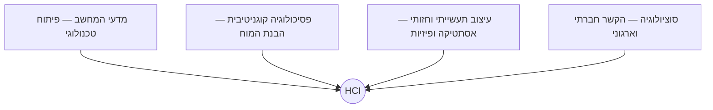

# מבוא ל-HCI: ממשק, חוויה ושמישות

## למה חשוב להבין את עקרונות ה-HCI?

בכל יום אנו באים במגע עם עשרות מערכות טכנולוגיות: טלפונים חכמים, כספומטים, מכונות קפה במשרד, מערכות ניווט ברכב ואפליקציות ממשלתיות. חלק מהמערכות הללו גורמות לנו להרגיש חכמים ויעילים, בעוד שאחרות גורמות לנו לתסכול רב, לבילבול ואף לוויתור מוחלט על השירות.

ההבדל בין מוצר טכנולוגי מצליח למוצר כושל אינו טמון רק בקוד שלו או בכוח העיבוד של המעבד, אלא בעיצוב המפגש שבין האדם לבין המחשב. פיתוח מוצרים דיגיטליים ללא הבנת המשתמש מוביל לבזבוז משאבים, לירידה באמון הלקוחות ובמקרים מסוימים (כמו במערכות רפואיות או צבאיות) גם לאסונות בנפש.

בשיעור זה נכיר את מושגי היסוד שילוו אותנו לאורך כל הדרך: נגדיר את תחומי הלימוד, נבחין בין עיצוב ממשק לחוויה כוללת, ונבין כיצד מעריכים שמישות של מערכות בעולם האמיתי.

---

## מטרות השיעור

בסיום שיעור זה תוכלו:

- להגדיר מהו תחום ה-[[hci]] ומדוע הוא נחשב למדע רב-תחומי.
- להבחין בצורה ברורה ומדויקת בין ממשק משתמש ([[ui]]) לבין חוויית משתמש ([[ux]]).
- להסביר את המקור ההיסטורי של המושג [[ux]] על פי דון נורמן.
- להפריד בין מושג השמישות ([[usability]]) לבין שימושיות (Utility), ולהסביר כיצד הם יוצרים ערך משותף.
- לזהות את חמשת הממדים להערכת שמישות לפי יעקב נילסן.

---

# מהו מנשק אדם-מחשב (HCI)?

האינטראקציה שלנו עם טכנולוגיה אינה מקרית; היא מעוצבת ומתוכננת לפרטי פרטים. הדיסציפלינה המדעית והמעשית שחוקרת ומנחה את העיצוב הזה נקראת [[hci]] (Human-Computer Interaction).

תחום ה-[[hci]] אינו עוסק רק בשאלה כיצד המערכת נראית, אלא כיצד בני אדם חושבים, פועלים ומגיבים כשהם משתמשים בה. התחום שם דגש עצום על בניית מערכות אינטראקטיביות שמותאמות למגבלות הקוגניטיביות והפיזיות של האדם, ולא דורשות מהאדם להשתנות או להתאמץ כדי להתאים את עצמו למחשב.

מכיוון שבני אדם הם יצורים מורכבים, אי אפשר לעצב מערכות טובות רק מתוך נקודת מבט הנדסית. מסיבה זו, [[hci]] הוא תחום רב-תחומי ביסודו, המשלב ידע ממדעי המחשב, מפסיכולוגיה קוגניטיבית (הבנת זיכרון, קשב ותפיסה), מעיצוב גרפי וארגונומיה, ומסוציולוגיה (הבנת השימוש בטכנולוגיה בקבוצות ובארגונים).

:::important
הכלל הראשון והחשוב ביותר ב-[[hci]] הוא: **לעולם אל תעצב את המערכת עבור עצמך!** המעצבים והמפתחים אינם המשתמשים הטיפוסיים של המוצר. כדי לבנות ממשק טוב, חובה לצאת לשטח, לחקור משתמשים אמיתיים ולהבין את עולמם.
:::

:::example
בעת פיתוח לוח מחוונים (Dashboard) דיגיטלי לרופאים בחדר ניתוח, מהנדסי התוכנה אינם יכולים להניח מהן הדרישות. מחקר [[hci]] יכלול תצפיות פיזיות ברופאים בזמן אמת, כדי להבין שהם עובדים עם כפפות (מה שמשפיע על היכולת להשתמש במסכי מגע עדינים), שהם נמצאים תחת לחץ זמנים כבד, ושהם צריכים לקרוא נתונים קריטיים במבט חטוף מרחוק.
:::

:::diagram
תרשים המציג את האופי הרב-תחומי של [[hci]]: מעגל מרכזי של ממשק אדם-מחשב, המוקף בדיסציפלינות המזינות אותו: מדעי המחשב (פיתוח טכנולוגי), פסיכולוגיה קוגניטיבית (הבנת המוח האנושי), עיצוב תעשייתי וחזותי (אסתטיקה ופיזיות), וסוציולוגיה (הקשר חברתי וארגוני).

:::

:::selfcheck
question: מה הופך את תחום ה-HCI לרב-תחומי (אינטרדיסציפלינרי)?
answer: ה-HCI משלב דיסציפלינות שונות כמו מדעי המחשב (לבניית הטכנולוגיה והקוד), פסיכולוגיה קוגניטיבית (להבנת האופן שבו המשתמש מעבד מידע וזוכר פעולות), עיצוב (ליצירת ויזואליה נוחה ונגישה), וסוציולוגיה (להבנת השימוש הטכנולוגי בהקשרים חברתיים וקבוצתיים).
:::

---

# ההבדל בין ממשק (UI) לחוויה (UX)

אחת הטעויות הנפוצות בתעשיית ההייטק היא השימוש במונח המאוחד "UI/UX" כאילו מדובר בדבר אחד. בפועל, מדובר בשני מושגים שונים לחלוטין, בעלי תפקידים מובחנים בתהליך הפיתוח.

**ממשק המשתמש ([[ui]] - User Interface)** הוא האמצעי הפיזי או הדיגיטלי שדרכו מתבצעת האינטראקציה בפועל. ה-[[ui]] הוא מה שהמשתמש רואה על המסך – הצבעים, הכפתורים, הגופנים, מבנה התפריטים ותיבות הזנת המידע. מעצב ה-[[ui]] מתרכז באסתטיקה, בהיררכיה הוויזואלית ובדיוק של האלמנטים הגרפיים.

**חוויית המשתמש ([[ux]] - User Experience)** היא מושג רחב בהרבה. היא מקיפה את כלל התחושות, הרגשות, הציפיות והתגובות של המשתמש כתוצאה מהמפגש עם המערכת, המוצר או השירות כולו. ה-[[ux]] עוסק בשאלה כיצד המוצר מרגיש, עד כמה הוא יעיל עבור המשתמש, והאם המפגש איתו הותיר חוויה חיובית או שלילית.

:::important
חוויית משתמש ([[ux]]) אינה מתחילה ומסתיימת במסך הדיגיטלי של האפליקציה. כפי שמסביר דון נורמן (Don Norman), שטבע את המונח בשנות ה-90 כשעבד באפל: החוויה של המשתמש עם מחשב מתחילה מהרגע שבו הוא שומע עליו, ממשיכה ברכישה בחנות, בקושי להכניס את הקופסה הגדולה לתא המטען של הרכב, ברמת הפחד בזמן פתיחת האריזה בבית (Unboxing), ועד ליכולת להפעיל אותו בקלות ולפתור בעיות מול התמיכה הטכנית.
:::

:::warning
מי שקורא לעצמו "מעצב UX" אך בפועל רק משרטט מסכים דיגיטליים באפליקציה, חוטא להגדרה המקורית של המקצוע. ה-[[ux]] דורש ראייה מערכתית ושיפור של כל נקודות המגע (Touchpoints) של הלקוח עם הארגון והשירות.
:::

:::example
נניח שאתם מזמינים טיסה באפליקציה.
- ה-[[ui]] הוא מסך הבחירה היפה, גופן הטקסט הקריא, והצבע הכחול הנעים של כפתור "אישור הזמנה".
- ה-[[ux]] הוא העובדה שהצלחתם למצוא טיסה זולה תוך 30 שניות, שכרטיס האשראי שלכם זוהה אוטומטית ללא הקלדה ארוכה, שקיבלתם הודעה מיידית למייל עם אישור מפורט, שביום הטיסה קיבלתם תזכורת ידידותית לנייד עם ברקוד לעלייה למטוס, ושצוות הדיילים בשדה היה אדיב ויעיל.
:::

:::selfcheck
question: מהו ההבדל המהותי בין UI ל-UX לפי דון נורמן?
answer: UI (ממשק המשתמש) מתייחס לאלמנטים הגרפיים והפיזיים הספציפיים שעל גבי המסך (איך המערכת נראית ברמת הכלים והכפתורים). UX (חוויית המשתמש) הוא המעטפת הכוללת של המפגש של האדם עם המוצר או השירות – החל משלב הגילוי והקנייה, דרך השימוש השוטף ועד לקבלת שירות לקוחות.
:::

---

# שמישות (Usability) מול שימושיות (Utility)

כדי שמוצר טכנולוגי יספק ערך אמיתי למשתמשים וישרוד בשוק, עליו להיות בעל **Usefulness** (תועלתיות/ערך). ערך זה מורכב משני עמודים מרכזיים שחייבים להתקיים יחד: שימושיות (Utility) ושמישות ([[usability]]).

- **שימושיות (Utility)** עונה על השאלה: *מה המערכת יודעת לעשות?* האם היא כוללת את הכלים והפונקציות שהמשתמש צריך כדי לפתור את הבעיה שלו?
- **שמישות ([[usability]])** עונה על השאלה: *באיזו קלות ויעילות המשתמש מפעיל את הכלים הללו?* האם השימוש בהם ברור, פשוט ונטול שגיאות?

חוקר השמישות יעקב נילסן (Jakob Nielsen) מגדיר את ה-[[usability]] באמצעות חמישה ממדי הערכה מרכזיים:

1. **למידות (Learnability):** כמה קל למשתמשים חדשים לבצע משימות בסיסיות במפגש הראשון שלהם עם הממשק?
2. **יעילות (Efficiency):** באיזו מהירות משתמשים שכבר למדו את המערכת מצליחים לבצע משימות מורכבות?
3. **זכירות (Memorability):** כשמשתמשים חוזרים למערכת לאחר תקופה ארוכה שלא נגעו בה, כמה מהר הם נזכרים איך להפעיל אותה?
4. **שגיאות (Errors):** כמה שגיאות המשתמשים עושים, כמה הן חמורות (האם הן גורמות לאובדן מידע), ואיך הם מתאוששים מהן?
5. **שביעות רצון (Satisfaction):** עד כמה נעים, נוח ומספק למשתמשים לעבוד עם הממשק באופן כללי?

![[Usability by Nelson.png]]

:::important
אם מערכת מציעה יכולות מדהימות (Utility גבוה) אך הממשק שלה מסורבל ובלתי קריא (Usability נמוך), המשתמשים יתייאשו ולא יפיקו ממנה תועלת. מצד שני, ממשק קל להפעלה ומהיר (Usability גבוה) שלא עושה שום דבר שהמשתמש צריך (Utility אפסי) הוא חסר ערך לחלוטין.
:::

:::example
דוגמה קלאסית לשילוב בין השניים היא תוכנת גיליון אלקטרוני (כמו Excel):
- ה-**Utility** הוא מנוע החישובים העוצמתי, הנוסחאות המתמטיות, והיכולת לייצר גרפים מורכבים מנתונים.
- ה-**Usability** הוא העובדה שהמשתמש לא צריך לכתוב קוד תכנות כדי לסכם עמודה אלא לוחץ על כפתור אחד בולט ("AutoSum"), ושהתוכנה מציגה השלמה אוטומטית ועזרה חזותית בזמן הקלדת נוסחאות כדי למנוע שגיאות הקלדה.
:::

:::selfcheck
question: מה ההבדל בין Utility ל-Usability, וכיצד הם משפיעים על הצלחת מוצר?
answer: Utility (שימושיות) מייצגת את הפונקציות והיכולות שהמערכת מציעה (האם היא עושה מה שצריך). Usability (שמישות) מייצגת את קלות השימוש בפונקציות הללו (האם קל להפעיל אותן). מוצר יצליח רק אם הוא משלב את שניהם – מערכת שמישה ללא פונקציות נדרשות, או מערכת מורכבת ובלתי מובנת למרות שיש לה יכולות רבות, ייכשלו שתיהן בגלל חוסר ערך כולל (Usefulness).
:::

---

## סיכום השיעור

:::summary
מנשק אדם-מחשב ([[hci]]) הוא הבסיס המדעי לעיצוב מוצרים דיגיטליים מוצלחים, המבוסס על הבנת המשתמש ומגבלותיו. בתוך עולם זה, אנו מפרידים בין ממשק המשתמש ([[ui]]), שהוא המרכיב הוויזואלי והכפתורים שעל המסך, לבין חוויית המשתמש ([[ux]]), המייצגת את כלל התחושות והמפגש המערכתי של האדם עם השירות מקצה לקצה. כדי להבטיח ערך (Usefulness), על המערכת לשלב פונקציונליות נדרשת (Utility) עם שמישות גבוהה ([[usability]]) הנמדדת בלמידות, יעילות, זכירות, מיעוט שגיאות ושביעות רצון.
:::

:::keypoints
- [[hci]] הוא מדע רב-תחומי (הנדסה, פסיכולוגיה, עיצוב) המציב את המשתמש במרכז.
- [[ui]] עוסק בעיצוב חזותי של הממשק; [[ux]] עוסק בחוויה המלאה והרגשית של הלקוח.
- חוויית משתמש (UX) היא מונח שטבע דון נורמן באפל ומקיפה גם את שלבי פתיחת האריזה והתמיכה ולא רק את האפליקציה.
- ערך המוצר (Usefulness) נוצר מחיבור של Utility (מה המערכת עושה) עם Usability (איך מפעילים אותה בקלות).
- שמישות נמדדת לפי יעקב נילסן ב-5 ממדים: למידות, יעילות, זכירות, טיפול בשגיאות ושביעות רצון.
:::

:::references
- מצגת מבוא לקורס מנשק אדם-מחשב (Introduction.pptx).
- הספר "The Design of Everyday Things" מאת דון נורמן.
- הרצאות וידאו ומאמרי Jakob Nielsen על ממדי שמישות (Usability Engineering).
:::

:::quiz{ref="what-is-hci-quiz"}
:::
