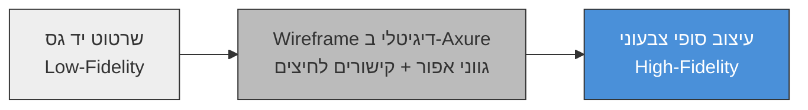

# שרטוט שלד המערכת (Wireframing) ברמת Low-Fidelity

## למה עוצרים את השיחה על צבע הכפתור?

דמיינו ישיבת צוות: מעצב, מפתח ובעל מוצר יושבים לתכנן מסך חדש באפליקציה. תוך חמש דקות הדיון כבר "נתקע" סביב השאלה אם כפתור "שליחה" צריך להיות כחול או ירוק, ואיזה פונט להשתמש בכותרת. אף אחד עדיין לא ענה על השאלה החשובה באמת: **אילו רכיבים בכלל צריכים להופיע במסך הזה, ואיפה הם ימוקמו?**

זו בדיוק הבעיה שבגללה אנו, כמעצבי ממשקים, בוחרים להקפיא לרגע את כל שיקולי העיצוב הוויזואלי. כפי שלמדנו כשעסקנו ב[[human-centered-design]], תהליך העיצוב הוא איטרטיבי — ולאחר שלב המחקר, כאשר אנו נכנסים לשלב האפיון, אנחנו משרטטים תחילה את **שלד** המערכת — ללא צבע, ללא פונטים מעוצבים וללא תמונות. השרטוט הזה נקרא [[wireframe]], וכפי שנראה בשיעור זה, הוא לא רק שלב טכני — הוא כלי שמונע בדיוק את הוויכוח שתיארנו למעלה, ומכריח את הצוות להסכים על המבנה לפני שמישהו מתאהב בצבע.

---

## מטרות השיעור

בסיום שיעור זה תוכלו:

- להגדיר מהו [[wireframe]] ולזהות את מאפייניו המרכזיים כייצוג שלדי של מסך.
- להסביר מדוע Wireframe נוצר תמיד בגווני אפור, במספר גופנים מינימלי וללא גרפיקה — ומהי המטרה מאחורי כל כלל.
- ליישם את שלושת כללי היצירה של Wireframe בבניית שרטוט למסך ממשק מוכר.
- להבחין בין Wireframe ל-[[prototype]] ולנמק באילו מצבים משתמשים בכל אחד מהם.
- לנתח את מיקומו של Wireframe על ספקטרום ה[[fidelity]], ולזהות כיצד כלים כמו Axure מרחיבים את רמת הדיוק שלו.

---

# מהו Wireframe?

[[wireframe]] הוא ייצוג ויזואלי-שלדי של המערכת — שרטוט שמתאר את פריסת הרכיבים, ההיררכיה והניווט של מסך, ללא כל עיצוב סופי. המילה "שלדי" אינה מקרית: בדיוק כמו ששלד אדם קובע את המבנה שעליו נבנה כל השאר, ה-Wireframe קובע את המבנה שעליו ייבנה כל העיצוב הוויזואלי בהמשך.

תפקידו המרכזי של Wireframe הוא לשמש **שפה משותפת** בין כל בעלי העניין בפרויקט — מעצבים, משתמשים, לקוחות ומפתחים. כאשר כולם מסתכלים על אותו שרטוט שחור-לבן, קל הרבה יותר להסכים או לחלוק דעה על *מבנה* המסך, בלי שהדיון "יגלוש" לוויכוח סובייקטיבי על טעם אישי בצבעים או בפונטים.

:::example
**שרטוט תיבת הדואר הנכנס של Gmail:** Wireframe של מסך ה-Inbox יראה מלבן צר מהצד לרשימת התוויות (Labels), פס עליון עם מלבן קטן לחיפוש ועיגול ריק לתמונת הפרופיל, ומתחתיו רשימה אנכית של שורות מלבניות — כל שורה מייצגת מייל אחד, עם תיבת סימון קטנה, שם שולח כטקסט מודגש, ונושא המייל כטקסט רגיל. אין כאן אף צבע של Gmail עצמו (לא האדום של "מחק", לא הכחול של קישורים) — רק מבנה, מרווחים והיררכיה.
:::

Wireframe עונה על שאלה אחת ויחידה: **"מה יש במסך הזה, ואיפה?"** — לא "איך זה ייראה?".

:::example
**דוגמה נגדית — אותו מסך, הפעם לא כ-Wireframe:** אם ניקח את אותו מסך Inbox ונציג אותו עם צבעי המותג האמיתיים של Gmail (אדום ל"מחק", כחול לקישורים), תמונת פרופיל אמיתית של המשתמש, ואייקונים מעוצבים — זהו כבר לא Wireframe אלא Mockup ויזואלי. ההבדל קריטי: ברגע שהצוות רואה את הגרסה הצבעונית, הדיון עלול לקפוץ ישר ל"האם האדום הזה נכון למותג?" במקום "האם סדר הרכיבים הגיוני?".
:::

---

# שלושת כללי היצירה של Wireframe

כדי לשמור על המיקוד במבנה ובפונקציונליות, וכדי למנוע החלקה חזרה לדיוני עיצוב ויזואלי, כל Wireframe נבנה לפי שלושה כללים.

## כלל 1: גווני אפור בלבד

Wireframe נעשה תמיד בשחור, לבן וגווני אפור שביניהם — לעולם לא בצבע.

**למה זה חשוב:** צבע נושא איתו החלטות עיצוביות שעדיין לא הבשילו — מיתוג, מצב רגשי, ניגודיות. ברגע שמכניסים צבע, המוח של הצופה (ובמיוחד של בעל עניין שאינו מעצב) מפסיק להעריך את המבנה ומתחיל להעריך "האם זה יפה".

**התוצאה של הפרת הכלל:** אם תציגו למנהל שרטוט עם הלוגו הכחול האמיתי של החברה, סביר שהתגובה הראשונה תהיה "אני לא אוהב את הגוון הזה" — במקום "האם סדר הרכיבים במסך הגיוני?". הפרת כלל האפור גורמת לבעלי עניין "להתאהב" בפרטים ויזואליים לפני שהמבנה הבסיסי אושרר, בדיוק כפי שקורה כשמדלגים ישר ל[[fidelity]] גבוהה מדי מוקדם מדי.

## כלל 2: מספר מינימלי של גופנים

משתמשים בכמה שפחות גופנים (אידיאלית גופן אחד), ומעבירים היררכיית מידע (מה חשוב יותר, מה פחות) באמצעות **גודל** הטקסט והאם הוא **מודגש**/נטוי — לא באמצעות בחירת גופנים שונים.

**למה זה חשוב:** עיקרון זה תקף לא רק ל-Wireframe אלא לעיצוב בכלל — ריבוי גופנים יוצר רעש ויזואלי ומטשטש את ההיררכיה במקום להבהיר אותה. גם ב-Wireframe שלדי לחלוטין, ניתן וצריך עדיין להראות מה הכי חשוב במסך — רק בכלים מינימליים.

**התוצאה של הפרת הכלל:** אם כל כותרת תקבל גופן אחר "כדי שיהיה מעניין", הצוות יבזבז זמן על החלטות טיפוגרפיה שלא רלוונטיות בשלב הזה, והשרטוט יאבד את הבהירות שהוא אמור לספק.

## כלל 3: ללא גרפיקה או תמונות — משתמשים במציייני מיקום

נמנעים לחלוטין מגרפיקה, איורים ותמונות אמיתיות. במקום תמונה, משרטטים מלבן ריק עם **X** גדול באמצעו כמציין-מיקום (placeholder) — סימן שמתקשר "כאן תהיה תמונה" בלי לצייר אותה בפועל. באופן דומה, כדי לייצג סרטון, משרטטים מלבן עם **משולש הפעלה (▶)** במרכזו.

**למה זה חשוב:** ברגע שמכניסים תמונה אמיתית — גם אם היא "רק זמנית" — היא מושכת תשומת לב ומעצבת רושם חזק על הצופה, בדיוק כמו צבע. מלבן עם X הוא ניטרלי לחלוטין: הוא אומר "כאן יהיה תוכן חזותי" בלי לקבוע איזה.

**התוצאה של הפרת הכלל:** צוות שמכניס תמונת מוצר אמיתית ל-Wireframe מגלה שהדיון קופץ ישר לשאלה "האם זו התמונה הנכונה?" — במקום "האם בכלל צריך תמונה כאן, ובאיזה גודל יחסית לשאר המסך?".

:::selfcheck
question: צוות מציג לכם שרטוט מסך ובו כל הכותרות בצבע כחול בהיר, עם תמונת רקע אמיתית של המוצר. אילו שניים מכללי ה-Wireframe הופרו כאן, ומה הסיכון המעשי בהפרה הזו?
answer: הופרו כלל גווני האפור (שימוש בצבע כחול) וכלל ההימנעות מגרפיקה (תמונת רקע אמיתית). הסיכון: בעלי העניין יגיבו לצבע ולתמונה במקום להעריך את מבנה המסך, ועלולים "להתאהב" בפרטים ויזואליים לפני שהמבנה הבסיסי אושרר — בדיוק המצב ש-Wireframe נועד למנוע.
:::

---

# ספקטרום ה-Fidelity: מ-Low-Fidelity ל-High-Fidelity

לא כל Wireframe זהה ברמת הדיוק שלו. כפי שלמדנו במושג ה[[fidelity]], שרטוטים נעים על ציר שמתחיל ב-**Low-Fidelity** — שרטוט גס, לרוב ביד או בכלים פשוטים, שמטרתו לבדוק מבנה בסיסי בלבד — ומגיע עד ל-**High-Fidelity** — שרטוט מדויק במרווחים, בגדלים ובמיקום, אך עדיין ללא צבע.

בעבודת אפיון מקצועית, עובדים לרוב עם כלי ייעודי בשם **Axure** (axure.com) לבניית Wireframes: הכלי מאפשר לבנות מסכים ברמת דיוק גבוהה, ואף לחבר ביניהם **קישורים לחיצים (clickable links)**, כך שניתן "לדפדף" בין מסכי השרטוט ולדמות זרימה בסיסית — מבלי לצבוע אף פיקסל אחד. ככל שהמבנה הבסיסי כבר אושרר, משתלם לעבור לרמת דיוק גבוהה יותר כדי לבדוק פרטי ניווט עדינים יותר.

:::diagram
תרשים המשווה שלושה שלבים על ציר ה-Fidelity לאותו מסך: (1) Low-Fidelity — שרטוט יד גס עם תיבות ריקות; (2) Wireframe דיגיטלי ב-Axure — גווני אפור מדויקים עם קישורים לחיצים בין מסכים; (3) עיצוב סופי צבעוני — עם הלוגו, הצבעים והתמונות האמיתיות.

:::

:::selfcheck
question: צוות רוצה לבדוק האם משתמשים מצליחים לנווט מהר בין שלושה מסכים חדשים באפליקציה, ולא רק לבחון את מבנה מסך בודד. האם Wireframe שלדי בסיסי מספיק, ומה כדאי לשקול?
answer: Wireframe שלדי בסיסי יכול לעזור לבדוק את מבנה כל מסך בנפרד, אבל כדי לבדוק ניווט וזרימה בין כמה מסכים כדאי להעלות את רמת ה-Fidelity — למשל לבנות Wireframe ב-Axure עם קישורים לחיצים בין המסכים, או לעבור ל-Prototype אינטראקטיבי שמדמה את הזרימה בפועל.
:::

---

:::important
**Wireframe מול Prototype — אל תבלבלו בין השניים:**
[[wireframe]] הוא **סטטי** — הוא מתאר את מבנה מסך בודד ועונה על "מה יש במסך הזה?". [[prototype]] הוא לרוב **אינטראקטיבי** — הוא מדמה זרימה ותנועה בין כמה מסכים ועונה על "מה קורה כשלוחצים כאן?". Wireframe הוא לרוב תחנה מוקדמת בדרך לבניית Prototype: קודם מסכימים על מה יש בכל מסך (Wireframe), ורק אז בונים את חוויית המעבר ביניהם (Prototype).
:::

---

## סיכום השיעור

:::summary
Wireframe הוא ייצוג ויזואלי-שלדי של מסך, המתאר פריסה, היררכיה וניווט — ללא צבע, טיפוגרפיה מעוצבת או גרפיקה. הוא נבנה לפי שלושה כללים: גווני אפור בלבד, מספר מינימלי של גופנים, והימנעות מגרפיקה לטובת מציייני מיקום (מלבן עם X לתמונה, משולש הפעלה לסרטון). Wireframe משמש שפה משותפת בין מעצבים, משתמשים, בעלי עניין ומפתחים, ומאפשר להסכים על מבנה המסך לפני שמישהו "מתאהב" בפרטים ויזואליים. הוא נע על ספקטרום ה[[fidelity]] מ-Low-Fidelity ועד High-Fidelity, וכלים כמו Axure מאפשרים לבנות אותו ברמת דיוק גבוהה עם קישורים לחיצים בין מסכים. בניגוד ל[[prototype]] האינטראקטיבי, Wireframe נשאר תמיד סטטי.
:::

:::keypoints
- Wireframe = ייצוג שלדי-ויזואלי של מסך: פריסה, היררכיה וניווט, ללא עיצוב סופי.
- שלושת כללי היצירה: (1) גווני אפור בלבד, (2) מספר מינימלי של גופנים, (3) ללא גרפיקה — מלבן עם X לתמונה, משולש להפעלת סרטון.
- כל הפרת כלל (למשל הכנסת צבע או תמונה אמיתית) מסיטה את תשומת הלב מהמבנה לפרטים ויזואליים.
- Wireframe משמש שפה משותפת בין מעצבים, משתמשים, בעלי עניין ומפתחים.
- Wireframe נע על ציר ה[[fidelity]] מ-Low ועד High; כלים כמו Axure מאפשרים Wireframe מדויק עם קישורים לחיצים בין מסכים.
- Wireframe הוא סטטי ("מה יש במסך?"); [[prototype]] הוא אינטראקטיבי ("מה קורה כשלוחצים?").
:::

:::references
- מצגת הקורס "בחינת הקונספט" — ד"ר משה לייבה (Examine the Concept.pptx).
- Nielsen Norman Group — Wireframing: Definition and Purpose.
- Axure — axure.com, כלי לבניית Wireframes ו-Prototypes עם קישורים לחיצים בין מסכים.
:::

:::quiz{ref="wireframing-quiz"}
:::
